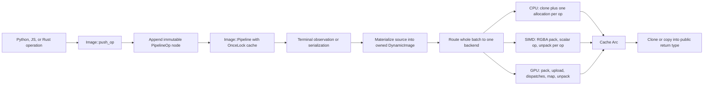

# Image Pipeline Performance Roadmap

Status: active — verified slices recorded; remaining work is open  
Reviewed: 2026-08-12  
Code revision reviewed: `60f7f357e9047370c1b0daa81f730c15064e77e9` with additional uncommitted worktree changes  
Benchmark evidence: `build/migration-parity/benchmark-result.json`, managed run `d8567f9d-5bd9-43da-938f-62d77912d88f`

## Purpose

This document is the implementation roadmap for making the Pillow-RS lazy image
pipeline materially faster on CPU, SIMD, and GPU while preserving exact public
Pillow parity. It covers the complete path from graph construction through
materialization, backend selection, kernels, transfers, Python and JavaScript
bindings, and benchmark observation.

This roadmap does not cover `fontdone`, font rendering, or codec internals in
`image-slash-star`. Those components have separate ownership and performance
contracts. Encoded image input and output are included only where they form a
terminal boundary of the Pillow-RS image pipeline.

The identifiers in this file are stable. Implementation commits and pull
requests should cite the relevant `FIL-xx` identifier and update its status
instead of creating a parallel plan.

## Evidence ledger

This ledger records verified slices; an item remains open until its complete
`Done when` condition is met.

| Date | Slice | Evidence | Result |
|---|---|---|---|
| 2026-08-12 | GPU lazy shader resolution, bounded A/B working buffers, bounded readback staging, and cumulative chunk-progress guard | `make -C pillow-rs test-core` (116 passed); managed unified `make test` run `b8029cd6-b72b-4c3c-9836-eb969fd59644` with `--gpu-full` | GPU smoke passed, the full GPU lane completed 3,678 cases without a timeout, and JS/WASM passed. CPU, SIMD, and full GPU each have the same one shared variable-font axis-overflow parity failure; no GPU hang was observed. |
| 2026-08-12 | GPU direct little-endian RGBA upload/readback and shared auxiliary-image ownership | managed benchmark run `f704d2bd-1ce5-4820-b946-6f5340786a35`; focused 10-case GPU parity batch | Benchmark schema passed; focused GPU cases passed. Native L/LA/RGB transfer paths and per-plan auxiliary-resource reuse are still open. |
| 2026-08-12 | CPU rolling-window BoxBlur/GaussianBlur | isolated worker branch commit `d00e74e57b2c554f27a31e336236b79d37961ebe`; `make -C pillow-rs test-core`; focused CPU parity 5/5; full CPU parity 3,677/3,678 | The 240-case edge/radius/mode matrix was byte-identical. Release 1024² GaussianBlur(2)→invert improved from 96.956 ms to 30.824 ms median (3.15×), but remains slower than Pillow’s 10.108 ms median. |
| 2026-08-12 | SIMD BoxBlur alpha accumulation correction | isolated worker commit `4e6deae8e6bd13b72c3e1502b9a421b53b81f30e`; focused SIMD parity 6/6; full SIMD parity 3,677/3,678 | LA and RGBA radii 1/2/3 now match exactly. The remaining full-lane failure is the shared variable-font axis-overflow case; this slice does not claim SIMD acceleration. |
| 2026-08-12 | Four-backend release benchmark after blur and SIMD correctness slices | managed Coverage MCP run `89b1c9d6-0cfb-4b4d-85ae-e8a06c10b1f0`; `migration-parity-benchmark` validator; 4 workloads, 100 samples per subject | Correctness passed for all four workloads. Current medians (Pillow / CPU / SIMD / GPU): transpose×2 1.518 / 3.880 / 33.355 / 10.514 ms; GaussianBlur+invert 8.343 / 28.604 / 40.762 / 28.644 ms; multiply+screen 5.482 / 5.367 / 33.325 / 12.428 ms; invert+mirror 1.844 / 3.152 / 30.519 / 10.574 ms. SIMD/GPU labels remain diagnostic until native execution receipts are implemented. |
| 2026-08-12 | Native-layout SIMD point/geometry fast paths | focused SIMD parity 8/8; managed benchmark `d8567f9d-5bd9-43da-938f-62d77912d88f`; unified all-backend receipt `50363c67-5278-4f11-88bc-f378fd19a86a` | Ordinary L/LA/RGB/RGBA invert, ImageChops invert, and mirror avoid RGBA packing. The current invert workload measured Pillow / CPU / SIMD / GPU at 1.829 / 3.301 / 1.431 / 10.444 ms. This is a native-layout safe-Rust fast path, not proof of architecture-specific SIMD instructions. |
| 2026-08-12 | Four-backend release benchmark after native-layout fast paths | managed Coverage MCP run `d8567f9d-5bd9-43da-938f-62d77912d88f`; validator reported 4 measured, 0 not-run, 0 budget failures | Current medians (Pillow / CPU / SIMD / GPU): transpose×2 1.552 / 3.888 / 33.094 / 10.450 ms; GaussianBlur+invert 8.510 / 28.932 / 27.162 / 28.427 ms; multiply+screen 5.567 / 5.499 / 33.894 / 11.535 ms; invert+mirror 1.829 / 3.301 / 1.431 / 10.444 ms. The benchmark is correctness-gated; SIMD/GPU native receipts remain open. |
| 2026-08-12 | Coverage denominator after native-layout fast paths | Coverage MCP snapshot `bd7f3ba7-318d-4c5c-8ece-71f757c7df38`, suite `pillow-rs-combined-cpu-simd-20260811`; compared with `d51ad1a7-7357-47f2-9384-a7dd18c12865` | 33,421 lines / 27,976 covered (83.7078%); 5,736 branches / 4,584 covered (79.9163%); 2,856 functions / 2,215 covered (77.5560%); 55,783 regions / 46,543 covered (83.4358%). The denominator grew by 77 lines, 16 branches, 3 functions, and 161 regions; covered items changed by +42, −2, +2, and +51 respectively. The rate decrease is recorded, not hidden. Unit-test pass counts are not coverage numerator data. |

The single managed coverage number above is explicitly the registered CPU+SIMD
LLVM suite. It includes compiled GPU and binding source files where that suite
instruments them, but it does not claim GPU execution coverage; the unified
all-backend parity receipt is reported separately. No source, operation, case,
threshold, or coverage denominator was removed to obtain this result.

The managed `make test` receipt also reports an inventory consistency diff in
the dirty worktree before the all-backend lane. That generated-manifest issue
must be repaired through the maintained generator workflow; it is not treated
as a coverage or parity waiver.

## Executive findings

The current release build is optimized: the maintained Python benchmark target
uses `maturin develop --release`, and the workspace release profile uses
`opt-level = 3`, LTO, one codegen unit, and abort-on-panic. Debug compilation is
not the explanation for the current results.

The dominant findings are:

1. The lazy graph still crosses several eager ownership boundaries. A public
   materialization returns an owned clone, pipeline evaluation materializes its
   source into another owned image, and each backend starts or ends with further
   full-frame allocations.
2. The baseline extended an existing pipeline by cloning the complete
   `Vec<PipelineOp>`. The current worktree has moved graph storage to an
   immutable append chain with one-time iterative flattening, but construction
   benchmarks, payload sharing, and the public materialization boundary remain
   open.
3. The SIMD backend is presently a packed-`u32` scalar backend. The architecture
   files for ARM and x86 contain no vector kernels, and most adapters convert an
   image to RGBA, allocate packed pixels, run scalar code, allocate bytes again,
   and convert back to the original mode for every operation.
4. Gaussian blur is slow because each of six box-blur passes recomputes the
   complete radius window for every output sample. The implementation is
   separable but not a rolling-window blur, is serial, and allocates a new full
   buffer per pass.
5. GPU batching correctly avoids intermediate host readback inside one accepted
   batch, but each materialization still pays upload, RGBA packing, resource and
   bind-group construction, submission, staging, mapping, unpacking, and final
   host readback. The initial image is written to both ping-pong buffers, and
   nested or split pipelines cannot remain device-resident.
6. Backend selection is priority-based rather than cost-based. Enabling GPU or
   SIMD can therefore select a slower route for small images, conversion-heavy
   operations, or adapters that internally call CPU code.
7. The earlier streaming architecture specification describes a one-allocation
   fused CPU evaluator, but the active implementation is still an
   operation-by-operation `DynamicImage` pipeline. That specification is design
   intent, not evidence of current behavior.

The highest-return sequence is therefore ownership and measurement first,
rolling-window CPU blur second, a retained native SIMD frame with real NEON/
AVX kernels third, and persistent GPU residency and transfer removal fourth.
Micro-tuning shaders before those boundaries are fixed will not address the
largest measured costs.

## Review surface

The review covered the following active paths:

| Area | Files reviewed | Main evidence |
|---|---|---|
| Lazy graph and materialization | [`image.rs`](../pillow-rs/src/image.rs), [`pipeline.rs`](../pillow-rs/src/pipeline.rs) | `Image::Pipeline`, `push_op`, `materialized_shared`, `materialize`, `evaluate_pipeline`, mode and palette propagation |
| Routing and operation metadata | [`compute/mod.rs`](../pillow-rs/src/compute/mod.rs), [`registry.rs`](../pillow-rs/src/compute/registry.rs), [`backend_op.rs`](../pillow-rs/src/compute/backend_op.rs), [`op_def.rs`](../pillow-rs/src/compute/op_def.rs) | global backend lock, repeated support validation, string registry lookup, duplicated operation descriptions |
| CPU pool | [`pool_cpu`](../pillow-rs/src/compute/pool_cpu), [`pil_resize.rs`](../pillow-rs/src/ops/pil_resize.rs), [`quantize.rs`](../pillow-rs/src/ops/quantize.rs), [`par.rs`](../pillow-rs/src/par.rs) | serial loops, conversions, per-pixel allocation, naïve blur windows, resampling tables, unused parallel helpers |
| SIMD pool | [`pool_simd`](../pillow-rs/src/compute/pool_simd) | packed RGBA conversion in adapters, scalar kernels, empty architecture modules, CPU delegation |
| GPU pool and shaders | [`pool_gpu/mod.rs`](../pillow-rs/src/compute/pool_gpu/mod.rs), [`pool_gpu/shaders`](../pillow-rs/src/compute/pool_gpu/shaders) | upload/readback packing, resource lifetime, per-op bind groups, shader compilation, loop-based filters, fixed workgroups |
| Python boundary | [`pillow-rs-py/src/lib.rs`](../pillow-rs-py/src/lib.rs), [`pillow_rs/image.py`](../pillow-rs-py/python/pillow_rs/image.py) | owned byte returns, handle cloning, selective GIL release, properties that can force materialization |
| JavaScript/WASM boundary | [`pillow-rs-js/src/lib.rs`](../pillow-rs-js/src/lib.rs) | `Vec<u8>` ingress and egress, synchronous materialization, repeated copies across linear memory |
| Benchmarks and parity gates | [`run_migration_benchmark.py`](../scripts/run_migration_benchmark.py), [`run_migration_parity.py`](../scripts/run_migration_parity.py), [`Makefile`](../Makefile) | release build, strict backend isolation, correctness gate, timing boundary, warmup and sample policy |

A simple source-token inventory over these paths found 154 `.clone()` sites, 214
standard-mode conversion sites, 332 explicit vector/allocation sites, 25 sort
sites, and 34 materialization calls. These are navigation counts, not runtime
allocation counts: they include cold, defensive, and inline-test code and must
not be used as performance claims. `FIL-03` replaces them with measured data.

## Current execution shape



The target architecture keeps the graph and image storage shared, plans the
complete chain once, partitions only where a backend crossover requires it,
reuses owned working buffers, and copies pixels only at an observable ownership
or serialization boundary.

## Current measured baseline

The maintained benchmark is correctness-gated, isolates one requested backend
pool per target process, and measures the public Python workflow in a release
build. The current artifact proves the requested active pool, but it does not
yet prove that every adapter segment executed natively: SIMD adapters and the
GPU pool can delegate or fall back to CPU internally. Until FIL-02 is closed,
the SIMD and GPU columns are diagnostic labels rather than native-kernel proof.
The current workloads use a 1024 × 1024 RGB image, five warmups, twenty
measurement iterations, five samples, concurrency one, and a warm cache. Each
median below therefore represents 100 measured executions and includes the
selected public pipeline steps plus final materialization. It is not a pure
kernel microbenchmark.

| Workload | Pillow median | CPU median | SIMD median | GPU median | SIMD / CPU | GPU / CPU |
|---|---:|---:|---:|---:|---:|---:|
| transpose × 2 | 1.552 ms | 3.888 ms | 33.094 ms | 10.450 ms | 8.51× slower | 2.69× slower |
| GaussianBlur + invert | 8.510 ms | 28.932 ms | 27.162 ms | 28.427 ms | 0.94× CPU (6.1% faster) | 0.98× CPU (1.7% faster) |
| multiply + screen | 5.567 ms | 5.499 ms | 33.894 ms | 11.535 ms | 6.16× slower | 2.10× slower |
| invert + mirror | 1.829 ms | 3.301 ms | 1.431 ms | 10.444 ms | 0.43× CPU (56.7% faster) | 3.16× slower |

The artifact identifies Pillow 12.2.0, CPython 3.12, macOS 15.7.7 arm64, and a
dirty target tree at the revision stated above. These numbers are a prioritizing
baseline, not a portable performance promise.

## Non-negotiable performance contract

Every `FIL-xx` implementation must satisfy all of these rules:

- Exact source/target parity remains the first gate. Expected bytes, fixtures,
  hashes, thresholds, or failure classification are never weakened for speed.
- Benchmarks run through maintained Make targets in release mode. Debug results
  cannot establish a performance improvement.
- Warm and cold costs are reported separately. Shader compilation, adapter
  creation, and first decode must not be hidden inside a warm-only claim.
- Pure kernel, full core pipeline, Python, and JS/WASM boundaries are measured
  separately. A faster kernel cannot hide a slower end-to-end path.
- The result records the backend that actually executed every segment. A SIMD
  or GPU result that silently delegated to CPU is reported as fallback, not as
  accelerated execution.
- An operation is advertised as SIMD-accelerated only when its supported path
  is at least 10% faster than CPU at or above a documented crossover size on a
  supported architecture. Below that crossover, automatic routing may choose
  CPU. Forced-backend tests still verify the real SIMD implementation.
- GPU routing includes transfer, dispatch, and readback costs. It is selected
  only when predicted end-to-end cost beats the best host backend or when the
  image is already device-resident.
- Optimizations that alter floating-point contraction, fixed-point rounding,
  edge extension, alpha premultiplication, mode layout, or palette behavior
  require exact parity cases at the affected boundaries.
- Allocation reuse is bounded. Pools and caches expose limits and eviction;
  they cannot retain the historical high-water mark indefinitely.
- No unsafe Rust is introduced. Parallel writers must prove disjoint ownership
  through safe slices, chunks, or owned tiles.

## Roadmap at a glance

| Phase | IDs | Outcome |
|---|---|---|
| A — evidence and contracts | FIL-01–FIL-06 | trustworthy kernel, pipeline, transfer, and binding measurements |
| B — graph, ownership, and planning | FIL-07–FIL-20 | cheap graph construction, one planning pass, minimal pixel copies, cost-aware routing |
| C — CPU kernels | FIL-21–FIL-36 | parallel native-mode execution, rolling filters, reusable buffers, optimized reductions |
| D — real SIMD | FIL-37–FIL-44 | retained SIMD storage, honest capabilities, NEON/AVX kernels, crossover routing |
| E — GPU pipeline | FIL-45–FIL-56 | low cold start, pooled resources, fewer dispatches, device residency, safe fallback |
| F — bindings and terminal I/O | FIL-57–FIL-61 | cheap handles, released GIL, lower-copy Python/WASM output, asynchronous GPU observation |
| G — sustained performance | FIL-62–FIL-64 | regression gates, staged rollout, one maintained status source |

## Phase A — Evidence and contracts

### FIL-01 — Expand the benchmark matrix

Priority: P0  
Evidence: measured gap; current matrix is too narrow  
Impact: enables every later decision  
Depends on: none

Problem: four 1024 × 1024 RGB workflows cannot establish crossover sizes,
native-mode behavior, construction overhead, cold GPU cost, or binding cost.

Implementation:

- Extend the declarative benchmark inputs, not expected-output files, with 1 ×
  1, 32 × 32, 256 × 256, 1024 × 1024, 4096 × 4096, and one non-square image.
- Cover L, LA, RGB, RGBA, P/PA, I;16, I, and F where the public operation is
  supported; keep mode-specific results separate.
- Add single-op, two-op, eight-op, and sixty-four-op chains for point, geometry,
  filter, draw, and multi-image families.
- Measure cold process, warm process, cold GPU pipeline, warm GPU pipeline, and
  already-resident GPU states separately.
- Add maintained Make targets for a quick representative lane and the complete
  matrix. Keep one process per backend and batch related workloads within it.

Done when: every backend report includes median, p95, throughput, image size,
mode, chain length, cache state, build profile, actual backend, and correctness
evidence, and the matrix can identify a crossover rather than assuming one.

### FIL-02 — Add execution-phase and actual-backend telemetry

Priority: P0  
Evidence: observed; current end-to-end timing cannot locate cost  
Impact: high  
Depends on: FIL-01

Implementation:

- Add opt-in structured counters for graph construction, source materialize,
  plan, route, conversion, kernel, upload, command encoding, queue wait,
  readback, terminal conversion, and binding copy.
- Record requested backend, selected backend per segment, fallback reason,
  operation count, dispatch count, and fusion count.
- Use `log`/trace or a benchmark-only collector; do not print from core code.
- Keep the instrumentation disabled at compile time or behind a predictable
  low-cost branch outside benchmark and diagnostic builds.

Done when: a benchmark can explain why SIMD or GPU lost to CPU without inferring
from wall-clock time, and a forced backend cannot silently report another path.

### FIL-03 — Measure allocations, peak bytes, and transfer volume

Priority: P0  
Evidence: 154 clone sites and 332 allocation sites observed; runtime weight unknown  
Impact: high  
Depends on: FIL-01

Implementation:

- Add benchmark-only allocation counts and bytes for graph construction,
  materialization, each backend, and binding conversion.
- Report peak live host bytes, GPU buffer bytes, upload bytes, readback bytes,
  auxiliary-image bytes, and retained cache bytes.
- Add counters for full-frame copies, mode conversions, and temporary buffers.
- Test repeated reads, clones, branches, and drops so cache retention is visible.

Done when: ownership work can be accepted by a reduction in measured copies and
peak memory, not by source inspection alone.

### FIL-04 — Establish repeatable profiling workflows

Priority: P0  
Evidence: profiling required before lower-ranked micro-optimization  
Impact: medium  
Depends on: FIL-01

Implementation:

- Add maintained Make targets that produce CPU sampling profiles, allocation
  profiles, and GPU timestamp/query reports where the adapter supports them.
- Preserve workload ID, revision, dirty state, target, device, and command in
  every artifact.
- Add first-divergence trace modes for exact arithmetic changes, but keep them
  out of timed measurements.
- Document platform-specific profiler prerequisites without making one platform
  the only supported evidence path.

Done when: each optimization PR can attach a before/after profile for its exact
workload and no recurring diagnostic requires an undocumented shell command.

### FIL-05 — Separate kernel, core-pipeline, and binding benchmarks

Priority: P0  
Evidence: current benchmark includes the Python public workflow  
Impact: high  
Depends on: FIL-01, FIL-02

Implementation:

- Add a pure-Rust benchmark boundary around a pre-materialized input and one
  backend execution plan.
- Add a full Rust `Image` graph boundary including construction and terminal
  materialization.
- Retain the Python public workflow and add an equivalent Node/browser WASM
  boundary where supported.
- Give all layers the same declarative workload and correctness digest so their
  deltas can be compared without changing inputs.

Done when: reports can distinguish kernel speed from graph, transfer, Python,
or JS overhead for the same operation chain.

### FIL-06 — Define operation-class performance acceptance gates

Priority: P0  
Evidence: policy requirement  
Impact: prevents misleading acceleration claims  
Depends on: FIL-01–FIL-05

Implementation:

- Define representative point, neighborhood, geometry, draw, multi-image,
  generator, and terminal workloads.
- Establish an initial baseline per architecture and report confidence/noise.
- Require no statistically credible regression above 5% for unaffected P0
  workloads and the item-specific gain stated in this roadmap.
- Require the SIMD acceleration and GPU cost-routing contracts stated above.
- Keep performance budgets separate from correctness and coverage thresholds.

Done when: an optimization has an objective merge gate and a backend label has
a measurable meaning.

## Phase B — Graph, ownership, and planning

### FIL-07 — Remove the owned clone from read-only materialization

Priority: P0  
Evidence: observed in `Image::materialize` and `materialized_shared`  
Impact: very high  
Depends on: FIL-03
Status: in progress — pipeline evaluation now consumes the shared cached source image without an intermediate owned clone; the public `materialize()` contract still returns an owned image and terminal/binding paths are not fully shared.

Problem: `materialized_shared` caches `Arc<DynamicImage>`, but `materialize`
immediately clones the underlying image to return an owned value. Pipeline
evaluation then calls `source.materialize()`, causing another ownership copy
before backend execution.

Implementation:

- Introduce an internal borrowed/shared materialized view, such as
  `MaterializedImage<'a>` or `Arc<DynamicImage>`, for read-only execution.
- Make backends accept a borrowed source plus an optional owned buffer that can
  be consumed when unique.
- Reserve an owned clone for APIs whose public contract promises independent
  mutable storage.
- Convert terminal getters, save, statistics, and bindings to consume the
  shared view directly where their downstream API permits it.

Done when: a read-only pipeline with one source and one terminal observation
performs no full-frame clone before the first kernel and no clone after cache
lookup; exact clone/copy semantics remain unchanged.

### FIL-08 — Make `Image` clones cheap and independent of graph length

Priority: P0  
Evidence: observed in binding handle clones and recursive backend locking  
Impact: high  
Depends on: FIL-07

Implementation:

- Move node state behind an `Arc<ImageInner>` or equivalent immutable handle.
- Keep mutable Pillow operations copy-on-write at the node or storage level.
- Store execution policy separately from recursively mutating every nested
  source with `Arc::make_mut`.
- Benchmark cloning a loaded image and pipelines of 1, 8, and 64 operations.

Done when: cloning an image is O(1) in graph length and pixel count until a
public mutation requires copy-on-write.

### FIL-09 — Replace quadratic `Vec<PipelineOp>` append behavior

Priority: P0  
Evidence: observed in `Image::push_op`  
Impact: very high for long chains and large op payloads  
Depends on: FIL-08
Status: in progress — `Image::Pipeline` operation storage now uses an immutable append chain with iterative one-time flattening; construction benchmarks and payload-sharing work remain.

Implementation:

- Replace clone-and-append with an immutable linked node, chunked persistent
  vector, or shared operation rope that provides O(1) append.
- Flatten into a contiguous plan only once at materialization.
- Preserve operation order and make iteration non-recursive for very deep
  chains.
- Add construction-only benchmarks at 1, 8, 64, 1,024, and 10,000 operations.

Done when: append time and allocated metadata are linear overall, a 10,000-op
chain cannot overflow the stack, and materialized bytes retain exact parity.

### FIL-10 — Share large operation payloads

Priority: P1  
Evidence: observed `Vec` payloads in LUT, mesh, matrix, draw, merge, and putdata variants  
Impact: high for data-heavy chains  
Depends on: FIL-09

Implementation:

- Store immutable LUTs, color tables, mesh data, point lists, and putdata bytes
  as `Arc<[T]>` or another compact shared slice.
- Use inline fixed arrays for small fixed-size matrices and parameter blocks.
- Avoid cloning `Vec<Image>` for merge; store shared image handles.
- Keep creation-time validation so backends can trust lengths without copying.

Done when: cloning or appending a pipeline does not duplicate payload bytes,
and payload lifetime ends when the last graph node or plan releases it.

### FIL-11 — Share palette and metadata state

Priority: P1  
Evidence: repeated palette and alpha `Vec` clones observed in `push_op` and accessors  
Impact: medium  
Depends on: FIL-08

Implementation:

- Store palette RGB, palette alpha, EXIF bytes, and immutable compatibility
  metadata in shared immutable records.
- Apply copy-on-write only to public palette mutation.
- Pass palette state through plan metadata by handle rather than returning a
  cloned `Vec` from internal accessors.
- Retain direct P/PA index storage without expanding to RGBA unless an operation
  requires color samples.

Done when: appending palette-safe operations and reading metadata allocate no
palette-sized buffers.

### FIL-12 — Propagate dimensions and mode without materialization

Priority: P0  
Evidence: `Image::size` only recognizes a narrow draw-only preserving set  
Impact: high for lazy property access and planning  
Depends on: FIL-09, FIL-18

Implementation:

- Give every operation descriptor a checked `output_shape`, `output_mode`,
  palette effect, and storage-layout transition.
- Compute source metadata once and fold it over the operation chain.
- Cache small immutable plan metadata separately from pixels.
- Return an error from metadata planning for invalid dimensions rather than
  materializing merely to discover it.

Done when: `size`, `width`, `height`, `mode`, backend support, and buffer sizing
do not execute pixel kernels for any statically describable pipeline.

### FIL-13 — Represent mode changes inside one plan

Priority: P0  
Evidence: mode-changing operations create nested pipeline boundaries  
Impact: very high for fusion and GPU residency  
Depends on: FIL-12, FIL-18

Implementation:

- Store input and output logical mode/layout per planned operation rather than
  one final mode tag for the complete batch.
- Permit convert, extract-band, putalpha, merge, and palette transitions inside
  a plan when the selected backend supports both sides.
- Insert an explicit conversion node only when representation genuinely
  changes; do not force host materialization as the transition mechanism.
- Verify mixed-mode chains with exact terminal bytes after every transition.

Done when: a supported mixed-mode chain can execute in one planned pipeline and
does not read back or clone solely because its mode changes.

### FIL-14 — Introduce ownership-aware in-place execution

Priority: P0  
Evidence: CPU starts with `img.clone()` and each operation returns a new image  
Impact: very high  
Depends on: FIL-07, FIL-13

Implementation:

- Define operation capabilities: in-place, ping-pong, output-only, size-changing,
  multi-input, reduction, and terminal.
- Consume a uniquely owned working buffer for in-place point, draw, and
  same-layout operations.
- Use two reusable buffers for neighborhood and geometry chains; swap logical
  ownership rather than allocating per operation.
- Never mutate shared cache storage; clone once only when uniqueness is absent.

Done when: N compatible point operations use one owned pixel buffer, and N
ping-pong operations use at most two full-size buffers aside from bounded
scratch.

### FIL-15 — Add a bounded scratch-buffer arena

Priority: P0  
Evidence: repeated full-frame and per-op temporary allocation across all pools  
Impact: high  
Depends on: FIL-14

Implementation:

- Add an execution-scoped arena keyed by element width, alignment, and capacity.
- Reuse row, coefficient, histogram, convolution, transpose, and full-frame
  ping-pong buffers within one materialization.
- Place an explicit maximum retained capacity on process-level reuse and drop
  oversized buffers after the operation.
- Clear only the bytes whose algorithm requires initialization.

Done when: repeated warm materializations have stable bounded allocation counts
and do not retain the largest image forever.

### FIL-16 — Deduplicate secondary-image materialization

Priority: P0  
Evidence: Chops, paste, composite, blend, merge, and masks materialize independently per op  
Impact: high  
Depends on: FIL-07, FIL-15

Implementation:

- Create an execution context keyed by immutable image-node identity and required
  layout/backend.
- Materialize or upload each secondary image once per plan and reuse it across
  operations.
- Detect when a primary or secondary is already cached or device-resident.
- Keep distinct entries when mode conversion or mutation semantics differ.

Done when: `multiply(other).screen(other)` reads/converts/uploads `other` once
per execution plan.

### FIL-17 — Reuse materialized branch nodes

Priority: P1  
Evidence: flattened pipelines can bypass a previously materialized prefix  
Impact: high for branching workloads  
Depends on: FIL-09, FIL-14

Implementation:

- Preserve graph nodes and prefix cache identity instead of flattening every
  append back to the original source.
- During planning, choose the cheapest valid cached ancestor and execute only
  the suffix.
- Add cache eviction and cycle-safe traversal.
- Benchmark one expensive prefix feeding multiple cheap branches.

Done when: materializing a second branch does not recompute a shared cached
prefix, while an uncached straight chain still flattens efficiently for fusion.

### FIL-18 — Consolidate operation metadata into one typed descriptor

Priority: P0  
Evidence: `PipelineOp`, string registry keys, `OpId`, GPU contracts, parameter extraction, and dead alternate descriptors duplicate facts  
Impact: high architectural leverage  
Depends on: FIL-02

Implementation:

- Generate or declare one typed `OpKind`/descriptor table containing CPU, SIMD,
  GPU, layout, shape, scratch, fusion, exactness, and cost metadata.
- Replace hot-path string `HashMap` dispatch with indexed tables or direct typed
  matches.
- Derive shader parameter layout and binding metadata from the same descriptor;
  stop parsing WGSL source to infer bindings.
- Retire or integrate `backend_op.rs` and `op_def.rs` only after every active
  consumer uses the canonical model; do not keep parallel authorities.

Done when: adding an operation requires one authoritative capability record and
compile-time or validation tests detect missing backend metadata.

### FIL-19 — Plan, validate, and route once

Priority: P1  
Evidence: support checks and validation recur in routing, image evaluation, and pools  
Impact: medium for large images, high for tiny chains  
Depends on: FIL-18

Implementation:

- Snapshot the active backend policy without holding the global mutex while
  scanning every operation.
- Build an immutable validated `ExecutionPlan` once and pass it to the selected
  executor.
- Store resolved descriptor indices, shape/mode transitions, prepared constants,
  and fallback reasons in the plan.
- Keep defensive backend boundary checks for externally constructed plans only;
  normal execution must not repeat full validation.

Done when: one materialization performs one registry resolution and support pass
regardless of backend.

### FIL-20 — Add cost-based segmentation and fusion planning

Priority: P0  
Evidence: current routing gives the complete batch to one priority-ranked backend  
Impact: very high  
Depends on: FIL-01, FIL-13, FIL-18, FIL-19

Implementation:

- Estimate host conversion, upload, dispatch, kernel, transition, and readback
  costs from image dimensions, mode, radius/filter, operation count, and current
  residency.
- Partition only at profitable boundaries; include transition cost so a single
  unsupported operation does not automatically move a long profitable suffix
  or prefix to CPU.
- Classify fuseable point, LUT, draw, neighborhood, and geometry sequences.
- Use conservative calibrated constants first, then update them from benchmark
  artifacts by device class.
- Expose the chosen plan and estimated/actual time through `FIL-02` telemetry.

Done when: automatic routing avoids the known slow SIMD/GPU paths, can retain a
profitable GPU or SIMD segment around an unsupported operation, and never adds
more transition cost than it saves on the benchmark matrix.

## Phase C — CPU kernels

### FIL-21 — Replace the parallel helper API with safe writable chunks

Priority: P0  
Evidence: Rayon is enabled by default, but active compute kernels are effectively serial  
Impact: high on large images  
Depends on: FIL-01, FIL-15

Implementation:

- Redesign `par.rs` around `par_chunks_mut`, disjoint output rows, indexed
  immutable input, and bounded tiles.
- Avoid building a `Vec` of tile coordinates before parallel work.
- Add image-size and work-per-pixel thresholds so tiny images stay serial.
- Pass one scratch object per worker or use scoped thread-local scratch; never
  share mutable pixel memory unsafely.

Done when: representative point, row, column, tile, and reduction kernels scale
on multiple cores, remain deterministic, and show no small-image regression.

### FIL-22 — Introduce native typed pixel-kernel views

Priority: P0  
Evidence: 214 standard-mode conversion sites; many operations widen to RGB/RGBA  
Impact: very high  
Depends on: FIL-14, FIL-21

Implementation:

- Dispatch once per image to typed contiguous L, LA, RGB, RGBA, 16-bit, I, and F
  views.
- Express common row/chunk operations generically over channel count without
  per-pixel enum matching.
- Preserve P/PA indices and metadata for palette-safe operations.
- Convert only when the public operation changes mode or lacks a native kernel.

Done when: same-mode point, Chops, filter, draw, and geometry operations do not
call `to_rgba8`, `to_rgb8`, or a final preserve-mode conversion.

### FIL-23 — Compose point and LUT operations into one traversal

Priority: P0  
Evidence: invert and other point chains allocate/traverse once per operation  
Impact: very high for common pipelines  
Depends on: FIL-18, FIL-22

Implementation:

- Compose exact 256-entry per-band LUTs for invert, solarize, posterize, point,
  eval, and compatible color operations.
- Generate one kernel for arithmetic point sequences that cannot be represented
  as a compact LUT, preserving operation-order rounding.
- Fold identity operations during planning without changing observable errors.
- Apply the final LUT in place and parallel by output chunk above threshold.

Done when: `invert().solarize().posterize().point()` uses one full-frame pass
and exact bytes match applying each public operation separately.

### FIL-24 — Replace sort-based autocontrast and multi-pass equalize

Priority: P0  
Evidence: autocontrast builds and sorts one full channel vector; equalize repeats full passes  
Impact: high  
Depends on: FIL-21, FIL-22

Implementation:

- Build 256-bin histograms for all active channels in one input pass.
- Merge per-worker histograms deterministically.
- Derive cutoff and equalization LUTs directly from bins without a nonzero-value
  vector or full sample sort.
- Apply all channel LUTs in one output pass and preserve alpha/mask rules.

Done when: complexity is O(pixels + 256 × bands), allocations are independent
of pixel count aside from output, and exact cutoff/equalize parity passes.

### FIL-25 — Implement exact rolling-window box and Gaussian blur

Priority: P0  
Evidence: measured 96.956 ms CPU Gaussian chain; six O(radius × pixels × channels) passes  
Impact: very high  
Depends on: FIL-15, FIL-21, FIL-22
Status: verified complete for the CPU path — commit `d00e74e57` uses exact safe-Rust rolling windows with reusable horizontal/vertical buffers. The worker’s 240-case edge/radius/mode matrix was byte-identical; focused parity passed 5/5 after fixing a radius-one underflow; the full CPU lane remained 3677/3678 with only the pre-existing font-variation overflow. Release measurements improved 1024² GaussianBlur(2)→invert from 96.956 ms to 30.824 ms median in the isolated worker, and the current managed four-backend benchmark measured 28.604 ms CPU median, still above Pillow’s 8.343 ms current median.

Implementation:

- Preserve Pillow's fixed-point weight and edge contribution contract.
- Compute the first window sum once per row/column, then update it by subtracting
  the departing sample and adding the entering sample.
- Reuse two full-frame buffers across the three horizontal/vertical box pairs.
- Parallelize horizontal rows and vertical columns or use a tiled transpose to
  make vertical access contiguous.
- Special-case radius zero and small radii only where exact output is proven.

Done when: runtime is O(pixels × channels × passes), independent of integer
radius except for setup; the 1024² Gaussian workload improves by at least 2×
before further tuning; every fractional-radius and edge case stays byte exact.

### FIL-26 — Optimize median, rank, minimum, and maximum filters

Priority: P1  
Evidence: per-pixel `Vec` allocation and full neighborhood sorting observed  
Impact: high for neighborhood filters  
Depends on: FIL-15, FIL-21, FIL-22

Implementation:

- Use fixed stack arrays or reusable worker scratch for supported small windows.
- Use selection networks or `select_nth_unstable` where exact ordering permits.
- Implement sliding 256-bin histograms for byte-mode median/rank windows.
- Implement deque or van Herk/Gil-Werman style separable min/max where Pillow's
  square-window edge behavior can be preserved exactly.

Done when: no heap allocation occurs per output pixel, rank results retain exact
edge replication, and each optimized size beats the existing kernel.

### FIL-27 — Specialize and tile convolution

Priority: P1  
Evidence: serial generic 3 × 3 and 5 × 5 loops  
Impact: high  
Depends on: FIL-21, FIL-22

Implementation:

- Add fixed-size 3 × 3 and 5 × 5 kernels with unrolled coefficient access.
- Process contiguous output tiles and reuse source rows in cache.
- Separate byte, 16-bit, integer, and float arithmetic contracts.
- Preserve Pillow's f32/f64 contraction and rounding order; do not enable a
  fused multiply-add merely because it is faster unless parity proves it.

Done when: exact kernels have no per-pixel dynamic indexing/allocation and scale
across rows without changing border or contraction behavior.

### FIL-28 — Flatten and cache resize coefficient tables

Priority: P0  
Evidence: nested `Vec<Vec<...>>` coefficient storage and repeated precomputation  
Impact: high  
Depends on: FIL-15, FIL-18

Implementation:

- Store coefficients in one contiguous array plus offset/count records.
- Eliminate temporary coefficient vectors per destination coordinate.
- Reuse tables within a plan and optionally in a bounded cache keyed by source
  size, destination size, filter, crop box, sample type, and exactness version.
- Keep separate fixed-point and f64 tables where Pillow uses different paths.

Done when: identical resize geometry reuses a validated table, table iteration
is contiguous, and cache memory has a documented bound.

### FIL-29 — Borrow the resize source and parallelize both passes

Priority: P0  
Evidence: non-alpha resize clones the input; horizontal and vertical passes are serial  
Impact: very high  
Depends on: FIL-21, FIL-22, FIL-28

Implementation:

- Use a borrowed source when premultiplication is unnecessary instead of
  `img.clone()`.
- Parallelize horizontal output rows and vertical output rows with disjoint
  output slices.
- Make the vertical pass cache-friendly using tiling or a transposed
  intermediate where benchmarks justify the extra pass.
- Specialize channel counts and avoid returning a heap `Vec<u8>` per output
  pixel.

Done when: non-alpha resize makes no source clone, uses bounded intermediates,
and each supported filter improves on the benchmark matrix without changing
I;16/I/F paths.

### FIL-30 — Fuse alpha premultiplication with resampling

Priority: P1  
Evidence: premultiply and unpremultiply add complete passes and buffers  
Impact: high for LA/RGBA resize and transforms  
Depends on: FIL-29

Implementation:

- Premultiply source samples as they enter the horizontal accumulator.
- Unpremultiply and apply Pillow's zero-alpha behavior as the vertical pass
  writes final output.
- Keep already-premultiplied RGBa/La and non-alpha four-byte modes on their
  distinct contracts.
- Share the implementation with rotate/transform where their sampler is the
  same.

Done when: straight-alpha resampling removes two full-image passes and exact
transparent-edge cases pass.

### FIL-31 — Optimize transpose, crop, reduce, and simple geometry

Priority: P1  
Evidence: coordinate-heavy serial loops and per-output scratch observed  
Impact: medium to high  
Depends on: FIL-21, FIL-22

Implementation:

- Use row copies for contiguous crop and mirror cases.
- Tile transpose and 90/270-degree rotations for cache locality.
- Replace per-output `Vec<u64>` reduction accumulators with fixed channel arrays
  or worker scratch.
- Precompute coordinate maps only when reused enough to amortize their memory.

Done when: byte movement approaches memory-bandwidth limits for copy-like
geometry and reduce has no per-pixel heap allocation.

### FIL-32 — Optimize Chops and multi-image kernels

Priority: P0  
Evidence: secondary materialization, RGB/RGBA conversion, and coordinate/channel loops  
Impact: high; multiply is already competitive on CPU but chains are not  
Depends on: FIL-16, FIL-21, FIL-22

Implementation:

- Zip compatible contiguous native buffers and process chunks directly.
- Specialize channel count and mask layout once outside the pixel loop.
- Reuse secondary views across a chain and fuse compatible Chops point
  operations where operation-order rounding permits.
- Parallelize disjoint output chunks above the measured crossover.

Done when: `multiply(other).screen(other)` converts/materializes `other` once,
uses native source layouts, and performs no coordinate lookup in the inner loop.

### FIL-33 — Batch drawing onto one mutable canvas

Priority: P1  
Evidence: each queued draw operation clones or creates another full image result  
Impact: high for drawing workloads  
Depends on: FIL-14, FIL-22

Implementation:

- Group contiguous draw operations with the same canvas mode and blend contract.
- Acquire one unique mutable canvas and apply shapes sequentially to it.
- Reuse edge, scanline, clipping, and interval scratch across shapes.
- Parallelize only independent scanlines/tiles whose compositing order is
  provably irrelevant.

Done when: N draw operations allocate one canvas and bounded scratch while
retaining Pillow's draw order and alpha behavior.

### FIL-34 — Consolidate effects, enhancement, and color kernels

Priority: P1  
Evidence: repeated standard-mode conversions and full-frame passes  
Impact: high  
Depends on: FIL-22, FIL-23

Implementation:

- Express brightness, color, contrast, sharpness endpoints, grayscale, colorize,
  and compatible effects through native typed kernels or composed LUTs.
- Calculate image-wide statistics once and pass compact constants to the output
  kernel.
- Fuse compatible enhancement steps while preserving intermediate rounding.
- Keep stochastic effects deterministic and separate from reorderable fusion.

Done when: compatible enhancement chains traverse pixels once or the minimum
number of neighborhood passes and avoid format widening.

### FIL-35 — Profile and optimize quantization by algorithm phase

Priority: P2  
Evidence: large allocation- and sort-heavy implementation; not in current headline matrix  
Impact: potentially high  
Depends on: FIL-03, FIL-04, FIL-15, FIL-22

Implementation:

- Measure histogram construction, box selection, median cut/libimagequant-like
  phases, nearest-palette search, dithering, and palette output separately.
- Use compact color keys and reusable histograms; avoid `Vec<u8>` keys in hot
  maps where fixed-width integers preserve semantics.
- Accelerate nearest-palette search with bounded lookup tables or spatial
  structures only after exact tie-breaking is specified.
- Parallelize histogram and mapping phases, then merge deterministically.

Done when: the dominant quantified phase improves, output indices and palette
ordering remain exact, and memory growth is bounded by colors rather than raw
pixel count where possible.

### FIL-36 — Avoid full owned materialization for terminal reads and reductions

Priority: P1  
Evidence: getters, histograms, statistics, encoding, and bytes paths often request owned images or convert modes  
Impact: medium to high  
Depends on: FIL-07, FIL-22

Implementation:

- Make histogram, extrema, projection, entropy, getpixel, and statistics consume
  shared typed views.
- Fuse terminal reductions with the final compatible execution segment when it
  avoids writing an otherwise unobserved full frame.
- Stream encode from the final owned/shared buffer without another
  `DynamicImage` clone.
- Keep public return ordering and repeat-read cache behavior unchanged.

Done when: read-only reductions allocate only result-sized storage and terminal
encoding has one final pixel owner.

## Phase D — Real SIMD

### FIL-37 — Make SIMD capability truthful

Priority: P0  
Evidence: ARM/x86 modules have no vector kernels; many registered adapters are scalar or delegate to CPU  
Impact: immediate routing correctness  
Depends on: FIL-02, FIL-06, FIL-18

Implementation:

- Split capability into implemented, exact, vectorized-on-this-CPU, and
  profitable-at-this-size.
- Do not register an adapter as accelerated merely because a scalar function
  exists under `pool_simd`.
- Record explicit CPU delegation as fallback telemetry.
- Route automatic execution to CPU until the SIMD implementation meets the
  performance contract; forced SIMD tests must still exercise the real path.

Done when: every advertised SIMD operation executes architecture-specific
vector instructions and beats CPU above its documented crossover.

### FIL-38 — Retain a native SIMD working frame across the batch

Priority: P0  
Evidence: adapters repeatedly call `to_rgba8`, allocate `Vec<u32>`, unpack bytes, and preserve mode  
Impact: very high  
Depends on: FIL-13–FIL-15, FIL-22

Implementation:

- Introduce a `SimdFrame` that owns or borrows aligned L, LA, RGB, RGBA, 16-bit,
  I, or F storage for the complete accepted segment.
- Perform at most one ingress conversion and one egress conversion per segment;
  use none when the source already has a supported native layout.
- Keep ping-pong storage for size-changing/neighborhood kernels and in-place
  storage for point kernels.
- Remove `dynimg_from_rgba` per-op reconstruction and per-pixel temporary vectors.

Done when: an eight-op same-layout SIMD chain performs zero inter-op format
conversions and no full-frame allocation per operation.

### FIL-39 — Add portable runtime architecture dispatch

Priority: P0  
Evidence: no `target_feature`, NEON, AVX, SSE, or runtime feature detection exists  
Impact: foundational  
Depends on: FIL-37, FIL-38

Implementation:

- Use AArch64 NEON where it is baseline and x86/x86-64 multiversion functions
  for the supported SSE/AVX levels.
- Perform runtime feature detection once and store a compact kernel table.
- Keep a portable scalar fallback for unsupported CPUs and WASM targets.
- Do not rely solely on `-C target-cpu=native`, because distributed wheels must
  run safely on different machines; an optional local-native benchmark profile
  may be added separately.

Done when: binaries select the best safe kernel table once, unsupported CPUs
fall back cleanly, and disassembly/profile evidence confirms vector execution.

### FIL-40 — Vectorize point and LUT kernels first

Priority: P0  
Evidence: current invert chain is 9.53× slower than CPU; point ops have the simplest exact contract  
Impact: very high and low algorithmic risk  
Depends on: FIL-23, FIL-38, FIL-39

Implementation:

- Implement NEON and AVX2/SSE kernels for invert, logical operations, constant,
  threshold/solarize/posterize, channel extraction, and exact arithmetic Chops.
- Use table-lookup instructions only where their lane semantics preserve the
  full 256-entry mapping; otherwise use vector comparisons/arithmetic.
- Handle tails with scalar slices outside the main vector loop.
- Fuse compatible point operations using the same plan as CPU.

Done when: the 1024² invert+mirror SIMD workflow is at least 10% faster than CPU
and smaller images route according to a measured crossover.

### FIL-41 — Vectorize Chops and alpha compositing

Priority: P1  
Evidence: packed scalar loops and repeated secondary conversion  
Impact: high  
Depends on: FIL-16, FIL-38–FIL-40

Implementation:

- Load aligned/unaligned vectors from primary and secondary native views.
- Widen lanes for multiply, screen, add/subtract, blend, and alpha arithmetic to
  avoid overflow and preserve exact division/rounding.
- Specialize masks and channel counts outside the inner loop.
- Reuse the secondary SIMD frame for a complete chain.

Done when: supported multi-image SIMD kernels beat their optimized CPU
equivalents and match every byte boundary case.

### FIL-42 — Vectorize copy-like geometry

Priority: P1  
Evidence: transpose SIMD route is 7.01× slower than CPU due mostly to conversion and scalar movement  
Impact: high  
Depends on: FIL-38, FIL-39

Implementation:

- Use vector-width row reversal for mirror and contiguous row copies for flip.
- Tile 90/270 transpose and use vector lane interleave/shuffle primitives.
- Vectorize nearest-neighbor resize/reduce only after coordinate tables are
  shared with the exact CPU planner.
- Retain native channel layout instead of forcing packed RGBA.

Done when: transpose×2 beats CPU above crossover and remains bandwidth-bound
rather than conversion-bound.

### FIL-43 — Vectorize filters after scalar algorithms are fixed

Priority: P1  
Evidence: SIMD Gaussian delegates to CPU and scalar box/rank kernels retain the same algorithmic costs  
Impact: high  
Depends on: FIL-25–FIL-27, FIL-38–FIL-41

Implementation:

- Reuse CPU rolling-window and coefficient algorithms; vectorize sample loading,
  widening accumulators, and output packing.
- Vectorize fixed-size convolution with explicit widening and exact rounding.
- Use SIMD histogram updates only where conflict handling beats scalar worker
  histograms.
- Do not vectorize the current O(radius) blur or per-pixel sorting loops; remove
  the algorithmic bottleneck first.

Done when: Gaussian, box blur, and supported convolution paths execute no CPU
delegation and beat the optimized CPU implementation at large sizes.

### FIL-44 — Coordinate thread-level and lane-level parallelism

Priority: P1  
Evidence: large images need both; naïve nesting can oversubscribe  
Impact: medium to high  
Depends on: FIL-21, FIL-39–FIL-43

Implementation:

- Use one Rayon partition across rows/tiles and vectorize inside each worker.
- Calibrate serial-scalar, serial-SIMD, parallel-scalar, and parallel-SIMD
  crossovers by operation class.
- Avoid nested Rayon pools and excessive tasks for tiny rows.
- Record chosen width, threads, and threshold in benchmark telemetry.

Done when: automatic host routing selects the fastest of CPU/SIMD variants for
each matrix cell without oversubscription or noisy regressions.

## Phase E — GPU pipeline

### FIL-45 — Reduce cold GPU initialization and shader compilation

Priority: P1  
Evidence: first pool creation compiles every registered shader pipeline  
Impact: high for first use, neutral for warm steady state  
Depends on: FIL-02, FIL-18

Implementation:

- Compile pipelines lazily for operations in the current plan or provide an
  explicit prewarm API for applications that prefer predictable startup.
- Key caches by typed operation/shader variant and device identity, not owned
  strings.
- Persist pipeline-cache data where wgpu/backend support makes it safe and
  version it by shader source and adapter.
- Measure adapter request, shader module, layout, and compute-pipeline creation
  separately.

Done when: first use of one operation does not compile unrelated shaders and
warm runs create no compute pipeline.

### FIL-46 — Eliminate redundant input packing and the second upload

Priority: P0  
Evidence: `BufferPool::upload` packs RGBA then writes identical bytes to both ping-pong buffers  
Impact: high  
Depends on: FIL-03, FIL-14  
Status: in progress — direct little-endian RGBA upload and single-buffer initialization implemented locally; full parity and benchmark verification pending

Implementation:

- Write the source only to the first input buffer; require output kernels to
  fully initialize their declared output region.
- On little-endian targets, cast validated RGBA bytes directly to packed words
  rather than building a per-pixel `Vec<u32>`.
- Add direct native packing paths for L, LA, and RGB or cost them explicitly
  before widening to RGBA.
- Upload only the logical source byte range, not complete high-water capacity.

Done when: one RGBA input incurs one host-to-device write and no pack allocation;
other modes report their exact widening cost.

### FIL-47 — Remove duplicate readback and unpack copies

Priority: P0  
Evidence: mapped GPU bytes are cloned, then unpacked into another byte vector  
Impact: high  
Depends on: FIL-03, FIL-46  
Status: in progress — little-endian mapped bytes now become final RGBA storage directly; full parity and benchmark verification pending

Implementation:

- Copy mapped packed bytes directly into the final owned image storage when
  endianness and layout permit.
- For L/LA/RGB output, use one compact conversion pass into the final buffer.
- Reuse a bounded staging buffer and avoid an intermediate mapped-range clone
  where wgpu lifetime rules allow a direct copy.
- Keep the compute and final readback copy in the proven single encoder path.

Done when: RGBA readback performs one device-to-staging copy and one host copy
into final storage, with no additional unpack vector.

### FIL-48 — Persist and bound GPU resource pools

Priority: P0  
Evidence: buffers and staging resources are created per materialization  
Impact: high for repeated work  
Depends on: FIL-15, FIL-45–FIL-47
Status: in progress — bounded persistent A/B working-buffer and readback-staging pools are implemented and invalidated on device failure; per-plan uniform/storage/LUT pools are still recreated.

Implementation:

- Move buffer, staging, uniform, storage, and LUT pools to the long-lived GPU
  backend while keeping mutable working sets isolated per concurrent execution.
- Bucket by usage/alignment/capacity and track in-flight submission completion
  before reuse.
- Enforce high-water limits and drop exceptional oversized allocations.
- Handle device loss by invalidating all device-owned pools atomically.

Done when: warm same-size materializations create no large buffers and memory
returns below the documented bound after oversized workloads.

### FIL-49 — Deduplicate auxiliary images and static GPU resources

Priority: P0  
Evidence: prepare_batch packs each secondary/mask for each operation  
Impact: high for Chops, paste, composite, blend, and merge  
Depends on: FIL-16, FIL-48

Implementation:

- Key prepared auxiliary resources by immutable image-node identity, logical
  mode/layout, dimensions, and device generation.
- Upload one secondary image once for every plan segment that uses it.
- Cache immutable LUTs, coefficient tables, and masks with bounded lifetime.
- Reuse device-resident resources directly when graph ownership proves they are
  unchanged.

Done when: a repeated secondary image produces one pack/upload and one resource
record per compatible segment.

### FIL-50 — Reuse parameter arenas and bind groups

Priority: P1  
Evidence: parameter extraction, vectors, bind-group entries, and bind groups are created per op per batch  
Impact: medium to high for short/tiny operations  
Depends on: FIL-18, FIL-19, FIL-48

Implementation:

- Extract and validate parameters once into the execution plan.
- Allocate one aligned dynamic uniform/storage arena per in-flight execution.
- Reuse bind-group layouts and cache bind groups for stable buffer sets; use
  dynamic offsets for per-op parameters.
- Replace heap `Vec` parameter assembly with fixed/inline storage for common
  small blocks.

Done when: warm execution creates no parameter buffers and minimizes bind-group
creation to resource-set changes rather than operation count.

### FIL-51 — Fuse compatible GPU point shaders

Priority: P0  
Evidence: every point operation currently creates a separate dispatch  
Impact: very high for multi-op pipelines  
Depends on: FIL-20, FIL-50

Implementation:

- Compose exact LUT operations into one uploaded LUT and one dispatch.
- Define a bounded point-operation bytecode or generated WGSL specialization for
  arithmetic sequences whose intermediate rounding must remain visible.
- Cache generated pipeline variants by normalized operation sequence.
- Cap specialization count and fall back to a generic interpreter or multiple
  dispatches to prevent unbounded shader-cache growth.
- Dispatch sparse mutations such as one-pixel writes, short putdata updates, and
  clipped paste over their touched range instead of copying the complete frame;
  use a validated in-place binding only when wgpu aliasing rules permit it.

Done when: the invert+mirror class uses the minimum number of dispatches and
outperforms CPU at the calibrated resident/nonresident crossover.

### FIL-52 — Replace loop-per-sample GPU neighborhood kernels

Priority: P0  
Evidence: blur shaders loop over radius for every pixel/channel; rank filters sort per invocation  
Impact: very high  
Depends on: FIL-25–FIL-27, FIL-48, FIL-53

Implementation:

- Implement horizontal and vertical rolling/prefix blur using shared-memory
  tiles and halo loading while retaining the exact fixed-point edge contract.
- Use tiled shared source data for 3 × 3/5 × 5 convolution.
- Replace insertion-sort rank kernels with histogram, selection-network, or
  shared-tile algorithms chosen by mode and window size.
- Retain radius/window bounds to prevent watchdog-scale work and split very
  large requests into bounded dispatches.

Done when: GPU Gaussian cost no longer grows linearly with radius per pixel,
passes exact parity, and beats the best host path above a measured crossover.

### FIL-53 — Tune workgroup shape by operation and device

Priority: P1  
Evidence: 80 shaders use a fixed 16 × 16 workgroup and five use 256 threads  
Impact: medium to high  
Depends on: FIL-02, FIL-45, FIL-52

Implementation:

- Benchmark 1D row, 1D column, and 2D tile shapes for point, blur, transpose,
  geometry, histogram, and generator classes.
- Respect device limits, subgroup behavior, occupancy, shared-memory pressure,
  and dispatch dimensions.
- Cache a small device-class tuning result or select from validated static
  profiles; never compile an unbounded search in production.
- Include odd dimensions and tiny images to validate bounds and tail cost.

Done when: each shader class has an evidence-backed workgroup policy and no
device-specific choice can violate correctness or resource limits.

### FIL-54 — Carry per-operation mode, dimensions, and native layout on GPU

Priority: P0  
Evidence: one batch-wide mode and universal packed RGBA force boundaries and widening  
Impact: very high  
Depends on: FIL-12, FIL-13, FIL-18, FIL-20

Implementation:

- Put input/output mode, sample width, channel layout, and dimensions on each
  planned dispatch.
- Support mode-changing operations without host materialization where exact
  shaders exist.
- Evaluate storage buffers versus storage textures per operation class; retain
  fixed-point buffer paths where texture conversion would alter parity.
- Add native L/LA and validated 16-bit/I/F layouts incrementally rather than
  pretending packed RGBA represents them.

Done when: a mixed-mode supported chain remains one GPU segment and transfers
the minimum sample bytes required by its actual modes.

### FIL-55 — Keep images device-resident across lazy graph nodes

Priority: P0  
Evidence: every pipeline materialization returns host pixels; parent/nested GPU pipelines upload again  
Impact: very high  
Depends on: FIL-08, FIL-13, FIL-17, FIL-20, FIL-48, FIL-54

Implementation:

- Add an internal materialized representation that may own host storage, a GPU
  resource plus device generation, or both.
- Keep a GPU result resident through subsequent compatible operations and
  branches; read back only for CPU segments or public host observation.
- Track immutable sharing, copy-on-write mutation, device loss, and explicit
  cache eviction.
- Allow encode/display integrations to consume a resident resource directly
  only when their public and platform contracts support it.

Done when: two separately constructed but connected GPU pipeline nodes incur
one initial upload and one final readback, with no serialization between them.

### FIL-56 — Make submission, waiting, fallback, and device loss explicit

Priority: P0  
Evidence: synchronous poll/readback dominates small work; availability and contract support are distinct; historical native hang required bounded child isolation  
Impact: high for latency and robustness  
Depends on: FIL-02, FIL-20, FIL-48, FIL-55
Status: in progress — cumulative shader-work budgeting, bounded chunk selection, no-progress rejection, one-encoder readback, and health invalidation are implemented; full cost-aware fallback telemetry and device-resident chaining remain open.

Implementation:

- Separate adapter availability, exact operation support, expected profitability,
  and current device health.
- Submit the largest safe command sequence without intermediate host waits; wait
  only at dependency or observation boundaries.
- Preserve the proven one-encoder compute-plus-readback-copy pattern and bounded
  shader work.
- Budget dynamic shader work cumulatively per submission, not only per
  operation. Split by estimated work, resource bytes, and operation count so a
  256-operation sequence cannot multiply a per-operation watchdog allowance
  into one unbounded command buffer.
- In automatic mode, fall back to the next planned backend on pre-dispatch
  initialization/resource failure and record the reason. In forced mode, return
  the error instead of silently changing backend.
- Invalidate resources on device loss and keep the all-backend process-group
  timeout as an infrastructure safety net.

Done when: no public automatic request hangs, forced backend identity remains
honest, and warm point chains do not perform avoidable queue waits.

## Phase F — Bindings and terminal I/O

### FIL-57 — Use cheap shared handles at Python and JS boundaries

Priority: P0  
Evidence: bindings frequently clone `Image`; backend locking recursively copy-on-writes the graph  
Impact: high for lazy construction  
Depends on: FIL-08, FIL-19

Implementation:

- Make binding objects clone one shared immutable core handle.
- Store requested execution policy on a root handle/plan context rather than
  recursively rewriting every graph node.
- Keep public mutation copy-on-write and update only the binding's root handle.
- Benchmark Python and JS construction of long chains without materialization.

Done when: binding-level image copies and backend selection are O(1) in graph
length and pixel count.

### FIL-58 — Release the Python GIL for every heavy terminal execution

Priority: P1  
Evidence: some module functions use `allow_threads`, but core image methods such as byte materialization do not consistently do so  
Impact: high for concurrent Python applications  
Depends on: FIL-07, FIL-19

Implementation:

- Parse and validate Python objects while holding the GIL, clone only cheap core
  handles, then execute materialization, filtering, resize, encode, and save
  inside `allow_threads`.
- Reacquire the GIL only to construct Python results or map errors.
- Audit callbacks and Python-owned buffers so no Python object is accessed while
  unlocked.
- Add a concurrent benchmark and a correctness test that runs independent image
  pipelines from multiple Python threads.

Done when: all heavy pure-Rust work releases the GIL safely and two independent
pipelines can overlap on the host.

### FIL-59 — Reduce Python byte and array copies

Priority: P1  
Evidence: Rust returns owned `Vec<u8>` and Python bytes/array consumers copy it  
Impact: high for large terminal output  
Depends on: FIL-07, FIL-36

Implementation:

- Provide a buffer-protocol owner or immutable byte owner whose lifetime keeps
  the Rust allocation alive when compatible with the public API.
- Keep `bytes` return semantics by making at most the unavoidable final copy;
  expose a separate documented zero-copy view only where Pillow compatibility
  permits an additional API.
- Add direct NumPy/array interchange from typed native storage without an RGBA
  detour.
- Measure lifetime, repeated access, and copy-on-write behavior.

Done when: terminal output reports the exact number of required copies and the
zero-copy path cannot outlive or observe mutated storage.

### FIL-60 — Reduce JavaScript/WASM linear-memory copies

Priority: P1  
Evidence: binding ingress and egress use `Vec<u8>`/`Uint8Array` conversions  
Impact: high for browser images  
Depends on: FIL-07, FIL-36

Implementation:

- First expose explicit managed `parallel` and GPU/WebGPU build components: the
  current JS crate disables core default features and therefore compiles neither
  the native GPU pool nor Rayon. Do not report JS SIMD/GPU performance until the
  built artifact and execution receipt prove those paths.
- Add explicit owned WASM buffer handles and temporary typed-array views with a
  documented invalidation/lifetime contract.
- Let callers write input bytes directly into reserved WASM memory when useful.
- Return encoded or raw output through one copy when a durable JS-owned array is
  required; avoid intermediate Rust vectors.
- Recreate views after memory growth and never expose dangling aliases.

Done when: browser benchmarks report ingress/egress bytes and copies, and the
view API is safe across allocation, memory growth, materialization, and drop.

### FIL-61 — Add asynchronous GPU observation and direct terminal sinks

Priority: P1  
Evidence: synchronous APIs wait for GPU map/readback even when callers could await or encode  
Impact: high for JS and service workloads  
Depends on: FIL-55, FIL-56, FIL-59, FIL-60

Implementation:

- Add an async JS materialization/encode API that resolves after GPU completion
  without blocking the event loop.
- Provide an optional Rust async terminal API while retaining synchronous public
  compatibility wrappers.
- Stream final host pixels into encoders or output sinks without constructing an
  extra image clone.
- Preserve deterministic cancellation and device-loss error mapping.

Done when: browser GPU execution does not block the event loop and terminal
encode/readback performs no unnecessary intermediate serialization.

## Phase G — Sustained performance

### FIL-62 — Add performance regression reporting and guarded budgets

Priority: P1  
Evidence: current benchmark records results but has no representative budgets  
Impact: protects all gains  
Depends on: FIL-06

Implementation:

- Store reviewed baselines by architecture/device class and compare compatible
  lineage only.
- Run a low-noise quick matrix in CI and the full matrix on scheduled or
  dedicated hardware.
- Report median, p95, confidence/noise, allocation count, transfer bytes,
  dispatches, and actual backend.
- Block only statistically credible regressions beyond the reviewed budget;
  never loosen correctness gates to stabilize performance CI.

Done when: a regression identifies the workload, phase, backend, and first bad
revision without relying on a hand-maintained headline number.

### FIL-63 — Roll out architecture changes behind observable internal stages

Priority: P1  
Evidence: ownership, planner, and residency changes are cross-cutting  
Impact: lowers migration risk  
Depends on: FIL-02, FIL-06

Implementation:

- Land plan metadata, ownership, CPU buffer reuse, SIMD frame, and GPU residency
  as separately benchmarked stages.
- During each transition, compare old and new executors on the same generated
  public inputs in non-production verification code.
- Remove the old path only after parity, memory, and performance acceptance.
- Never keep a permanent environment switch that makes backend identity
  ambiguous.

Done when: each architectural milestone has an isolated before/after artifact
and rollback does not require changing fixtures or public behavior.

### FIL-64 — Maintain one roadmap and one generated status report

Priority: P2  
Evidence: older architecture/status documents contain aspirational or historical statements  
Impact: prevents stale performance claims  
Depends on: FIL-01, FIL-62

Implementation:

- Keep this file as the human-reviewed roadmap and generate a separate status
  report from benchmark artifacts and completed IDs.
- Mark every item `proposed`, `in progress`, `implemented`, `verified`, or
  `rejected with evidence`.
- Link implementation commits, benchmark run IDs, parity run IDs, and affected
  source files.
- Update older documents to point here when their performance architecture has
  been superseded; retain historical debugging evidence rather than rewriting
  it as current fact.

Done when: contributors can determine current performance, next dependencies,
and supporting evidence without reconciling contradictory plans manually.

## Recommended implementation order

The following slices maximize early signal and useful speedup while keeping
changes reviewable:

1. Evidence slice: FIL-01 through FIL-06.
2. Ownership slice: FIL-07, FIL-08, FIL-09, FIL-14, and FIL-15.
3. Planning slice: FIL-12, FIL-13, FIL-18, FIL-19, and FIL-20.
4. Immediate CPU slice: FIL-21 through FIL-25, followed by FIL-28 and FIL-29.
5. Honest SIMD slice: FIL-37 through FIL-40. Do not optimize the remaining SIMD
   families until one retained-frame point path proves the architecture.
6. GPU transfer slice: FIL-45 through FIL-50.
7. GPU residency/fusion slice: FIL-51 through FIL-56.
8. Remaining kernels and bindings: FIL-26, FIL-27, FIL-30 through FIL-36,
   FIL-41 through FIL-44, and FIL-57 through FIL-61.
9. Continuous enforcement: FIL-62 through FIL-64.

FIL-25 can proceed in parallel with the graph/planner work because it improves
the reference CPU kernel without changing ownership. FIL-45 can also proceed
after typed operation metadata is settled. GPU native-layout work must wait for
the per-operation mode planner; otherwise it will recreate the current batch-wide
mode limitation in another representation.

## First milestone acceptance target

The first milestone should implement FIL-01–FIL-06, FIL-07, FIL-09, FIL-14,
FIL-15, FIL-25, FIL-37, FIL-38, FIL-40, FIL-46, and FIL-47. It is accepted only
when all of the following are true:

- The complete maintained CPU, SIMD, safe GPU, Python, and JS/WASM parity
  campaign passes with unchanged expected outputs.
- The GaussianBlur + invert CPU median improves by at least 2× from 96.956 ms
  on a comparable run, with no byte difference.
- The advertised SIMD invert path beats optimized CPU by at least 10% above its
  documented crossover; otherwise it remains a truthful CPU-routed operation.
- An eight-operation point chain performs one materialization clone at most,
  one owned working-buffer acquisition, and one pixel traversal after LUT fusion.
- GPU RGBA materialization performs one input upload and no host pack allocation,
  then one final host copy without a second unpack vector.
- The report contains actual backend, fallback reason, phase timing, full-frame
  copy count, host allocation bytes, GPU transfer bytes, and dispatch count.

## Risk register

| Risk | Affected IDs | Required mitigation |
|---|---|---|
| Floating-point contraction or fixed-point rounding changes output by one unit | FIL-23–FIL-30, FIL-40–FIL-43, FIL-51–FIL-54 | exact boundary fixtures, source-first divergence traces, no fast-math assumptions |
| In-place execution mutates shared cache or sibling branches | FIL-07–FIL-17 | immutable graph nodes, uniqueness checks, copy-on-write tests, branch tests |
| Parallel execution changes deterministic ordering | FIL-21–FIL-36, FIL-44 | disjoint output ownership, deterministic reduction merge, seeded stochastic paths |
| Runtime SIMD dispatch produces illegal instructions | FIL-37–FIL-44 | baseline binary, one-time feature detection, architecture-specific tests |
| GPU pools retain excessive memory or reuse in-flight resources | FIL-48–FIL-50 | submission-aware leases, hard bounds, oversized-buffer eviction |
| Device residency hides device loss or stale resources | FIL-55–FIL-56 | device generation IDs, invalidation, explicit automatic versus forced fallback |
| Shader fusion causes unbounded compilation/cache growth | FIL-51 | normalized keys, specialization cap, bounded eviction, generic fallback |
| WASM zero-copy view becomes invalid after memory growth | FIL-60 | explicit owner/lifetime API, view recreation, invalidation tests |
| Benchmark improvement is noise or measures a different boundary | FIL-01–FIL-06, FIL-62 | identical declarative inputs, lineage metadata, p95/noise report, separate layers |

## Verification commands

Use maintained Make targets only. The existing end-to-end gates are:

```bash
make migration-parity-test-all-backends
make migration-parity-benchmark
make test-core
make test-wasm
make fmt
make clippy
make repo-map-check
```

FIL-01, FIL-03, and FIL-04 should add named Make targets for the expanded quick,
full, allocation, and profiler lanes. Once added, those target names must be
recorded here and in `make help`.

## Reporting template for each FIL item

Every completed item should report:

- ID and implementation commit;
- exact source files and operation classes changed;
- public parity command and result;
- benchmark command, run ID, revision, dirty state, machine/device, and release
  profile;
- before/after median and p95 at each relevant layer;
- before/after allocations, peak bytes, transfer bytes, dispatches, and actual
  backend where relevant;
- crossover size and fallback behavior;
- remaining unsupported modes, operations, or devices;
- whether the item is implemented, verified, rejected, or superseded.
