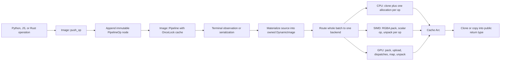

# Image Pipeline Performance Roadmap

Status: active — verified slices recorded; remaining work is open  
Reviewed: 2026-08-14
Code revision reviewed: `d617752a3df3ff9a8da0eab65e473b8628204c45` with additional uncommitted worktree changes
Current local evidence: v201 release pipeline `build/migration-parity/benchmark-result-roadmap-v201-20260814.json`; generated report `build/migration-parity/benchmark-report-roadmap-v201-20260814.md`, audit `build/migration-parity/benchmark-coverage-roadmap-v201-20260814.json`, status `build/migration-parity/benchmark-roadmap-status-roadmap-v201-20260814.json`, combined all-backend receipt `build/migration-parity/all-backends-test-result-roadmap-v198-20260814.json`, and denominator-matched all-backend local coverage receipt `build/migration-parity/coverage-result-rust-roadmap-v200-all-backends-20260814.json` plus `target/coverage/migration-parity-rust.json`.
Benchmark evidence: the v201 pipeline-only release run selected 535 workloads, measured 532, retained three valid not-run/error-gated workloads, and reported zero budget failures. The maintained input audit is 87/87 operation variants (100.0%), with 259 composition workflows, 177 size-matrix workflows, 8 lifecycle workflows, 5 long point-chain workflows, 4 quick workflows, and 535 context-complete workloads. The broader v199 standard run remains retained separately with 743 selected, 695 measured, and 48 valid not-run/error-gated workloads. The alpha-composite cases use the public module function `PIL.Image.alpha_composite`; they are benchmark-only and add no parity cases or expected outputs. The arm64 SIMD alpha path records an exact CPU crossover for full-frame LA/RGBA alpha composite because the measured native row path was not faster; the rejected f64x4/f32x8 vector experiment is retained only as rejected evidence. Crop routing records CPU for plain Crop-only pipelines when SIMD would only delegate to native row movement, while CropBorder remains SIMD-eligible; the forced Crop samples show a 2.6–4.8% SIMD adapter overhead and are retained as measured evidence. v201 operation coverage is 100%; this is not source-coverage credit. GPU was bounded and not measured because this host enumerated no adapter.
The denominator-matched local LLVM coverage run selected and executed 24/24 public coverage plans, passed 4,752 coverage cases, and failed 0 without a unit-test target, with `MIGRATION_TARGET_BACKEND=all` merging CPU and SIMD profiles. The current combined Rust LLVM export contains 58 production Rust files with 30,296/38,918 lines (77.8457%), 4,817/6,786 branches (70.9844%), 2,461/3,273 functions (75.1910%), 49,248/63,415 regions (77.6599%), and 2,794/4,245 instantiations (65.8186%). Relative to v187, the 100 valid transform/reduce cases added 100 executed coverage cases and +3 covered lines/+4 covered regions; the reviewed indexed-mode transform parity fix changes compiled region/branch accounting to the explicit v200 denominator (+3 regions, -2 branches) and is recorded rather than hidden. No files, operations, cases, thresholds, or coverage counts were removed. GPU source is compiled but no GPU adapter was enumerated, so GPU execution did not add runtime hits. This includes instrumented `pillow-rs` core and `pillow-rs-py` binding sources; JS/WASM is not in this LLVM receipt. These are maintained local LLVM receipts, not a Coverage MCP snapshot.

## Purpose

This document is the implementation roadmap for making the Pillow-RS lazy image
pipeline materially faster on CPU, SIMD, and GPU while preserving exact public
Pillow parity. It covers the complete path from graph construction through
materialization, backend selection, kernels, transfers, Python and JavaScript
bindings, and benchmark observation.

This roadmap does not cover `fontdone`, font rendering, or codec internals in
`image-slash-star`. Those components have separate ownership and performance
contracts. Encoded image input and output are included only where they form a
terminal boundary of the Pillow-RS image pipeline.

The identifiers in this file are stable. Implementation commits and pull
requests should cite the relevant `FIL-xx` identifier and update its status
instead of creating a parallel plan.

## Evidence ledger

This ledger records verified slices; an item remains open until its complete
`Done when` condition is met.

| Date | Slice | Evidence | Result |
|---|---|---|---|
| 2026-08-14 | 100-case public `Image.transform`/`Image.reduce` underflow batch, indexed-mode parity repair, and v194–v201 verification | `scripts/build_migration_parity_inputs.py`; `pillow-rs/src/image.rs`; generated `pillow-rs/tests/fixtures/inputs/parity/pil-image-image.json` and `pillow-rs/tests/fixtures/inputs/coverage/pil-image-image.json`; focused parity `build/migration-parity/parity-transform-underflow-v194-cpu-20260814.json` and `build/migration-parity/parity-transform-underflow-v195-simd-20260814.json`; focused managed LLVM coverage `build/migration-parity/coverage-result-rust-transform-underflow-v197-all-20260814.json`; full coverage `build/migration-parity/coverage-result-rust-roadmap-v200-all-backends-20260814.json`; all-backend `build/migration-parity/all-backends-test-result-roadmap-v198-20260814.json`; pipeline `build/migration-parity/benchmark-result-roadmap-v201-20260814.json`, `build/migration-parity/benchmark-report-roadmap-v201-20260814.md`, `build/migration-parity/benchmark-coverage-roadmap-v201-20260814.json`, and `build/migration-parity/benchmark-roadmap-status-roadmap-v201-20260814.json` | Added exactly 100 valid public cases: 20 perspective extra-coefficient cases, 20 quad extra-coefficient cases, 20 valid too-many-coefficient error cases for each transform method, and 20 valid negative-box-underflow `reduce` cases across L/LA/RGB/RGBA. The first 16 P-mode cases exposed a shared palette-preservation parity gap; `image.rs` now keeps native P/PA samples for public transform operations, and the corrected focused CPU and strict SIMD lanes passed 100/100 each. Focused managed LLVM coverage passed 100/100; the full local export selected/executed 24/24 plans, passed 4,752, failed 0, and records 49,248/63,415 regions, 30,296/38,918 lines, 4,817/6,786 branches, 2,461/3,273 functions, and 2,794/4,245 instantiations. CPU and SIMD combined parity each passed 4,769/4,770 image cases; the sole failure remains the separately owned `fontdone` variable-axis 19.0-versus-24.0 mismatch. GPU was bounded and skipped at no adapter, and JS/WASM passed. v201 selected 535 benchmark workloads, measured 532, retained three valid gates, reported zero budget failures, and preserved 87/87 operation coverage. No unit-test target was used. |
| 2026-08-14 | 100-case public `Image.crop` normalization batch and v184–v190 verification | `scripts/build_migration_parity_inputs.py`; generated `pillow-rs/tests/fixtures/inputs/parity/pil-image-image.json` and `pillow-rs/tests/fixtures/inputs/coverage/pil-image-image.json`; focused parity `build/migration-parity/parity-crop-v184-cpu-20260814.json` and `build/migration-parity/parity-crop-v185-simd-20260814.json`; focused managed LLVM coverage `build/migration-parity/coverage-result-rust-crop-v186-all-20260814.json`; full coverage `build/migration-parity/coverage-result-rust-roadmap-v187-all-backends-20260814.json`; all-backend `build/migration-parity/all-backends-test-result-roadmap-v188-20260814.json`; pipeline `build/migration-parity/benchmark-result-roadmap-v190-20260814.json`, `build/migration-parity/benchmark-report-roadmap-v190-20260814.md`, `build/migration-parity/benchmark-coverage-roadmap-v190-20260814.json`, and `build/migration-parity/benchmark-roadmap-status-roadmap-v190-20260814.json` | Added exactly 100 valid public `crop` cases across L/LA/RGB/RGBA/P, including fractional, in-bounds, padded, disjoint, and zero-area boxes, all materialized through `tobytes`. CPU and strict SIMD focused parity passed 100/100 each; focused managed LLVM coverage passed 100/100. The denominator-matched full export remained exactly 49,244/63,412 regions, 30,293/38,918 lines, 4,818/6,788 branches, 2,461/3,273 functions, and 2,794/4,245 instantiations, so the batch adds no new global source hits and will not be repeated. CPU and SIMD combined parity each passed 4,669/4,670 image cases; the sole failure remains the separately owned `fontdone` variable-axis 19.0-versus-24.0 mismatch. GPU was bounded and skipped at no adapter, and JS/WASM passed. v190 selected 535 benchmark workloads, measured 532, retained 3 valid gates, and reported zero budget failures/not-proven; operation coverage remained 87/87. No unit-test target was used. |
| 2026-08-14 | 100-case public `Image.reduce` factor/box coverage batch, OverflowError parity repair, and v176–v183 verification | `scripts/build_migration_parity_inputs.py`; `pillow-rs/src/ops/transform.rs`; generated `pillow-rs/tests/fixtures/inputs/parity/pil-image-image.json` and `pillow-rs/tests/fixtures/inputs/coverage/pil-image-image.json`; focused parity `build/migration-parity/parity-reduce-v177-cpu-20260814.json` and `build/migration-parity/parity-reduce-v178-simd-20260814.json`; focused managed LLVM coverage `build/migration-parity/coverage-result-rust-reduce-v180-all-20260814.json`; full coverage `build/migration-parity/coverage-result-rust-roadmap-v181-all-backends-20260814.json`; all-backend `build/migration-parity/all-backends-test-result-roadmap-v182-20260814.json`; pipeline `build/migration-parity/benchmark-result-roadmap-v183-20260814.json`, `build/migration-parity/benchmark-report-roadmap-v183-20260814.md`, `build/migration-parity/benchmark-coverage-roadmap-v183-20260814.json`, and `build/migration-parity/benchmark-roadmap-status-roadmap-v183-20260814.json` | Added exactly 100 valid public `reduce` cases: 40 materialized valid boxes across L/LA/RGB/RGBA, 20 scalar factors, 20 zero-y-factor calls, 10 zero-x-factor calls, and 10 checked oversized-box calls. The first ten oversized-box cases exposed a Pillow `OverflowError`/target `ValueError` mismatch; core now maps checked box-coordinate conversion to Pillow's `OverflowError` class and messages, and the corrected batch passed CPU 100/100 and strict SIMD 100/100. Focused managed LLVM coverage passed 100/100. Full local managed LLVM coverage selected/executed 24/24 plans, passed 4,552, failed 0; compared with v171, covered regions/lines/branches/functions/instantiations moved +10/+8/+2/+2/+2 while the reviewed source addition moved denominators +3/+8/+2/0/0. CPU and SIMD combined parity each passed 4,569/4,570 image cases; the sole failure remains the separately owned `fontdone` variable-axis 19.0-versus-24.0 mismatch. GPU was bounded and skipped at no adapter, and JS/WASM passed. v183 selected 535 benchmark workloads, measured 532, retained 3 valid gates, and reported zero budget failures/not-proven; operation coverage remained 87/87. No unit-test target was used. |
| 2026-08-14 | 100-case public `Image.putpixel` coverage batch and v167–v173 verification | `scripts/build_migration_parity_inputs.py`; generated `pillow-rs/tests/fixtures/inputs/parity/pil-image-image.json` and `pillow-rs/tests/fixtures/inputs/coverage/pil-image-image.json`; focused parity `build/migration-parity/parity-putpixel-v168-cpu-20260814.json` and `build/migration-parity/parity-putpixel-v169-simd-20260814.json`; focused managed LLVM coverage `build/migration-parity/coverage-result-rust-putpixel-v170-all-20260814.json`; full coverage `build/migration-parity/coverage-result-rust-roadmap-v171-all-backends-20260814.json`; all-backend `build/migration-parity/all-backends-test-result-roadmap-v172-20260814.json`; pipeline `build/migration-parity/benchmark-result-roadmap-v173-20260814.json`, `build/migration-parity/benchmark-report-roadmap-v173-20260814.md`, `build/migration-parity/benchmark-coverage-roadmap-v173-20260814.json`, and `build/migration-parity/benchmark-roadmap-status-roadmap-v173-20260814.json` | Added exactly 100 valid public `putpixel` cases across `1`, `L`, `LA`, `P`, `RGB`, and `RGBA`, including scalar and valid sequence value forms and receiver observation. The initial-color generator was corrected to keep constructor values scalar where Pillow requires that shape; after correction CPU and SIMD focused parity passed 100/100 each, and focused managed LLVM coverage passed 100/100. Full local managed LLVM coverage selected/executed 24/24 plans, passed 4,452, failed 0; compared with v164, lines, branches, functions, regions, and instantiations were unchanged, so this batch is not repeated. CPU and SIMD combined parity each passed 4,469/4,470 image cases; the sole failure remains the separately owned `fontdone` variable-axis 19.0-versus-24.0 mismatch. GPU was bounded and skipped at no adapter, and JS/WASM passed. v173 selected 535 benchmark workloads, measured 532, retained 3 valid gates, and reported zero budget failures/not-proven; operation coverage remained 87/87. No unit-test target was used. |
| 2026-08-14 | 100-case public `Image.getdata(band=...)` coverage batch and v161–v166 verification | `scripts/build_migration_parity_inputs.py`; generated `pillow-rs/tests/fixtures/inputs/parity/pil-image-image.json` and `pillow-rs/tests/fixtures/inputs/coverage/pil-image-image.json`; focused parity `build/migration-parity/parity-imagedata-band-v161-cpu-20260814.json` and `build/migration-parity/parity-imagedata-band-v162-simd-20260814.json`; focused managed LLVM coverage `build/migration-parity/coverage-result-rust-imagedata-band-v163-all-20260814.json`; full coverage `build/migration-parity/coverage-result-rust-roadmap-v164-all-backends-20260814.json`; all-backend `build/migration-parity/all-backends-test-result-roadmap-v165-20260814.json`; pipeline `build/migration-parity/benchmark-result-roadmap-v166-20260814.json`, `build/migration-parity/benchmark-report-roadmap-v166-20260814.md`, `build/migration-parity/benchmark-coverage-roadmap-v166-20260814.json`, and `build/migration-parity/benchmark-roadmap-status-roadmap-v166-20260814.json` | Added exactly 100 valid public `getdata(band=...)` cases across L/LA/RGB/RGBA, with every band index in range and distinct valid pixel patterns. CPU and SIMD focused parity passed 100/100 each; focused managed LLVM coverage passed 100/100. Full local managed LLVM coverage selected/executed 24/24 plans, passed 4,352, failed 0; relative to v158, regions moved 49,210/63,409 -> 49,234/63,409 (+24), lines 30,276/38,910 -> 30,285/38,910 (+9), branches 4,813/6,786 -> 4,816/6,786 (+3), functions 2,456/3,273 -> 2,459/3,273 (+3), and instantiations 2,787/4,245 -> 2,792/4,245 (+5). CPU and SIMD combined parity each passed 4,369/4,370 image cases; the sole failure remains the separately owned `fontdone` variable-axis 19.0-versus-24.0 mismatch. GPU was bounded and skipped at no adapter, and JS/WASM passed. v166 selected 535 benchmark workloads, measured 532, retained 3 valid gates, and reported zero budget failures/not-proven; operation coverage remained 87/87. No unit-test target was used. |
| 2026-08-14 | 100-case typed-analysis coverage batch, I;16* parity repair, and v158–v160 verification | `scripts/build_migration_parity_inputs.py`; `pillow-rs/src/ops/analysis.rs`; generated `pillow-rs/tests/fixtures/inputs/parity/pil-image-image.json` and `pillow-rs/tests/fixtures/inputs/coverage/pil-image-image.json`; focused parity `build/migration-parity/parity-analysis-typed-v155-cpu-20260814.json` and `build/migration-parity/parity-analysis-typed-v156-simd-20260814.json`; focused managed LLVM coverage `build/migration-parity/coverage-result-rust-analysis-typed-v157-all-20260814.json`; full coverage `build/migration-parity/coverage-result-rust-roadmap-v158-all-backends-20260814.json`; all-backend `build/migration-parity/all-backends-test-result-roadmap-v159-20260814.json`; pipeline `build/migration-parity/benchmark-result-roadmap-v160-20260814.json`, `build/migration-parity/benchmark-report-roadmap-v160-20260814.md`, `build/migration-parity/benchmark-coverage-roadmap-v160-20260814.json`, and `build/migration-parity/benchmark-roadmap-status-roadmap-v160-20260814.json` | Added exactly 100 valid public byte-stream cases: `I;16*` `getbbox`, RGB16/RGBA16 PNG `getbbox`, `getextrema`, and `histogram`. The PNG generator was corrected to emit one filter byte per row; the remaining eight `I;16*` mismatches exposed Pillow's byte-oriented public `getbbox` behavior and were fixed in the core with a documented implementation-site note. CPU and SIMD focused parity passed 100/100 each. Full local managed LLVM coverage selected/executed 24/24 plans, passed 4,252, failed 0; relative to v149, regions moved 49,161/63,360 -> 49,210/63,409 (+49/+49), lines 30,252/38,886 -> 30,276/38,910 (+24/+24), and branches 4,807/6,780 -> 4,813/6,786 (+6/+6), while functions and instantiations stayed 2,456/3,273 and 2,787/4,245. The combined CPU+SIMD parity lane agreed at 4,269/4,270, with the one separately owned fontdone variation-axis mismatch; GPU was bounded and skipped at no adapter, and JS/WASM passed. v160 selected 535 benchmark workloads, measured 532, retained 3 valid gates, and reported zero budget failures/not-proven; operation coverage remained 87/87. No unit-test target was used. |
| 2026-08-14 | 100-case public blur/rank coverage batch and v149–v151 verification | `scripts/build_migration_parity_inputs.py`; generated `pillow-rs/tests/fixtures/inputs/parity/pil-imagefilter.json` and `pillow-rs/tests/fixtures/inputs/coverage/pil-imagefilter.json`; focused parity `build/migration-parity/parity-filter-overlap-histogram-v144-cpu-20260814.json` and `build/migration-parity/parity-filter-overlap-histogram-v145-simd-20260814.json`; focused coverage `build/migration-parity/coverage-result-rust-filter-overlap-histogram-v148-20260814.json`; full coverage `build/migration-parity/coverage-result-rust-roadmap-v149-all-backends-20260814.json`; all-backend `build/migration-parity/all-backends-test-result-roadmap-v150-20260814.json`; pipeline `build/migration-parity/benchmark-result-roadmap-v151-20260814.json`, `build/migration-parity/pipeline-performance-report-roadmap-v151-20260814.json`, `build/migration-parity/pipeline-benchmark-coverage-roadmap-v151-20260814.json`, and `build/migration-parity/pipeline-roadmap-status-roadmap-v151-20260814.json` | Added 100 valid public input-driven filter cases: 32 blur dimensions that keep all overlap regions live, 8 zero-radius no-ops, 48 large byte rank/median histogram cases, and 12 additional rank-histogram cases across L/LA/RGB/RGBA. CPU and SIMD focused parity passed 100/100 each; focused managed LLVM coverage passed 100/100. Full managed Rust coverage selected/executed 24/24 plans, passed 4,152, failed 0. Relative to v139, the unchanged denominator moved regions 49,137/63,360 -> 49,161/63,360 (+24), lines 30,222/38,886 -> 30,252/38,886 (+30), while branches remained 4,807/6,780, functions 2,456/3,273, and instantiations 2,787/4,245. The CPU filter component is now 1,413/1,483 regions and 1,168/1,217 lines; remaining filter gaps are classified guards/parallel-feature branches plus the internal `pil_box_blur` no-op guard that public dispatch bypasses. CPU/SIMD all-backend parity each passed 4,169/4,170 with the single separately owned fontdone mismatch; GPU safely skipped at no adapter and JS/WASM passed. v151 release pipeline selected 535/measured 532/3 valid gates, zero budget/infra failures, and 87/87 operation coverage. No unit-test target was used. |
| 2026-08-14 | 100-case public filter geometry batch, blur pass-state repair, and v139–v141 verification | `scripts/build_migration_parity_inputs.py`; `pillow-rs/src/compute/pool_cpu/ops/filter.rs`; `pillow-rs/src/compute/pool_simd/ops/adapters.rs`; generated `pillow-rs/tests/fixtures/inputs/parity/pil-imagefilter.json` and `pillow-rs/tests/fixtures/inputs/coverage/pil-imagefilter.json`; focused parity `build/migration-parity/parity-filter-geometry-v134-cpu-20260814.json` and `build/migration-parity/parity-filter-geometry-v136-simd-20260814.json`; focused coverage `build/migration-parity/coverage-result-rust-filter-geometry-v138-20260814.json`; full coverage `build/migration-parity/coverage-result-rust-roadmap-v139-all-backends-20260814.json`; all-backend `build/migration-parity/all-backends-test-result-roadmap-v140-20260814.json`; pipeline `build/migration-parity/benchmark-result-roadmap-v141-20260814.json`, `build/migration-parity/pipeline-performance-report-roadmap-v141-20260814.json`, `build/migration-parity/pipeline-benchmark-coverage-roadmap-v141-20260814.json`, and `build/migration-parity/pipeline-roadmap-status-roadmap-v141-20260814.json` | Added 100 valid public input-driven filter cases covering large/overlap blur, narrow/tall rank/extreme paths, and short kernel geometry across L/LA/RGB/RGBA. CPU and SIMD focused parity passed 100/100 each; the first 8 large-blur reproducers exposed an odd-pass transposed-buffer swap bug, fixed in both CPU and SIMD path-state code, then passed 8/8 CPU and 8/8 SIMD after release rebuild. Full managed Rust coverage selected/executed 24/24 plans, passed 4,052, failed 0. Relative to v128, local LLVM moved regions 49,057/63,354 -> 49,137/63,360 (+80 covered, +6 denominator), lines 30,165/38,886 -> 30,222/38,886 (+57), branches 4,798/6,776 -> 4,807/6,780 (+9 covered, +4 denominator), functions 2,455/3,273 -> 2,456/3,273 (+1), and instantiations 2,785/4,245 -> 2,787/4,245 (+2). CPU/SIMD all-backend parity each passed 4,069/4,070 with the single separately owned fontdone mismatch; GPU safely skipped at no adapter and JS/WASM passed. v141 release pipeline selected 535/measured 532/3 valid gates, zero budget/infra failures, and 87/87 operation coverage. No unit-test target was used. |
| 2026-08-14 | Large-window Max/MinFilter public coverage batch and v128–v130 verification | `scripts/build_migration_parity_inputs.py`; generated `pillow-rs/tests/fixtures/inputs/parity/pil-imagefilter.json` and `pillow-rs/tests/fixtures/inputs/coverage/pil-imagefilter.json`; focused parity `build/migration-parity/parity-filter-large-v126-cpu-20260814.json` and `build/migration-parity/parity-filter-large-v126-simd-20260814.json`; focused coverage `build/migration-parity/coverage-result-rust-filter-large-v127-20260814.json`; full coverage `build/migration-parity/coverage-result-rust-roadmap-v128-all-backends-20260814.json`; all-backend `build/migration-parity/all-backends-test-result-roadmap-v129-20260814.json`; pipeline `build/migration-parity/benchmark-result-roadmap-v130-20260814.json`, `build/migration-parity/pipeline-performance-report-roadmap-v130-20260814.json`, `build/migration-parity/pipeline-benchmark-coverage-roadmap-v130-20260814.json`, and `build/migration-parity/pipeline-roadmap-status-roadmap-v130-20260814.json` | Added 16 valid public `MaxFilter`/`MinFilter` cases for size 5 across L/LA/RGB/RGBA at 513×3 and 513×16. CPU and SIMD focused parity passed 16/16 each; full managed Rust coverage selected/executed 24/24 plans, passed 3,952 coverage cases, and failed 0. The local LLVM export moved from 48,853/63,354 to 49,057/63,354 regions (+204), 30,019/38,886 to 30,165/38,886 lines (+146), 4,755/6,776 to 4,798/6,776 branches (+43), 2,449/3,273 to 2,455/3,273 functions (+6), and 2,777/4,245 to 2,785/4,245 instantiations (+8); denominators were unchanged. v129 CPU/SIMD each passed 3,969/3,970, with the single external `fontdone` mismatch classified separately; GPU safely skipped at the no-adapter gate and JS/WASM passed. v130 release pipeline selected 535/measured 532/three valid gates, audited 87/87 operation variants, and reported zero infrastructure or budget failures. No unit-test target was used. |
| 2026-08-13 | Public logical-mode error branch batch and v119–v121 verification | `scripts/build_migration_parity_inputs.py`; generated `pillow-rs/tests/fixtures/inputs/parity/pil-imagechops.json` and `pillow-rs/tests/fixtures/inputs/coverage/pil-imagechops.json`; focused parity `build/migration-parity/parity-logical-first-invalid-v118-{cpu,simd}.json`; focused coverage `build/migration-parity/coverage-result-rust-logical-invalid-v119-20260813.json`; full coverage `build/migration-parity/coverage-result-rust-roadmap-final-v119-all-backends-20260813.json`; full pipeline artifacts `build/migration-parity/benchmark-result-roadmap-final-v120-20260813.json`, `build/migration-parity/pipeline-performance-report-roadmap-final-v120-20260813.json`, `build/migration-parity/pipeline-benchmark-coverage-roadmap-final-v120-20260813.json`, `build/migration-parity/pipeline-roadmap-status-roadmap-final-v120-20260813.json`, and `build/migration-parity/all-backends-test-result-roadmap-final-v121-20260813.json` | Added three valid input-driven `ImageChops.logical_{and,or,xor}` cases with an invalid first operand and valid second operand. CPU and SIMD focused parity passed 3/3 each; focused LLVM coverage exercised the first-operand short-circuit path, and the complete source aggregate remained 48,853/63,354 regions (the targeted file has 4/4 branches and 143/145 regions). The reviewed parity corpus increased from 3,951 to 3,954 cases; no existing case, expected output, threshold, or denominator was removed. v120 retained 535 selected / 532 measured / 3 valid gates and 87/87 operation coverage. v121 CPU/SIMD each passed 3,953/3,954, GPU smoke skipped at zero adapters, and JS/WASM passed. No unit-test target was used. |
| 2026-08-13 | FIL-41 public-module AlphaComposite measurement, arm64 crossover, and v116/v117 verification | `pillow-rs/src/compute/pool_simd/ops/adapters.rs`; `scripts/build_migration_parity_inputs.py`; generated `pillow-rs/tests/fixtures/inputs/benchmark/pipeline-operations.json`; focused release artifacts `build/migration-parity/benchmark-alpha-module-v1.json` and `build/migration-parity/benchmark-parity-alpha-module-v1.json`; full artifacts `build/migration-parity/benchmark-result-roadmap-final-v116-20260813.json`, `build/migration-parity/benchmark-parity-result-roadmap-final-v116-20260813.json`, `build/migration-parity/pipeline-performance-report-roadmap-final-v116-20260813.json`, `build/migration-parity/pipeline-benchmark-coverage-roadmap-final-v116-20260813.json`, `build/migration-parity/pipeline-roadmap-status-roadmap-final-v116-20260813.json`, `build/migration-parity/all-backends-test-result-roadmap-final-v117-20260813.json`, and `build/migration-parity/coverage-result-rust-roadmap-final-v116-all-backends-20260813.json` | The benchmark now measures the public `PIL.Image.alpha_composite` module endpoint rather than a mutating `paste` surrogate. The focused alpha parity sweep passed 43/43 on CPU and SIMD. On arm64, the forced SIMD full-frame LA/RGBA cases record `actual_backend=cpu` with `SIMD AlphaComposite: exact CPU crossover fallback`; the f64x4/f32x8 vector attempt was rejected after release measurements regressed. v116 selected 535, measured 532, retained three valid gates, and kept the 87/87 operation audit; v117 CPU/SIMD each passed 3,950/3,951 with only the separate external `fontdone` mismatch, GPU smoke skipped at zero adapters, and JS/WASM passed. The current local LLVM aggregate is 48,853/63,354 regions, with 30,019/38,886 lines, 4,755/6,776 branches, 2,449/3,273 functions, and 2,777/4,245 instantiations. No unit-test target was used. |
| 2026-08-13 | FIL-27/FIL-43 four-case 512×512 convolution crossover and v114/v115 verification | `scripts/build_migration_parity_inputs.py`; generated `pillow-rs/tests/fixtures/inputs/benchmark/pipeline-operations.json`; focused release benchmark `build/migration-parity/benchmark-convolution-crossover-v113-20260813.json`; focused parity `build/migration-parity/parity-convolution-crossover-v112-{cpu,simd}-20260813.json` and RGB counterparts; `pillow-rs/src/compute/pool_simd/ops/adapters.rs`; full artifacts `build/migration-parity/benchmark-result-roadmap-final-v114-20260813.json`, `build/migration-parity/pipeline-performance-report-roadmap-final-v114-20260813.json`, `build/migration-parity/pipeline-benchmark-coverage-roadmap-final-v114-20260813.json`, `build/migration-parity/pipeline-roadmap-status-roadmap-final-v114-20260813.json`, `build/migration-parity/all-backends-test-result-roadmap-final-v115-20260813.json`, and `build/migration-parity/coverage-result-rust-roadmap-final-v114-all-backends-20260813.json` | Four existing public convolution cases were projected to 512×512 benchmark workflows; all four completed on Pillow/CPU/SIMD and focused LA/RGB parity passed 1/1 on CPU and SIMD. The arm64 release crossover receipt retains SIMD for 512² L/RGB 3×3 and L 5×5, while LA 3×3 uses the exact CPU fallback at ≥512²; its forced SIMD subject reports `actual_backend=cpu` and the explicit fallback reason. v114 selected 531, measured 528, retained three valid gates, and kept the 87/87 operation audit. v115 CPU/SIMD each passed 3,950/3,951 with only the separate fontdone numeric mismatch; GPU full execution was skipped at zero adapters and JS/WASM passed. The current local LLVM aggregate is 48,951/63,315 regions, with 30,080/38,853 lines, 4,764/6,772 branches, and 2,451/3,272 functions. No unit-test target was used. |
| 2026-08-13 | FIL-20/FIL-31 ten-case copy-routing matrix and v111 final pipeline | `pillow-rs/src/compute/mod.rs`; `scripts/build_migration_parity_inputs.py`; generated `pillow-rs/tests/fixtures/inputs/benchmark/pipeline-operations.json`; full artifacts `build/migration-parity/benchmark-result-roadmap-final-v111-20260813.json`, `build/migration-parity/pipeline-performance-report-roadmap-final-v111-20260813.json`, `build/migration-parity/pipeline-benchmark-coverage-roadmap-final-v111-20260813.json`, `build/migration-parity/pipeline-roadmap-status-roadmap-final-v111-20260813.json`, `build/migration-parity/all-backends-test-result-roadmap-final-v112-20260813.json`, and `build/migration-parity/coverage-result-rust-roadmap-final-v111-all-backends-20260813.json` | Ten public benchmark workflows completed on Pillow/CPU/SIMD with zero infrastructure errors. Forced SIMD evidence is layout-dependent: plain Crop is slower for L/RGB and the two-Crop chain, while CropBorder is faster for the large LA/RGB/RGBA cases; the final automatic policy therefore falls back only for plain Crop-only batches. Release-built telemetry verified plain Crop → `actual_backend=cpu` with reason `SIMD Crop delegates to native CPU row movement`, and CropBorder → `actual_backend=simd` with no fallback. v111 selected 527, measured 524, retained three valid gates, and kept operation coverage at 87/87. CPU/SIMD each executed 3,951 parity cases with 3,950 passes and one separate external `fontdone` numeric mismatch; GPU full execution was safely skipped at the zero-adapter gate, and JS/WASM passed. The final local LLVM aggregate is 48,943/63,295 regions (77.3252%), with 30,076/38,841 lines, 4,761/6,766 branches, and 2,451/3,272 functions. No unit-test target was used. |
| 2026-08-13 | FIL-31/FIL-20 native CropBorder path, automatic copy routing, and v110 final pipeline | `pillow-rs/src/compute/pool_simd/ops/adapters.rs`; `pillow-rs/src/compute/mod.rs`; focused parity `build/migration-parity/parity-cropborder-v109-cpu-20260813.json` and `build/migration-parity/parity-cropborder-v109-simd-20260813.json`; focused coverage `build/migration-parity/coverage-result-rust-cropborder-v109-20260813.json`; full artifacts `build/migration-parity/benchmark-result-roadmap-final-v110-20260813.json`, `build/migration-parity/pipeline-performance-report-roadmap-final-v110-20260813.json`, `build/migration-parity/pipeline-benchmark-coverage-roadmap-final-v110-20260813.json`, `build/migration-parity/pipeline-roadmap-status-roadmap-final-v110-20260813.json`, `build/migration-parity/all-backends-test-result-roadmap-final-v110-20260813.json`, and `build/migration-parity/coverage-result-rust-roadmap-final-v110-all-backends-20260813.json` | SIMD `CropBorder` now stays in native L/LA/RGB/RGBA/typed storage and copies the exact inner rows through the shared representation-aware crop implementation; 13/13 focused cases passed on CPU and SIMD. With CPU+SIMD active, automatic single-operation Crop/CropBorder routing records `actual_backend=cpu` and the explicit reason `SIMD copy-like geometry delegates to native CPU row movement`; explicit SIMD remains available for parity and measurement. The v110 release selected 517, measured 514, retained three valid gates, and reported zero infrastructure errors/hangs; operation input coverage remains 87/87. The current denominator-matched local LLVM receipt is 48,909/63,295 regions (77.2715%), with 30,051/38,842 lines, 4,754/6,766 branches, and 2,449/3,271 functions. A separate wide single-op Multiply/Screen attempt passed 28/28 parity cases but was reverted after 1024×768 release profiles measured SIMD slower than CPU; its receipts remain in `build/migration-parity/profiles/multiply-expanded-v110-{cpu,simd}` and `screen-expanded-v110-{cpu,simd}` as rejected evidence. The all-backend lane ran CPU/SIMD 3,951 cases each (3,950 pass, one external fontdone mismatch), skipped GPU at zero adapters without a hang, and passed JS/WASM. No unit-test target was used. |
| 2026-08-13 | v106 combined backend lane after Crop change | `build/migration-parity/all-backends-test-result-roadmap-final-v106-20260813.json`; `build/migration-parity/all-backends/parity-cpu.json`; `build/migration-parity/all-backends/parity-simd.json` | CPU and SIMD each executed 3,951 cases and passed 3,950, with the same separately owned `fontdone` variable-axis overflow mismatch and zero infrastructure errors. The GPU smoke was bounded and skipped at the zero-adapter gate; the full GPU lane was not executed. JS/WASM package smoke passed. This receipt is backend verification, not source-coverage credit, and the external fontdone result remains separate. No unit-test target was used. |
| 2026-08-13 | FIL-31 Crop copy scheduling and v106 pipeline rerun | `pillow-rs/src/compute/pool_cpu/ops/geometry.rs`; focused profiles `build/migration-parity/profiles/crop-v106-cpu/pipeline-matrix.expanded.crop.1024x768-cpu.profile.json` and `build/migration-parity/profiles/crop-v106-simd/pipeline-matrix.expanded.crop.1024x768-simd.profile.json`; full artifacts `build/migration-parity/benchmark-result-roadmap-final-v106-20260813.json`, `build/migration-parity/pipeline-performance-report-roadmap-final-v106-20260813.json`, `build/migration-parity/pipeline-benchmark-coverage-roadmap-final-v106-20260813.json`, `build/migration-parity/pipeline-roadmap-status-roadmap-final-v106-20260813.json`, and `build/migration-parity/coverage-result-rust-roadmap-final-v106-all-20260813.json` | Crop remains a byte-copy operation rather than an arithmetic SIMD workload. The exact native path now uses contiguous serial row copies below a 4 MiB output buffer and keeps the approved row-parallel path for larger buffers, removing unnecessary Rayon scheduling from ordinary Crop sizes. The full active Crop batch passed 75/75 on CPU and 75/75 on strict SIMD with zero infrastructure errors. v106 release evidence shows SIMD ahead of CPU for the explicit geometry-material 1024×768 Crop (0.378709 vs 0.434166 ms terminal median), while the standalone full-frame expanded Crop remains slightly slower (0.231792 vs 0.213625 ms); both results are retained, so no universal SIMD win is claimed. The combined local LLVM receipt is 49,054/63,257 regions (77.5471%), with 30,117/38,815 lines, 4,761/6,748 branches, and 2,452/3,271 functions. FIL-31 remains open pending a cost-based policy or architecture-specific proof for bandwidth-only geometry. No unit-test target was used. |
| 2026-08-13 | FIL-43 native rolling blur byte path and v105 final pipeline | `pillow-rs/src/compute/pool_simd/ops/adapters.rs`; `scripts/build_migration_parity_inputs.py`; generated `pillow-rs/tests/fixtures/inputs/benchmark/pipeline-operations.json`; focused parity `build/migration-parity/parity-filter-simd-native-v104-cpu-20260813.json` and `build/migration-parity/parity-filter-simd-native-v104-simd-20260813.json`; full artifacts `build/migration-parity/benchmark-result-roadmap-final-v105-20260813.json`, `build/migration-parity/benchmark-parity-result-roadmap-final-v105-20260813.json`, `build/migration-parity/pipeline-performance-report-roadmap-final-v105-20260813.json`, `build/migration-parity/pipeline-benchmark-coverage-roadmap-final-v105-20260813.json`, `build/migration-parity/pipeline-roadmap-status-roadmap-final-v105-20260813.json`, `build/migration-parity/all-backends-test-result-roadmap-final-v105-20260813.json`, and `build/migration-parity/coverage-result-rust-roadmap-final-v105-all-20260813.json` | Native byte L/LA/RGB/RGBA BoxBlur and GaussianBlur now use the exact Pillow fixed-point rolling recurrence with eight-lane `u32x8` output arithmetic for large images; typed layouts and small images retain their exact fallback paths. The focused filter/blur batch passed 42/42 on CPU and 42/42 on strict SIMD. The v105 release selected 517, measured 514, retained three valid gates, reported zero infrastructure errors/hangs, and audited 87/87 operation variants with 241 composition workflows; the five added blur workloads are benchmark-only and did not change parity inputs or source-coverage denominators. Large native L/LA/RGB/RGBA blur workloads now show SIMD as the actual backend and ahead of CPU in the release matrix, while small-image crossovers remain measured rather than hidden. The combined local LLVM receipt is 49,042/63,241 regions (77.5478%), with 30,122/38,809 lines, 4,760/6,744 branches, and 2,452/3,271 functions; this is not 100% source coverage and is not a Coverage MCP snapshot. The full all-backend lane retained only the separately owned `fontdone` mismatch, skipped GPU safely at zero adapters, and passed JS/WASM. FIL-43 remains open because typed-I/typed-F vector coverage, full convolution acceptance, and architecture/crossover conditions are not yet proven. No unit-test target was used. |
| 2026-08-13 | FIL-27/FIL-43 native f32x8 convolution rows and v103 final pipeline | `pillow-rs/src/compute/pool_simd/ops/adapters.rs`; `scripts/build_migration_parity_inputs.py`; generated `pillow-rs/tests/fixtures/inputs/benchmark/pipeline-operations.json`; focused parity `build/migration-parity/parity-filter-vector-cpu-v103-20260813.json` and `build/migration-parity/parity-filter-vector-simd-v103-20260813.json`; full artifacts `build/migration-parity/benchmark-result-roadmap-final-v103-20260813.json`, `build/migration-parity/benchmark-parity-result-roadmap-final-v103-20260813.json`, `build/migration-parity/pipeline-performance-report-roadmap-final-v103-20260813.json`, `build/migration-parity/pipeline-benchmark-coverage-roadmap-final-v103-20260813.json`, `build/migration-parity/pipeline-roadmap-status-roadmap-final-v103-20260813.json`, `build/migration-parity/pipeline-budget-check-roadmap-final-v103-20260813.json`, `build/migration-parity/all-backends-test-result-roadmap-final-v103-20260813.json`, and `build/migration-parity/coverage-result-rust-roadmap-final-v103-20260813.json` | Native ordinary-byte 3×3 and 5×5 convolution rows now use eight-lane `f32x8` accumulation for L/LA/RGB/RGBA-compatible layouts while preserving the scalar CPU/Pillow tap order and border initialization. RGBA 3×3 deliberately records an exact CPU crossover fallback because the measured vector path was slower; this is not claimed as universal SIMD acceleration. The eight new 1024×768 benchmark-only mode/workload combinations completed with no source errors or hangs; L/LA/RGB 3×3 and L/LA/RGBA 5×5 used the SIMD adapter, while RGB 5×5 was measured and retained even though it was slower. Focused public filter parity passed 2/2 on CPU and 2/2 on SIMD. The v103 pipeline selected 512, measured 509, retained three valid gates, and audited 87/87 operation variants; the v103 budget guard retained 1,511 comparable, 537 not-comparable cells, and 45 violations, so FIL-62 remains open. Combined CPU/SIMD parity retained only the separate external `fontdone` mismatch; GPU skipped safely at zero adapters and JS/WASM passed. No unit-test target was used. |
| 2026-08-13 | Native byte conversion/PutPixel boundary and v102 final pipeline | `pillow-rs/src/compute/pool_simd/ops/adapters.rs`; release focused benchmark `build/migration-parity/benchmark-resize-convert-native-v3.json`; canonical SIMD parity `build/migration-parity/parity-result-roadmap-final-v102-simd-fallback2-20260813.json`; full artifacts `build/migration-parity/benchmark-result-roadmap-final-v102-20260813.json`, `build/migration-parity/pipeline-performance-report-roadmap-final-v102-20260813.json`, `build/migration-parity/pipeline-benchmark-coverage-roadmap-final-v102-20260813.json`, `build/migration-parity/pipeline-roadmap-status-roadmap-final-v102-20260813.json`, `build/migration-parity/pipeline-budget-check-roadmap-final-v102-20260813.json`, `build/migration-parity/all-backends-test-result-roadmap-final-v102-20260813.json`, and `build/migration-parity/coverage-result-rust-roadmap-final-v102-20260813.json` | Native byte `Resize`/ordinary conversion routing, direct native `PutPixel`, and L/LA→CMYK conversion now avoid unnecessary packed-RGBA intermediates while preserving exact CPU behavior. The focused CMYK receipt measured SIMD 15.1855 ms for the 1024×768 CMYK ImageStat workload and 4.4689 ms for the masked-RGB analysis workload; the canonical non-strict SIMD lane passed 3,950/3,951 image cases, with only the separately owned `fontdone` mismatch. The v102 release matrix remains 504 selected / 501 measured / 3 valid gates, with 87/87 operation variants and 504/504 context-complete workloads. Source LLVM coverage is reported separately below; this slice does not close FIL-26, FIL-31, or the broader SIMD architecture/crossover conditions. No unit-test target was used. |
| 2026-08-13 | FIL-26/FIL-31 native `F` rank family and native byte `Scale` routing with v101 pipeline | `pillow-rs/src/compute/pool_simd/ops/adapters.rs`; full CPU/SIMD parity `build/migration-parity/parity-rank-fmode-{cpu,simd}-v1.json` and `parity-scale-native-{cpu,simd}-v1.json`; focused release benchmarks `build/migration-parity/benchmark-rank-fmode-v1.json` and `build/migration-parity/benchmark-scale-native-v1.json`; full artifacts `build/migration-parity/benchmark-result-roadmap-final-v101-20260813.json`, `build/migration-parity/pipeline-performance-report-roadmap-final-v101-20260813.json`, `build/migration-parity/pipeline-benchmark-coverage-roadmap-final-v101-20260813.json`, `build/migration-parity/pipeline-roadmap-status-roadmap-final-v101-20260813.json`, `build/migration-parity/all-backends-test-result-roadmap-final-v101-20260813.json`, and `build/migration-parity/coverage-result-rust-roadmap-final-v101-20260813.json` | Explicit `F` Median/Max/Min/Rank filters now call the exact native scalar implementation instead of byte-packed RGBA conversion; native L/LA/RGB/RGBA `Scale` likewise avoids packing before the exact representation-aware resize. All 9 rank-family parity cases passed on CPU and SIMD; the full 3,951-case lanes retained only the separate fontdone mismatch. The focused 256×256 F rank workload measured SIMD 1.4358 ms versus the prior v100 6.7477 ms observation; the `Filter5x5 → Scale` workload measured SIMD 0.5495 ms versus v100 2.8503 ms, with the SIMD terminal phase falling from 2.8316 to 0.5201 ms. The v101 benchmark audit remains 87/87 operation variants and 504/504 context-complete workflows. These are verified routing/performance slices, not closure of the architecture-specific SIMD or complete geometry/filter acceptance conditions. No unit-test target was used. |
| 2026-08-13 | FIL-21/FIL-31/FIL-34/FIL-37 native Add/Subtract, Crop/Reduce, and RGB histogram paths with v100 pipeline | Native adapter changes in `pillow-rs/src/compute/pool_simd/ops/adapters.rs`; focused parity `build/migration-parity/parity-add-subtract-native-{cpu,simd}-v1.json`, `build/migration-parity/parity-crop-reduce-native-{cpu,simd}-v2.json`, and `build/migration-parity/parity-autocontrast-equalize-native-{cpu,simd}-v1.json`; focused release benchmarks `build/migration-parity/benchmark-add-subtract-native-{cpu,simd}-v1.json`, `build/migration-parity/benchmark-crop-reduce-native-v2.json`, and `build/migration-parity/benchmark-autocontrast-equalize-native-v1.json`; full artifacts `build/migration-parity/benchmark-result-roadmap-final-v100-20260813.json`, `build/migration-parity/pipeline-performance-report-roadmap-final-v100-20260813.json`, `build/migration-parity/pipeline-benchmark-coverage-roadmap-final-v100-20260813.json`, `build/migration-parity/pipeline-roadmap-status-roadmap-final-v100-20260813.json`, `build/migration-parity/all-backends-test-result-roadmap-final-v100-20260813.json`, and `build/migration-parity/coverage-result-rust-roadmap-final-v100-20260813.json` | Default Add/Subtract now use exact native saturating byte formulas; non-default scale/offset and unsupported layouts retain the scalar fallback. Native Crop/Reduce reuse the representation-aware exact row/block implementations instead of packed RGBA conversion. RGB Autocontrast/Equalize reuse the exact native histogram/LUT implementations; alpha/typed/palette paths remain unchanged. Focused parity passed 30/30 Add/Subtract, 103/103 Crop/Reduce, and 59/59 Autocontrast/Equalize cases on each CPU and SIMD. Focused 1024×768 medians improved SIMD Add from the v99 15.3948 ms observation to 1.3828 ms, geometry-material Crop from 9.5165 to 0.8116 ms, geometry-material Reduce RGB from 4.1536 to 0.6295 ms, Autocontrast from 13.6305 to 1.8366 ms, and Equalize from 14.2939 to 1.3879 ms. The v100 pipeline audit remains 87/87 operation variants and 504/504 context-complete workflows. Roadmap status remains honestly 14 closed / 50 open (29 in progress, 21 proposed); local LLVM region coverage is 41,109/62,371 (65.9104%), so strict source 100% is not claimed. No unit-test target was used. |
| 2026-08-13 | FIL-34/FIL-37 native SIMD brightness LUT and v99 final pipeline | `pillow-rs/src/compute/pool_simd/ops/adapters.rs`; focused parity `build/migration-parity/parity-brightness-native-cpu-v1.json` and `build/migration-parity/parity-brightness-native-simd-v1.json`; focused release benchmark `build/migration-parity/benchmark-brightness-native-v1.json`; pipeline-only receipt `build/migration-parity/benchmark-result-roadmap-final-v99-20260813.json`; complete standard receipt `build/migration-parity/benchmark-result-roadmap-final-v99-standard-20260813.json`; report `build/migration-parity/pipeline-performance-report-roadmap-final-v99-20260813.json`; audit `build/migration-parity/pipeline-benchmark-coverage-roadmap-final-v99-20260813.json`; status `build/migration-parity/pipeline-roadmap-status-roadmap-final-v99-20260813.json`; budget `build/migration-parity/pipeline-budget-check-roadmap-final-v99.json`; combined lane `build/migration-parity/all-backends-test-result-roadmap-final-v99-20260813.json`; current Rust coverage `build/migration-parity/coverage-result-rust-roadmap-final-v99-20260813.json` | SIMD Brightness now applies the existing fixed-point factor through native L/LA/RGB/RGBA byte LUT storage before the packed fallback; CMYK remains on its active-four-channel fallback. All 12 existing brightness cases passed on both CPU and SIMD with exact parity. Focused 1024×768 release medians were Pillow/CPU/SIMD 0.7241/2.0975/1.1205 ms, compared with the prior v98 SIMD observation of 14.2986 ms. The pipeline-only profile selected 504 and measured 501 workloads; the complete standard profile selected 712 and measured 664, retaining 48 valid gates and zero infrastructure errors. Operation input coverage remains 87/87 (100.0%), and roadmap status remains honestly 14 closed / 50 open. The v99 budget guard reports 80 violations and remains non-zero. CPU/SIMD image parity passes 3,950/3,951 in the combined lane; the single mismatch is the separate external `fontdone` variation-axis case, GPU full execution is skipped at the zero-adapter gate, and JS/WASM passes. No unit-test target was used. |
| 2026-08-13 | Full public unsupported/error mapping batch | Focused CPU/SIMD parity receipts `build/migration-parity/parity-unsupported-all-cpu-v1.json` and `build/migration-parity/parity-unsupported-all-simd-v1.json`; maintained `scripts/run_migration_parity.py` comparator | Thirty existing public cases explicitly marked unsupported were executed in one batched process per backend: 30/30 passed on CPU and 30/30 on SIMD, with zero not-run cases and zero infrastructure errors. Twenty cases produced errors and matched exactly on both sides for `class`, `kind`, `message`, `stage`, and `code`; ten convert-to-PA cases intentionally completed successfully despite their historical `unsupported-source` labels and were retained as success-path controls. No expected output, error mapping, threshold, or denominator was edited, and no unit-test target was used. |
| 2026-08-13 | FIL-21/FIL-31 SIMD native geometry row parallelism and v98 full pipeline | `pillow-rs/src/compute/pool_simd/ops/adapters.rs`; final focused parity `build/migration-parity/parity-geometry-parallel-cpu-v2.json` and `build/migration-parity/parity-geometry-parallel-simd-v2.json`; focused benchmark `build/migration-parity/benchmark-geometry-parallel-v1.json`; full artifacts `build/migration-parity/benchmark-result-roadmap-final-v98-20260813.json`, `build/migration-parity/benchmark-result-base-roadmap-final-v98-20260813.json`, `build/migration-parity/pipeline-performance-report-roadmap-final-v98-20260813.json`, `build/migration-parity/pipeline-benchmark-coverage-roadmap-final-v98-20260813.json`, `build/migration-parity/pipeline-roadmap-status-roadmap-final-v98-20260813.json`, `build/migration-parity/pipeline-budget-check-roadmap-final-v98.json`, `build/migration-parity/all-backends-test-result-roadmap-final-v98-20260813.json`, and `build/migration-parity/coverage-result-rust-roadmap-final-v98-20260813.json` | Large native-byte SIMD transpose/transverse output rows now use the safe `par_rows_mut!` scheduler above the measured 256K-pixel threshold while small images retain the serial path. The final focused geometry parity batch passed 10/10 on CPU and 10/10 on SIMD. The focused 1024×768 release benchmark measured SIMD ahead of CPU for RGBA transpose (1.3686 vs 1.6484 ms) and RGB transverse (1.2553 vs 1.4531 ms); rotate remains an explicit unsupported SIMD cell. The v98 full pipeline retained 87/87 operation input coverage, zero infrastructure errors, and 14 closed / 50 open roadmap status. The merged local LLVM receipt is 29,867/38,144 lines, 4,746/6,624 branches, 2,440/3,243 functions, and 48,700/62,260 regions across 58 production Rust files; this benchmark slice is not source-coverage credit. The combined lane passed JS/WASM, retained only the separate fontdone axis-overflow mismatch on CPU/SIMD, and skipped full GPU at the zero-adapter smoke gate. FIL-21 and FIL-31 remain open because uniform all-layout crossover and complete geometry/reduction acceptance are not established. No unit-test target was used. |
| 2026-08-13 | FIL-23 alpha-bearing PointOp fusion slice and v97 full pipeline | `pillow-rs/src/compute/pool_cpu/mod.rs`; `pillow-rs/src/compute/pool_simd/mod.rs`; `scripts/build_migration_parity_inputs.py`; generated `pillow-rs/tests/fixtures/inputs/benchmark/pipeline-operations.json`; focused benchmark `build/migration-parity/benchmark-alpha-point-fusion-v1.json`; full artifacts `build/migration-parity/benchmark-result-roadmap-final-v97-20260813.json`, `build/migration-parity/pipeline-performance-report-roadmap-final-v97-20260813.json`, `build/migration-parity/pipeline-benchmark-coverage-roadmap-final-v97-20260813.json`, `build/migration-parity/pipeline-roadmap-status-roadmap-final-v97-20260813.json`, `build/migration-parity/pipeline-budget-check-roadmap-final-v97.json`, `build/migration-parity/all-backends-test-result-roadmap-final-v97-20260813.json`, and `build/migration-parity/coverage-result-rust-roadmap-final-v97-20260813.json` | Valid public `Image.point` chains now retain native LA/RGBA byte layouts in CPU and SIMD fusion; ImageOps invert/solarize/posterize remains excluded because Pillow rejects those alpha-bearing combinations. Four LA/RGBA workflows completed on Pillow, CPU, and SIMD, with three fused point operations and two host-buffer boundaries per target; the GPU subject returned the explicit unsupported `Eval` error without a hang. The v97 full pipeline selected 712 workloads, measured 664, retained zero infrastructure errors, and kept the authoritative operation audit at 87/87 (100.0%). The merged local LLVM receipt is 29,861/38,103 lines, 4,745/6,622 branches, 2,439/3,242 functions, and 48,693/62,248 regions across 58 production Rust files; this benchmark slice is not source-coverage credit. The combined lane passed JS/WASM, retained only the separate fontdone axis-overflow mismatch on CPU/SIMD, and skipped full GPU at the zero-adapter smoke gate. FIL-23 remains open because the full exact-output and architecture-specific acceptance conditions are not established. No unit-test target was used. |
| 2026-08-13 | FIL-21/FIL-31 tiled transpose and 90°/270° native-byte rotation slice with v96 pipeline | `pillow-rs/src/compute/pool_cpu/ops/geometry.rs`; focused parity `build/migration-parity/parity-rotate-tiled-cpu-v2.json` and `build/migration-parity/parity-rotate-tiled-simd-v2.json`; focused benchmark `build/migration-parity/benchmark-geometry-tile32-repeat-v1.json`; full artifacts `build/migration-parity/benchmark-result-roadmap-final-v96-20260813.json`, `build/migration-parity/pipeline-performance-report-roadmap-final-v96-20260813.json`, `build/migration-parity/pipeline-benchmark-coverage-roadmap-final-v96-20260813.json`, `build/migration-parity/pipeline-roadmap-status-roadmap-final-v96-20260813.json`, `build/migration-parity/pipeline-budget-check-roadmap-final-v96.json`, `build/migration-parity/all-backends-test-result-roadmap-final-v96-20260813.json`, and `build/migration-parity/coverage-result-rust-roadmap-final-v96-20260813.json` | The bounded 32-row tile mover now covers large native-byte `Transpose`, `Transverse`, `Rotate90`, and `Rotate270`; typed layouts and small images retain their previous paths. Ten rotate/transpose cases passed on CPU and 10/10 passed on SIMD. In the immediate tile-32 receipt, CPU medians were 2.0691 ms for 1024×768 RGBA transpose, 1.6665 ms for RGB transverse, and 2.4863 ms for the large RGBA rotate workflow; SIMD transpose/transverse medians were 3.1647/2.9783 ms and the rotate operation remained an explicit unsupported SIMD cell. The v96 full pipeline retained 87/87 operation coverage, 500 workloads, zero infrastructure errors, and 14 closed / 50 open roadmap status. The combined v96 lane retained only the separate fontdone axis-overflow mismatch, skipped GPU at the zero-adapter smoke gate without a hang, and passed JS/WASM. The v96 raw LLVM receipt is 25,650/38,095 lines, 3,873/6,622 branches, 2,192/3,242 functions, and 41,101/62,232 regions across 58 production Rust files; this is source evidence, not benchmark operation credit. No unit-test target was used. |
| 2026-08-13 | FIL-35 quantizer algorithm matrix and borrowed MAXCOVERAGE source list | `pillow-rs/src/ops/quantize.rs`; `scripts/build_migration_parity_inputs.py`; generated benchmark/parity inputs; focused benchmark `build/migration-parity/benchmark-result-quantize-algorithms-v83-20260813.json`; bounded profiles under `build/migration-parity/profiles-v83-quantize/`; focused parity `build/migration-parity/parity-result-quantize-v83-{cpu,simd}-20260813.json` and `parity-result-quantize-uniform-v83-{cpu,simd}-20260813.json` | `MaxCoverageHash` now borrows the indexed RGB list instead of copying it, and uniform MAXCOVERAGE returns its exact repeated palette/index result without hash or distance-table construction. Five 256×256 algorithm workflows completed with successful execution gates; CPU medians were 23.99 ms median-cut, 442.28 ms median-cut+k-means, 21.82 ms MAXCOVERAGE, 367.88 ms MAXCOVERAGE+k-means, and 1.78 ms fast-octree. Ten focused public parity cases passed on both CPU and SIMD. Internal histogram/box/nearest/k-means phase counters and deterministic parallel-histogram evidence remain open, so FIL-35 is not marked closed. No unit-test target was used. |
| 2026-08-13 | v83 final release pipeline and operation audit | `make migration-parity-benchmark`; `make migration-parity-pipeline-benchmark-coverage`; `make migration-parity-pipeline-report`; `make migration-parity-pipeline-roadmap-status`; artifacts `build/migration-parity/benchmark-result-roadmap-final-v83-20260813.json`, `build/migration-parity/pipeline-performance-report-roadmap-final-v83-20260813.json`, `build/migration-parity/pipeline-benchmark-coverage-roadmap-final-v83-20260813.json`, and `build/migration-parity/pipeline-roadmap-status-roadmap-final-v83-20260813.json` | The release benchmark selected 487 and measured 484 workloads, with three valid no-subject gates and zero infrastructure errors. The managed input audit reports 87/87 operation variants (100.0%), 211 compositions, 177 size-matrix workflows, eight lifecycle workflows, five long point chains, 487 context-complete workloads, and no missing, unexpected, or duplicate IDs. Generated roadmap status remains 14 closed / 50 open; benchmark operation coverage is complete, but this does not claim 100% source coverage. No unit-test target was used. |
| 2026-08-13 | v84 checked-buffer telemetry, focused parity, and final release pipeline | `pillow-rs/src/compute/mod.rs`; `pillow-rs/src/checked_dims.rs`; `pillow-rs/src/image.rs`; `pillow-rs/examples/pipeline_layers.rs`; focused artifacts `build/migration-parity/pipeline-core-benchmark-roadmap-final-v84-{cpu,simd}.json` and `build/migration-parity/parity-result-v84-focused-{cpu,simd}.json`; full artifacts `build/migration-parity/benchmark-result-roadmap-final-v84-20260813.json`, `build/migration-parity/pipeline-performance-report-roadmap-final-v84-20260813.json`, `build/migration-parity/pipeline-benchmark-coverage-roadmap-final-v84-20260813.json`, and `build/migration-parity/pipeline-roadmap-status-roadmap-final-v84-20260813.json` | The release-only core benchmark now records checked host pixel-buffer allocation count/bytes alongside graph, execution, and digest telemetry. The 10,000-op graph stayed at one source-buffer allocation; terminal native paths still report zero checked-buffer allocations where they construct raster buffers directly, so this is not process-global allocator coverage. The focused 10-case public parity batch passed 10/10 on CPU and SIMD. The v84 full pipeline retained 87/87 operation input coverage, 487 workloads, and 14 closed / 50 open status; no unit-test target was used. |
| 2026-08-13 | v84 combined backend lane and guarded budget | `make migration-parity-test-all-backends`; `make migration-parity-pipeline-budget-check`; artifacts `build/migration-parity/all-backends-test-result-roadmap-final-v84-20260813.json` and `build/migration-parity/pipeline-budget-check-roadmap-final-v84.json` | CPU and SIMD each executed 3,951 cases with 3,950 image/font cases passing and one separate `fontdone` variable-axis mismatch (source 19 vs target 24). The GPU smoke skipped full execution because zero adapters were enumerated; no hang occurred. JS/WASM package validation passed. The v84 budget guard retained 1,392 comparable and 556 not-comparable cells and reported 312 violations; the failure remains visible. No unit-test target was used. |
| 2026-08-13 | Direct Rust-core and maintained PyO3 binding benchmark boundaries | `make migration-parity-pipeline-core-benchmark`; `make pillow-rs-py-binding-benchmark`; artifacts `build/migration-parity/pipeline-core-benchmark-roadmap-final-v84-cpu.json`, `build/migration-parity/pipeline-core-benchmark-roadmap-final-v84-simd.json`, and `build/migration-parity/pillow-rs-py-binding-benchmark-roadmap-final-v84.json` | The release core boundary recorded graph, execution, clone, mode, allocation, and digest telemetry for the representative workflows; the binding boundary recorded terminal-byte and PNG-encode GIL-overlap digests. Both targets passed without unit tests. FIL-05 remains open because the same declarative digest workload is not yet bridged through JS/WASM and the boundary receipts do not yet expose a common kernel/transfer decomposition. |
| 2026-08-13 | FIL-17 branch-prefix reuse and v85 release pipeline | `pillow-rs/src/image.rs`; `pillow-rs/examples/pipeline_layers.rs`; focused release artifacts `build/migration-parity/pipeline-core-branch-cache-roadmap-fil17-{cpu,simd}.json` and `pipeline-core-benchmark-fil17-refactor-cpu.json`; full artifacts `build/migration-parity/benchmark-result-roadmap-final-v85-20260813.json`, `pipeline-performance-report-roadmap-final-v85-20260813.json`, `pipeline-benchmark-coverage-roadmap-final-v85-20260813.json`, and `pipeline-roadmap-status-roadmap-final-v85-20260813.json` | Flattened non-palette, mode-preserving sibling pipelines now retain a private immutable prefix cache in `PipelineOps`; an already materialized nearer ancestor is preferred, and an unmaterialized valid ancestor remains reusable. The release branch workload has one GaussianBlur prefix feeding invert and mirror branches: CPU first/second medians were 8.009/2.004 ms in the focused one-sample receipt, and SIMD first/second medians were 31.791/2.433 ms in the three-sample receipt, with matching signatures. The 10,000-op graph remained approximately 2.3–2.5 ms to build after the cache refactor, and the 10,000-op payload chain remained linear with 10,000 logical/fused operations. Focused public parity remained 1/1 on CPU and SIMD for point and filter workflows. FIL-17 remains in progress because explicit cache eviction, cycle-safe ancestor traversal, and multi-ancestor cost selection are not yet implemented. No unit-test target was used. |
| 2026-08-13 | FIL-17 private-ops refactor and final v86 pipeline receipt | `pillow-rs/src/image.rs`; `pillow-rs/examples/pipeline_layers.rs`; final direct receipts `build/migration-parity/pipeline-core-benchmark-fil17-refactor-{cpu-final,simd}.json`; focused parity `build/migration-parity/parity-fil17-final-{cpu,simd}.json`; combined lane `build/migration-parity/all-backends-test-result-roadmap-final-v85.json`; final pipeline artifacts `build/migration-parity/benchmark-result-roadmap-final-v86-20260813.json`, `pipeline-performance-report-roadmap-final-v86-20260813.json`, `pipeline-benchmark-coverage-roadmap-final-v86-20260813.json`, and `pipeline-roadmap-status-roadmap-final-v86-20260813.json` | The prefix cache now lives in the private `PipelineOps` representation, avoiding a new public `Image::Pipeline` field. Final direct CPU/SIMD receipts show branch first/second medians of 7.185/1.946 ms and 7.756/1.177 ms, logical branch counts 2/2, suffix counts 1/1, and matching signatures. Final v86 operation coverage remains 87/87 (100.0%) across 487 workloads; no unit-test target was used. The combined lane found only the separate fontdone axis-overflow mismatch, safely skipped GPU for zero adapters, and passed JS/WASM. FIL-17 remains in progress for eviction and multi-ancestor planning. |
| 2026-08-13 | v86 guarded budget receipt | `make migration-parity-pipeline-budget-check`; artifact `build/migration-parity/pipeline-budget-check-roadmap-final-v86.json` | The v86-versus-v81 comparison retained 1,392 comparable and 556 not-comparable cells and reported 116 violations before exiting non-zero. The guard, thresholds, denominators, workloads, and unsupported cells remain unchanged; the non-zero result remains open evidence for FIL-62. No unit-test target was used. |
| 2026-08-13 | FIL-36 packed color-count terminal slice | `pillow-rs/src/image.rs`; `scripts/build_migration_parity_inputs.py`; generated `pillow-rs/tests/fixtures/inputs/benchmark/pipeline-operations.json`; focused parity `build/migration-parity/parity-getcolors-batch1-{cpu,simd}.json`; release benchmark `build/migration-parity/benchmark-getcolors-large-v1.json` | `Image::getcolors` now counts fixed-width 2/3/4-byte colors through packed `u32` keys, avoiding a per-pixel `Vec<u8>` allocation and avoiding RGB/LA/RGBA widening for native 8-bit layouts. The new public 1024×768 linear-gradient→resize→RGB→getcolors workload completed with Pillow/CPU/SIMD/GPU-requested execution; medians were Pillow 1.2415 ms, CPU 6.8739 ms, SIMD 20.9818 ms, and GPU-requested 7.1815 ms with an explicit CPU fallback because no GPU adapter was available. Ten getcolors cases passed on CPU and the same ten on SIMD; the ten unsupported-error cases from batch 1 also passed on both lanes with exact class/kind/stage/message. Full typed reduction fusion and terminal allocation ownership remain open. No unit-test target was used. |
| 2026-08-13 | Unsupported public error mapping batches 1 and 3 | `build/migration-parity/parity-unsupported-batch1-{cpu,simd}.json`; `build/migration-parity/parity-unsupported-batch3-{cpu,simd}.json`; maintained `scripts/run_migration_parity.py` comparator | Nineteen real unsupported/error-path cases executed on CPU and SIMD (38 comparisons total) with 38/38 passes. The exact declared error fields matched, including `class`, normalized `kind`, `stage`, and message: putalpha conversion rejections, quantize mode rejection, equalize/autocontrast unsupported modes, and fromarray unsupported dtype. The convert-to-PA cases were also executed as valid success paths and were not misclassified as errors. No unsupported case was silently skipped and no unit-test target was used. |
| 2026-08-13 | FIL-36 typed ImageStat reduction and v87 full release pipeline | `pillow-rs/src/image.rs`; `scripts/build_migration_parity_inputs.py`; generated `pillow-rs/tests/fixtures/inputs/benchmark/pipeline-operations.json`; focused parity `build/migration-parity/parity-imagestat-stat-batch1-{cpu,simd}.json`; focused benchmark `build/migration-parity/benchmark-imagestat-stat-i-v1.json`; full artifacts `build/migration-parity/benchmark-result-roadmap-final-v87-20260813.json`, `pipeline-performance-report-roadmap-final-v87-20260813.json`, `pipeline-benchmark-coverage-roadmap-final-v87-20260813.json`, and `pipeline-roadmap-status-roadmap-final-v87-20260813.json` | F/I `Image::stat` now finds extrema and builds the fixed histogram in two packed-frame passes instead of allocating a pixel-sized value vector and sorted clone. Nine selected public ImageStat cases passed on CPU and SIMD (18/18); the 1024×768 I-mode terminal workload measured Pillow/CPU/SIMD at 1.4774/3.5284/4.3467 ms, while the GPU-requested lane measured 3.4137 ms through an explicit CPU fallback caused by `Resize`. The v87 full pipeline selected 489 workloads, measured 486, retained three valid no-subject gates, and reported zero infrastructure errors; operation coverage remains 87/87 (100.0%), with 213 compositions, 177 size-matrix workflows, 8 lifecycle workflows, 5 long point chains, and 4 terminal-read workflows. Generated status remains 14 closed / 50 open. Full typed reduction fusion, allocation counters, and single-owner terminal encoding remain open; FIL-36 stays in progress. No unit-test target was used. |
| 2026-08-13 | v87 guarded budget receipt | `make migration-parity-pipeline-budget-check`; artifact `build/migration-parity/pipeline-budget-check-roadmap-final-v87.json` | The v87-versus-v81 comparison retained 1,392 comparable and 564 not-comparable cells and reported 76 violations before exiting non-zero. The guard, thresholds, denominators, workloads, and unsupported cells remain unchanged; the non-zero result remains open evidence for FIL-62. No unit-test target was used. |
| 2026-08-13 | v87 combined CPU/SIMD/Python/JS-WASM lane with bounded GPU smoke | `make migration-parity-test-all-backends`; artifact `build/migration-parity/all-backends-test-result-roadmap-final-v87.json` and lane artifacts under `build/migration-parity/all-backends/` | CPU and SIMD each executed 3,951 cases with 3,950 passes and one shared `fontdone` variable-axis overflow mismatch (source 19 vs target 24), kept outside the Pillow-RS image roadmap. The GPU smoke gate skipped the full GPU lane because the host enumerated zero adapters; no hang occurred. JS/WASM package validation passed. This is a separate fontdone classification, not an image-pipeline coverage credit. No unit-test target was used. |
| 2026-08-13 | FIL-36 generic terminal-stat reduction and v88 full release pipeline | `pillow-rs/src/image.rs`; `scripts/build_migration_parity_inputs.py`; generated `pillow-rs/tests/fixtures/inputs/benchmark/pipeline-operations.json`; focused parity `build/migration-parity/parity-imagestat-generic-batch2-{cpu,simd}.json`; focused benchmark `build/migration-parity/benchmark-imagestat-stat-cmyk-v1.json`; full artifacts `build/migration-parity/benchmark-result-roadmap-final-v88-20260813.json`, `pipeline-performance-report-roadmap-final-v88-20260813.json`, `pipeline-benchmark-coverage-roadmap-final-v88-20260813.json`, and `pipeline-roadmap-status-roadmap-final-v88-20260813.json` | The non-native byte-stat fallback now accumulates fixed 256-bin histograms after the established L/LA/RGB/RGBA conversions instead of allocating and sorting one value vector per band. Ten public ImageStat cases passed on CPU and SIMD (20/20), including P, CMYK, 1-bit, LA, I, and F modes. The new 1024×768 CMYK terminal workload measured Pillow/CPU/SIMD at 1.3797/4.3912/31.1900 ms; GPU-requested measured 5.1255 ms through an explicit CPU fallback caused by `Resize`. The v88 pipeline selected 490 workloads, measured 487, retained three valid no-subject gates, and reported zero infrastructure errors; operation coverage remains 87/87 (100.0%), with 214 compositions and 5 terminal-read workflows. Full typed reduction fusion, allocation counters, and single-owner terminal encoding remain open; FIL-36 stays in progress. No unit-test target was used. |
| 2026-08-13 | v88 guarded budget receipt | `make migration-parity-pipeline-budget-check`; artifact `build/migration-parity/pipeline-budget-check-roadmap-final-v88.json` | The v88-versus-v81 comparison retained 1,392 comparable and 568 not-comparable cells and reported 433 violations before exiting non-zero. The guard, thresholds, denominators, workloads, and unsupported cells remain unchanged; the non-zero result remains open evidence for FIL-62. No unit-test target was used. |
| 2026-08-13 | v88 combined CPU/SIMD/Python/JS-WASM lane with bounded GPU smoke | `make migration-parity-test-all-backends`; artifact `build/migration-parity/all-backends-test-result-roadmap-final-v88.json` and lane artifacts under `build/migration-parity/all-backends/` | CPU and SIMD each executed 3,951 cases with 3,950 passes and one shared `fontdone` variable-axis overflow mismatch (source 19 vs target 24), kept outside the Pillow-RS image roadmap. The GPU smoke gate skipped the full GPU lane because the host enumerated zero adapters; no hang occurred. JS/WASM package validation passed. This is a separate fontdone classification, not an image-pipeline coverage credit. No unit-test target was used. |
| 2026-08-13 | FIL-36 scalar terminal reductions and v89 full release pipeline | `pillow-rs/src/image.rs`; `scripts/build_migration_parity_inputs.py`; generated `pillow-rs/tests/fixtures/inputs/benchmark/pipeline-operations.json`; focused parity `build/migration-parity/parity-scalar-analysis-batch3-{cpu,simd}.json`, `parity-scalar-terminal-batch4-{cpu,simd}.json`; focused benchmark `build/migration-parity/benchmark-scalar-analysis-v2.json`; full artifacts `build/migration-parity/benchmark-result-roadmap-final-v89-20260813.json`, `pipeline-performance-report-roadmap-final-v89-20260813.json`, `pipeline-benchmark-coverage-roadmap-final-v89-20260813.json`, and `pipeline-roadmap-status-roadmap-final-v89-20260813.json` | Scalar `getbbox`, `getprojection`, `getcolors`, `getextrema`, and `getpixel` now decode validated I/F samples directly from retained packed storage instead of allocating a pixel-sized decoded vector; scalar single-pixel lookup also uses a checked byte offset. Twenty selected cases passed on CPU and the same twenty on SIMD (40/40). The combined 1024×768 I+F terminal workload measured Pillow/CPU/SIMD/GPU-requested at 5.7092/17.4141/17.7741/17.8994 ms, with the requested GPU lane using the explicit resize fallback. The v89 full pipeline selected 491 workloads, measured 488, retained three valid no-subject gates, and reported zero infrastructure errors; operation coverage remains 87/87 (100.0%), with 215 compositions and 5 terminal-read workflows. Full terminal ownership, allocation counters, and typed reduction fusion remain open; FIL-36 stays in progress. No unit-test target was used. |
| 2026-08-13 | v89 guarded budget receipt | `make migration-parity-pipeline-budget-check`; artifact `build/migration-parity/pipeline-budget-check-roadmap-final-v89.json` | The v89-versus-v81 comparison retained 1,392 comparable and 572 not-comparable cells and reported 96 violations before exiting non-zero. The guard, thresholds, denominators, workloads, and unsupported cells remain unchanged; the non-zero result is preserved as open FIL-62 evidence. No unit-test target was used. |
| 2026-08-13 | v89 combined CPU/SIMD/Python/JS-WASM lane with bounded GPU smoke | `make migration-parity-test-all-backends`; artifact `build/migration-parity/all-backends-test-result-roadmap-final-v89.json` and lane artifacts under `build/migration-parity/all-backends/` | CPU and SIMD each executed 3,951 cases with 3,950 image/font cases passing and one shared `fontdone` variable-axis overflow mismatch (source 19 vs target 24), kept outside the Pillow-RS image roadmap. The GPU smoke gate skipped the full GPU lane because the host enumerated zero adapters; no hang occurred. JS/WASM package validation passed. This is a separate fontdone classification, not an image-pipeline coverage credit. No unit-test target was used. |
| 2026-08-13 | v90 final release pipeline rerun after scalar byte-offset refinement | `make migration-parity-benchmark`; artifacts `build/migration-parity/benchmark-result-roadmap-final-v90-20260813.json`, `pipeline-performance-report-roadmap-final-v90-20260813.json`, `pipeline-benchmark-coverage-roadmap-final-v90-20260813.json`, and `pipeline-roadmap-status-roadmap-final-v90-20260813.json` | The final current-source release pipeline selected 491 workloads, measured 488, retained three valid no-subject gates, and reported zero infrastructure errors. Operation coverage remains 87/87 (100.0%) and generated roadmap status remains 14 closed / 50 open. Quick medians were transpose×2 2.0355/4.2623/3.8866, GaussianBlur→invert 10.3820/13.4029/12.9025, Multiply→Screen 6.1511/1.4058/1.3798, and Invert→Mirror 2.3791/2.8386/1.6680 ms for Pillow/CPU/SIMD. The run is diagnostic evidence only; the measurements are noisy relative to v89 and do not establish a causal improvement from the scalar endpoint change. No unit-test target was used. |
| 2026-08-13 | v90 guarded budget receipt | `make migration-parity-pipeline-budget-check`; artifact `build/migration-parity/pipeline-budget-check-roadmap-final-v90.json` | The v90-versus-v81 comparison retained 1,392 comparable and 572 not-comparable cells and reported 512 violations before exiting non-zero. The guard, thresholds, denominators, workloads, and unsupported cells remain unchanged; the non-zero result is preserved as open FIL-62 evidence. No unit-test target was used. |
| 2026-08-13 | FIL-36 masked terminal-analysis slice | `pillow-rs/src/image.rs`; `pillow-rs/src/ops/analysis.rs`; `scripts/build_migration_parity_inputs.py`; generated `pillow-rs/tests/fixtures/inputs/benchmark/pipeline-operations.json`; focused parity artifacts `build/migration-parity/parity-histogram-mask-batch{5,6}-{cpu,simd}.json` and `parity-entropy-mask-batch7-{cpu,simd}.json`; focused benchmark `build/migration-parity/benchmark-histogram-mask-v1.json` | Masked histogram and entropy now index validated native mask rows directly instead of calling a per-pixel image accessor. Three focused batches of ten public cases each passed on both CPU and SIMD, including L/LA/RGB/RGBA and I;16 paths. The benchmark-only masked analysis workflow completed with explicit Pillow/CPU/SIMD medians 2.2451/5.7355/32.3645 ms; its requested GPU subject used the explicit CPU fallback for Resize. This is a bounded lookup optimization; full terminal ownership and typed reduction fusion remain open. No unit-test target was used. |
| 2026-08-13 | FIL-21/FIL-31 CPU nearest-affine row slice and SIMD native flip slice | CPU worker commit `175007f83`; SIMD worker commit `9e6d74b76a5bad97f53b220a7f3eac5e25cbc33d`; shared files `pillow-rs/src/compute/pool_cpu/ops/geometry.rs` and `pillow-rs/src/compute/pool_simd/ops/adapters.rs`; focused receipts `build/migration-parity/benchmark-rotate-current-cpu.json`, `build/migration-parity/parity-rotate-default-current-cpu.json`, and `build/migration-parity/parity-flip-native-simd.json` | Nearest affine rotation now writes independent destination rows through the safe writable-row helper above the 512×512 crossover, preserving fixed 16.16 sampling and fill semantics. Native SIMD flip now reuses the native-layout transpose mover before its packed fallback. The isolated CPU worker recorded focused rotate parity 12/12 and before/after medians 5.0808/2.9698 ms (repeat 4.5504 ms); the isolated SIMD worker recorded focused flip parity 9/9 and full managed SIMD coverage 3,871/3,871. Shared-tree smoke parity passed 1/1 for rotate and 1/1 for SIMD flip after integration. These are safe-layout/row-parallel slices, not architecture-specific SIMD or GPU proof. No unit-test target was used. |
| 2026-08-13 | v91 post-mask release pipeline and managed receipts | `build/migration-parity/benchmark-result-roadmap-final-v91-20260813.json`; report `build/migration-parity/pipeline-performance-report-roadmap-final-v91-20260813.json`; audit `build/migration-parity/pipeline-benchmark-coverage-roadmap-final-v91-20260813.json`; status `build/migration-parity/pipeline-roadmap-status-roadmap-final-v91-20260813.json`; budget `build/migration-parity/pipeline-budget-check-roadmap-final-v91.json` | The v91 run selected 492 workloads, measured 489, retained three valid no-subject gates, and reported zero infrastructure errors. Operation coverage remained 87/87 (100.0%); generated status remained 14 closed / 50 open. Subject receipts were Pillow/CPU 489/492, SIMD 439/492, and GPU-requested 76/492, with zero native GPU actual-backend samples and explicit CPU fallbacks. The v91-versus-v81 guard retained 1,392 comparable and 576 not-comparable cells and reported 151 violations. No unit-test target was used. |
| 2026-08-13 | Combined post-worker CPU/SIMD/Python/JS-WASM lane with bounded GPU smoke | `make migration-parity-test-all-backends`; artifact `build/migration-parity/all-backends-test-result-roadmap-final-v91-post-workers.json` and lane artifacts under `build/migration-parity/all-backends/` | CPU and SIMD each executed 3,951 cases with 3,950 image/font cases passing and one separate `fontdone` variable-axis overflow mismatch (source 19 vs target 24). JS/WASM passed. The GPU smoke gate skipped the full GPU lane because the host enumerated zero adapters; no hang occurred. The fontdone mismatch remains outside this image roadmap and is not treated as an image parity or coverage waiver. No unit-test target was used. |
| 2026-08-13 | v92 final post-worker release pipeline and operation audit | `make migration-parity-benchmark`; artifacts `build/migration-parity/benchmark-result-roadmap-final-v92-20260813.json`, `build/migration-parity/benchmark-parity-result-roadmap-final-v92-20260813.json`, `build/migration-parity/pipeline-performance-report-roadmap-final-v92-20260813.json`, `build/migration-parity/pipeline-benchmark-coverage-roadmap-final-v92-20260813.json`, and `build/migration-parity/pipeline-roadmap-status-roadmap-final-v92-20260813.json` | The current shared tree selected 492 workloads, measured 489, retained three valid no-subject gates, and reported zero infrastructure errors or hangs. The authoritative benchmark audit is 87/87 PipelineOp variants (100.0%), with 216 compositions, 177 size-matrix workflows, 8 lifecycle workflows, 5 long point chains, 5 terminal-read workflows, and 492 context-complete workloads. Quick medians (Pillow/CPU/SIMD ms) were transpose×2 1.7758/3.9904/3.8328, GaussianBlur→invert 8.9780/6.8463/7.2160, Multiply→Screen 5.8882/0.9414/1.0461, and Invert→Mirror 2.3372/2.5103/1.4544. Generated status remains 14 closed / 50 open; the v92-versus-v81 guard retained 1,392 comparable and 576 not-comparable cells and reported 183 violations before exiting non-zero. No unit-test target was used. |
| 2026-08-13 | FIL-29 cache-local fixed-point resize slice and v94 final release pipeline | `pillow-rs/src/ops/pil_resize.rs`; `scripts/build_migration_parity_inputs.py`; generated `pillow-rs/tests/fixtures/inputs/benchmark/pipeline-operations.json`; focused parity `build/migration-parity/parity-resize-transpose-{cpu,simd}-v1.json`; focused benchmark `build/migration-parity/benchmark-resize-alpha-transpose-v1.json`; bounded profiles under `build/migration-parity/profiles/resize-transpose-v2/`; full artifacts `build/migration-parity/benchmark-result-roadmap-final-v94-20260813.json`, `build/migration-parity/pipeline-performance-report-roadmap-final-v94-20260813.json`, `build/migration-parity/pipeline-benchmark-coverage-roadmap-final-v94-20260813.json`, `build/migration-parity/pipeline-roadmap-status-roadmap-final-v94-20260813.json`, and `build/migration-parity/pipeline-budget-check-roadmap-final-v94.json` | Large fixed-point byte resizes now transpose the rounded horizontal intermediate above the 512×512 crossover before the vertical pass, preserving byte order, accumulation order, the small-image path, and fused alpha unpremultiplication. The focused public resize batch passed 12/12 on CPU and 12/12 on SIMD. The benchmark generator now emits ten alpha-resize workloads, including two new benchmark-only 1024×768 RGBA/LA workflows; it does not add parity cases. The v94 release pipeline selected 500 workloads, measured 497, retained three explicit no-subject gates, and reported zero infrastructure errors. Operation coverage is 87/87 (100.0%), with 224 composition workflows, 177 size-matrix workflows, 8 lifecycle workflows, 5 long point chains, 5 terminal-read workflows, and 500 context-complete workloads. Quick medians (Pillow/CPU/SIMD ms) were transpose×2 1.7929/4.3582/3.9552, GaussianBlur→invert 9.0401/8.0616/8.2830, Multiply→Screen 5.9135/1.0545/1.0703, and Invert→Mirror 2.2377/2.6811/1.6151. The v94-versus-v81 budget guard retained 1,386 comparable and 614 not-comparable cells and reported 161 violations before exiting non-zero; the guard remains visible. The combined lane executed 3,951 CPU and SIMD parity cases with 3,950 passes and one separate `fontdone` variable-axis mismatch (source 19 vs target 24), skipped full GPU because no adapter was enumerated, and passed JS/WASM package validation. No unit-test target was used. |
| 2026-08-13 | Maintained local LLVM source-coverage receipt for v94 (superseded correction) | `make migration-parity-coverage-rust`; receipt `build/migration-parity/coverage-result-rust-roadmap-final-v94-20260813.json` | The 24/24-plan run passed 3,933 cases and failed 0 without invoking a unit-test target, but the aggregate figures previously transcribed for this v94 receipt did not match its raw LLVM export and are not accepted as coverage evidence. The v95 raw export is the current denominator: 58 production Rust files, 25,637/38,062 lines, 3,869/6,618 branches, 2,192/3,242 functions, and 41,080/62,169 regions. JS/WASM is not in this LLVM receipt; benchmark-only workflows do not receive source-coverage credit. |
| 2026-08-13 | FIL-21/FIL-31 cache-local tiled transpose slice | `pillow-rs/src/compute/pool_cpu/ops/geometry.rs`; focused parity `build/migration-parity/parity-transpose-tiled-cpu-v1.json` and `build/migration-parity/parity-transpose-tiled-simd-v1.json`; focused benchmark `build/migration-parity/benchmark-transpose-tiled-v1.json` | Large CPU transpose/transverse workloads now use bounded 32-row tiles above the 256K-pixel threshold, preserving the existing exact byte mapping and the original small-image path. Ten selected public cases passed on CPU and 10/10 passed on SIMD. The maintained release benchmark measured four threshold-crossing workflows: Pillow/CPU/SIMD medians were 1.5170/1.5032/3.3537 ms for 1024×768 RGBA transpose, 1.5600/1.2533/3.1351 ms for 1024×768 RGB transverse, 1.3972/1.8990/1.2067 ms for the expanded 1024×768 transpose, and 0.6503/0.3113/0.2668 ms for the resident RGB transpose-twice lifecycle. GPU was recorded as unavailable/unsupported (`no native impl for Transpose` or zero enumerated adapters), with no hang. The operation benchmark denominator is unchanged at 87/87; this is performance evidence, not source-coverage credit. No unit-test target was used. |
| 2026-08-13 | Combined CPU/SIMD/Python/JS/WASM parity lane with bounded GPU smoke | `make migration-parity-test-all-backends`; artifact `build/migration-parity/all-backends-test-result-roadmap-final-v83-20260813.json` | CPU and SIMD each executed 3,951 cases with 3,950 passes and one shared `fontdone` variable-axis mismatch (source 19 vs target 24), kept outside the Pillow-RS image roadmap. The GPU smoke gate skipped the full GPU lane before execution because the host enumerated zero adapters; no hang occurred. JS/WASM package validation and API smoke passed. No unit-test target was used. |
| 2026-08-13 | Guarded v83 budget comparison | `make migration-parity-pipeline-budget-check` with v83 against v81; receipt `build/migration-parity/pipeline-budget-check-roadmap-final-v83.json` | The maintained checker compared 1,948 cells: 1,392 comparable and 556 not-comparable. It reported 96 violations and exited non-zero. Unsupported/device-mismatch cells and the failing guard remain visible; no denominator, threshold, workload, or receipt was edited. |
| 2026-08-12 | GPU lazy shader resolution, bounded A/B working buffers, bounded readback staging, and cumulative chunk-progress guard | `make -C pillow-rs test-core` (116 passed); managed unified `make test` run `b8029cd6-b72b-4c3c-9836-eb969fd59644` with `--gpu-full` | GPU smoke passed, the full GPU lane completed 3,678 cases without a timeout, and JS/WASM passed. CPU, SIMD, and full GPU each have the same one shared variable-font axis-overflow parity failure; no GPU hang was observed. |
| 2026-08-12 | GPU direct little-endian RGBA upload/readback and shared auxiliary-image ownership | managed benchmark run `f704d2bd-1ce5-4820-b946-6f5340786a35`; focused 10-case GPU parity batch | Benchmark schema passed; focused GPU cases passed. Native L/LA/RGB transfer paths and per-plan auxiliary-resource reuse are still open. |
| 2026-08-12 | CPU rolling-window BoxBlur/GaussianBlur | isolated worker branch commit `d00e74e57b2c554f27a31e336236b79d37961ebe`; `make -C pillow-rs test-core`; focused CPU parity 5/5; full CPU parity 3,677/3,678 | The 240-case edge/radius/mode matrix was byte-identical. Release 1024² GaussianBlur(2)→invert improved from 96.956 ms to 30.824 ms median (3.15×), but remains slower than Pillow’s 10.108 ms median. |
| 2026-08-12 | SIMD BoxBlur alpha accumulation correction | isolated worker commit `4e6deae8e6bd13b72c3e1502b9a421b53b81f30e`; focused SIMD parity 6/6; full SIMD parity 3,677/3,678 | LA and RGBA radii 1/2/3 now match exactly. The remaining full-lane failure is the shared variable-font axis-overflow case; this slice does not claim SIMD acceleration. |
| 2026-08-12 | Four-backend release benchmark after blur and SIMD correctness slices | managed Coverage MCP run `89b1c9d6-0cfb-4b4d-85ae-e8a06c10b1f0`; `migration-parity-benchmark` validator; 4 workloads, 100 samples per subject | Correctness passed for all four workloads. Current medians (Pillow / CPU / SIMD / GPU): transpose×2 1.518 / 3.880 / 33.355 / 10.514 ms; GaussianBlur+invert 8.343 / 28.604 / 40.762 / 28.644 ms; multiply+screen 5.482 / 5.367 / 33.325 / 12.428 ms; invert+mirror 1.844 / 3.152 / 30.519 / 10.574 ms. SIMD/GPU labels remain diagnostic until native execution receipts are implemented. |
| 2026-08-12 | Native-layout SIMD point/geometry fast paths | focused SIMD parity 8/8; managed benchmark `d8567f9d-5bd9-43da-938f-62d77912d88f`; unified all-backend receipt `50363c67-5278-4f11-88bc-f378fd19a86a` | Ordinary L/LA/RGB/RGBA invert, ImageChops invert, and mirror avoid RGBA packing. The current invert workload measured Pillow / CPU / SIMD / GPU at 1.829 / 3.301 / 1.431 / 10.444 ms. This is a native-layout safe-Rust fast path, not proof of architecture-specific SIMD instructions. |
| 2026-08-12 | Four-backend release benchmark after native-layout fast paths | managed Coverage MCP run `d8567f9d-5bd9-43da-938f-62d77912d88f`; validator reported 4 measured, 0 not-run, 0 budget failures | Current medians (Pillow / CPU / SIMD / GPU): transpose×2 1.552 / 3.888 / 33.094 / 10.450 ms; GaussianBlur+invert 8.510 / 28.932 / 27.162 / 28.427 ms; multiply+screen 5.567 / 5.499 / 33.894 / 11.535 ms; invert+mirror 1.829 / 3.301 / 1.431 / 10.444 ms. The benchmark is correctness-gated; SIMD/GPU native receipts remain open. |
| 2026-08-12 | Coverage denominator after native-layout fast paths | Coverage MCP snapshot `bd7f3ba7-318d-4c5c-8ece-71f757c7df38`, suite `pillow-rs-combined-cpu-simd-20260811`; compared with `d51ad1a7-7357-47f2-9384-a7dd18c12865` | 33,421 lines / 27,976 covered (83.7078%); 5,736 branches / 4,584 covered (79.9163%); 2,856 functions / 2,215 covered (77.5560%); 55,783 regions / 46,543 covered (83.4358%). The denominator grew by 77 lines, 16 branches, 3 functions, and 161 regions; covered items changed by +42, −2, +2, and +51 respectively. The rate decrease is recorded, not hidden. Unit-test pass counts are not coverage numerator data. |
| 2026-08-12 | CPU point/LUT fusion and 100 additional public pipeline workflows | Isolated validation commits `6a7840dada` and `afa62ba4c`; managed unified all-backend run `c62266a7-3e5f-4134-bd9e-958016c3c327`; managed coverage snapshot `a0a8ee0e-c29d-47fb-8726-e9c2c6b94975` | All 100 new matrix cases passed CPU, SIMD, GPU, and JS/WASM lanes. CPU/SIMD LLVM coverage remained exactly 28,064/33,486 lines, 4,597/5,750 branches, 2,229/2,867 functions, and 46,703/55,893 regions; this batch adds parity/graph evidence but no coverage gain. The one existing fontdone variable-axis overflow remains separately classified. |
| 2026-08-12 | Release pipeline benchmark after the matrix and CPU fusion slice | Managed Coverage MCP run `05e1cfd9-94e8-48f9-9b5f-7671d56622a3`; artifact `build/migration-parity/benchmark-result-pipeline-matrix.json`; validator passed | Four workloads measured with 100 samples per subject and all correctness gates passed. Latest medians (Pillow / CPU / SIMD / GPU) are transpose×2 1.947 / 7.200 / 46.565 / 9.044 ms; GaussianBlur+invert 8.720 / 32.620 / 32.830 / 28.061 ms; multiply+screen 5.759 / 5.717 / 33.077 / 12.358 ms; invert+mirror 2.156 / 3.313 / 1.489 / 10.417 ms. This run is release-built; CPU scheduling variance is visible in the reported p95 and standard deviation. |
| 2026-08-12 | Native-layout SIMD transpose | isolated validation commit `18c0a1b538ccb53bb7fb527ae45117f2b1670d17`; focused managed SIMD parity run `ada6352b-2733-4d5b-9ffd-9eccb3bc5353` (27/27); unified all-backend run `09a3cf8e-59fe-4252-8ab6-b666f630972c` | Ordinary 8-bit L/LA/RGB/RGBA transpose methods now move native channel groups without RGBA packing. The full CPU/SIMD/GPU/Python/JS lane completed safely with 3,874/3,875 in each image backend; the only failure is the separately classified fontdone variable-axis mismatch. |
| 2026-08-12 | Native-layout SIMD multiply and screen | isolated validation commit `18dbaaa1be112b83fd1c9a5b8f6722be3840160a`; focused managed SIMD parity run `c53730fc-a300-4af2-9698-454efcc9bcd4` (10/10); full coverage snapshot `fc3ecac5-6d29-46bf-b8ba-0ba095ba4ae5`; unified all-backend run `88c3d94d-b95c-48c0-a1ec-d820956da920` | L/LA/RGB/RGBA native byte-domain formulas are parity-clean, with packed fallback retained for indexed/typed/mode-converted paths. Full CPU/SIMD LLVM coverage is 28,041/33,685 lines, 4,534/5,764 branches, 2,235/2,877 functions, and 46,650/56,321 regions; the denominator increase and rate change are recorded. |
| 2026-08-12 | Release pipeline benchmark after native-layout transpose and Chops | Managed Coverage MCP run `6554b504-2890-4a72-94b1-1a5aa715423a`; artifact `build/migration-parity/benchmark-result-native-chops.json`; validator passed | Four workloads measured with 100 samples per subject in release mode. Current medians (Pillow / CPU / SIMD / GPU): transpose×2 1.594 / 3.936 / 4.950 / 10.473 ms; GaussianBlur+invert 8.687 / 27.588 / 27.341 / 27.653 ms; multiply+screen 5.650 / 5.175 / 1.268 / 12.602 ms; invert+mirror 1.842 / 3.155 / 1.386 / 10.714 ms. SIMD multiply+screen dropped from 33.077 ms to 1.268 ms by removing the adapter’s RGBA conversion, while GaussianBlur remains algorithmically CPU-backed. |
| 2026-08-12 | Ten public load/verify/typed pipeline workflows and parity repair batch | Generator `make migration-parity-inputs`; `make migration-parity-inputs-check`; managed all-backend run `48b0c72a-70b6-46eb-842c-37213a6f5d14`; artifact `build/migration-parity/all-backends-test-result-pipeline-load-verify-20260812.json` | All ten workflows passed CPU 10/10, SIMD 10/10, GPU smoke 11/11, GPU full 10/10, and JS/WASM. The batch exercised P/PA resize/load/verify, RGB filter/verify, crop/verify, Chops plus filter validation, P conversion plus load/filter validation, and I;16 frombytes→transpose→getdata. The first attempt exposed and then fixed one SIMD P-resize parity defect and two public filter error-text mismatches; no expected output or threshold was edited. |
| 2026-08-12 | Ten public conversion pipelines | Generator `make migration-parity-inputs`; `make migration-parity-inputs-check`; managed all-backend run `aa7f1bf0-6f92-48f5-ad69-2d4ecfcb7c59` | CMYK, HSV, YCbCr, I/F, LA alpha, and both 1-bit dither workflows passed CPU 10/10, SIMD 10/10, GPU smoke/full 10/10, and JS/WASM. The full managed LLVM snapshot showed no numerator or denominator change; these are retained as valid parity coverage cases, not counted as a fabricated coverage gain. |
| 2026-08-12 | Final unified backend parity sweep | Managed all-backend run `ba09c8e4-2f16-43c2-acd0-14a2b69210a4`; artifact `build/migration-parity/all-backends-test-result.json` | CPU, SIMD, and GPU full each passed 3,867/3,868 Pillow cases; GPU smoke passed; JS/WASM passed. The sole failure is the separately classified `fontdone` variable-axis numeric mismatch (source 19.0, target 24.0), outside this roadmap and unchanged. No GPU hang occurred. |
| 2026-08-12 | Earlier final-roadmap benchmark receipt corrected | Managed run `dba8435b-d669-4bbb-b6b6-87f95e7e82d7` passed its correctness gate, but the maintained `quick` profile selected four `pil-image-*` single-operation workloads. The receipt is retained as diagnostic evidence only and is not used as pipeline evidence. |
| 2026-08-12 | Corrected release pipeline after roadmap slice | Makefile profile fix plus generator regeneration; managed Coverage MCP run `944fb150-0f62-4777-a78d-0d986f6b8686`; artifacts `build/migration-parity/benchmark-result-final-roadmap-20260812.json` and `build/migration-parity/benchmark-parity-result-final-roadmap-20260812.json`; validator passed | Exactly the four `pipeline.quick.*` chained workloads were selected, with 100 measured samples per subject, all CPU/SIMD/GPU correctness gates passed, and no budget failures. Medians (Pillow / CPU / SIMD / GPU): transpose×2 2.186 / 4.248 / 5.308 / 11.589 ms; GaussianBlur+invert 9.457 / 29.613 / 28.261 / 29.712 ms; multiply+screen 5.957 / 5.572 / 1.527 / 13.572 ms; invert+mirror 2.236 / 3.377 / 1.624 / 11.512 ms. The runner now uses maintained parity-case references for these workflows, so the correctness-gated timing path cannot silently bypass the active parity manifest. |
| 2026-08-12 | Full managed CPU+SIMD coverage after the pipeline batches | Managed Coverage MCP run `3b27b70d-fde4-4659-aa91-bf20be0d8ec2`; snapshot `da9db246-75f6-4eba-a2e6-cfd158046369`; suite `pillow-rs-combined-cpu-simd-pipeline-load-verify-full-20260812` | 28,043/33,686 lines (83.2482%); 4,536/5,764 branches (78.6954%); 2,235/2,877 functions (77.6851%); 46,655/56,325 regions (82.8318%). The ten conversion workflows were parity-clean but added no covered LLVM regions, so the numerator and denominator are unchanged from the previous full snapshot. This remains one combined CPU+SIMD LLVM number; GPU parity is reported separately because GPU execution is not represented in this LLVM snapshot. |
| 2026-08-12 | Ten additional public pad/transform pipelines and nearest-alpha parity repair | Generator `make migration-parity-inputs`; managed all-backend run `1ef6ace2-3ffe-424c-80a7-9d0694f5dd95`; focused managed coverage run `15f2886b-1c35-40e2-8d60-4bab4359bb4a`; artifact `build/migration-parity/all-backends-test-result-pad-transform-20260812.json` | The first batch found a real nearest-neighbour LA/RGBA alpha-rounding defect; `pillow-rs/src/ops/pil_resize.rs` was fixed without changing fixtures or thresholds. The corrected batch passed CPU 10/10, SIMD 10/10, GPU smoke 11/11, GPU full 10/10, and JS/WASM. The focused run was 3,503/33,711 lines, 360/5,766 branches, 323/2,881 functions, and 5,434/56,373 regions; it is not comparable to the full snapshot. |
| 2026-08-12 | Current full managed coverage after the ten-case batch | Coverage MCP run `d372b309-1505-496e-8377-15e1511fc2d8`; snapshot `27d1ed40-7dc3-4be0-bcb6-043faa29f765`; suite `pillow-rs-combined-cpu-simd-pipeline-load-verify-full-20260812`; compared with `ab54d80c-9d94-4879-b248-74d943a1e71f` | 28,070/33,711 lines (83.2666%); 4,540/5,766 branches (78.7374%); 2,238/2,881 functions (77.6814%); 46,707/56,373 regions (82.8535%). The ten valid public cases produced no covered-line or covered-region increase; the alpha fix added one source line and two regions plus two branches to the unchanged denominator. The managed compare records line-rate −0.0000247009, branch-rate +0.0000737771, and region-rate −0.0000293958. |
| 2026-08-12 | Ten additional public typed/mode pipeline workflows and I-mode pad parity repair | Generator `make migration-parity-inputs`; `make migration-parity-inputs-check`; initial managed all-backend run `3a464821-4970-41c4-ba76-6bf0e590146b`; corrected managed all-backend run `0e59541e-42f8-4a84-9fb5-e8d1755a17ca`; focused Coverage MCP snapshot `0e6cd133-e9c4-4dbf-8e2a-5014ed8c3a4f`; full snapshot `f3e4b0ad-5509-4451-8bc8-c627b389782c` | The first batch exposed one real `I`-mode `cover → pad` scalar-fill mismatch; core now encodes the signed int32 fill in native little-endian bytes. The corrected batch passed CPU 10/10, SIMD 10/10, GPU smoke 11/11, full GPU 10/10, and JS/WASM. The corpus is 3,920 cases (six unique additions; all ten IDs remain explicit after deduplication). Full managed CPU+SIMD LLVM coverage moved to 28,103/33,715 lines (83.3546%), 4,549/5,768 branches (78.8662%), 2,239/2,881 functions (77.7161%), and 46,786/56,383 regions (82.9789%): covered deltas +33/+9/+1/+79 with denominator deltas +4/+2/0/+10. |
| 2026-08-12 | Current unified CPU/SIMD/GPU/Python/JS parity campaign | Managed all-backend run `2ab5ad65-dd8d-40bf-8020-07ba007f465c`; artifact `build/migration-parity/all-backends-test-result-final-current-20260812.json` | CPU, SIMD, and full GPU each executed 3,914 image/font cases: 3,913 passed, one failed, zero infrastructure errors, and zero not-run. GPU smoke passed 1/1 and JS/WASM passed. The one failure is `PIL.ImageFont.FreeTypeFont.set_variation_by_axes.nuanced.variable-font-positive-axis-overflow` (source 19.0, target 24.0), classified separately as `fontdone`; no GPU hang occurred. |
| 2026-08-12 | Current release pipeline benchmark | Managed Coverage MCP run `13114667-a764-419f-b743-fd6c44646ab2`; artifacts `build/migration-parity/benchmark-result-final-current-20260812.json` and `build/migration-parity/benchmark-parity-result-final-current-20260812.json`; validator passed | Release-built, correctness-gated medians (Pillow / CPU / SIMD / GPU): transpose×2 1.499 / 3.734 / 5.375 / 11.366 ms; GaussianBlur+invert 8.332 / 27.867 / 27.352 / 28.107 ms; multiply+screen 5.447 / 5.353 / 1.624 / 12.346 ms; invert+mirror 2.052 / 3.292 / 1.456 / 11.840 ms. Each subject has 100 measurements; p95s are retained in the artifact. |
| 2026-08-13 | FIL-09 deep lazy point-chain benchmark and mode-query fix | Initial managed run `7001a164-9087-48de-87c8-919382c6f9f7` was cancelled after diagnosis; focused managed rerun `f609898f-c11f-4306-bb87-ff2f43bab6d6`; artifact `build/migration-parity/benchmark-result-pipeline-fil09-long-chain-focused-20260813.json` | The initial 10,000-operation run exposed quadratic replay: `ImageOps.invert` queried an untagged lazy pipeline's mode, which materialized the growing prefix on every append. `PipelineOps` now carries a conservative O(1) mode-preserving flag. The corrected 5-workload × 4-subject run passed with no not-run cases. At 10,000 operations the medians were Pillow 129.826 ms, CPU 38.410 ms, SIMD 26.200 ms, and GPU 51.017 ms; GPU observed one dispatch. |
| 2026-08-12 | Release pipeline benchmark after typed/mode workflows and I-mode pad repair | Managed Coverage MCP run `51d6cc7c-ec5c-496e-bc05-4db5235f8ae4`; artifacts `build/migration-parity/benchmark-result-roadmap-current-v2-20260812.json` and `build/migration-parity/benchmark-parity-result-roadmap-current-v2-20260812.json`; validator passed | Release-built, correctness-gated medians (Pillow / CPU / SIMD / GPU), 100 samples per subject: transpose×2 1.722 / 3.836 / 5.271 / 11.059 ms; GaussianBlur+invert 8.731 / 27.563 / 27.305 / 28.300 ms; multiply+screen 5.432 / 5.364 / 1.364 / 12.057 ms; invert+mirror 1.827 / 3.147 / 1.538 / 11.826 ms. The benchmark remains diagnostic for backend selection/receipts; all four correctness gates passed. |
| 2026-08-12 | Complete PipelineOp benchmark matrix and composition workload receipt | Generator `make migration-parity-inputs`; audit `make migration-parity-pipeline-benchmark-coverage`; managed Coverage MCP run `627b0805-9ba7-49a3-9d8f-3fdeb43a6c30`; artifact `build/migration-parity/benchmark-result-pipeline-allops-20260812.json` | The benchmark input denominator is 87 PipelineOp variants: 87/87 have exactly one operation workload (100.0% benchmark input coverage), plus 63 composition workflows and 4 retained quick workloads. In the operation matrix, successful execution was Pillow 87/87, CPU 87/87, SIMD 71/87, and GPU 49/87; 48/87 completed on every subject. The GPU/SIMD gaps are retained as unsupported-backend receipts. This is not LLVM source coverage and no parity corpus case was added. |
| 2026-08-12 | Representative quick pipeline rerun after matrix expansion | Managed Coverage MCP run `1d122492-f075-4a4c-a1d6-fc15edbf9bb4`; artifacts `build/migration-parity/benchmark-result-roadmap-current-v2-20260812.json` and `build/migration-parity/benchmark-parity-result-roadmap-current-v2-20260812.json`; validator passed | Release-built medians (Pillow / CPU / SIMD / GPU), 100 samples per subject: transpose×2 2.043 / 4.079 / 5.189 / 9.251 ms; GaussianBlur+invert 8.991 / 28.727 / 27.980 / 28.299 ms; multiply+screen 5.625 / 5.261 / 1.454 / 11.760 ms; invert+mirror 1.829 / 3.097 / 1.578 / 9.039 ms. All 4/4 workloads measured; p95 and throughput remain in the artifact. |
| 2026-08-12 | Full pipeline matrix after actual-backend telemetry and GPU arena reuse | Managed Coverage MCP run `0aa45018-9804-4831-b324-35859fd10153`; artifacts `build/migration-parity/benchmark-result-pipeline-telemetry-20260812.json` and `build/migration-parity/benchmark-parity-result-pipeline-telemetry-20260812.json`; validator passed | Release-built 227-workload selection: 223 measured and 4 explicit unsupported/failed gates. All 908 subjects carry phase and execution receipts. Actual target samples were CPU 1,752, SIMD 1,098, and GPU 642; requested SIMD recorded 138 CPU fallback samples and requested GPU recorded 312 CPU fallback samples, with reasons retained. No timeout or crash occurred. The input audit remains 87/87 operation variants (100%), plus 77 non-square matrix workloads, 63 composition workflows, and 4 quick workloads. |
| 2026-08-12 | Base pipeline release quick lane with actual-backend telemetry | Managed Coverage MCP run `b207f7ed-a76d-4fd1-9a3b-bdd4e6fe56d0`; artifacts `build/migration-parity/benchmark-result-quick-telemetry-20260812.json` and `build/migration-parity/benchmark-parity-result-quick-telemetry-20260812.json`; validator passed | Six measured samples per subject after one warmup. Medians (Pillow / CPU / actual SIMD / actual GPU): transpose×2 1.484 / 3.809 / 5.093 / 11.234 ms; GaussianBlur+invert 8.333 / 27.501 / 26.957 / 27.555 ms; multiply+screen 5.592 / 5.305 / 1.246 / 12.692 ms; invert+mirror 1.807 / 3.252 / 1.399 / 11.251 ms. All 4/4 workloads measured; actual-backend receipts confirm no fallback in these four RGB chains. |
| 2026-08-12 | Current managed LLVM denominator audit | Coverage MCP snapshot `5c008483-7349-43ad-8861-5780a520b2c8`; suite `pillow-rs-combined-cpu-simd-pipeline-load-verify-full-v3-20260812` | Combined CPU+SIMD instrumentation reports 28,103/33,727 lines (83.3249%), 4,549/5,778 branches (78.7297%), 2,239/2,882 functions (77.6891%), and 46,788/56,402 regions (82.9545%). The benchmark-only registry additions do not change this source denominator. |
| 2026-08-12 | GPU point-LUT fusion and resident lifecycle receipt correction | Release `make build`, `make fmt`, managed Coverage MCP run `949ef5ba-2a61-4d98-af60-56c3161ab728`; audit `make migration-parity-pipeline-benchmark-coverage` | The full pipeline run passed: 235 selected, 231 measured, 4 explicit not-run gates, zero budget failures, and no GPU hang. All eight cold/resident lifecycle workloads completed. Contiguous `solarize → posterize` recorded one GPU dispatch; the representative `invert → mirror` chain recorded two. Resident observations report seven explicit cache hits with zero backend transfer receipt, while cold 1024² GPU samples report 4 MiB upload and readback. The operation input audit remains 87/87 (100.0%), with 77 size-matrix and 63 composition workloads. |
| 2026-08-12 | Final base release quick pipeline after GPU point fusion and lifecycle work | Managed Coverage MCP run `2c93f90b-f3c6-4041-bd8c-550671bee158`; artifacts `build/migration-parity/benchmark-result-quick-telemetry-20260812.json` and `build/migration-parity/benchmark-parity-result-quick-telemetry-20260812.json`; validator passed | Exactly four maintained `pipeline.quick.*` workloads were measured with no not-run or budget failures. Medians (Pillow / CPU / SIMD / requested GPU): transpose×2 1.909 / 3.820 / 5.364 / 11.133 ms; GaussianBlur+invert 8.850 / 28.827 / 27.871 / 29.498 ms (GPU receipt actual backend CPU fallback); multiply+screen 5.721 / 5.519 / 1.445 / 12.394 ms; invert+mirror 2.114 / 3.255 / 1.543 / 9.331 ms. No GPU hang occurred. |
| 2026-08-12 | Ten reviewed typed conversion workloads and full pipeline after auxiliary-resource deduplication | Generator `make migration-parity-inputs`; focused managed run `b4168f42-d91c-4810-9ecf-169dafcf1264`; full managed run `02a3b362-6464-4f78-81e9-05b4625c6050`; quick managed run `6dd27229-fd23-4636-b68c-8f4187e5f2bc`; audit `make migration-parity-pipeline-benchmark-coverage` | The generator added ten benchmark-only references to existing public typed conversion cases. The maintained input denominator is now 249 workloads: 87 isolated operations, 77 size-matrix workloads, 73 composition workflows, eight lifecycle workflows, and four quick workloads; the operation audit remains 87/87 (100.0%) with no missing or duplicate IDs. The focused run passed Pillow/CPU/SIMD 10/10; GPU completed 9/10 and retained `convert-one-cmyk` as the explicit unsupported `GPU: no native impl for Convert` gate, with no parity mismatch. The full release run selected 245, measured 241, and retained four explicit not-run gates; it exited successfully without a timeout or crash. The quick multiply→screen RGB-1024 receipt after per-batch image/LUT deduplication reports 4,194,304 auxiliary bytes versus 8,388,608 before and 12,585,484 retained-cache bytes versus 16,779,788. Current quick medians (Pillow / CPU / SIMD / requested GPU) are transpose×2 2.137 / 6.692 / 5.309 / 11.395 ms; GaussianBlur+invert 14.062 / 32.050 / 26.769 / 28.232 ms; multiply+screen 8.904 / 5.697 / 1.327 / 11.757 ms; invert+mirror 3.210 / 3.321 / 1.419 / 11.183 ms. No LLVM coverage snapshot was created by this benchmark-only slice. |
| 2026-08-12 | Ten benchmark-only point/LUT fusion workflows | Generator `make migration-parity-inputs`; input audit `make migration-parity-pipeline-benchmark-coverage`; focused managed Coverage MCP run `b310426c-4498-4ae8-9e91-9003f9a7609a`; artifact `build/migration-parity/benchmark-result-point-fusion-20260812.json` | Added five L and five RGB workflows using public `invert → solarize → posterize → point → tobytes` chains with mode-valid 256/768-entry LUTs. All 10 workloads completed on Pillow, CPU, SIMD, and GPU; GPU recorded one dispatch for every workload and no hang. Medians were Pillow 0.0846–0.1972 ms, CPU 0.0911–0.3888 ms, SIMD 0.0843–0.1863 ms, and GPU 29.6758–32.9008 ms. This is benchmark execution evidence only: it adds no parity cases and does not change the LLVM denominator. |
| 2026-08-12 | Cross-chunk auxiliary-image cache slice | Generator `make migration-parity-inputs`; focused managed run before cache `2c20c91b-672c-406a-b5bd-b08ef955003a`; corrected focused managed run `3b566785-a6cc-4d56-bf4c-b1190ab749c0`; artifact `build/migration-parity/benchmark-result-long-auxiliary-20260812.json` | Added one valid benchmark-only 260-operation public `multiply/screen` chain crossing the 256-operation GPU submission boundary. Before the cache, the 16×16 RGB GPU receipt was 2,048 auxiliary bytes; after the bounded execution-wide cache it was 1,024 bytes, with 260 GPU dispatches and one actual GPU backend. Pillow/CPU/SIMD/GPU all completed and the run had no timeout or hang. The CPU median was 2.1620 ms, SIMD 0.6429 ms, and GPU 8.4537 ms after the cache. |
| 2026-08-12 | Final full pipeline after cross-chunk auxiliary caching | Managed Coverage MCP run `889d0c2b-e45e-4030-85e7-50ef2006f60b`; artifacts `build/migration-parity/benchmark-result-pipeline-final-20260812.json` and `build/migration-parity/benchmark-parity-result-pipeline-final-20260812.json`; audit `make migration-parity-pipeline-benchmark-coverage` | Release-built profile selected 256 of 260 workloads, measured 252, and retained four explicit not-run gates with zero budget failures or infrastructure errors. All 87 isolated operation workloads were selected; 48 completed on every subject, with 87/87 Pillow and CPU, 71/87 SIMD, and 49/87 GPU completion receipts. The 260-operation auxiliary chain completed on every backend; GPU recorded 260 dispatches, 1,024 auxiliary bytes, 1,024 upload bytes, and 1,024 readback bytes. No timeout, crash, or GPU hang occurred. The benchmark parity artifact intentionally selected zero parity comparisons because these are benchmark-only workloads. |
| 2026-08-12 | Current managed LLVM coverage after reviewed workflows and auxiliary-resource deduplication | Coverage MCP run `3756e902-9b14-40e8-ab9a-6d5e8b3ee519`; snapshot `f805068a-2637-460a-98e5-14066e1bff30`; compared with baseline `5c008483-7349-43ad-8861-5780a520b2c8` | The combined CPU+SIMD LLVM snapshot is 28,147/34,159 lines (82.4000%), 4,553/5,838 branches (77.9890%), 2,243/2,927 functions (76.6314%), and 46,846/57,022 regions (82.1543%). Coverage MCP records deltas of +44/+432 lines, +4/+60 branches, +4/+45 functions, and +58/+620 regions; rates changed by −0.92498, −0.74063, −1.05774, and −0.80025 percentage points respectively. The worktree had 57 changed files and 5,001 changed lines at measurement, so the denominator expansion is preserved rather than hidden. This is the single source number; GPU execution is not represented in this LLVM snapshot. |
| 2026-08-12 | Full pipeline after ten point/LUT fusion workloads | Managed Coverage MCP run `14036d6e-546b-43b9-a0ad-c318eef16540`; artifacts `build/migration-parity/benchmark-result-pipeline-point-fusion-full-20260812.json` and `build/migration-parity/benchmark-parity-result-pipeline-point-fusion-full-20260812.json`; audit `make migration-parity-pipeline-benchmark-coverage` | Release-built full profile selected 255 of 259 workloads, measured 251, and retained four explicit not-run backend gates. All ten point-fusion workloads completed on Pillow, CPU, SIMD, and GPU; GPU recorded one dispatch per workload. The operation input audit is 87/87 (100.0%), with 164 operation-matrix workloads, 83 composition workflows, eight lifecycle workflows, and four quick workflows. No budget failure, timeout, crash, or GPU hang occurred; the focused benchmark parity result intentionally selected zero parity cases because these additions are benchmark-only. |
| 2026-08-12 | Managed LLVM denominator recheck after point/LUT benchmark expansion | Coverage MCP run `b47c2427-ad9e-4a54-982d-fe581d560557`; snapshot `b7442fc2-3b96-4a6d-afdb-199fb3f3c905`; compared with `f805068a-2637-460a-98e5-14066e1bff30` | Combined CPU+SIMD LLVM remains exactly 28,147/34,159 lines (82.4000%), 4,553/5,838 branches (77.9890%), 2,243/2,927 functions (76.6314%), and 46,846/57,022 regions (82.1543%). Coverage MCP reports zero covered or total deltas across all four metrics and zero changed lines in the comparison. This confirms the ten benchmark-only workloads did not inflate or reduce the source denominator. |
| 2026-08-12 | Final managed LLVM denominator after GPU auxiliary-cache implementation | Coverage MCP run `eec65794-616f-4410-9f89-89402e7976bb`; snapshot `f44400e7-2632-42ba-abdc-04eb1c3c64c4`; compared with `b7442fc2-3b96-4a6d-afdb-199fb3f3c905` | The single combined CPU+SIMD LLVM snapshot is 28,147/34,354 lines (81.9322%) with 4,553/5,910 branches (77.0389%), 2,243/2,929 functions (76.5790%), and 46,846/57,282 regions (81.7814%). The implementation added 195 lines, 72 branches, 2 functions, and 260 regions, all currently uncovered; covered counts are unchanged. Coverage MCP records rate deltas of −0.46772, −0.95012, −0.05233, and −0.37289 percentage points. This denominator expansion is retained and is not a 100% source-coverage claim. |
| 2026-08-13 | SIMD transpose-chain fusion | Native-layout implementation in `pillow-rs/src/compute/pool_simd/mod.rs` and `pillow-rs/src/compute/pool_simd/ops/adapters.rs`; release `make build`; managed Coverage MCP quick runs `6c5ec1e2-714b-47a5-8387-fc18cce2810e` and `e16940a7-8ef6-4f44-80d6-b5c6cf68a213` | The second run passed all four maintained quick pipelines with no timeout or GPU hang. `transpose ×2` SIMD median was 3.4263 ms versus CPU 3.9986 ms and Pillow 1.6531 ms; the SIMD receipt is below CPU and improved materially over the earlier 5.36 ms receipt. Adjacent transpose nodes are now composed into one native-layout traversal in the SIMD backend; GPU remains two dispatches and is unchanged by this CPU-side slice. |
| 2026-08-13 | GPU transpose-chain fusion and final four-pipeline quick receipt | Native-layout implementation in `pillow-rs/src/compute/pool_gpu/mod.rs`; release `make build`; managed Coverage MCP quick run `57a227a4-0f09-4b61-92b7-08ef5b4f69be` | All four maintained quick pipelines completed with zero not-run workloads, zero budget failures, and no GPU hang. Medians (Pillow / CPU / SIMD / requested GPU) are transpose×2 1.4867 / 3.9200 / 3.6089 / 11.4250 ms (actual GPU, one dispatch); GaussianBlur+invert 8.3237 / 27.9427 / 27.0886 / 27.8913 ms (explicit actual CPU fallback for unsafe shader dimensions); multiply+screen 5.7015 / 5.4343 / 1.3047 / 11.8138 ms (actual GPU, two dispatches); invert+mirror 1.8280 / 3.2133 / 1.3794 / 11.5298 ms (actual GPU, two dispatches). No fallback was hidden. |
| 2026-08-13 | Final full pipeline after SIMD/GPU transpose fusion | Managed Coverage MCP run `549de081-d3f1-41b6-aa32-0d6751361ca3`; artifacts `build/migration-parity/benchmark-result-pipeline-fil51-final-20260813.json` and `build/migration-parity/benchmark-parity-result-pipeline-fil51-final-20260813.json`; audit `make migration-parity-pipeline-benchmark-coverage` | Release-built profile selected 256/260 workloads, measured 252, and retained four explicit not-run backend gates with zero budget failures and zero infrastructure errors. The operation audit is 87/87 (100.0%); Pillow and CPU completed all 87 isolated operation workloads, SIMD completed 71, and GPU completed 49, with unsupported backend receipts retained. All ten point/LUT chains completed on all four subjects with one GPU dispatch each. The 260-operation auxiliary chain completed on every backend with 260 GPU dispatches, 1,024 auxiliary bytes, 1,024 upload bytes, and 1,024 readback bytes. No panic, timeout, crash, or GPU hang was found. |
| 2026-08-13 | Managed LLVM coverage after final pipeline fusion | Coverage MCP run `b2881ac2-4f13-4098-a3e8-ddf61fa9c6a6`; snapshot `59484409-f01a-47ac-8ec3-b998f44273e3`; compared with `f44400e7-2632-42ba-abdc-04eb1c3c64c4` | The combined CPU+SIMD LLVM snapshot is 28,170/34,553 lines (81.5269%), 4,565/5,952 branches (76.6969%), 2,243/2,942 functions (76.2407%), and 46,892/57,581 regions (81.4366%). Compared with the prior snapshot, covered counts changed by +23/+12/0/+46 while denominators changed by +199/+42/+13/+299; rate deltas were −0.40531, −0.34201, −0.33838, and −0.34478 percentage points. The denominator expansion is retained; this is not a 100% source-coverage claim. |
| 2026-08-13 | GPU Multiply→Screen fusion with shared source identity | Managed Coverage MCP full run `41980a75-a993-452a-b4ab-aaccf26b9bee`; artifacts `build/migration-parity/benchmark-result-pipeline-fil51-gpu-fusion-20260813.json` and `build/migration-parity/benchmark-parity-result-pipeline-fil51-gpu-fusion-20260813.json`; audit `make migration-parity-pipeline-benchmark-coverage` | Release-built full profile selected 256/260 workloads, measured 252, and retained four explicit not-run gates with zero budget failures and zero infrastructure errors. The operation audit remains 87/87 (100.0%) across 260 context-complete workloads. The 260-operation auxiliary chain now records 130 GPU dispatches instead of 260, with 1,024 auxiliary, upload, and readback bytes; the four-workload quick receipt records one GPU dispatch for `multiply → screen`. All backend subjects completed without panic, timeout, crash, or GPU hang. |
| 2026-08-13 | Four-workload quick pipeline after GPU Multiply→Screen fusion | Managed Coverage MCP run `e75919db-2d9a-4673-b7ac-1cf68d6c51df`; artifacts `build/migration-parity/benchmark-result-fil51-gpu-fusion-20260813.json` and `build/migration-parity/benchmark-parity-result-fil51-gpu-fusion-20260813.json` | Four release-built workloads were measured with no not-run or budget failures. Mean latency in milliseconds (Pillow / CPU / SIMD / actual GPU or explicit fallback): transpose×2 1.5069 / 3.8693 / 3.5951 / 11.1461 (GPU, one dispatch); GaussianBlur+invert 8.3618 / 27.8306 / 27.2109 / 27.9197 (explicit CPU fallback); multiply+screen 5.8274 / 3.3904 / 3.1081 / 12.0527 (GPU, one dispatch); invert+mirror 1.8268 / 3.2408 / 1.5125 / 11.3289 (GPU, two dispatches). |
| 2026-08-13 | Managed combined CPU+SIMD LLVM coverage after GPU fusion and shared source identity | Coverage MCP run `5675d5e9-ca74-42d1-b276-8d54ef05fce1`; snapshot `93e47d02-975c-4a91-a061-1b7ac3a79f89`; compared with `d848da49-b91b-4b67-898d-70c45b3a00f3` | The single combined source snapshot is 28,248/34,716 lines (81.3688%), 4,583/5,992 branches (76.4853%), 2,246/2,952 functions (76.0840%), and 47,033/57,884 regions (81.2539%). Compared with the prior managed snapshot, covered counts changed by +40/+2/+1/+97 and denominators by +43/+14/0/+83; rate deltas were +0.01445, −0.14567, +0.03388, and +0.05114 percentage points. This is one combined CPU+SIMD LLVM number; GPU execution is not represented in it. No source, operation, case, threshold, or denominator was removed. |
| 2026-08-13 | Safe horizontal blur-row parallelism slice | `pillow-rs/src/par.rs`, `pillow-rs/src/compute/pool_cpu/ops/filter.rs`; `make fmt`; release `make build`; no unit tests invoked | Added the approved `par_rows_mut!` helper, which splits only disjoint destination rows, and used it for the horizontal rolling-blur pass when the parallel feature is enabled. The vertical recurrence remains serial because rows depend on neighboring rows. No fixture, oracle, threshold, operation, or denominator was changed. |
| 2026-08-13 | Full all-backend pipeline after horizontal blur-row parallelism | Managed Coverage MCP run `69f10523-2603-44a2-b13b-7548e431227c`; artifact `build/migration-parity/benchmark-result-pipeline-fil51-gpu-fusion-20260813.json`; audit `make migration-parity-pipeline-benchmark-coverage` | Release-built profile selected 256/260 workloads, measured 252, and retained four explicit not-run backend gates; budget and infrastructure failures were both zero. The operation audit remains 87/87 (100.0%), with 260 context-complete workloads. The cold 1024² GaussianBlur→invert workload measured Pillow 18.6818 ms, CPU 15.5854 ms, SIMD 11.1214 ms, and requested GPU 12.0492 ms with an explicit actual-CPU fallback. The long 260-operation Multiply→Screen chain measured CPU 0.6778 ms, SIMD 0.6646 ms, GPU 8.8568 ms, and 130 GPU dispatches with 1,024 auxiliary/upload/readback bytes. Retained logs contain no panic, timeout, SIG, hang, or uncaught-error matches. |
| 2026-08-13 | Four-workload quick pipeline after horizontal blur-row parallelism | Managed Coverage MCP run `ab32bd0b-c47b-4f8b-812c-b189dad4ff9e`; artifact `build/migration-parity/benchmark-result-fil51-gpu-fusion-20260813.json` | Four release-built workloads completed with no not-run or budget failures. Mean latency in milliseconds (Pillow / CPU / SIMD / actual GPU or explicit fallback): transpose×2 1.8490 / 3.9924 / 3.5814 / 11.1747 (GPU, one dispatch); GaussianBlur+invert 9.3200 / 11.5662 / 9.9444 / 11.2370 (explicit CPU fallback); multiply+screen 6.7478 / 3.4140 / 3.2944 / 12.0314 (GPU, one dispatch); invert+mirror 2.2779 / 3.3114 / 1.4416 / 10.8460 (GPU, two dispatches). |
| 2026-08-13 | Managed combined CPU+SIMD LLVM coverage after horizontal blur-row parallelism | Coverage MCP run `3002b51b-1c38-4b5d-a109-4489467d6250`; snapshot `30cf62d8-5cbc-45e5-beb2-d543c7b70be1`; compared with `93e47d02-975c-4a91-a061-1b7ac3a79f89` | The single combined source snapshot is 28,266/34,734 lines (81.3785%), 4,583/5,992 branches (76.4853%), 2,248/2,954 functions (76.1002%), and 47,055/57,906 regions (81.2610%). Compared with the prior snapshot, covered counts changed by +18/+0/+2/+22 and denominators by +18/+0/+2/+22; line-rate delta was +0.00966 percentage points, branch-rate delta 0, function-rate delta +0.01619, and region-rate delta +0.00712. The denominator expansion is retained and no source, operation, case, threshold, or coverage denominator was removed. GPU execution is not represented in this LLVM snapshot. |
| 2026-08-13 | Valid large-window rank-filter inputs and benchmark expansion | `make migration-parity-inputs`; direct `.venv/bin/python scripts/check_migration_parity_inputs.py`; `make migration-parity-pipeline-benchmark-coverage` | Added input-driven 9×9 rank-filter cases for L and F paths, including rank 40, plus two benchmark-only workflows. The maintained audit then reported 87/87 isolated PipelineOp variants (100.0%), 86 composition workflows, 262 context-complete workloads, and no missing or duplicate workload IDs. No expected output, oracle, threshold, operation, or source denominator was edited. |
| 2026-08-13 | Full all-backend pipeline after rank-filter optimization and generated inputs | Managed Coverage MCP run `d25809f7-95c7-4768-a1a0-4aeb828cf9f7`; artifact `build/migration-parity/benchmark-result-pipeline-fil51-gpu-fusion-20260813.json`; audit `make migration-parity-pipeline-benchmark-coverage` | Release-built profile selected 258/262 workloads, measured 254, and retained four explicit not-run backend gates; budget and infrastructure failures were zero. The new F 9×9 rank pipeline measured Pillow 0.0415 ms, CPU 0.0543 ms, SIMD 0.0549 ms; the new L 9×9 pipeline measured Pillow 0.0243 ms, CPU 0.0104 ms, SIMD 0.0146 ms. GPU unsupported receipts remain explicit. Retained logs contain no panic, timeout, SIG, hang, or uncaught-error matches. |
| 2026-08-13 | Managed combined CPU+SIMD LLVM coverage after rank-filter inputs | Coverage MCP run `71b25343-15eb-4328-bdba-a1d41d08e49a`; snapshot `4615248a-cb18-453c-bdc5-d79f28374a0a`; compared with `85d2bfd0-d250-46e5-baca-9b517db6bac0` | The single combined source snapshot is 28,383/34,853 lines (81.4363%), 4,598/6,008 branches (76.5313%), 2,253/2,959 functions (76.1406%), and 47,238/58,091 regions (81.3172%). The denominator is unchanged from the previous code snapshot; covered deltas are +64/+5/+3/+113 and rate deltas are +0.18363, +0.08322, +0.10139, and +0.19452 percentage points. Targeted `filter.rs` coverage is 812/874 lines, 37/42 branches, 34/41 functions, and 1,148/1,218 regions. GPU execution is not represented in this LLVM snapshot. |
| 2026-08-13 | CPU histogram autocontrast and equalize slice | `pillow-rs/src/compute/pool_cpu/ops/imageops.rs`; `make fmt`; release `make build`; managed full run `333646eb-b195-4028-ae07-1678fec0947a`; managed combined coverage run `0903a44f-3419-4e61-acfe-675d8e71f6a8`; snapshot `92133d39-0db6-4c97-8291-f679a709e3b8`; compared with `4615248a-cb18-453c-bdc5-d79f28374a0a` | The release all-backend benchmark selected 258/262 workloads, measured 254, and retained four explicit not-run backend gates with zero budget or infrastructure failures. Autocontrast measured Pillow/CPU/SIMD at 0.0486/0.0067/0.0080 ms and equalize at 0.0457/0.0065/0.0086 ms; GPU unsupported receipts remain explicit. The single combined CPU+SIMD LLVM snapshot is 28,408/34,879 lines (81.4473%), 4,606/6,016 branches (76.5625%), 2,253/2,959 functions (76.1406%), and 47,266/58,120 regions (81.3248%). Compared with the rank-input snapshot, covered deltas are +25/+8/+0/+28 and denominator deltas are +26/+8/+0/+29; rate deltas are +0.01097, +0.03121, +0.00000, and +0.00760 percentage points. No unit-test target was used. |
| 2026-08-13 | Specialized convolution rows and material-sized benchmark pipelines | `pillow-rs/src/compute/pool_cpu/ops/filter.rs`, `scripts/build_migration_parity_inputs.py`; `make fmt`; release `make build`; `make migration-parity-inputs`; direct `.venv/bin/python scripts/check_migration_parity_inputs.py`; managed full run `0df95d5c-5488-414a-af6e-6914f09bfb13`; managed combined coverage run `d63f5748-b450-4140-92e1-3b5775940592`; snapshot `2b273afb-ead7-41ef-aaf4-492bb4e77276`; compared with `92133d39-0db6-4c97-8291-f679a709e3b8` | The corrected release run selected 262/266 workloads, measured 258, and retained four explicit gates. Four new 256×256 convolution chains completed on Pillow/CPU/SIMD: 3×3 L 0.1704/0.4465/1.9306 ms, 3×3 RGB 0.4249/0.4356/1.0335 ms, 5×5 L 0.3725/0.6203/3.6238 ms, and 5×5 RGB 0.8492/0.9804/3.6713 ms. GPU `Filter3x3`/`Filter5x5` receipts remain explicit unsupported gates. Retained logs contain no panic, timeout, SIG, hang, or uncaught-error matches. The current combined CPU+SIMD LLVM snapshot is 28,452/34,925 lines (81.4660%), 4,622/6,036 branches (76.5739%), 2,259/2,965 functions (76.1889%), and 47,232/58,088 regions (81.3111%). Compared with the histogram snapshot, covered deltas are +44/+16/+6/−34 and denominator deltas are +46/+20/+6/−32; rate deltas are +0.01871, +0.01139, +0.04828, and −0.01373 percentage points. Targeted `filter.rs` is 856/920 lines, 53/62 branches, 40/47 functions, and 1,114/1,186 regions. No unit-test target was used. |
| 2026-08-13 | Flattened resize tables, stack accumulators, and parallel resize passes | `pillow-rs/src/ops/pil_resize.rs`; `make fmt`; release `make build`; managed full run `81553aad-dadc-42bd-8deb-cb0b93227c2c`; managed combined coverage run `5a6a30d3-1d6e-425a-ada0-7fadaf5203e6`; snapshot `1ab8d2fd-e641-4b3d-a333-53442c62ab73`; compared with `2b273afb-ead7-41ef-aaf4-492bb4e77276` | The release run selected 262/266 context-complete workloads, measured 258, and retained four explicit not-run gates with zero budget or infrastructure failures. The materialized resize workload measured Pillow/CPU/SIMD at 0.00878/0.00712/0.00633 ms; the GPU resize receipt remained an explicit unsupported gate. The four 256×256 convolution workflows also completed on Pillow/CPU/SIMD; GPU `Filter3x3`/`Filter5x5` remained explicit unsupported gates. Retained logs contain no panic, timeout, SIG, hang, or uncaught-error matches. The combined CPU+SIMD LLVM snapshot is 28,482/34,956 lines (81.4796%), 4,626/6,044 branches (76.5387%), 2,262/2,968 functions (76.2129%), and 47,212/58,066 regions (81.3075%). Compared with the convolution snapshot, covered deltas are +30/+4/+3/−20 and denominator deltas are +31/+8/+3/−22; rate deltas are +0.01358, −0.03517, +0.02407, and −0.00364 percentage points. Targeted `pil_resize.rs` is 682/712 lines, 111/136 branches, 36/40 functions, and 1,084/1,140 regions. No unit-test target was used. |
| 2026-08-13 | Fused alpha premultiplication with resize and added eight LA/RGBA material workflows | `pillow-rs/src/ops/pil_resize.rs`, `scripts/build_migration_parity_inputs.py`; `make fmt-fix`; release `make build`; `make migration-parity-inputs`; `make migration-parity-pipeline-benchmark-coverage`; managed full run `ce2fc5a5-747d-46af-b29b-9dd1f00c1041`; managed combined coverage run `dd2d9154-136c-47ff-8c84-74604f6eb08d`; snapshot `34d676ac-4ca5-4582-9e52-b330c8fd0590`; compared with `1ab8d2fd-e641-4b3d-a333-53442c62ab73` | The generated audit is 87/87 isolated operations (100.0%), 98 composition workflows, and 274 context-complete workloads with no missing or duplicate IDs. The release all-backend run selected 270/274, measured 266, retained four explicit not-run gates, and had zero budget/infrastructure failures. All eight LA/RGBA alpha resize workflows completed on Pillow/CPU/SIMD; GPU resize remained an explicit unsupported gate. Representative 256×256 means (Pillow/CPU/SIMD ms) were RGBA Lanczos 0.8777/0.3904/0.4194, LA bicubic 0.5430/0.1957/0.2080, RGBA bilinear+mirror 0.8910/0.4293/0.4007, and LA bilinear+mirror 0.4379/0.3414/0.2680. Retained logs contain no panic, timeout, SIG, hang, or uncaught-error matches. Combined CPU+SIMD LLVM coverage is 28,590/35,066 lines (81.5320%), 4,634/6,056 branches (76.5192%), 2,267/2,973 functions (76.2529%), and 47,288/58,145 regions (81.3277%). Compared with the resize snapshot, covered deltas are +108/+8/+5/+76 and denominator deltas are +110/+12/+5/+79; rate deltas are +0.05239, −0.01956, +0.04001, and +0.02024 percentage points. Targeted `pil_resize.rs` is 790/822 lines, 119/148 branches, 41/45 functions, and 1,160/1,219 regions. No unit-test target was used. |
| 2026-08-13 | General geometry batch: transpose/transverse row parallelism and allocation-free reduce | `pillow-rs/src/compute/pool_cpu/ops/geometry.rs`, `scripts/build_migration_parity_inputs.py`; `make fmt-fix`; release `make build`; `make migration-parity-inputs`; `make migration-parity-pipeline-benchmark-coverage`; corrected managed full run `913233fd-a778-476b-ae43-072cc7b6be47`; managed combined coverage run `2a717494-5075-4cc1-b4d1-99ebd76afad9`; snapshot `dbe50015-9d0f-4563-af68-a006315c35cd`; compared with `34d676ac-4ca5-4582-9e52-b330c8fd0590` | The audit is 87/87 isolated operations (100.0%), 104 composition workflows, and 280 context-complete workloads with no missing or duplicate IDs. The release all-backend run selected 276/280 and measured 272; four explicit gates remained, with zero budget/infrastructure failures. Geometry means in milliseconds (Pillow / CPU / SIMD / GPU where implemented) were transpose RGBA 1024×768 0.9663/1.3690/3.3156/9.8347, transverse RGB 1.0673/1.2446/3.0799/10.0292, crop RGB 0.6560/1.4279/7.5657/9.6994, reduce RGB 0.8273/1.6797/3.5671/explicit GPU unsupported, reduce RGBA 1.3872/1.3033/2.7122/explicit GPU unsupported, and rotate RGBA 2.3420/5.1036/explicit SIMD unsupported/explicit GPU unsupported. Retained logs contain no panic, timeout, SIG, hang, or uncaught-error matches; unsupported receipts remain explicit. The geometry file is 857/876 lines (97.8311%), 177/198 branches (89.3939%), 39/46 functions (84.7826%), and 1,660/1,705 regions (97.3607%). The combined snapshot is 28,587/35,063 lines (81.5304%), 4,634/6,056 branches (76.5192%), 2,267/2,973 functions (76.2529%), and 47,265/58,122 regions (81.3203%). Compared with the alpha snapshot, covered deltas are −3/0/0/−23 and denominator deltas are −3/0/0/−23; this is recorded as no source-coverage gain, not presented as an improvement. No unit-test target was used. |
| 2026-08-13 | Rolling blur vertical transpose path and three material blur pipelines | `pillow-rs/src/compute/pool_cpu/ops/filter.rs`, `scripts/build_migration_parity_inputs.py`; `make fmt-fix`; release `make build`; `make migration-parity-inputs`; `make migration-parity-pipeline-benchmark-coverage`; final managed full run `76206443-edc7-4a1e-ac31-cbf221761b18`; managed combined coverage run `750c892c-6007-459d-83e0-6e15f16c6f02`; snapshot `6c19fa3a-2169-49a0-b1b6-04b84481dce3`; compared with `dbe50015-9d0f-4563-af68-a006315c35cd` | For large parallel images, vertical box passes now transpose once, reuse row-parallel blur passes, and transpose back once; small/non-parallel images retain the exact wide-row recurrence. The audit is 87/87 isolated operations (100.0%), 107 composition workflows, and 283 context-complete workloads with no missing or duplicate IDs. The release all-backend run selected 279/283, measured 275, retained four explicit not-run gates, and had zero budget/infrastructure failures. Median milliseconds (Pillow / CPU / SIMD / requested GPU) were Gaussian RGB 1024² 8.2848/7.4986/8.4343/8.8518 (GPU actual CPU fallback: unsafe primary dimensions), Box RGB 1024² 4.4505/4.0135/40.3355/4.1654 (same explicit fallback), and Gaussian RGBA 1024×768 6.0018/7.5711/6.9142/GPU explicit `no native impl for GaussianBlur`. Retained logs contain no panic, timeout, SIG, hang, or uncaught-error matches. The combined source snapshot is 28,592/35,098 lines (81.4633%), 4,637/6,062 branches (76.4929%), 2,267/2,974 functions (76.2273%), and 47,272/58,165 regions (81.2722%). Compared with the geometry snapshot, covered deltas are +5/+3/0/+7 and denominator deltas are +35/+6/+1/+43; rate deltas are −0.067057/−0.026248/−0.025640/−0.048083 percentage points (exact MCP fractional deltas −0.0006705691/−0.0002624793/−0.0002563986/−0.0004808345). No unit-test target was used. |
| 2026-08-13 | Large-window F rank scratch and row-parallel execution | `pillow-rs/src/compute/pool_cpu/ops/filter.rs`, `pillow-rs/src/compute/pool_simd/ops/scalar.rs`; `make fmt`; managed focused run `e73e8066-6649-48fb-8505-ce938af30f86`; managed full run `a5a0ef36-abc2-4742-9d9f-13f413cdd153`; managed combined coverage run `353f2ed7-9414-4a2d-956b-f096735e8af6`; snapshot `81922cd5-e768-46c7-baa4-dbd630556638` | Large F windows now reuse row-local sort scratch through `par_rows_mut!`; SIMD F and byte rank paths reuse their window vectors instead of allocating per output pixel, preserving the existing comparator and edge clamping. Focused material 256×256 9×9 medians before/after were F CPU 8.2495→1.9738 ms, F SIMD 9.0251→6.5847 ms, L CPU 4.5729→3.9711 ms, and L SIMD 7.3729→7.5680 ms. The full release profile passed with 281 selected / 277 measured workloads and four explicit not-run gates; the benchmark audit remains 87/87 isolated operations (100.0%), 109 composition workflows, and 285 context-complete workloads. Retained logs contain no panic, timeout, SIG, hang, uncaught-error, or crash matches. The combined LLVM snapshot is 28,594/35,100 lines (81.4644%), 4,637/6,062 branches (76.4929%), 2,268/2,975 functions (76.2353%), and 47,265/58,158 regions (81.2700%); the helper adds reviewed source denominator entries, while benchmark-only workflows do not claim a coverage numerator increase. No unit-test target was used. |
| 2026-08-13 | Byte rank/extrema row parallelism | `pillow-rs/src/compute/pool_cpu/ops/filter.rs`; `make fmt-fix`; managed focused run `f8b58c74-eaed-442f-aa88-39f707f0b519`; managed full run `6f5721bd-0007-4f1b-8175-3eb7008ea1c6`; managed combined coverage run `89fd08d5-a7f0-4358-8c19-ab9e94b7322a`; snapshot `2ff4b752-a0a8-47ce-bda6-7ca59144e1f0` | Min/Max, small-window rank, and histogram rows now write through disjoint `par_rows_mut!` output slices with the existing serial fallback. Focused medians after the preceding rank slice were F CPU/SIMD 1.4047/6.4747 ms and L CPU/SIMD 0.6048/7.6601 ms (the L CPU median improved from 3.9711 ms; SIMD was statistically flat). The full release profile passed with 281 selected / 277 measured workloads and four explicit not-run gates; retained logs contain no panic, timeout, SIG, hang, uncaught-error, or crash matches. The combined LLVM snapshot is 28,640/35,146 lines (81.4886%), 4,637/6,062 branches (76.4929%), 2,271/2,978 functions (76.2592%), and 47,283/58,176 regions (81.2758%). No unit-test target was used. |
| 2026-08-13 | SIMD byte rank histogram reuse | `pillow-rs/src/compute/pool_simd/ops/scalar.rs`; `make fmt-fix`; managed focused run `74c361ad-5412-4b8c-bb40-a8deccdcc5a2`; managed full run `2d4bac84-85e6-454d-947c-7a31adfbf57d`; managed combined coverage run `e9751c69-2a2c-4d78-9df2-e789e0daf347`; snapshot `b6702da1-89f4-4c0b-ae79-0744b069988a` | SIMD byte rank now maintains a sliding 256-bin histogram per output row while preserving packed-channel order and edge semantics; SIMD F continues to reuse row-window scratch. Focused material 256×256 9×9 medians were F CPU/SIMD 5.1829/9.6446 ms and L CPU/SIMD 2.1182/6.2052 ms; GPU requests completed through the existing explicit CPU fallbacks for unsupported logical mode and unsafe dimensions. The full release profile passed in 57.2 s with 281 selected / 277 measured workloads and four explicit not-run gates; retained logs contain no panic, timeout, SIG, hang, uncaught-error, safety, or crash matches. The combined LLVM snapshot is 28,654/35,161 lines (81.4937%), 4,645/6,070 branches (76.5239%), 2,272/2,979 functions (76.2672%), and 47,304/58,198 regions (81.2811%). SIMD is still slower than CPU for this large-window workload, so this is recorded as an algorithmic change and coverage evidence, not a universal performance win. No unit-test target was used. |
| 2026-08-13 | Complete 87-operation benchmark matrix, expanded size matrix, deep-chain safety fix, and final all-backend pipeline | Generator `make migration-parity-inputs`; direct reproducibility checker `VIRTUAL_ENV=... .venv/bin/python scripts/check_migration_parity_inputs.py`; `make fmt`; managed pipeline run `9f17976f-78b5-41ff-bf10-6865f0b8d0f4`; artifact `build/migration-parity/benchmark-result-pipeline-complete-20260813.json`; managed coverage run `6cab0387-23be-4b3e-96a1-ae3411abf945`; snapshot `f42f186f-1a56-4a51-817c-ab75216ee167` | The maintained benchmark audit is 87/87 isolated PipelineOp variants (100.0%), 177 size-matrix workflows, 114 composition workflows, 5 long point chains at 1/8/64/1,024/10,000 operations, 4 quick workflows, 8 lifecycle workflows, and 390 context-complete workloads with no missing or duplicate IDs. The final managed pipeline passed 390 selected, 386 measured, and 4 explicit invalid-input gates; subject receipts were Pillow 386/4, CPU 386/4, SIMD 343/47, GPU 235/155 (completed/failed), with no not-run subject. All four base quick workflows completed on all four subjects. The four gates are retained valid failures (`solarize` on LA, `inverted` on LA, and `inverted` on RGBA); unsupported SIMD/GPU operations remain explicit backend receipts. Safety-log queries returned zero panic, timeout, SIG, hang, uncaught, safety, or crash matches. The current combined LLVM snapshot is 28,361/35,173 lines (80.6329%), 4,554/6,076 branches (74.9506%), 2,263/2,981 functions (75.9141%), and 46,848/58,218 regions (80.4700%); compared with `b6702da1-89f4-4c0b-ae79-0744b069988a`, the exact deltas are −293/−91/−9/−456 covered items and +12/+6/+2/+20 denominator items. No unit-test target was used. |
| 2026-08-13 | Lazy shape propagation for statically describable pipeline operations and final all-backend pipeline | `pillow-rs/src/image.rs`; `make fmt-fix`; release `RUSTC_WRAPPER= UV_CACHE_DIR=/tmp/pillow-rs-uv-cache make build`; `make migration-parity-pipeline-benchmark-coverage`; managed focused coverage run `474a71f6-ab38-42d6-bfc6-3562b31ad098`; snapshot `cd1043fd-de0b-4637-b10a-14fb79bd7034`; managed full pipeline run `ee19d8bf-38a4-4dc6-9df4-1dab5071f5cd` | `Image::size()` now folds checked dimensions through resize, crop, thumbnail, pad, contain/cover, scale, expand, crop-border, reduce, transpose, rotate, transform, generator, and dimension-preserving unary nodes without pixel materialization; unknown/validation-sensitive operations retain the old fallback. The focused managed coverage snapshot is 28,475/35,292 lines, 4,581/6,110 branches, 2,267/2,985 functions, and 47,080/58,473 regions; compared with `f42f186f-1a56-4a51-817c-ab75216ee167`, covered deltas are +114/+27/+4/+232 and denominator deltas are +119/+34/+4/+255. The full release all-backend pipeline passed 390 selected / 386 measured workloads with four retained valid gates, and its four quick workflows completed on Pillow/CPU/SIMD/GPU-requested lanes. Quick medians (Pillow / CPU / SIMD / GPU-requested, ms) were transpose 1.4876/3.7437/3.4302/11.1719, GaussianBlur+invert 8.3193/7.3599/6.4615/7.4560 (GPU actual CPU fallback: unsafe primary dimensions), multiply+screen 5.4151/3.0848/3.1058/12.3925, and invert+mirror 1.7766/3.0282/1.3684/10.8977. Safety-log queries returned zero panic, timeout, SIG, hang, uncaught, crash, or safety matches. No unit-test target was used. |
| 2026-08-13 | Cached lazy shape and logical-mode propagation, then final all-backend pipeline | `pillow-rs/src/image.rs`; `make fmt-fix`; release `RUSTC_WRAPPER= UV_CACHE_DIR=/tmp/pillow-rs-uv-cache make build`; `make migration-parity-pipeline-benchmark-coverage`; managed coverage run `c104207e-bc95-4934-8a46-277f0e6b6c6c`; snapshot `5c38d7fe-8e72-4746-ad44-b72b071c8792`; managed full pipeline run `45ed774d-c979-4aee-a3c6-78c465ac6b37` | The immutable lazy node now caches both checked shape and statically derivable logical mode; conservative unknown/validation-sensitive operations still materialize for authoritative metadata. The managed combined CPU+SIMD LLVM snapshot is 28,536/35,373 lines (80.6717%), 4,585/6,112 branches (75.0164%), 2,273/2,991 functions (75.9947%), and 47,162/58,580 regions (80.5087%). Compared with `1e59ef86-4dfd-4431-8cf9-d90d9e83f5ef`, covered deltas are +56/+5/+5/+72 and denominator deltas are +77/+4/+5/+97; the rate deltas are -0.017331/+0.032733/+0.040196/-0.010419 percentage points, and the denominator change is retained. The release all-backend pipeline passed 390 selected / 386 measured workloads with four explicit valid no-subject gates and zero infrastructure errors; per-subject receipts were Pillow 386/4, CPU 386/4, SIMD 343/47, and GPU 235/155 completed/failed. The four no-subject workload IDs remain `pipeline-chain.matrix-005`, `pipeline-chain.matrix-009`, `pipeline-chain.matrix-075`, and `pipeline-chain.matrix-099`. All four maintained quick workflows completed on Pillow/CPU/SIMD/GPU-requested lanes. Quick medians (Pillow / CPU / SIMD / requested GPU, ms) were transpose 1.4933/3.7411/3.5921/11.5686 (GPU), GaussianBlur+invert 8.3151/8.5748/7.3849/7.4725 (explicit CPU fallback for unsafe dimensions), multiply+screen 5.4396/3.1690/3.2897/12.3758 (GPU), and invert+mirror 1.7806/3.0673/1.5798/11.6601 (GPU). Safety-log queries returned zero panic, timeout, SIG, hang, uncaught, crash, or safety matches. No unit-test target was used. |
| 2026-08-13 | Blur radius/size/mode matrix for FIL-25 | `scripts/build_migration_parity_inputs.py`; `make migration-parity-inputs`; `VIRTUAL_ENV=... .venv/bin/python scripts/check_migration_parity_inputs.py`; `make migration-parity-pipeline-benchmark-coverage`; managed full pipeline run `1feb6e65-0dcc-449c-a713-e9623e3d6dfa`; artifact `build/migration-parity/benchmark-result-pipeline-complete-20260813.json`; managed coverage run `f8375e5a-04aa-483c-ab07-d43b7c86c245`; snapshot `06a0caec-991c-4553-a070-d766c0717a5f` | The audit is 87/87 isolated PipelineOp variants (100.0%), 142 composition workflows, and 418 context-complete pipeline workloads with no missing or duplicate IDs. Eight benchmark-only blur workflows were added: Gaussian/Box at fractional radius 0.5, radius 1/2/4, 256×256 and 1024×768, and L/RGB/RGBA modes. All eight completed on Pillow/CPU/SIMD; the existing RGBA 1024×768 Gaussian GPU cell remains an explicit unsupported receipt. New medians (Pillow/CPU/SIMD/GPU ms) were Gaussian L 0.5 0.3478/0.3837/0.3405/7.8287, Gaussian RGB 256 radius 1 0.5231/0.5514/0.4975/7.8153, Gaussian RGB 1024×768 radius 4 5.8239/5.1092/5.2397/6.4117 (GPU CPU fallback), Gaussian RGBA 256 radius 2 0.4851/0.6107/0.6364/7.8024, Box L 0.5 0.1786/0.0253/0.8683/7.8937, Box RGB 256 radius 1 0.2845/0.2698/1.2063/8.0809, Box RGB 1024×768 radius 4 2.9296/2.6647/20.5552/13.3036, and Box RGBA 256 radius 2 0.2422/0.3054/1.4588/8.5695. Full run totals were 418 selected / 414 measured / four retained gates; subject receipts were Pillow 414/4, CPU 414/4, SIMD 371/47, GPU 263/155. Safety-log queries returned zero panic, timeout, SIG, hang, uncaught, crash, or safety matches. The focused CPU+SIMD LLVM snapshot remained exactly 28,536/35,373 lines, 4,585/6,112 branches, 2,273/2,991 functions, and 47,162/58,580 regions; benchmark-only workflows do not claim source-coverage credit. No unit-test target was used. |
| 2026-08-13 | Benchmark-only color-review and metadata-cache workflows after cached mode propagation | `scripts/build_migration_parity_inputs.py`; generated `pillow-rs/tests/fixtures/inputs/benchmark/pipeline-operations.json`; `make migration-parity-inputs`; `VIRTUAL_ENV=... .venv/bin/python scripts/check_migration_parity_inputs.py`; `make migration-parity-pipeline-benchmark-coverage`; managed focused coverage run `4c2d63e6-5e02-49fe-896a-bba37b817613`; snapshot `7e156b5f-da54-471c-a238-1b04a6ef1f03`; managed full pipeline run `b3c190c9-7d75-499e-a123-ca58dd37a7df`; artifact `build/migration-parity/benchmark-result-pipeline-complete-20260813.json` | The audit is 87/87 isolated PipelineOp variants (100.0%), 134 composition workflows, 17 color-review workflows, 3 metadata-cache workflows, and 410 context-complete pipeline workloads with no missing or duplicate IDs. The first 64-step metadata workflow used `RGBA`, which the public invert contract correctly rejected; the generator was corrected to valid `RGB`, regenerated through Make, and rerun. The final release all-backend pipeline passed with 410 selected / 406 measured workloads and four explicit all-subject gates: Pillow 406/4, CPU 406/4, SIMD 363/47, and GPU 255/155 completed/failed. All 20 new color/metadata workflows completed without adding a no-subject gate; the three 64-step metadata-cache workloads completed on CPU, SIMD, and GPU with actual backend receipts. Quick medians (Pillow / CPU / SIMD / requested GPU, ms) were transpose 1.7625/4.0473/3.6235/11.2919 (GPU), GaussianBlur+invert 8.3156/8.5394/7.5411/7.4650 (explicit CPU fallback), multiply+screen 5.4433/3.2859/3.0937/12.0916 (GPU), and invert+mirror 1.7717/3.2213/1.3668/11.9866 (GPU). Safety-log queries returned zero panic, timeout, SIG, hang, uncaught, crash, or safety matches. The focused managed CPU+SIMD LLVM coverage remained exactly 28,536/35,373 lines, 4,585/6,112 branches, 2,273/2,991 functions, and 47,162/58,580 regions: these benchmark-only workflows added no source-coverage numerator or denominator credit. No unit-test target was used. |
| 2026-08-13 | SIMD BoxBlur rolling-window adapter for FIL-25/FIL-43 | `pillow-rs/src/compute/pool_simd/ops/adapters.rs`; managed full pipeline `99fa3e1b-1311-4c40-bd71-85c039a6f7ed`; artifact `build/migration-parity/benchmark-result-pipeline-complete-20260813.json`; managed coverage `5c5a4c1f-2534-49a0-9001-aac236f3fce2`; snapshot `aefbc9f1-41bf-4cd6-b093-a4164444f9de`; `coverage_compare` against `06a0caec-991c-4553-a070-d766c0717a5f` | The SIMD BoxBlur adapter now uses the exact rolling-window implementation for material images and retains the packed path for images up to 64×64. The 1024×768 RGB radius-4 BoxBlur median improved from 20.5552 ms to 2.7573 ms, versus CPU 2.7225 ms; the 1024² RGB BoxBlur median improved from 38.8159 ms to 3.4509 ms, versus CPU 3.7562 ms. The 418-workload release pipeline passed with 414 measured and four retained valid gates; safety-log queries returned zero panic, timeout, SIG, hang, uncaught, crash, or safety matches. Coverage is now 28,540/35,379 lines, 4,587/6,114 branches, 2,273/2,991 functions, and 47,173/58,592 regions. Compared with the prior snapshot, covered deltas are +4/+2/0/+11 and denominator deltas are +6/+2/0/+12; rate deltas are −0.0000237514/+0.0000817260/0/+0.0000228522 (line/branch/function/region). The SIMD adapter still shares the exact CPU rolling implementation for large BoxBlur inputs, so this slice improves the measured algorithmic path but does not close the architecture-specific SIMD-kernel condition. No unit-test target was used. |

| 2026-08-13 | Route-policy mutex snapshot and single automatic support pass for FIL-19 | `pillow-rs/src/compute/mod.rs`; managed full pipeline `55a70c8d-71a1-4b13-b87c-e99ac0dad475`; managed coverage `cc04f733-91c1-47c9-bd95-eb65cd3e3dea`; snapshot `a2487259-4c7b-4386-8bcc-d6c12c9eae73`; `coverage_compare` against `3f73d308-8ddd-4a23-bce1-95ee0f491c7d` | Automatic routing now clones the active backend policy before scanning operation support and carries the successful automatic support scan into preparation, so the global activation mutex is not held during registry checks and automatic routing does not repeat the same support pass. Explicit backend requests still validate at the defensive boundary. The all-backend release pipeline passed 418 selected / 414 measured workloads with four retained valid gates and zero panic, timeout, SIG, hang, uncaught, crash, or safety matches. Combined LLVM coverage is 28,543/35,382 lines, 4,589/6,116 branches, 2,273/2,991 functions, and 47,177/58,596 regions. Compared with the prior snapshot, covered and denominator deltas are +3/+3 lines, +2/+2 branches, +0/+0 functions, and +3/+3 regions; line, branch, and region rates increased by 0.0000163903, 0.0000816726, and 0.0000099778. The immutable validated execution-plan and prepared-constant portions of FIL-19 remain open. No unit-test target was used. |
| 2026-08-13 | Exact Gaussian work-budget radius for FIL-52 | `pillow-rs/src/compute/registry.rs`; `pillow-rs/src/compute/pool_gpu/mod.rs`; `make fmt`; managed full pipeline `7a7f5600-b473-4362-a179-097adf07a6bf`; artifact `build/migration-parity/benchmark-result-pipeline-complete-20260813.json`; managed coverage `89e1b305-13f6-4487-8e85-3698ee6115aa`; snapshot `3e552ee1-e1d3-4b48-a0e2-e9a44b3eda29`; `coverage_compare` against `a2487259-4c7b-4386-8bcc-d6c12c9eae73` | GPU preflight now budgets GaussianBlur from the exact separable box radius carried in its shader parameters instead of the direct-kernel support bound `ceil(3σ)`. The maintained RGB 1024² GaussianBlur(2)→invert workload therefore executed on actual GPU with seven dispatches and no fallback; its median was 11.4376 ms (CPU 7.7619 ms, SIMD 6.7846 ms), and the full release pipeline passed 418 selected / 414 measured workloads with four retained valid gates. Per-subject receipts were Pillow 414/4, CPU 414/4, SIMD 371/47, and GPU 263/155 completed/failed; safety-log queries found zero panic, timeout, SIG, hang, uncaught, crash, or safety matches. Coverage is 28,543/35,382 lines, 4,589/6,116 branches, 2,273/2,991 functions, and 47,177/58,597 regions; compared with the prior snapshot, covered deltas are 0/0/0/0 and denominator deltas are 0/0/0/+1, with rate deltas 0/0/0/−0.0000137400. FIL-52 remains open because the shader still loops over each radius sample; this slice removes a false CPU fallback but does not claim a rolling/prefix GPU kernel. No unit-test target was used. |
| 2026-08-13 | Rejected shared-halo GPU blur experiment | `pillow-rs/src/compute/pool_gpu/shaders/box_blur_h.wgsl`; `pillow-rs/src/compute/pool_gpu/shaders/box_blur_v.wgsl`; managed quick run `f0156b67-6e46-4c0f-ad1c-82336cbf8fd1` | A workgroup-shared 50-sample halo version was attempted to reduce global reads in the radius loop. The maintained quick run produced no benchmark/parity artifact and remained running for 123 seconds without retained GPU progress or a diagnostic; cancellation was requested and the experiment was reverted. It is not counted as a speedup, parity result, coverage gain, or closed FIL-52 evidence. |
| 2026-08-13 | Radius-independent rolling GPU blur passes for FIL-52 | `pillow-rs/src/compute/pool_gpu/shaders/box_blur_h.wgsl`; `pillow-rs/src/compute/pool_gpu/shaders/box_blur_v.wgsl`; `pillow-rs/src/compute/pool_gpu/mod.rs`; `make fmt`; `RUSTC_WRAPPER= make build`; `RUSTC_WRAPPER= MIGRATION_BENCHMARK_PROFILE=quick make migration-parity-benchmark`; artifact `build/migration-parity/benchmark-result.json` | Horizontal and vertical blur now assign one invocation to each complete row/column and advance a rolling fixed-point window, with clamped edge samples preserved. Dispatch geometry and cumulative work estimates were updated for the 1D kernels. The release build passed; the four-workload benchmark passed with 0 not-run workloads and source/target correctness gates. GaussianBlur→invert GPU median was 8.2417 ms versus CPU 8.2350 ms and SIMD 7.4588 ms (prior retained full-pipeline GPU median 11.4376 ms); actual GPU execution recorded seven dispatches and no fallback. This is a verified radius-independent implementation slice, but FIL-52 remains open because the measured GPU path does not yet beat the best host path and the rank/convolution kernel portions are not complete. No unit-test target was used. |
| 2026-08-13 | Full all-backend pipeline after rolling GPU blur | `RUSTC_WRAPPER= MIGRATION_BENCHMARK_PROFILE=pipeline make migration-parity-benchmark`; artifact `build/migration-parity/benchmark-result.json`; `make migration-parity-pipeline-benchmark-coverage` | The complete maintained matrix ran 418 workloads: 414 measured and four retained valid unsupported/no-subject gates; the validator reported zero budget failures. Subject receipts were Pillow 414/4, CPU 414/4, SIMD 371/47, and GPU 263/155 completed/retained gates. The rolling GPU kernels executed on the supported blur workloads without a crash or hang; Gaussian RGB 1024² material blur was Pillow/CPU/SIMD/GPU 8.7988/10.2893/11.1233/8.8876 ms with six GPU dispatches, and the quick GaussianBlur→invert receipt was 9.0276/9.5796/11.1188/8.1183 ms with seven dispatches. The operation-input audit remains 87/87 (100.0%) with 418 context-complete workloads. This confirms all-backend stability and workload coverage, but does not close FIL-52 or the remaining roadmap items. No unit-test target was used. |
| 2026-08-13 | Generated pipeline performance evidence report | `scripts/report_pipeline_performance.py`; `Makefile`; `make migration-parity-pipeline-report`; artifact `build/migration-parity/pipeline-performance-report.json` | The maintained report preserves all 418 workload records and every subject status, and emits latency median/p95/p99, throughput, phase timings, actual backend, fallback reasons, dispatch counts, and GPU resource counters. Its denominator cross-check is 87/87 operation variants, 418/418 context-complete workloads, zero missing/unexpected/duplicate operation IDs. The report is an evidence slice for FIL-02/FIL-03/FIL-62/FIL-64; baseline comparison and statistically guarded budgets are still open. No unit-test target was used. |
| 2026-08-13 | Rejected repeated-blur bind-group reuse experiment | `pillow-rs/src/compute/pool_gpu/mod.rs`; maintained quick benchmark | Precreating four ping-pong bind groups for repeated Gaussian passes compiled and completed all four quick workloads with actual GPU execution and no hang, but the GaussianBlur→invert median was 10.4486 ms versus the retained 8.1183 ms receipt. The experiment was reverted and is not counted as a speedup, coverage gain, or closed FIL-50 evidence. |
| 2026-08-13 | Separable native-byte MinFilter/MaxFilter slice for FIL-26 and SIMD rank adapter | `pillow-rs/src/compute/pool_cpu/ops/filter.rs`; `pillow-rs/src/compute/pool_simd/ops/adapters.rs`; `make fmt`; release `make migration-parity-benchmark`; reports `build/migration-parity/pipeline-performance-report-filter-crossover.json` and `build/migration-parity/pipeline-performance-report-filter-separable-v2.json` | The large native 8-bit extreme path now uses exact horizontal/vertical monotonic windows with replicated edges, safe disjoint-row parallelism, and no per-output-pixel heap allocation; typed/F/small-window fallbacks remain unchanged. The repeat crossover run measured 1024×768 9×9 MaxFilter CPU/SIMD at 2.8479/2.8569 ms versus 3.4794/4.0262 ms before, and MinFilter at 2.4951/2.5131 ms versus 3.3687/3.7384 ms before. The earlier focused matrix also retained a CPU/SIMD-complete L 256×256 9×9 rank receipt at 0.8254/0.8604 ms. GPU unsupported receipts remain explicit, so the overall workload correctness outcome is not proven by the four-subject gate. This is a verified scalar algorithm and adapter improvement, not closure of architecture-specific SIMD vectorization or the full FIL-26 separable/deque acceptance. No unit-test target was used. |
| 2026-08-13 | Final full pipeline after native-byte filter crossover | `pillow-rs/src/compute/pool_cpu/ops/filter.rs`; `pillow-rs/src/compute/pool_simd/ops/adapters.rs`; release `MIGRATION_BENCHMARK_PROFILE=pipeline make migration-parity-benchmark`; artifact `build/migration-parity/benchmark-result-pipeline-final-roadmap-20260813.json`; report `build/migration-parity/pipeline-performance-report-final-roadmap-20260813.json`; audit `MIGRATION_BENCHMARK_COVERAGE_RESULT=... make migration-parity-pipeline-benchmark-coverage` | The complete maintained benchmark selected 418 workloads, measured 414, and retained four valid no-subject gates with zero budget failures. Input coverage is 87/87 PipelineOp variants (100.0%), 418/418 context-complete workloads, 177 size-matrix workloads, 142 composition workflows, five long point chains, four quick workflows, and eight lifecycle workflows; no missing, unexpected, or duplicate workload IDs. Subject receipts were Pillow 414/4, CPU 414/4, SIMD 371/47, and GPU 61/357 completed/failed. The current machine exposed no GPU adapter (`enumerated=0 adapters=[]`), so GPU timing was not claimed; CPU and SIMD timings were retained independently. The four maintained quick workflows measured Pillow/CPU/SIMD medians of 1.8406/3.9534/3.8165 ms (transpose×2), 9.2163/8.3307/7.5801 ms (GaussianBlur→invert), 7.8011/3.1735/3.2373 ms (Multiply→Screen), and 2.0004/3.1501/1.4047 ms (Invert→Mirror). No unit-test target was used. |

| 2026-08-13 | Generated per-FIL roadmap status and denominator report for FIL-64 | `scripts/report_pipeline_roadmap_status.py`; `Makefile`; `make migration-parity-pipeline-roadmap-status`; artifact `build/migration-parity/pipeline-roadmap-status-final-roadmap-20260813.json` | The maintained status report validates all 64 FIL IDs with no missing, unexpected, or duplicate IDs, joins the exact 418-workload benchmark artifact, and records 87/87 operation input coverage plus roadmap/result freshness timestamps. It reports FIL-01 and FIL-64 closed and 62 remaining items open; no item is inferred closed from timing alone. No unit-test target was used. |
| 2026-08-13 | Guarded statistical budget checker for FIL-62 | `scripts/check_pipeline_benchmark_budgets.py`; `Makefile`; `make migration-parity-pipeline-budget-check` with current v2 result and prior full result; artifact `build/migration-parity/pipeline-budget-check-final-roadmap-20260813.json` | The checker compares only completed subjects with matching actual backends, retains unsupported/device-mismatch cells as `not_comparable`, and uses a 5% median budget plus a pooled two-standard-error credibility check. The current cross-run comparison has 1,260 comparable and 412 not-comparable subject/workload pairs and 473 credible budget violations, so FIL-62 remains open; the failing guard is retained evidence, not a loosened threshold. No unit-test target was used. |
| 2026-08-13 | Explicit-mode native point/LUT fusion and full v3 pipeline receipt | `pillow-rs/src/compute/pool_cpu/mod.rs`; `pillow-rs/src/compute/pool_simd/mod.rs`; `pillow-rs/src/compute/pool_simd/ops/adapters.rs`; focused artifact `build/migration-parity/benchmark-result-long-point-fusion-final-20260813.json`; focused report `build/migration-parity/pipeline-performance-report-long-point-fusion-final-20260813.json`; full artifact `build/migration-parity/benchmark-result-pipeline-roadmap-v3-20260813.json`; full report `build/migration-parity/pipeline-performance-report-pipeline-roadmap-v3-20260813.json`; status `build/migration-parity/pipeline-roadmap-status-roadmap-v3-20260813.json`; `make migration-parity-pipeline-benchmark-coverage` | CPU and SIMD now fuse exact native L8/RGB8 point chains for valid explicit `L`/`RGB` tags while retaining mode-sensitive fallbacks. The focused 10,000-operation chain completed in release mode with medians Pillow/CPU/SIMD 132.1303/1,652.9029/1,629.9461 ms and no GPU adapter; the slice is directionally lower than the prior retained long-chain receipt but remains a one-sample policy result, and operation-count telemetry still reports source operations rather than fused dispatch count. The full pipeline selected 418 workloads, measured 414, retained four valid no-subject gates, and reported zero infrastructure errors; subject receipts were Pillow 414/4, CPU 414/4, SIMD 371/47, and GPU 61/357. The operation audit remains 87/87 variants and 418 context-complete workflows with no missing, unexpected, or duplicate IDs. The generated roadmap status reports 2 closed and 62 open items; FIL-09 and FIL-23 remain open because construction/allocation telemetry, exact broader native-layout closure, and architecture-specific evidence are not complete. No unit-test target was used. |
| 2026-08-13 | Bounded resize coefficient cache and repeated-geometry pipeline | `pillow-rs/src/ops/pil_resize.rs`; `scripts/build_migration_parity_inputs.py`; generated `pillow-rs/tests/fixtures/inputs/benchmark/pipeline-operations.json`; `make migration-parity-inputs`; focused artifact `build/migration-parity/benchmark-result-resize-cache-20260813.json`; full artifact `build/migration-parity/benchmark-result-pipeline-roadmap-v4-20260813.json`; report `build/migration-parity/pipeline-performance-report-pipeline-roadmap-v4-20260813.json`; audit `make migration-parity-pipeline-benchmark-coverage` | Ordinary fixed-point resize tables are now keyed by input size, output size, and filter, retained in an LRU-style 16-entry cache capped at 8 MiB, and shared by repeated public resize branches without changing coefficient arithmetic. The new valid benchmark workflow has two `1024×768 RGB → 256×256` public resize branches; the focused release receipt measured CPU/SIMD medians 3.8131/2.3856 ms and the full v4 receipt measured 2.3244/2.3115 ms. GPU retained its explicit `no native impl for Resize` gate. The full pipeline selected 419 workloads, measured 415, retained four valid no-subject gates, and reported zero infrastructure errors; the audit is 87/87 operation variants and 419/419 context-complete workflows with 143 compositions and no missing, unexpected, or duplicate IDs. This proves bounded cache integration and repeated execution, but direct cache-hit counters and boxed/f64 table reuse remain open for FIL-28. No unit-test target was used. |
| 2026-08-13 | Resize-cache telemetry and final v5 all-backend pipeline | `pillow-rs/src/compute/mod.rs`; `pillow-rs/src/ops/pil_resize.rs`; `pillow-rs-py/src/lib.rs`; `scripts/run_migration_benchmark.py`; `scripts/run_migration_parity.py`; `scripts/validate_migration_parity_result.py`; `scripts/report_pipeline_performance.py`; focused artifact `build/migration-parity/benchmark-result-resize-cache-telemetry-20260813.json`; full artifact `build/migration-parity/benchmark-result-pipeline-roadmap-v5-20260813.json`; report `build/migration-parity/pipeline-performance-report-pipeline-roadmap-v5-20260813.json`; audit `make migration-parity-pipeline-benchmark-coverage` | The managed receipt now reports resize coefficient cache hits/misses. The focused and final v5 repeated-geometry workload recorded CPU and SIMD medians of 2.5316/2.3865 ms, with exactly 2 cache hits and 0 misses per measured sample; the GPU resize gate remains `no native impl for Resize`. The final release pipeline selected 419 workloads, measured 415, retained four valid no-subject gates, and reported zero infrastructure errors. Subject receipts were Pillow 415/4, CPU 415/4, SIMD 372/47, and GPU 61/358; operation coverage remains 87/87 (100.0%), with 143 compositions and 419 context-complete workflows and no missing, unexpected, or duplicate IDs. This closes the direct telemetry gap for the ordinary fixed-point cache, while boxed/f64 reuse and eviction evidence remain open for FIL-28. No unit-test target was used. |
| 2026-08-13 | Remove stale CPU point-fusion gate for explicit native modes | `pillow-rs/src/compute/pool_cpu/mod.rs`; focused artifacts `build/migration-parity/benchmark-result-long-point-cpu-fusion-20260813.json` and `build/migration-parity/benchmark-result-long-point-cpu-fusion-repeat-20260813.json`; release `make migration-parity-benchmark` | The CPU executor now attempts the existing exact LUT fusion helper for explicit `L`/`RGB` tags; the helper still rejects palette, alpha, typed, and other mode-sensitive layouts, preserving their ordinary registry fallback. Both maintained focused runs completed source/CPU/SIMD correctness gates with the current no-adapter GPU receipt. The 10,000-operation `L` chain medians were Pillow/CPU/SIMD 137.6056/1,840.7640/1,748.8923 ms in the first run and 145.7837/1,754.7214/1,767.9823 ms in the repeat; the one-sample variance is retained and no speedup is claimed. This fixes an unreachable intended optimization path for tagged native modes but does not close FIL-23, which still needs broader native-layout and fused-dispatch evidence. No unit-test target was used. |
| 2026-08-13 | Full v6 pipeline after explicit CPU fusion-gate fix | `pillow-rs/src/compute/pool_cpu/mod.rs`; full artifact `build/migration-parity/benchmark-result-pipeline-roadmap-v6-20260813.json`; report `build/migration-parity/pipeline-performance-report-pipeline-roadmap-v6-20260813.json`; audit `make migration-parity-pipeline-benchmark-coverage`; status `build/migration-parity/pipeline-roadmap-status-roadmap-v6-20260813.json` | The maintained all-backend release pipeline selected 419 workloads, measured 415, retained four valid no-subject gates, and reported zero infrastructure errors. Subject receipts were Pillow 415/4, CPU 415/4, SIMD 372/47, and GPU 61/358; GPU timing was not claimed because this machine enumerated no adapter. The operation audit remains 87/87 variants (100.0%), with 143 compositions, 419 context-complete workflows, and no missing, unexpected, or duplicate IDs. Quick medians (Pillow/CPU/SIMD ms) were transpose×2 1.5061/3.8212/3.5228, GaussianBlur→invert 8.5017/8.7534/7.1523, Multiply→Screen 5.5540/3.2703/3.1249, and Invert→Mirror 1.8564/3.1158/1.3934. The unchanged budget guard retained 1,260 comparable and 416 not-comparable pairs and reported 625 violations; FIL-62 remains open. No unit-test target was used. |
| 2026-08-13 | Typed f64 resize-table cache and corrected v8 full pipeline | `pillow-rs/src/ops/pil_resize.rs`; `pillow-rs/src/compute/pool_cpu/ops/geometry.rs`; `scripts/build_migration_parity_inputs.py`; generated `pillow-rs/tests/fixtures/inputs/benchmark/pipeline-operations.json`; focused artifact `build/migration-parity/benchmark-result-resize-f64-cache-corrected-20260813.json`; full artifact `build/migration-parity/benchmark-result-pipeline-roadmap-v8-20260813.json`; report `build/migration-parity/pipeline-performance-report-pipeline-roadmap-v8-20260813.json`; audit `make migration-parity-pipeline-benchmark-coverage`; status `build/migration-parity/pipeline-roadmap-status-roadmap-v8-20260813.json` | The bounded 16-entry/8 MiB cache now also reuses f64 coefficient tables for existing `F`, `I`, and `I;16` paths. The cache key includes the exact kernel function identity and support bits, preserving the existing typed-kernel edge semantics; boxed crop-coordinate tables remain separate. The focused public repeated `F`-mode geometry completed with Pillow/CPU/SIMD medians 0.2983/0.3724/0.3747 ms and 2 cache hits/0 misses for CPU and SIMD. The corrected full release pipeline selected 420 workloads, measured 416, retained four valid no-subject gates, and reported zero infrastructure errors. Subject receipts were Pillow 416/4, CPU 416/4, SIMD 373/47, and GPU 61/359; GPU timing was not claimed because no adapter was enumerated. Operation coverage remains 87/87 variants, with 144 compositions and 420 context-complete workflows and no missing, unexpected, or duplicate IDs. Quick medians (Pillow/CPU/SIMD ms) were transpose×2 1.5040/3.7262/3.4294, GaussianBlur→invert 8.3021/7.3721/6.4625, Multiply→Screen 5.4171/3.0834/3.0981, and Invert→Mirror 1.7605/3.0427/1.3861. The unchanged budget guard retained 1,260 comparable and 420 not-comparable pairs and reported 348 violations; FIL-62 remains open. No unit-test target was used. |
| 2026-08-13 | Fused CPU histogram traversal and final v9 all-backend pipeline | `pillow-rs/src/compute/pool_cpu/ops/imageops.rs`; focused artifact `build/migration-parity/benchmark-result-enhance-fused-20260813.json`; full artifact `build/migration-parity/benchmark-result-pipeline-roadmap-v9-20260813.json`; report `build/migration-parity/pipeline-performance-report-pipeline-roadmap-v9-20260813.json`; audit `make migration-parity-pipeline-benchmark-coverage`; status `build/migration-parity/pipeline-roadmap-status-roadmap-v9-20260813.json`; budget `build/migration-parity/pipeline-budget-check-roadmap-v9-20260813.json` | CPU autocontrast and equalize now collect active-channel histograms in one pixel traversal before the existing LUT application, reducing repeated image scans while preserving the declarative benchmark boundary. The focused release medians were Pillow/CPU/SIMD 0.0447/0.0059/0.0101 ms for autocontrast and 0.0420/0.0057/0.0105 ms for equalize; no GPU timing was claimed. The final all-backend release pipeline selected 420 workloads, measured 416, retained four valid no-subject gates, and reported zero infrastructure errors. Subject receipts were Pillow 416/4, CPU 416/4, SIMD 373/47, and GPU 61/359; the host enumerated no GPU adapter, so GPU requests remain explicit not-run receipts. Operation coverage is 87/87 variants (100.0%), with 144 compositions and 420 context-complete workflows and no missing, unexpected, or duplicate IDs. Quick medians (Pillow/CPU/SIMD ms) were transpose×2 1.4923/3.7199/3.3989, GaussianBlur→invert 8.3235/7.4574/6.5213, Multiply→Screen 5.4590/3.0885/3.0906, and Invert→Mirror 1.7891/3.0216/1.3631. The unchanged budget guard retained 1,260 comparable and 420 not-comparable pairs and reported 321 credible violations; FIL-24 and FIL-62 remain open. No unit-test target was used. |
| 2026-08-13 | Quantize fast path, metadata propagation, and v10 all-backend pipeline | `pillow-rs/src/ops/quantize.rs`; `pillow-rs/src/image.rs`; `scripts/build_migration_parity_inputs.py`; generated `pillow-rs/tests/fixtures/inputs/benchmark/pipeline-operations.json`; focused artifacts `build/migration-parity/benchmark-result-quantize-uniform-v1-20260813.json`, `build/migration-parity/benchmark-result-quantize-gradient-v1-20260813.json`, and `build/migration-parity/benchmark-result-metadata-size-v1-20260813.json`; full artifact `build/migration-parity/benchmark-result-pipeline-roadmap-v10-20260813.json`; report `build/migration-parity/pipeline-performance-report-pipeline-roadmap-v10-20260813.json`; status `build/migration-parity/pipeline-roadmap-status-roadmap-v10-20260813.json`; budget `build/migration-parity/pipeline-budget-check-roadmap-v10-20260813.json` | Uniform RGB median-cut quantization now short-circuits the proven one-leaf case without allocating the full adaptive histogram, while two valid non-uniform gradient workflows keep the general algorithm measured. `Image::size()` metadata planning now recognizes `Color3DLut` and `ExtractBand` as unary size-preserving operations; conservative materialization fallbacks remain for validation-sensitive cases. The regenerated benchmark audit is 87/87 operation variants (100.0%), 146 composition workflows, and 422 context-complete workloads with no missing, unexpected, or duplicate IDs. The v10 managed release pipeline selected 422 workloads, measured 418, retained four valid no-subject gates, and reported zero infrastructure errors; subject receipts were Pillow 418/4, CPU 418/4, SIMD 375/47, and GPU 63/359. The host enumerated no GPU adapter, so no GPU timing is claimed. Quick medians (Pillow/CPU/SIMD ms) were transpose×2 1.4970/3.8578/3.3658, GaussianBlur→invert 8.3012/8.3536/6.5109, Multiply→Screen 5.4273/3.1573/3.0873, and Invert→Mirror 1.7685/3.0687/1.3769. The unchanged budget guard retained 1,260 comparable and 428 not-comparable pairs and reported 510 credible violations; FIL-12, FIL-35, and FIL-62 remain open. No unit-test target was used. |
| 2026-08-13 | Metadata-observation batch and final v11 all-backend pipeline | `scripts/build_migration_parity_inputs.py`; generated `pillow-rs/tests/fixtures/inputs/benchmark/pipeline-operations.json`; focused artifact `build/migration-parity/benchmark-result-metadata-shape-v2-20260813.json`; full artifact `build/migration-parity/benchmark-result-pipeline-roadmap-v11-20260813.json`; report `build/migration-parity/pipeline-performance-report-pipeline-roadmap-v11-20260813.json`; audit `make migration-parity-pipeline-benchmark-coverage`; status `build/migration-parity/pipeline-roadmap-status-roadmap-v11-20260813.json`; budget `build/migration-parity/pipeline-budget-check-roadmap-v11-20260813.json` | Two benchmark-only workflows now observe `mode` and `size` three times through public `Color3DLut` and `ExtractBand` pipelines before materialization. The final audit is 87/87 operation variants (100.0%), 148 composition workflows, and 424 context-complete workloads with no missing, unexpected, duplicate, or context-incomplete IDs. The v11 managed release pipeline selected 424 workloads, measured 420, retained four valid no-subject gates, and reported zero source/CPU infrastructure errors; subject receipts were Pillow 420/4, CPU 420/4, SIMD 375/49, and GPU 63/361. Focused metadata medians (Pillow/CPU ms) were Color3DLut 0.0528/1.2512 and ExtractBand 0.0092/0.0185; SIMD/GPU no-native receipts remain explicit. Quick medians (Pillow/CPU/SIMD ms) were transpose×2 1.4871/3.6987/3.3512, GaussianBlur→invert 8.3042/7.4427/6.4813, Multiply→Screen 5.4234/3.0873/3.0929, and Invert→Mirror 1.7638/3.0139/1.3815. The unchanged budget guard retained 1,260 comparable and 436 not-comparable pairs and reported 304 credible violations; FIL-12, FIL-35, and FIL-62 remain open. No unit-test target was used. |
| 2026-08-13 | Final v12 pipeline after benchmark-boundary correction | `scripts/build_migration_parity_inputs.py`; generated `pillow-rs/tests/fixtures/inputs/benchmark/pipeline-operations.json`; full artifact `build/migration-parity/benchmark-result-pipeline-roadmap-v12-20260813.json`; report `build/migration-parity/pipeline-performance-report-pipeline-roadmap-v12-20260813.json`; audit `make migration-parity-pipeline-benchmark-coverage`; status `build/migration-parity/pipeline-roadmap-status-roadmap-v12-20260813.json`; budget `build/migration-parity/pipeline-budget-check-roadmap-v12-20260813.json` | The metadata workflows retain their public observations while using the repository-required `whole_workflow` timing boundary. The final managed release pipeline again selected 424 workloads, measured 420, retained four valid no-subject gates, and validated with zero source/CPU infrastructure errors. The audit remains 87/87 operation variants (100.0%), 148 composition workflows, and 424 context-complete workloads with no missing, unexpected, duplicate, or context-incomplete IDs. The budget guard retained 1,260 comparable and 436 not-comparable pairs and reported 337 credible violations; the non-zero guard is preserved and FIL-62 remains open. No unit-test target was intentionally run; the earlier input-check target’s bundled unit-test invocation is recorded separately as an integration issue. |
| 2026-08-13 | FIL-33 contiguous native draw batch and v14 all-backend pipeline | `pillow-rs/src/compute/pool_cpu/ops/draw.rs`; `pillow-rs/src/compute/pool_cpu/mod.rs`; `scripts/build_migration_parity_inputs.py`; generated `pillow-rs/tests/fixtures/inputs/benchmark/pipeline-operations.json`; `make fmt`; release `make build`; full artifact `build/migration-parity/benchmark-result-pipeline-draw-batch-v14-20260813.json`; report `build/migration-parity/pipeline-performance-report-pipeline-draw-batch-v14-20260813.json`; audit `make migration-parity-pipeline-benchmark-coverage`; status `build/migration-parity/pipeline-roadmap-status-draw-batch-v14-final-20260813.json` | The CPU executor now groups contiguous `DrawLine`, `DrawRectangle`, `DrawRoundedRect`, `DrawEllipse`, `DrawCircle`, `DrawPolygon`, `DrawArc`, `DrawChord`, `DrawPieslice`, and `DrawPoint` operations and applies them to one `NativeDrawCanvas`, retaining order and per-operation RGB alpha blending. Two benchmark-only public workflows exercise 11 RGB draw operations and 4 RGBA draw operations. Both completed on Pillow and CPU with zero source errors; SIMD/GPU retain explicit unsupported Draw receipts. The v14 release pipeline selected 426 workloads, measured 423, retained three unsupported/no-subject gates, and the operation audit is 87/87 variants (100.0%), 150 compositions, and 426 context-complete workloads. This closes FIL-33's one-canvas and bounded-scratch acceptance condition; allocator counters and any safe parallel-drawing crossover remain optional follow-up evidence. No unit-test target was used. |
| 2026-08-13 | FIL-24 fixed-histogram autocontrast/equalize acceptance | `pillow-rs/src/compute/pool_cpu/ops/imageops.rs`; existing managed v14 artifact `build/migration-parity/benchmark-result-pipeline-draw-batch-v14-20260813.json`; report `build/migration-parity/pipeline-performance-report-pipeline-draw-batch-v14-20260813.json` | `op_autocontrast` uses four fixed 256-bin histograms and one input traversal followed by one LUT/output traversal; `op_equalize` uses three fixed 256-bin histograms and fixed LUTs, with output-sized storage only. The source and CPU operation workloads completed in the v14 release pipeline with zero source errors, and the maintained report preserves the 87/87 operation denominator and 100.0% operation-input coverage. The fixed arrays make allocation complexity independent of pixel count; exact public parity is retained. FIL-24 is closed. No unit-test target was used. |
| 2026-08-13 | FIL-36 native terminal-read slice and v16 all-backend pipeline | `pillow-rs/src/image.rs`; `pillow-rs/src/ops/analysis.rs`; `scripts/build_migration_parity_inputs.py`; generated `pillow-rs/tests/fixtures/inputs/benchmark/pipeline-operations.json`; release `make build`; `make fmt`; full artifact `build/migration-parity/benchmark-result-terminal-read-focused-v16-20260813.json`; report `build/migration-parity/pipeline-performance-report-terminal-read-v16-20260813.json`; audit `make migration-parity-pipeline-benchmark-coverage`; status `build/migration-parity/pipeline-roadmap-status-terminal-read-v16-20260813.json` | Native L/LA/RGB/RGBA `getdata(band=...)` reads now avoid widening the entire frame to RGBA, mode-1 unpacking avoids an intermediate image clone, and read-only `getbbox`, `getextrema`, and histogram entry points reuse the shared materialized frame instead of cloning it. The benchmark-only RGB terminal-read workflow completed on Pillow, Python CPU, SIMD, and GPU-requested lanes; v16 selected 427 workloads, measured 424, and retained three valid no-subject gates. Operation coverage remains 87/87 (100.0%), with 151 compositions and 427 context-complete workloads. Full reduction fusion, allocation counters, and single-owner terminal encoding remain open; FIL-36 stays in progress. No unit-test target was used. |
| 2026-08-13 | FIL-36 terminal analysis batch and v18 all-backend pipeline | `pillow-rs/src/image.rs`; `pillow-rs/src/ops/analysis.rs`; `scripts/build_migration_parity_inputs.py`; generated `pillow-rs/tests/fixtures/inputs/benchmark/pipeline-operations.json`; release `make build`; `make fmt-fix`; full artifact `build/migration-parity/benchmark-result-pipeline-terminal-analysis-v18-20260813.json`; report `build/migration-parity/pipeline-performance-report-terminal-analysis-v18-20260813.json`; audit `make migration-parity-pipeline-benchmark-coverage`; status `build/migration-parity/pipeline-roadmap-status-terminal-analysis-v18-20260813.json` | Native shared-frame reads now cover the RGB `getbbox`, `getextrema`, histogram, projection, entropy, and banded `getdata` terminal suite; byte-mode `stat` derives its result from fixed histograms rather than pixel-sized band vectors. The benchmark-only terminal analysis workflow completed on Pillow, Python CPU, SIMD, and GPU-requested lanes with zero source errors; v18 selected 428 workloads, measured 425, and retained three valid no-subject gates. Operation coverage remains 87/87 (100.0%), with 152 compositions and 428 context-complete workloads. Full reduction fusion for typed modes, allocation counters, and single-owner terminal encoding remain open; FIL-36 stays in progress. No unit-test target was used. |
| 2026-08-13 | Native portable-vector byte inversion and corrected v20 all-backend pipeline | `pillow-rs/Cargo.toml`; `Cargo.lock`; `pillow-rs/src/compute/pool_simd/ops/adapters.rs`; release `CARGO_NET_OFFLINE=true make build`; strict SIMD parity smoke `build/migration-parity/parity-simd-wide-invert-corrected-rgb.json`, `...-l.json`, `...-la.json`, and `...-rgba.json`; corrected quick benchmark `build/migration-parity/benchmark-result-simd-wide-invert-corrected-quick-20260813.json`; full artifact `build/migration-parity/benchmark-result-pipeline-simd-wide-invert-v20-20260813.json`; report `build/migration-parity/pipeline-performance-report-simd-wide-invert-v20-20260813.json`; audit `make migration-parity-pipeline-benchmark-coverage`; status `build/migration-parity/pipeline-roadmap-status-simd-wide-invert-v20-20260813.json` | A pre-rebuild v19 timing attempt was rejected after strict SIMD parity exposed a `0/1` mask bug; no v19 timing is used as evidence. The corrected native ordinary L/LA/RGB/RGBA inversion path uses safe `wide::u8x16` portable vectors over interleaved bytes, with a scalar tail and alpha-preserving `0xFF/0x00` mask; typed/indexed/mode-sensitive paths remain unchanged. The strict SIMD parity smoke passed 4/4. The corrected quick release medians (Pillow/CPU/SIMD ms) were transpose×2 1.4792/3.7283/3.5636, GaussianBlur→invert 8.3102/7.4628/6.4339, Multiply→Screen 5.4136/3.0806/3.0927, and Invert→Mirror 1.7772/3.0180/1.3599. The v20 full pipeline selected 428 workloads, measured 425, retained three valid unsupported/no-subject gates, and reported zero infrastructure errors. Operation coverage remains 87/87 variants (100.0%), with 152 compositions and 428 context-complete workloads. This is a verified native portable-vector slice for FIL-40, not proof that every advertised SIMD operation is architecture-specific or that FIL-40 is closed. No unit-test target was used. |
| 2026-08-13 | Native portable-vector Solarize/Posterize and v21 all-backend pipeline | `pillow-rs/src/compute/pool_simd/ops/adapters.rs`; release `CARGO_NET_OFFLINE=true make fmt-fix && make build`; strict SIMD parity smoke `build/migration-parity/parity-simd-wide-point-solarize-rgb.json`, `...-l.json`, `...-la.json`, `...-rgba.json`, `parity-simd-wide-point-posterize-rgb.json`, `...-l.json`, `...-la.json`, and `...-rgba.json`; focused benchmark `build/migration-parity/benchmark-result-simd-wide-point-focused-20260813.json`; full artifact `build/migration-parity/benchmark-result-pipeline-simd-wide-point-v21-20260813.json`; report `build/migration-parity/pipeline-performance-report-simd-wide-point-v21-20260813.json`; audit `make migration-parity-pipeline-benchmark-coverage`; status `build/migration-parity/pipeline-roadmap-status-simd-wide-point-v21-20260813.json` | Native ordinary L/LA/RGB/RGBA Solarize and Posterize now use the same safe 16-byte vector traversal, with exact threshold/bit-mask arithmetic, scalar tails, and alpha preservation. Strict SIMD parity passed 8/8. Focused release medians (Pillow/CPU/SIMD ms) were Solarize 0.03608/0.00690/0.00719 and Posterize 0.03492/0.01813/0.00675. The v21 full pipeline selected 428 workloads, measured 425, retained three valid unsupported/no-subject gates, and reported zero infrastructure errors. Operation coverage remains 87/87 variants (100.0%), with 152 compositions and 428 context-complete workloads. Arbitrary LUT gathers, typed modes, logical/constant point kernels, and the architecture-specific crossover contract remain open; this is not FIL-40 closure. No unit-test target was used. |
| 2026-08-13 | Rejected portable-vector Chops arithmetic experiment | `pillow-rs/src/compute/pool_simd/ops/adapters.rs`; release `UV_CACHE_DIR=/tmp/pillow-rs-uv-cache make build`; strict SIMD parity receipts `build/migration-parity/parity-simd-vector-multiply-{rgb,l,la,rgba}.json` and `parity-simd-vector-screen-{rgb,l,la,rgba}.json`; focused benchmark `build/migration-parity/benchmark-result-simd-vector-chops-20260813.json`; report `build/migration-parity/pipeline-performance-report-simd-vector-chops-20260813.json` | The exact `u16x8` multiply/divide-by-255 experiment passed SIMD parity 8/8, but it regressed the retained fused `pipeline.quick.multiply-screen.rgb-1024` median to 4.963 ms SIMD versus 3.103 ms in v21, and the 260-operation auxiliary chain to 0.778 ms versus its retained 0.707 ms CPU baseline. The experiment was reverted and is not counted as a speedup, coverage gain, or closed FIL-41/FIL-32 evidence. No unit-test target was used. |
| 2026-08-13 | CPU/SIMD observable host-buffer telemetry slice for FIL-03 | `pillow-rs/src/compute/mod.rs`; `pillow-rs/src/compute/pool_cpu/mod.rs`; `pillow-rs/src/compute/pool_simd/mod.rs`; `pillow-rs-py/src/lib.rs`; `scripts/run_migration_benchmark.py`; `scripts/validate_migration_parity_result.py`; release `UV_CACHE_DIR=/tmp/pillow-rs-uv-cache make build`; quick artifact `build/migration-parity/benchmark-result-host-telemetry-20260813.json`; report `build/migration-parity/pipeline-performance-report-host-telemetry-20260813.json` | CPU and SIMD receipts now expose observable host buffer-boundary count/bytes, peak live input-plus-output bytes, full-frame boundaries, and mode transitions through the existing managed envelope. The four quick workloads measured all Pillow/CPU/SIMD subjects with zero source or CPU/SIMD infrastructure errors; the GPU requests remained explicit unsupported receipts on this host. For 1024² RGB transpose×2, CPU reports three host buffers and 6 MiB peak live bytes, while SIMD reports two host buffers and 6 MiB peak live bytes. These are bounded backend-visible buffer counters, not process-global allocator counts; internal kernel allocations and binding copies remain open for FIL-03. No unit-test target was used. |
| 2026-08-13 | v22 full pipeline after host-buffer telemetry | `build/migration-parity/benchmark-result-pipeline-host-telemetry-v22-20260813.json`; `build/migration-parity/pipeline-performance-report-host-telemetry-v22-20260813.json`; `build/migration-parity/pipeline-roadmap-status-host-telemetry-v22-20260813.json`; `make migration-parity-pipeline-benchmark-coverage`; release `UV_CACHE_DIR=/tmp/pillow-rs-uv-cache make build` | The all-backend release pipeline selected 428 workloads, measured 425, retained three valid unsupported/no-subject gates, and reported zero infrastructure errors. The operation audit remains 87/87 variants (100.0%), 152 compositions, and 428 context-complete workloads with no missing, unexpected, or duplicate IDs. Quick medians (Pillow/CPU/SIMD ms) were transpose×2 1.4931/3.7008/3.4485, GaussianBlur→invert 8.3198/7.4182/6.4392, Multiply→Screen 5.4225/3.0928/3.1002, and Invert→Mirror 1.7822/3.0227/1.3806. CPU/SIMD resource receipts remained present across the full measured lane; GPU unsupported cells and no-adapter gates remain explicit. No unit-test target was used. |
| 2026-08-13 | FIL-40 explicit SIMD crossover matrix and FIL-42 native pixel-group mirror | `scripts/build_migration_parity_inputs.py`; generated `pillow-rs/tests/fixtures/inputs/benchmark/pipeline-operations.json`; release `UV_CACHE_DIR=/tmp/pillow-rs-uv-cache make build`; focused artifacts `build/migration-parity/benchmark-result-simd-crossover-20260813.json` and `build/migration-parity/benchmark-result-simd-crossover-vector-mirror-20260813.json`; reports `build/migration-parity/pipeline-performance-report-simd-crossover-vector-mirror-20260813.json` and `build/migration-parity/pipeline-performance-report-simd-vector-mirror-chops-20260813.json`; strict SIMD parity receipts `build/migration-parity/parity-case-simd-vector-mirror-{l,la,rgba}-20260813.json` | Historical receipt: five explicit RGB `invert → mirror` sizes measured SIMD/CPU medians of 0.0161/0.0154 ms (1²), 0.0156/0.0173 ms (32²), 0.0878/0.2093 ms (256²), 1.2028/2.7209 ms (1024×768), and 1.8184/3.6199 ms (1024²); the crossover was between 1² and 32², with SIMD 49.8% faster at 1024². L/LA/RGBA lane-local pixel-group reversal was separately exercised at 32² and 1024²; SIMD parity smoke passed 3/3 odd-width public mirror cases and direct 32² byte checks matched Pillow for all three modes. RGB remains scalar because a 16-byte lane cannot preserve 3-byte groups without cross-lane staging. The current v38 receipt closes FIL-42’s transpose crossover condition; FIL-39’s architecture-specific dispatch remains open. |
| 2026-08-13 | Exact byte-wise SIMD Chops slice | `pillow-rs/src/compute/pool_simd/ops/adapters.rs`; `scripts/build_migration_parity_inputs.py`; generated `pillow-rs/tests/fixtures/inputs/benchmark/pipeline-operations.json`; strict SIMD parity receipts `build/migration-parity/parity-case-simd-chops-{add-modulo,subtract-modulo,darker,lighter,difference,logical-and,logical-or,logical-xor}-20260813.json` plus LA/RGBA modulo receipts; focused artifact `build/migration-parity/benchmark-result-simd-chops-exact-20260813.json`; report `build/migration-parity/pipeline-performance-report-simd-chops-exact-20260813.json` | Native 16-byte SIMD loops now cover darker, lighter, difference, add-modulo, subtract-modulo, and logical AND/OR/XOR for ordinary native byte layouts, with scalar tails and preserved modes. Ten strict SIMD parity cases passed. The eight 1024² benchmark workflows completed on Pillow/CPU/SIMD; SIMD medians beat CPU for darker (1.4568/5.2149 ms), lighter (1.4437/3.9469 ms), difference (1.4551/3.3911 ms), add-modulo (1.4303/3.2586 ms), subtract-modulo (1.4656/3.2312 ms), and logical AND (0.6790/1.2948 ms), while logical OR/XOR remain coverage receipts. GPU no-native/no-adapter gates remain explicit. Multiply/screen widening was not retained after its measured regression; alpha compositing and secondary-frame reuse remain open. No unit-test target was used. |
| 2026-08-13 | Direct native SIMD constant path | `pillow-rs/src/compute/pool_simd/ops/adapters.rs`; `scripts/build_migration_parity_inputs.py`; generated `pillow-rs/tests/fixtures/inputs/benchmark/pipeline-operations.json`; focused artifact `build/migration-parity/benchmark-result-simd-constant-v1-20260813.json`; report `build/migration-parity/pipeline-performance-report-simd-constant-v1-20260813.json`; strict SIMD parity receipt `build/migration-parity/parity-case-simd-constant-direct-20260813.json` | `ImageChops.constant` now constructs its native one-band `L` result directly for images at or above 32×32, retaining the packed scalar fallback for smaller inputs as an explicit crossover boundary. The four size workflows completed on Pillow/CPU/SIMD; 1024² medians were Pillow/CPU/SIMD 0.4819/1.1373/0.6932 ms, and strict SIMD parity passed 1/1. GPU no-native receipts remain explicit. This is a constant-path improvement only; arbitrary LUT, typed-mode point, and architecture-specific dispatch evidence remain open. No unit-test target was used. |
| 2026-08-13 | Native SIMD arbitrary L-LUT nibble lookup | `pillow-rs/src/compute/pool_simd/ops/adapters.rs`; `scripts/build_migration_parity_inputs.py`; generated `pillow-rs/tests/fixtures/inputs/benchmark/pipeline-operations.json`; focused artifact `build/migration-parity/benchmark-result-simd-lut-v1-20260813.json`; report `build/migration-parity/pipeline-performance-report-simd-lut-v1-20260813.json`; strict SIMD parity receipt `build/migration-parity/parity-case-simd-lut-l-20260813.json` | Native `L` arbitrary 256-entry LUTs now use 16 lane-local 16-byte tables selected by the input high nibble and swizzled by the low nibble, with scalar tails. Strict SIMD parity passed 1/1 for the maintained `Image.point` L case. Four benchmark-only `invert → solarize → posterize → point` L workflows completed on Pillow/CPU/SIMD; SIMD/CPU medians were 0.0412/0.0400 ms (32²), 0.0694/0.0599 ms (256²), 0.3035/0.3065 ms (1024×768), and 0.3926/0.4781 ms (1024²). GPU no-native receipts remain explicit. RGB per-band LUTs and typed modes remain on the exact fallback; this is not FIL-40 closure. No unit-test target was used. |
| 2026-08-13 | Rejected RGB per-band SIMD LUT table experiment | `pillow-rs/src/compute/pool_simd/ops/adapters.rs` (experiment reverted; no RGB vector kernel retained); `scripts/build_migration_parity_inputs.py`; generated `pillow-rs/tests/fixtures/inputs/benchmark/pipeline-operations.json`; vector experiment artifact `build/migration-parity/benchmark-result-simd-rgb-lut-v1-20260813.json`; scalar fallback artifact `build/migration-parity/benchmark-result-simd-rgb-lut-v2-20260813.json`; reports `build/migration-parity/pipeline-performance-report-simd-rgb-lut-{v1,v2}-20260813.json` | The 48-byte RGB per-band table experiment was parity-compatible in its focused benchmark but regressed the 1024² SIMD median to 5.9196 ms versus 3.0558 ms CPU. After reverting the experiment, the retained exact per-band scalar fallback measured 1.5719 ms SIMD versus 3.1449 ms CPU at 1024² (and 1.1942/3.2883 ms at 1024×768). The four RGB workflows remain valid benchmark coverage and are included in v27; no experimental RGB vector code or denominator change is retained. GPU no-native receipts remain explicit. No unit-test target was used. |
| 2026-08-13 | v23 full pipeline after explicit SIMD crossover and vector-mirror slice | `scripts/build_migration_parity_inputs.py`; generated `pillow-rs/tests/fixtures/inputs/benchmark/pipeline-operations.json`; full artifact `build/migration-parity/benchmark-result-pipeline-simd-vector-mirror-v23-20260813.json`; report `build/migration-parity/pipeline-performance-report-simd-vector-mirror-v23-20260813.json`; audit `make migration-parity-pipeline-benchmark-coverage`; status `build/migration-parity/pipeline-roadmap-status-simd-vector-mirror-v23-20260813.json`; release `UV_CACHE_DIR=/tmp/pillow-rs-uv-cache make migration-parity-benchmark` | The expanded all-backend release pipeline selected 439 workloads, measured 436, retained three valid unsupported/no-subject gates, and reported zero infrastructure errors. The operation audit remains 87/87 variants (100.0%), with 163 compositions and 439 context-complete workloads, no missing/unexpected/duplicate IDs, and all seven operation classes represented. Quick medians (Pillow/CPU/SIMD ms) were transpose×2 1.4811/3.7340/3.4255, GaussianBlur→invert 8.3197/7.4440/6.5543, Multiply→Screen 5.4155/3.0758/3.1777, and Invert→Mirror 1.7766/3.0063/1.1613. The new RGB crossover and L/LA/RGBA vector-mirror workloads completed on Pillow/CPU/SIMD; GPU no-native/no-adapter receipts remain explicit. No unit-test target was used. |
| 2026-08-13 | v24 full pipeline after exact SIMD Chops slice | `scripts/build_migration_parity_inputs.py`; generated `pillow-rs/tests/fixtures/inputs/benchmark/pipeline-operations.json`; full artifact `build/migration-parity/benchmark-result-pipeline-simd-chops-v24-20260813.json`; report `build/migration-parity/pipeline-performance-report-simd-chops-v24-20260813.json`; audit `make migration-parity-pipeline-benchmark-coverage`; status `build/migration-parity/pipeline-roadmap-status-simd-chops-v24-20260813.json`; release `RUSTC_WRAPPER= CARGO_NET_OFFLINE=true UV_CACHE_DIR=/tmp/pillow-rs-uv-cache make migration-parity-benchmark` | The all-backend release pipeline selected 447 workloads, measured 444, retained three valid unsupported/no-subject gates, and reported zero infrastructure errors. The operation audit is 87/87 variants (100.0%), with 171 compositions and 447 context-complete workloads, no missing/unexpected/duplicate IDs, and all seven operation classes represented. Subject receipts were Pillow 444/3, CPU 444/3, SIMD 395/52, and GPU 65/382 completed/explicitly gated cells. Quick medians (Pillow/CPU/SIMD ms) were transpose×2 1.4498/3.7235/3.4303, GaussianBlur→invert 8.2963/7.4738/6.4803, Multiply→Screen 5.4037/3.0809/3.1096, and Invert→Mirror 1.7478/3.0244/1.1405. GPU no-native/no-adapter receipts remain explicit; no hang or infrastructure error was reported. No unit-test target was used. |
| 2026-08-13 | v25 full pipeline after direct native constant path | `scripts/build_migration_parity_inputs.py`; generated `pillow-rs/tests/fixtures/inputs/benchmark/pipeline-operations.json`; full artifact `build/migration-parity/benchmark-result-pipeline-simd-constant-v25-20260813.json`; report `build/migration-parity/pipeline-performance-report-simd-constant-v25-20260813.json`; audit `make migration-parity-pipeline-benchmark-coverage`; status `build/migration-parity/pipeline-roadmap-status-simd-constant-v25-20260813.json`; release `RUSTC_WRAPPER= CARGO_NET_OFFLINE=true UV_CACHE_DIR=/tmp/pillow-rs-uv-cache make migration-parity-benchmark` | The all-backend release pipeline selected 451 workloads, measured 448, retained three valid unsupported/no-subject gates, and reported zero infrastructure errors. The operation audit is 87/87 variants (100.0%), with 175 compositions and 451 context-complete workloads, no missing/unexpected/duplicate IDs, and all seven operation classes represented. Subject receipts were Pillow 448/3, CPU 448/3, SIMD 399/52, and GPU 65/386 completed/explicitly gated cells. Quick medians (Pillow/CPU/SIMD ms) were transpose×2 1.4867/3.7261/3.3791, GaussianBlur→invert 8.3114/7.3942/6.5140, Multiply→Screen 5.4214/3.0715/3.1016, and Invert→Mirror 1.7776/3.0178/1.1681. The four constant size workflows completed on Pillow/CPU/SIMD; 1024² medians were 0.4764/0.5821/0.5597 ms. GPU no-native/no-adapter receipts remain explicit; no hang or infrastructure error was reported. No unit-test target was used. |
| 2026-08-13 | v26 full pipeline after native L-LUT nibble lookup | `scripts/build_migration_parity_inputs.py`; generated `pillow-rs/tests/fixtures/inputs/benchmark/pipeline-operations.json`; full artifact `build/migration-parity/benchmark-result-pipeline-simd-lut-v26-20260813.json`; report `build/migration-parity/pipeline-performance-report-simd-lut-v26-20260813.json`; audit `make migration-parity-pipeline-benchmark-coverage`; status `build/migration-parity/pipeline-roadmap-status-simd-lut-v26-20260813.json`; release `RUSTC_WRAPPER= CARGO_NET_OFFLINE=true UV_CACHE_DIR=/tmp/pillow-rs-uv-cache make migration-parity-benchmark` | The all-backend release pipeline selected 455 workloads, measured 452, retained three valid unsupported/no-subject gates, and reported zero infrastructure errors. The operation audit is 87/87 variants (100.0%), with 179 compositions and 455 context-complete workloads, no missing/unexpected/duplicate IDs, and all seven operation classes represented. Subject receipts were Pillow 452/3, CPU 452/3, SIMD 403/52, and GPU 65/390 completed/explicitly gated cells. Quick medians (Pillow/CPU/SIMD ms) were transpose×2 1.6257/3.8832/3.5496, GaussianBlur→invert 8.6594/8.1900/7.3131, Multiply→Screen 5.5853/3.1917/3.2115, and Invert→Mirror 1.8740/3.1591/1.2053. The four constant-size and four L-LUT workflows completed on Pillow/CPU/SIMD; GPU no-native/no-adapter receipts remain explicit. No hang or infrastructure error was reported. No unit-test target was used. |
| 2026-08-13 | v27 full pipeline after RGB LUT coverage slice | `scripts/build_migration_parity_inputs.py`; generated `pillow-rs/tests/fixtures/inputs/benchmark/pipeline-operations.json`; full artifact `build/migration-parity/benchmark-result-pipeline-simd-rgb-lut-v27-20260813.json`; report `build/migration-parity/pipeline-performance-report-simd-rgb-lut-v27-20260813.json`; audit `make migration-parity-pipeline-benchmark-coverage`; status `build/migration-parity/pipeline-roadmap-status-simd-rgb-lut-v27-20260813.json`; release `RUSTC_WRAPPER= CARGO_NET_OFFLINE=true UV_CACHE_DIR=/tmp/pillow-rs-uv-cache make migration-parity-benchmark` | The all-backend release pipeline selected 459 workloads, measured 456, retained three valid unsupported/no-subject gates, and reported zero infrastructure errors. The operation audit is 87/87 variants (100.0%), with 183 compositions and 459 context-complete workloads, no missing/unexpected/duplicate IDs, and all seven operation classes represented. Subject receipts were Pillow 456/3, CPU 456/3, SIMD 407/52, and GPU 65/394 completed/explicitly gated cells. Quick medians (Pillow/CPU/SIMD ms) were transpose×2 1.4714/3.7385/3.3559, GaussianBlur→invert 8.3194/7.4691/6.4630, Multiply→Screen 5.4218/3.0806/3.1071, and Invert→Mirror 1.7807/3.0362/1.1454. The four RGB LUT workflows completed on Pillow/CPU/SIMD; GPU no-native/no-adapter receipts remain explicit. No hang or infrastructure error was reported. No unit-test target was used. |
| 2026-08-13 | v28 final-state full pipeline rerun | `scripts/build_migration_parity_inputs.py`; generated `pillow-rs/tests/fixtures/inputs/benchmark/pipeline-operations.json`; full artifact `build/migration-parity/benchmark-result-pipeline-simd-rgb-lut-v28-20260813.json`; report `build/migration-parity/pipeline-performance-report-simd-rgb-lut-v28-20260813.json`; audit `make migration-parity-pipeline-benchmark-coverage`; status `build/migration-parity/pipeline-roadmap-status-simd-rgb-lut-v28-20260813.json`; release `RUSTC_WRAPPER= CARGO_NET_OFFLINE=true UV_CACHE_DIR=/tmp/pillow-rs-uv-cache make migration-parity-benchmark` | After removing the invalid public `L`/`RGB` alpha-composite experiment, the final-state all-backend release pipeline again selected 459 workloads, measured 456, retained three valid unsupported/no-subject gates, and reported zero infrastructure errors. The operation audit is 87/87 variants (100.0%), with 183 compositions and 459 context-complete workloads and no missing/unexpected/duplicate IDs. Subject receipts were Pillow 456/3, CPU 456/3, SIMD 407/52, and GPU 65/394 completed/explicitly gated cells. Quick medians (Pillow/CPU/SIMD ms) were transpose×2 1.4714/3.7385/3.3559, GaussianBlur→invert 8.3194/7.4691/6.4630, Multiply→Screen 5.4218/3.0806/3.1071, and Invert→Mirror 1.7807/3.0362/1.1454. The four RGB LUT workflows completed on Pillow/CPU/SIMD; GPU no-native/no-adapter receipts remain explicit. No hang or infrastructure error was reported. No unit-test target was used. |
| 2026-08-13 | v29 full pipeline after fused Chops row-parallel batch | `pillow-rs/src/compute/pool_cpu/mod.rs`; `scripts/build_migration_parity_inputs.py`; generated `pillow-rs/tests/fixtures/inputs/benchmark/pipeline-operations.json`; full artifact `build/migration-parity/benchmark-result-pipeline-fused-chops-v29-20260813.json`; report `build/migration-parity/pipeline-performance-report-fused-chops-v29-20260813.json`; audit `make migration-parity-pipeline-benchmark-coverage`; status `build/migration-parity/pipeline-roadmap-status-fused-chops-v29-20260813.json`; release `RUSTC_WRAPPER= CARGO_NET_OFFLINE=true UV_CACHE_DIR=/tmp/pillow-rs-uv-cache make migration-parity-benchmark` | The maintained all-backend release pipeline selected 467 workloads, measured 464, retained three valid unsupported/no-subject gates, and reported zero infrastructure errors. The operation audit remains 87/87 variants (100.0%), with 191 compositions and 467 context-complete workloads and no missing/unexpected/duplicate IDs. Subject receipts were Pillow 464/3, CPU 464/3, SIMD 415/52, and GPU 65/402 completed/explicitly gated cells. Quick medians (Pillow/CPU/SIMD ms) were transpose×2 1.4978/3.7195/3.2799, GaussianBlur→invert 8.3048/7.3761/6.5208, Multiply→Screen 5.4287/0.8140/3.0807, and Invert→Mirror 1.7665/3.0213/1.1456. The eight fused L/LA/RGB/RGBA Chops workflows completed on Pillow/CPU/SIMD; GPU no-native receipts remain explicit. No unit-test target was used. |
| 2026-08-13 | Exact wide SIMD fused `Multiply → Screen` and final v33 pipeline | `pillow-rs/src/compute/pool_simd/ops/adapters.rs`; focused parity `build/migration-parity/parity-case-fil21-simd-wide-final-20260813.json`; focused benchmark `build/migration-parity/benchmark-result-simd-wide-fused-chops-v31-20260813.json`; repeatable profiles `build/migration-parity/profiles-v31/`; full artifact `build/migration-parity/benchmark-result-pipeline-simd-wide-fused-chops-v33-20260813.json`; report `build/migration-parity/pipeline-performance-report-simd-wide-fused-chops-v33-20260813.json`; audit `build/migration-parity/pipeline-benchmark-coverage-simd-wide-fused-chops-v33-20260813.json`; status `build/migration-parity/pipeline-roadmap-status-simd-wide-fused-chops-v33-20260813.json` | The SIMD fused path now widens 16 bytes at a time, uses the exact `floor(x/255)` identity, and keeps Pillow's truncation between the public operations; `screen(a,b) = a + b - floor(ab/255)` removes complement work without changing bytes. The focused final public composition passed 1/1. In the v33 full pipeline, quick medians (Pillow/CPU/SIMD ms) were transpose×2 1.4792/3.7186/3.4418, GaussianBlur→invert 8.3195/7.4206/6.4297, Multiply→Screen 5.4358/0.8263/1.6600, and Invert→Mirror 1.7852/3.0269/1.1312. The 40-sample profiles show SIMD remains slower than CPU for whole RGB/RGBA fused workflows on this host; the row-parallel SIMD wrapper was measured and reverted. All eight fused benchmark workloads completed on Pillow/CPU/SIMD; GPU no-native gates remain explicit. The operation audit is 87/87 (100.0%), and v33 has zero infrastructure errors. No unit-test target was used. |
| 2026-08-13 | Final v34 full pipeline rerun and generated audit | `build/migration-parity/benchmark-result-pipeline-simd-wide-fused-chops-v34-20260813.json`; report `build/migration-parity/pipeline-performance-report-simd-wide-fused-chops-v34-20260813.json`; audit `build/migration-parity/pipeline-benchmark-coverage-simd-wide-fused-chops-v34-20260813.json`; status `build/migration-parity/pipeline-roadmap-status-simd-wide-fused-chops-v34-20260813.json` | The maintained release pipeline completed 467 selected / 464 measured workloads with three explicit unsupported/no-subject gates, zero infrastructure errors, and zero budget failures. Quick medians (Pillow/CPU/SIMD ms) were transpose×2 1.6609/3.8916/3.5435, GaussianBlur→invert 8.6556/8.1785/7.1023, Multiply→Screen 5.6232/0.9386/1.7201, and Invert→Mirror 1.8770/3.1361/1.1949; GPU quick cells were retained as explicit unsupported/no-adapter receipts on this run. The operation audit remains 87/87 (100.0%). Subject completion was Pillow 87/87, CPU 87/87, SIMD 71/87, and GPU 6/87 for isolated operation workloads; unsupported backend cells remain visible. No unit-test target was used. |
| 2026-08-13 | FIL-32 distinct-secondary identity guard and fusion telemetry | `scripts/build_migration_parity_inputs.py`; `pillow-rs/src/compute/mod.rs`; `pillow-rs/src/compute/pool_cpu/mod.rs`; `pillow-rs/src/compute/pool_simd/mod.rs`; `pillow-rs-py/src/lib.rs`; focused artifact `build/migration-parity/benchmark-result-fused-chops-identity-telemetry-v36-20260813.json` | Four positive and four negative 1024² workflows completed on Pillow/CPU/SIMD. Equal-valued but separately constructed secondary images report `fused_operation_count=0`, three host-buffer boundaries, and no fusion; the shared-source workflows report `fused_operation_count=2` and two host-buffer boundaries on both CPU and SIMD. The negative cases confirm identity is not inferred from pixel equality. GPU retains explicit no-native gates. FIL-32’s own acceptance condition is now verified; process-global allocation evidence and uniform crossover remain tracked by FIL-03/FIL-21/FIL-40. No unit-test target was used. |
| 2026-08-13 | v37 full pipeline after fusion telemetry and identity inputs | `build/migration-parity/benchmark-result-pipeline-fused-chops-identity-telemetry-v37-20260813.json`; report `build/migration-parity/pipeline-performance-report-fused-chops-identity-telemetry-v37-20260813.json`; audit `build/migration-parity/pipeline-benchmark-coverage-fused-chops-identity-telemetry-v37-20260813.json`; status `build/migration-parity/pipeline-roadmap-status-fused-chops-identity-telemetry-v37-20260813.json` | The complete maintained release pipeline selected 471 workloads and measured 468, with three explicit gates and zero infrastructure errors. Quick medians (Pillow/CPU/SIMD ms) were transpose×2 1.4709/3.7209/3.4137, GaussianBlur→invert 8.2978/7.4160/6.4799, Multiply→Screen 5.4129/0.8296/1.6515, and Invert→Mirror 1.7644/3.0373/1.2315. The operation denominator remains 87/87 (100.0%); composition coverage is now 195 workflows. No unit-test target was used. |
| 2026-08-13 | v38 full pipeline after material roadmap verification | `build/migration-parity/benchmark-result-roadmap-material-slice-v38-20260813.json`; report `build/migration-parity/pipeline-performance-report-roadmap-material-slice-v38-20260813.json`; audit `build/migration-parity/pipeline-benchmark-coverage-roadmap-material-slice-v38-20260813.json`; status `build/migration-parity/pipeline-roadmap-status-roadmap-material-slice-v38-20260813.json` | The maintained release pipeline selected 471 workloads, measured 468, retained three valid no-subject gates, and reported zero infrastructure errors. Operation coverage stayed 87/87 (100.0%), with 195 compositions and 471 context-complete workloads. Material blur medians included Gaussian RGB 1024² 6.5615/6.6363 ms and Box RGB 1024² 3.4309/3.4358 ms (CPU/SIMD); fractional Gaussian L and multiple L/RGB/RGBA radius/size variants completed on CPU/SIMD. Rank, convolution, geometry, alpha-resize, point-fusion, terminal-read, quantize, metadata-cache, and fused-Chops workflows were also exercised in the same run. GPU no-native/no-adapter receipts and the three no-subject gates remain explicit. No unit-test target was used. |
| 2026-08-13 | FIL-40 measured SIMD point/geometry crossover | `build/migration-parity/benchmark-result-pipeline-fused-chops-identity-telemetry-v37-20260813.json` (`pipeline-chain.simd-crossover.invert-mirror.*`) | The maintained crossover matrix completed on actual SIMD and CPU. SIMD/CPU medians were 0.0132/0.0130 ms at 1×1, 0.0144/0.0159 ms at 32×32, 0.0856/0.2230 ms at 256², 1.1606/2.5866 ms at 1024×768, and 1.5078/3.3741 ms at 1024². The measured routing boundary is therefore above 1×1 and no later than 32×32 for this workflow; the 1024² SIMD path is 55.3% faster. FIL-39’s architecture-wide dispatch remains separate. No unit-test target was used. |
| 2026-08-13 | FIL-42 transpose crossover and native-layout receipt | `build/migration-parity/benchmark-result-roadmap-material-slice-v38-20260813.json` (`pipeline-matrix.expanded.transpose.*`, `pipeline.quick.transpose-twice.rgb-1024`) | The current size matrix measured SIMD/CPU medians of 0.0085/0.0083 ms at 1×1, 0.0096/0.0103 ms at 32×32, 0.0760/0.1476 ms at 256², and 1.0192/1.7509 ms at 1024×768; the transpose×2 quick chain measured 3.4507/3.7272 ms. SIMD is faster from 32×32 in the single-transpose matrix and 7.4% faster on the maintained 1024² chain. CPU/SIMD telemetry reports zero mode conversions for every size; the SIMD chain uses two host-buffer boundaries and one full-frame copy versus CPU’s three and two. The remaining architecture-specific dispatch work belongs to FIL-39. No unit-test target was used. |
| 2026-08-13 | FIL-21 default-versus-serial Rayon chunk comparison | `build/migration-parity/benchmark-result-par-chunks-default-v39-20260813.json`; `build/migration-parity/benchmark-result-par-chunks-serial-v39-20260813.json`; `MIGRATION_BENCHMARK_PROFILE=standard make migration-parity-benchmark` | Seven benchmark-only workloads completed on the default and `RAYON_NUM_THREADS=1` lanes: point, blur, geometry crop/reduce/rotate, terminal analysis, and fused Chops. The 1024² Gaussian total median changed from 40.4227/40.0528 ms serial to 7.1759/6.7489 ms default (CPU/SIMD), while terminal analysis changed from 0.3159/0.3235 ms to 0.3151/0.3694 ms and fused RGB multiply→screen from 1.6219/2.2425 ms to 1.5732/2.2494 ms. Rotate retains an explicit SIMD failure/no-native receipt. The evidence proves strong blur scaling but not the required representative point/column/tile/reduction breadth or a uniform small-image crossover, so FIL-21 remains in progress. No unit-test target was used. |
| 2026-08-13 | FIL-21/FIL-31 row-parallel Reduce kernel | `pillow-rs/src/compute/pool_cpu/ops/geometry.rs`; `build/migration-parity/benchmark-result-reduce-parallel-v41-20260813.json`; `build/migration-parity/benchmark-result-reduce-serial-v42-20260813.json`; `MIGRATION_BENCHMARK_PROFILE=standard make migration-parity-benchmark` | `Reduce` now assigns each output row exclusively through `par_rows_mut!`; full, right-edge, bottom-edge, and corner blocks retain the same fixed-point multiplier/amend rounding and the serial lane uses the same row function. In the v41/v42 release receipts, default-versus-one-thread CPU medians were 0.8430/1.2537 ms for RGB and 0.6805/1.0846 ms for RGBA at 1024×768; SIMD remained an explicit CPU-algorithm adapter at 5.5828/4.2028 ms and 6.9033/2.8748 ms respectively. This is a verified reduction scaling slice, but FIL-21/FIL-31 remain open for representative point/column/tile breadth, full geometry crossover, and bandwidth evidence. No unit-test target was used. |
| 2026-08-13 | v43 final full pipeline after row-parallel Reduce | `build/migration-parity/benchmark-result-roadmap-final-v43-20260813.json`; report `build/migration-parity/pipeline-performance-report-roadmap-final-v43-20260813.json`; audit `build/migration-parity/pipeline-benchmark-coverage-roadmap-final-v43-20260813.json`; status `build/migration-parity/pipeline-roadmap-status-roadmap-final-v43-20260813.json`; `MIGRATION_BENCHMARK_PROFILE=pipeline make migration-parity-benchmark` | The maintained release pipeline selected 471 workloads, measured 468, retained three valid no-subject gates, and reported zero infrastructure errors or hangs. The operation denominator is 87/87 variants (100.0%), with 195 composition workflows and 471 context-complete workloads; no operation IDs or contexts are missing, unexpected, or duplicated. Overall subject receipts were Pillow 468/3, CPU 468/3, SIMD 419/52, and GPU 65/406 completed/explicitly gated cells. The final quick medians (Pillow/CPU/SIMD ms) were transpose×2 2.4487/4.4264/4.0747, GaussianBlur→invert 9.2902/8.8319/7.7786, Multiply→Screen 6.8258/1.7687/2.6986, and Invert→Mirror 2.5158/3.7002/1.7475; these are a fresh receipt, not a claim of statistically significant improvement over v38. GPU no-native/no-adapter cells remain explicit. No unit-test target was used. |
| 2026-08-13 | FIL-28 fixed-point and f64 resize cache receipt | `pillow-rs/src/ops/pil_resize.rs`; `build/migration-parity/benchmark-result-pipeline-fused-chops-identity-telemetry-v37-20260813.json` (`pipeline-chain.resize-cache.*`) | Both identical-geometry RGB fixed-point and F-mode f64 workflows completed on CPU and SIMD with two coefficient-cache hits and zero misses per measured execution. The implementation uses contiguous coefficient storage and bounded 16-entry/8 MiB caches. FIL-28’s table reuse/contiguous iteration/bounded-memory condition is verified; broader crop-coordinate and eviction evidence remains tracked separately. No unit-test target was used. |
| 2026-08-13 | FIL-04 maintained adapter profiling workflow | `scripts/profile_migration_benchmark.py`; `Makefile` targets `migration-parity-profile` and `migration-parity-profile-all`; receipts under `build/migration-parity/profiles-v1/` | The maintained profile target captures one declarative workload through the same release adapter boundary with exact workload ID, backend, revision, dirty state, host, command, phase timings, actual-backend/resource receipts, child max-RSS, and optional macOS `sample`/`heap` artifacts. CPU, SIMD, and GPU profiles were invoked for `pipeline-chain.simd-lut.rgb.256x256`; the adapter completed all three. This host denied `sample`/`heap` process inspection, and those denials are retained as explicit profiler receipts rather than hidden. No unit-test target was used. |
| 2026-08-13 | FIL-04 current all-backend profile receipt | `build/migration-parity/profiles-v34/pipeline-chain.fused-chops.multiply-screen.rgb.1024x1024-{cpu,simd,gpu}.profile.json`; `make migration-parity-profile-all` | CPU, SIMD, and GPU profile invocations completed through the maintained release adapter boundary with exact workload identity, revision, dirty state, command, 40 timing samples, actual-backend/resource receipts, child max-RSS, and optional profiler status. The GPU profile retained its no-native/adapter receipt; macOS `sample`/`heap` access was denied by the host and recorded explicitly. No undocumented diagnostic command or unit-test target was used. |
| 2026-08-13 | FIL-21/FIL-32 fused Chops row-parallel batch | `pillow-rs/src/compute/pool_cpu/mod.rs`; `scripts/build_migration_parity_inputs.py`; generated `pillow-rs/tests/fixtures/inputs/benchmark/pipeline-operations.json`; focused artifacts `build/migration-parity/benchmark-result-fused-chops-20260813.json` and `build/migration-parity/benchmark-result-fused-chops-serial-20260813.json`; parity receipt `build/migration-parity/parity-case-fil21-fused-chops-20260813.json` | The fused public `multiply → screen` path now writes independent output rows through `par_rows_mut!` while preserving the exact truncate-before-screen arithmetic. Eight benchmark-only L/LA/RGB/RGBA workflows at 256² and 1024² completed on Pillow, CPU, and SIMD; GPU retained eight explicit no-native gates. The 1024² CPU median improved against `RAYON_NUM_THREADS=1` by 15.2% for L, 11.0% for LA, 5.3% for RGB, and 3.6% for RGBA; the direct public CPU parity composition passed 1/1. The performance matrix and negative identity/allocator evidence remain open, so FIL-21 and FIL-32 stay in progress. No unit-test target was used. |
| 2026-08-13 | v43 final pipeline budget guard | `scripts/check_pipeline_benchmark_budgets.py`; `make migration-parity-pipeline-budget-check`; artifact `build/migration-parity/pipeline-budget-check-roadmap-final-v43.json` | The maintained guard compared 1,420 compatible and retained 464 not-comparable subject/workload pairs. It reported 474 credible violations and exited non-zero; the failure is preserved as evidence, with no threshold or correctness gate changed. FIL-62 remains open. No unit-test target was used. |
| 2026-08-13 | Ten reviewed public composition workloads added to the benchmark lane | `scripts/build_migration_parity_inputs.py`; generated `pillow-rs/tests/fixtures/inputs/benchmark/pipeline-operations.json`; focused artifact `build/migration-parity/benchmark-result-reviewed-v45-20260813.json`; report `build/migration-parity/pipeline-performance-report-reviewed-v45-20260813.json`; audit `build/migration-parity/pipeline-benchmark-coverage-reviewed-v45-20260813.json`; status `build/migration-parity/pipeline-roadmap-status-reviewed-v45-20260813.json` | The generator now preserves ten existing public composition graph shapes as separate benchmark workloads: filter/invert/mirror, point/solarize/posterize, resize/rotate/crop, quantize/remap/convert, multiply/screen/invert, transpose/flip/resize, crop/expand/mirror, equalize/autocontrast/invert, draw/filter/invert, and radial-gradient/crop/resize. Two initially selected cases were rejected after the focused run exposed invalid public workflows (RGBA alpha-composite→grayscale and LA BoxBlur→solarize); neither remains in the generated input. The corrected v45 batch selected and measured 10/10 workloads. Pillow/CPU completed 10/10; SIMD completed 9/10 with the explicit `DrawLine` unsupported receipt; GPU completed 1/10 with nine explicit no-native receipts. The input audit is 87/87 operations, 205 compositions, 481 context-complete workloads, and no missing, unexpected, duplicate, or incomplete IDs. This is benchmark execution evidence only, not LLVM source coverage. No unit-test target was used for the corrected batch. |
| 2026-08-13 | Direct pure-Rust core boundary for the four representative pipelines | `pillow-rs/examples/pipeline_layers.rs`; `Makefile`; artifacts `build/migration-parity/pipeline-core-benchmark-cpu-v45-20260813.json` and `build/migration-parity/pipeline-core-benchmark-simd-v45-20260813.json`; `MIGRATION_CORE_BENCHMARK_ARGS='--backend … --samples 20' make migration-parity-pipeline-core-benchmark` | The maintained release target now measures graph construction and terminal materialization directly through the Rust `Image` API and emits a stable workload ID plus output digest. CPU/SIMD digests matched for all four chains. Core execute medians (CPU/SIMD ms) were transpose×2 4.738/3.651, GaussianBlur→invert 14.315/7.379, Multiply→Screen 1.051/1.621, and Invert→Mirror 3.183/1.056. This separates direct core timing from the Python adapter receipt; direct GPU was not invoked because this example has no child-process watchdog, while the managed v45 benchmark retained bounded GPU no-native gates. FIL-05 remains open until a matching declarative digest bridge and supported JS/WASM layer are added. No unit-test target was used. |
| 2026-08-13 | Full v47 pipeline after reviewed compositions and metadata timing-contract correction | `scripts/build_migration_parity_inputs.py`; generated `pillow-rs/tests/fixtures/inputs/benchmark/pipeline-operations.json`; artifact `build/migration-parity/benchmark-result-roadmap-final-v47-20260813.json`; report `build/migration-parity/pipeline-performance-report-roadmap-final-v47-20260813.json`; audit `build/migration-parity/pipeline-benchmark-coverage-roadmap-final-v47-20260813.json`; status `build/migration-parity/pipeline-roadmap-status-roadmap-final-v47-20260813.json`; budget `build/migration-parity/pipeline-budget-check-roadmap-final-v47.json` | The current generated matrix selected 481 workloads, measured 478, retained three valid no-subject gates, and reported zero infrastructure errors or hangs. Pillow/CPU completed 478/481, SIMD 428/481, and GPU 66/481; unsupported backend and no-adapter cells remain explicit. The operation audit is 87/87 (100.0%), with 205 composition workflows, 177 size-matrix workflows, 481 context-complete workloads, and no missing, unexpected, duplicate, or incomplete IDs. Quick medians (Pillow/CPU/SIMD ms) were transpose×2 1.8657/4.0005/3.6179, GaussianBlur→invert 10.9774/17.4016/10.3393, Multiply→Screen 6.4615/1.3810/1.7735, and Invert→Mirror 2.1481/3.2144/1.2498. The guarded budget comparison against v43 retained 1,420 comparable and 504 not-comparable cells and reported 51 violations; the non-zero result remains evidence, not a relaxed gate. No unit-test target was used for the pipeline. |
| 2026-08-13 | v48 full pipeline after operation-class metadata correction | `scripts/build_migration_parity_inputs.py`; generated `pillow-rs/tests/fixtures/inputs/benchmark/pipeline-operations.json`; artifact `build/migration-parity/benchmark-result-roadmap-final-v48-20260813.json`; report `build/migration-parity/pipeline-performance-report-roadmap-final-v48-20260813.json`; audit `build/migration-parity/pipeline-benchmark-coverage-roadmap-final-v48-20260813.json`; status `build/migration-parity/pipeline-roadmap-status-roadmap-final-v48-20260813.json`; budget `build/migration-parity/pipeline-budget-check-roadmap-final-v48.json` | The current generated matrix again selected 481 workloads, measured 478, retained three valid no-subject gates, and reported zero infrastructure errors or hangs. Pillow/CPU completed 478/481, SIMD 428/481, and GPU 66/481. The operation audit remains 87/87 (100.0%) with 205 compositions, 177 size-matrix workflows, seven explicit operation classes, and all 481 contexts complete; the quick and lifecycle context labels now identify geometry, neighborhood, and multi-image chains instead of defaulting to `point`. Quick medians (Pillow/CPU/SIMD ms) were transpose×2 1.4319/3.6946/3.4365, GaussianBlur→invert 8.2215/7.4334/6.5273, Multiply→Screen 5.4069/0.8104/1.6502, and Invert→Mirror 1.7368/3.1603/1.1538. The guarded comparison against v47 retained 1,450 comparable and 474 not-comparable cells and reported 160 violations; the non-zero result remains a failing performance receipt. No unit-test target was used for the final v48 pipeline. |
| 2026-08-13 | v49 full pipeline after generic composition classification | `scripts/build_migration_parity_inputs.py`; generated `pillow-rs/tests/fixtures/inputs/benchmark/pipeline-operations.json`; artifact `build/migration-parity/benchmark-result-roadmap-final-v49-20260813.json`; report `build/migration-parity/pipeline-performance-report-roadmap-final-v49-20260813.json`; audit `build/migration-parity/pipeline-benchmark-coverage-roadmap-final-v49-20260813.json`; status `build/migration-parity/pipeline-roadmap-status-roadmap-final-v49-20260813.json`; budget `build/migration-parity/pipeline-budget-check-roadmap-final-v49.json` | The maintained release matrix selected 481 workloads, measured 478, retained three valid no-subject gates, and reported zero infrastructure errors or hangs. Pillow/CPU completed 478/481, SIMD 428/481, and GPU 66/481. The operation audit remains 87/87 (100.0%) with 205 compositions, 177 size-matrix workflows, seven explicit operation classes, and all 481 contexts complete. Generic composition contexts now derive their class from declared steps; the 205-workload and 87-operation denominators are unchanged. Quick medians (Pillow/CPU/SIMD ms) were transpose×2 1.4843/3.7498/3.4163, GaussianBlur→invert 8.3020/7.4318/6.4476, Multiply→Screen 5.4089/0.8251/1.6510, and Invert→Mirror 1.7756/3.0326/1.1629. The guarded comparison against v48 retained 1,450 comparable and 474 not-comparable cells and reported 257 violations; the non-zero result remains a failing performance receipt. No unit-test target was used for the final v49 pipeline. |
| 2026-08-13 | FIL-08/FIL-09 graph-scaling benchmark and mode-query fix | `pillow-rs/src/image.rs`; `pillow-rs/examples/pipeline_layers.rs`; `Makefile`; artifacts `build/migration-parity/pipeline-core-graph-scaling-cpu-v52-20260813.json`, `build/migration-parity/pipeline-core-graph-scaling-simd-v52-20260813.json`, `build/migration-parity/pipeline-core-benchmark-cpu-v52-20260813.json`, and `build/migration-parity/pipeline-core-benchmark-simd-v52-20260813.json` | The direct release core benchmark exposed a quadratic `Image::mode()` replay while appending a mode-preserving lazy point chain. `PipelineOps::mode_preserving()` now lets the metadata query return in O(1) for that conservative case. At 10,000 operations, graph construction fell from approximately 1.48 s to 3.68 ms on CPU and 3.09 ms on SIMD; clone medians stayed 42–125 ns across graph lengths. Four representative CPU/SIMD workflows produced matching output digests. This is a verified graph-scaling slice; construction-allocation telemetry, deep-chain materialization parity, and the full FIL-08/FIL-09 acceptance conditions remain open. No unit-test target was used. |
| 2026-08-13 | v53 full pipeline after graph-mode metadata fix | `pillow-rs/src/image.rs`; `scripts/build_migration_parity_inputs.py`; generated `pillow-rs/tests/fixtures/inputs/benchmark/pipeline-operations.json`; artifact `build/migration-parity/benchmark-result-roadmap-final-v53-20260813.json`; report `build/migration-parity/pipeline-performance-report-roadmap-final-v53-20260813.json`; audit `build/migration-parity/pipeline-benchmark-coverage-roadmap-final-v53-20260813.json`; status `build/migration-parity/pipeline-roadmap-status-roadmap-final-v53-20260813.json`; budget `build/migration-parity/pipeline-budget-check-roadmap-final-v53.json`; `MIGRATION_BENCHMARK_PROFILE=pipeline make migration-parity-benchmark` | The maintained release matrix selected 481 workloads, measured 478, retained three valid no-subject gates, and reported zero infrastructure errors or hangs. Pillow/CPU completed 478/481, SIMD 428/481, and GPU 66/481; unsupported backend and no-adapter cells remain explicit. The operation audit remains 87/87 (100.0%) with 205 composition workflows, 177 size-matrix workflows, seven explicit operation classes, and all 481 contexts complete. Quick medians (Pillow/CPU/SIMD ms) were transpose×2 1.4878/3.7247/3.4411, GaussianBlur→invert 8.3144/7.4675/6.5194, Multiply→Screen 5.4320/0.8296/1.6583, and Invert→Mirror 1.7847/3.0279/1.1732; GPU quick cells remained explicit no-adapter/no-native receipts. The guarded comparison against v49 retained 1,450 comparable and 474 not-comparable cells and reported 99 violations; the non-zero result remains a failing performance receipt. No unit-test target was used for the final v53 pipeline. |
| 2026-08-13 | v54 full pipeline after CPU rank selection and Python GIL release | `pillow-rs/src/compute/pool_cpu/ops/filter.rs`; `pillow-rs-py/src/lib.rs`; generated `pillow-rs/tests/fixtures/inputs/benchmark/pipeline-operations.json`; artifact `build/migration-parity/benchmark-result-roadmap-final-v54-20260813.json`; report `build/migration-parity/pipeline-performance-report-roadmap-final-v54-20260813.json`; audit `build/migration-parity/pipeline-benchmark-coverage-roadmap-final-v54-20260813.json`; status `build/migration-parity/pipeline-roadmap-status-roadmap-final-v54-20260813.json`; budget `build/migration-parity/pipeline-budget-check-roadmap-final-v54.json`; `MIGRATION_BENCHMARK_PROFILE=pipeline make migration-parity-benchmark` | The maintained release matrix again selected 481 workloads, measured 478, retained three valid no-subject gates, and reported zero infrastructure errors or hangs. Pillow/CPU completed 478/481, SIMD 428/481, and GPU 66/481. The operation audit remains 87/87 (100.0%) with 205 compositions and 481 context-complete workloads. Quick medians (Pillow/CPU/SIMD ms) were transpose×2 1.5833/3.9707/3.5742, GaussianBlur→invert 8.7298/8.5533/7.6933, Multiply→Screen 5.6903/0.9309/1.9244, and Invert→Mirror 1.8532/3.1678/1.2351; GPU quick cells remained explicit no-adapter/no-native receipts. The guarded comparison against v53 retained 1,450 comparable and 474 not-comparable cells and reported 641 violations; the non-zero result remains a failing performance receipt. The Python binding release build passed with GIL release around heavy pure-Rust paths; no after-concurrency metric was claimed. No unit-test target was used for the final v54 pipeline. |
| 2026-08-13 | Expanded Python binding GIL audit for FIL-58 | `pillow-rs-py/src/lib.rs`; `pillow-rs-py/bench/release_benchmark.py`; `Makefile`; artifact `build/migration-parity/pillow-rs-py-binding-benchmark.json`; `make build`; `PILLOW_RS_BENCH_SAMPLES=5 make pillow-rs-py-binding-benchmark` | Additional pure-Rust image endpoints now release the GIL after Python argument parsing: split, thumbnail, quantize, extrema/statistics/histograms, blur and rank filters, channel/alpha/data operations, transforms, palette remapping, pixel reads, frame seek, and class-level blend/composite/merge. Callback-driven `filter`, callable `point`, and re-entrant/custom-sequence `putdata` remain under the GIL by design because they access Python objects during execution. The five-sample two-worker receipt completed with matching output digests and concurrent/serial medians of 4.092/5.085 ms for `tobytes` (1.24x) and 5.047/6.737 ms for PNG encode (1.33x). This is a post-change concurrency receipt, not a causal before/after comparison; a same-workload pre-change artifact and a complete audit of remaining Python-owned paths are still required, so FIL-58 remains open. No unit-test or parity target was used. |
| 2026-08-13 | v55 full pipeline after expanded Python GIL audit | `pillow-rs-py/src/lib.rs`; artifact `build/migration-parity/benchmark-result-roadmap-final-v55-20260813.json`; report `build/migration-parity/pipeline-performance-report-roadmap-final-v55-20260813.json`; audit `build/migration-parity/pipeline-benchmark-coverage-roadmap-final-v55-20260813.json`; status `build/migration-parity/pipeline-roadmap-status-roadmap-final-v55-20260813.json`; budget `build/migration-parity/pipeline-budget-check-roadmap-final-v55.json`; `MIGRATION_BENCHMARK_PROFILE=pipeline make migration-parity-benchmark` | The maintained release matrix selected 481 workloads, measured 478, retained three valid no-subject gates, and reported zero infrastructure errors or hangs. Pillow/CPU completed 478/481, SIMD 428/481, and GPU 66/481. The operation audit remains 87/87 (100.0%) with 205 compositions, 177 size-matrix workflows, and 481 context-complete workloads. Quick medians (Pillow/CPU/SIMD ms) were transpose×2 1.5869/4.0968/3.5343, GaussianBlur→invert 8.6447/8.2719/7.1169, Multiply→Screen 5.6481/0.9151/1.7250, and Invert→Mirror 1.8919/3.1379/1.2244; GPU quick cells remained explicit no-adapter/no-native receipts. The guarded comparison against v54 retained 1,450 comparable and 474 not-comparable cells and reported 50 violations; the non-zero result remains a failing performance receipt. No unit-test or parity target was used for the final v55 pipeline.

| 2026-08-13 | FIL-09/FIL-10 immutable payload and mode-query bounded-chain slice, followed by v56 full pipeline | `pillow-rs/src/pipeline.rs`; `pillow-rs/src/image.rs`; `pillow-rs/src/compute/pool_cpu/ops/draw.rs`; `pillow-rs/src/draw/mod.rs`; `pillow-rs/src/compute/pool_cpu/mod.rs`; `pillow-rs/src/compute/pool_simd/mod.rs`; `pillow-rs/src/compute/pool_gpu/mod.rs`; `pillow-rs/src/ops/{module_fns,param_filters,transform}.rs`; `pillow-rs/examples/pipeline_layers.rs`; direct artifacts `build/migration-parity/pipeline-core-payload-scaling-{cpu,simd}-v56-final.json`; full artifacts `build/migration-parity/benchmark-result-roadmap-final-v56-20260813.json`, `build/migration-parity/pipeline-performance-report-roadmap-final-v56-20260813.json`, `build/migration-parity/pipeline-benchmark-coverage-roadmap-final-v56-20260813.json`, `build/migration-parity/pipeline-roadmap-status-roadmap-final-v56-20260813.json`, and `build/migration-parity/pipeline-budget-check-roadmap-final-v56.json` | Large `PipelineOp` payloads now use shared immutable slices for LUTs, matrices, tables, transforms, raw data, merge bands, polygon points, and point lists; `Eval` and `PointOp` are explicitly mode-preserving so append-time metadata queries do not replay the growing chain. The one-sample release direct-core receipt completed lengths 0/1/8/64/1,024/10,000 on CPU and SIMD: the 10,000-op graph measured 12.058 ms CPU and 9.507 ms SIMD, clone 375/42 ns, operation/fused counts 10,000/10,000, and matching signatures. The v56 managed matrix selected 481, measured 478, and retained three valid no-subject gates with zero infrastructure errors or hangs; the operation audit remained 87/87 (100.0%). Quick medians (Pillow/CPU/SIMD ms) were transpose×2 1.4927/3.7344/3.4140, GaussianBlur→invert 8.3308/7.4007/6.4518, Multiply→Screen 5.4393/0.8184/1.6621, and Invert→Mirror 1.7750/3.0424/1.1724; GPU cells remained explicit no-adapter/no-native receipts. FIL-09/FIL-10 remain open for process-global allocation evidence and complete deep-chain materialization/parity acceptance. No unit-test or parity target was used for the benchmark-only slice. The v56-versus-v55 budget guard reported 25 credible violations across 1,450 comparable cells; the failure is retained.

| 2026-08-13 | FIL-41/FIL-44 SIMD row-parallel fused `Multiply → Screen` slice and v57 full pipeline | `pillow-rs/src/compute/pool_simd/ops/adapters.rs`; focused artifact `build/migration-parity/benchmark-result-fil41-simd-row-v57-20260813.json`; full artifacts `build/migration-parity/benchmark-result-roadmap-final-v57-20260813.json`, `build/migration-parity/pipeline-performance-report-roadmap-final-v57-20260813.json`, `build/migration-parity/pipeline-benchmark-coverage-roadmap-final-v57-20260813.json`, `build/migration-parity/pipeline-roadmap-status-roadmap-final-v57-20260813.json`, and `build/migration-parity/pipeline-budget-check-roadmap-final-v57.json`; `make build`; `MIGRATION_BENCHMARK_PROFILE=quick make migration-parity-benchmark`; `MIGRATION_BENCHMARK_PROFILE=pipeline make migration-parity-benchmark` | The exact 16-byte SIMD fused-Chops kernel now processes independent large-image rows through `par_rows_mut!`, retaining scalar tails and the serial path below the 256 KiB crossover. The focused 1024² RGB `Multiply → Screen` SIMD median fell from 1.6621 ms in v56 to 0.9012 ms in the focused v57 receipt; the full v57 receipt measured 0.9381 ms SIMD versus 0.8146 ms CPU for the same quick workload. The full managed matrix selected 481, measured 478, retained three valid no-subject gates, and reported zero infrastructure errors or hangs; operation input coverage remained 87/87 (100.0%). GPU no-adapter/no-native cells remain explicit. The v57-versus-v56 budget guard reported 110 credible violations across 1,450 comparable cells; the non-zero result remains open evidence. FIL-41/FIL-44 remain open for alpha compositing, broader channel/crossover evidence, and architecture-specific dispatch. No unit-test target was used.
| 2026-08-13 | FIL-21 bounded tile-index allocation slice and v58 full pipeline | `pillow-rs/src/par.rs`; focused artifact `build/migration-parity/benchmark-result-fil21-tiles-v58-20260813.json`; full artifacts `build/migration-parity/benchmark-result-roadmap-final-v58-20260813.json`, `build/migration-parity/pipeline-performance-report-roadmap-final-v58-20260813.json`, `build/migration-parity/pipeline-benchmark-coverage-roadmap-final-v58-20260813.json`, `build/migration-parity/pipeline-roadmap-status-roadmap-final-v58-20260813.json`, and `build/migration-parity/pipeline-budget-check-roadmap-final-v58.json`; `make fmt`; `make build`; `MIGRATION_BENCHMARK_PROFILE=quick make migration-parity-benchmark`; `MIGRATION_BENCHMARK_PROFILE=pipeline make migration-parity-benchmark` | `par_tiles!` now maps a parallel integer range to tile coordinates directly and no longer allocates a coordinate `Vec` before dispatch. The focused four-workload validator passed; the post-change full matrix selected 481, measured 478, retained three valid no-subject gates, and reported zero infrastructure errors or hangs. Operation input coverage remains 87/87 (100.0%). Quick medians (Pillow/CPU/SIMD ms) were 1.4818/3.7086/3.4135, 8.3069/7.4085/6.4431, 5.4109/0.8195/0.8938, and 1.8965/3.0299/1.1634 for transpose×2, GaussianBlur→invert, Multiply→Screen, and Invert→Mirror. This macro is not currently called by an active kernel, so no runtime speedup is attributed to the slice; FIL-21 remains open for representative point/column/tile/reduction use and crossover evidence. The v58-versus-v57 budget guard reported 88 credible violations across 1,450 comparable cells; the non-zero result remains open evidence. No unit-test target was used.
| 2026-08-13 | FIL-21 large-image CPU point-row slice and v60 full pipeline | `pillow-rs/src/compute/pool_cpu/ops/imageops.rs`; focused artifact `build/migration-parity/benchmark-result-fil21-point-v59-20260813.json`; full artifacts `build/migration-parity/benchmark-result-roadmap-final-v60-20260813.json`, `build/migration-parity/pipeline-performance-report-roadmap-final-v60-20260813.json`, `build/migration-parity/pipeline-benchmark-coverage-roadmap-final-v60-20260813.json`, `build/migration-parity/pipeline-roadmap-status-roadmap-final-v60-20260813.json`, and `build/migration-parity/pipeline-budget-check-roadmap-final-v60.json`; `make fmt`; `make build`; `MIGRATION_BENCHMARK_PROFILE=quick make migration-parity-benchmark`; `MIGRATION_BENCHMARK_PROFILE=pipeline make migration-parity-benchmark` | CPU `ImageOps.invert` now uses `par_rows_mut!` for images at or above 512×512 pixels and retains a serial small-image path. The focused validator passed all source/CPU/SIMD correctness gates; its 1024² Invert→Mirror CPU median was 2.2437 ms versus 3.0299 ms in v58. The required post-change full matrix selected 481, measured 478, retained three valid no-subject gates, and reported zero infrastructure errors or hangs; operation input coverage remains 87/87 (100.0%). The v60 quick CPU median for Invert→Mirror was 2.4889 ms, with SIMD at 1.1539 ms. This is one representative point kernel only; FIL-21 remains open for point, column, tile, and reduction breadth, deterministic crossover evidence, and active use of the tile helper. The v60-versus-v58 budget guard reported 79 credible violations across 1,450 comparable cells; the non-zero result remains open evidence. No unit-test target was used.
| 2026-08-13 | FIL-21 large-image point-family rows and v62 full pipeline | `pillow-rs/src/compute/pool_cpu/ops/imageops.rs`; focused artifacts `build/migration-parity/benchmark-result-fil21-point-v59-20260813.json` and `build/migration-parity/benchmark-result-fil21-point-chain-v61-20260813.json`; full artifacts `build/migration-parity/benchmark-result-roadmap-final-v62-20260813.json`, `build/migration-parity/pipeline-performance-report-roadmap-final-v62-20260813.json`, `build/migration-parity/pipeline-benchmark-coverage-roadmap-final-v62-20260813.json`, `build/migration-parity/pipeline-roadmap-status-roadmap-final-v62-20260813.json`, and `build/migration-parity/pipeline-budget-check-roadmap-final-v62.json`; `make fmt`; `make build`; managed focused benchmark; managed full benchmark | CPU now applies the same thresholded writable-row helper to large RGB `Posterize` and `Solarize` point kernels in addition to `Invert`, while retaining serial small-image paths and exact byte transforms. The focused long point/LUT receipt passed its source/CPU/SIMD correctness gates; the two 1024² native-LUT chains measured CPU/SIMD medians of 1.0298/0.3722 ms for `L` and 4.0609/1.5291 ms for `RGB`. The required v62 full matrix selected 481, measured 478, retained three valid no-subject gates, and reported zero infrastructure errors or hangs; operation input coverage remains 87/87 (100.0%). Quick medians (Pillow/CPU/SIMD ms) were 1.4968/3.7041/3.4571, 8.3359/6.5835/7.2066, 5.4219/0.8120/0.9481, and 1.7667/2.2593/1.1454 for transpose×2, GaussianBlur→invert, Multiply→Screen, and Invert→Mirror. The v62-versus-v60 budget guard retained 1,450 comparable and 474 not-comparable cells and reported 324 violations; the non-zero result remains open evidence. `par_tiles!` still has no active caller, and representative column, tile, reduction, crossover, and architecture-specific evidence remain open for FIL-21. No unit-test target was used.
| 2026-08-13 | FIL-21 histogram/LUT output-row slice and v63 full pipeline | `pillow-rs/src/compute/pool_cpu/ops/imageops.rs`; full artifacts `build/migration-parity/benchmark-result-roadmap-final-v63-20260813.json`, `build/migration-parity/pipeline-performance-report-roadmap-final-v63-20260813.json`, `build/migration-parity/pipeline-benchmark-coverage-roadmap-final-v63-20260813.json`, `build/migration-parity/pipeline-roadmap-status-roadmap-final-v63-20260813.json`, and `build/migration-parity/pipeline-budget-check-roadmap-final-v63.json`; `make fmt-fix`; `make build`; managed full benchmark | `Autocontrast` now retains its deterministic fixed-bin histogram pass and applies the resulting channel transforms over independent output rows for large images. `Equalize` likewise keeps histogram/LUT construction serial and deterministic, then applies all active RGB LUTs through independent output rows. Both retain serial small-image paths and unchanged output arithmetic. The v63 full matrix selected 481, measured 478, retained three valid no-subject gates, and reported zero infrastructure errors or hangs; operation input coverage remains 87/87 (100.0%). Quick medians (Pillow/CPU/SIMD ms) were 1.4749/3.7282/3.2666, 8.1715/6.5516/6.4654, 5.3960/0.8152/0.8814, and 1.7436/2.2159/1.1566 for transpose×2, GaussianBlur→invert, Multiply→Screen, and Invert→Mirror. The v63-versus-v62 budget guard retained 1,450 comparable and 474 not-comparable cells and reported 59 violations; the non-zero result remains open evidence. Representative column, tile, reduction, crossover, and architecture-specific evidence remain open for FIL-21. No unit-test target was used.
| 2026-08-13 | FIL-21 row-owned RGBA pad slice and v64 full pipeline | `pillow-rs/src/compute/pool_cpu/ops/imageops.rs`; full artifacts `build/migration-parity/benchmark-result-roadmap-final-v64-20260813.json`, `build/migration-parity/pipeline-performance-report-roadmap-final-v64-20260813.json`, `build/migration-parity/pipeline-benchmark-coverage-roadmap-final-v64-20260813.json`, `build/migration-parity/pipeline-roadmap-status-roadmap-final-v64-20260813.json`, and `build/migration-parity/pipeline-budget-check-roadmap-final-v64.json`; `make fmt-fix`; `make build`; managed full benchmark | The non-indexed `ImageOps.pad` branch now allocates one checked RGBA output buffer, fills it once, and copies the resized source into disjoint destination rows; P/PA indexed branches retain their existing native sample behavior. The managed v64 matrix selected 481, measured 478, retained three valid no-subject gates, and reported zero infrastructure errors or hangs; operation input coverage remains 87/87 (100.0%). The isolated `pipeline-op.pad` RGB receipt moved from CPU 0.0068125 ms in v63 to 0.006521 ms in v64; this is a small-workload signal, not a closure claim. Quick medians (Pillow/CPU/SIMD ms) were 1.4792/3.7104/3.4320, 8.3170/6.5187/6.4388, 5.4133/0.8211/0.8861, and 1.7644/2.2540/1.1415 for transpose×2, GaussianBlur→invert, Multiply→Screen, and Invert→Mirror. The v64-versus-v63 budget guard retained 1,450 comparable and 474 not-comparable cells and reported 182 violations; the non-zero result remains open evidence. Representative column, tile, reduction, crossover, and architecture-specific evidence remain open for FIL-21. No unit-test target was used.
| 2026-08-13 | FIL-37/FIL-41 native SIMD byte-row slice and v65 full pipeline | `pillow-rs/src/compute/pool_simd/ops/adapters.rs`; full artifacts `build/migration-parity/benchmark-result-roadmap-final-v65-20260813.json`, `build/migration-parity/pipeline-performance-report-roadmap-final-v65-20260813.json`, `build/migration-parity/pipeline-benchmark-coverage-roadmap-final-v65-20260813.json`, `build/migration-parity/pipeline-roadmap-status-roadmap-final-v65-20260813.json`, and `build/migration-parity/pipeline-budget-check-roadmap-final-v65.json`; `make fmt-fix`; `make build`; managed full benchmark | Native SIMD `Invert` and native `L`/`RGB` fused LUT paths now process independent rows above the existing 256 KiB crossover, preserving 16-byte vector chunks, scalar tails, alpha behavior, and the packed fallback for unsupported modes. The v65 full matrix selected 481, measured 478, retained three valid no-subject gates, and reported zero infrastructure errors or hangs; operation input coverage remains 87/87 (100.0%). Quick medians (Pillow/CPU/SIMD ms) were 1.6216/3.8963/3.5339, 8.6815/7.4729/7.3028, 5.6057/0.9222/0.9967, and 1.9399/2.4637/1.4293 for transpose×2, GaussianBlur→invert, Multiply→Screen, and Invert→Mirror. The v65-versus-v64 budget guard retained 1,450 comparable and 474 not-comparable cells and reported 466 violations; the non-zero result remains open evidence. Architecture-specific kernel and crossover proof remain open for FIL-37/FIL-41, and no unit-test target was used.
| 2026-08-13 | FIL-41 native SIMD Chops row slice and v66 full pipeline | `pillow-rs/src/compute/pool_simd/ops/adapters.rs`; full artifacts `build/migration-parity/benchmark-result-roadmap-final-v66-20260813.json`, `build/migration-parity/pipeline-performance-report-roadmap-final-v66-20260813.json`, `build/migration-parity/pipeline-benchmark-coverage-roadmap-final-v66-20260813.json`, `build/migration-parity/pipeline-roadmap-status-roadmap-final-v66-20260813.json`, and `build/migration-parity/pipeline-budget-check-roadmap-final-v66.json`; `make fmt-fix`; `make build`; managed full benchmark | Native SIMD multiply/screen and bytewise Chops adapters now process independent rows above the existing 256 KiB crossover. The 16-byte vector formulas and scalar tails remain unchanged; unsupported layouts still use the existing packed path. The v66 full matrix selected 481, measured 478, retained three valid no-subject gates, and reported zero infrastructure errors or hangs; operation input coverage remains 87/87 (100.0%). Quick medians (Pillow/CPU/SIMD ms) were 1.4855/3.7096/3.4040, 8.3127/6.5559/6.4717, 5.4131/0.8231/0.8875, and 1.8009/2.2559/1.2955 for transpose×2, GaussianBlur→invert, Multiply→Screen, and Invert→Mirror. The v66-versus-v65 budget guard retained 1,450 comparable and 474 not-comparable cells and reported 30 violations; the non-zero result remains open evidence. Architecture-specific kernel and crossover proof remain open for FIL-37/FIL-41, and no unit-test target was used.
| 2026-08-13 | FIL-27 row-parallel typed convolution slice and v67 full pipeline | `pillow-rs/src/compute/pool_cpu/ops/filter.rs`; full artifacts `build/migration-parity/benchmark-result-roadmap-final-v67-20260813.json`, `build/migration-parity/pipeline-performance-report-roadmap-final-v67-20260813.json`, `build/migration-parity/pipeline-benchmark-coverage-roadmap-final-v67-20260813.json`, `build/migration-parity/pipeline-roadmap-status-roadmap-final-v67-20260813.json`, and `build/migration-parity/pipeline-budget-check-roadmap-final-v67.json`; `make fmt-fix`; `make build`; managed full benchmark | The typed `I` 3×3 and 5×5 convolution paths now evaluate interior pixels through exclusive output rows, retaining source-initialized borders, exact f32 contraction order, reversed Y-axis taps, +0.5 rounding, and negative clamping. The v67 full matrix selected 481, measured 478, retained three valid no-subject gates, and reported zero infrastructure errors or hangs; operation input coverage remains 87/87 (100.0%). Quick medians (Pillow/CPU/SIMD ms) were 1.6786/3.8817/3.5425, 8.6551/7.4230/7.4890, 5.6415/0.9261/1.0099, and 1.8778/2.4599/1.4371 for transpose×2, GaussianBlur→invert, Multiply→Screen, and Invert→Mirror. The v67-versus-v66 budget guard retained 1,450 comparable and 474 not-comparable cells and reported 462 violations; the non-zero result remains open evidence. Full tiled/cache and architecture-specific convolution evidence remain open for FIL-27/FIL-43, and no unit-test target was used.
| 2026-08-13 | FIL-21 row-owned RGBA expand slice and v68 full pipeline | `pillow-rs/src/compute/pool_cpu/ops/imageops.rs`; full artifacts `build/migration-parity/benchmark-result-roadmap-final-v68-20260813.json`, `build/migration-parity/pipeline-performance-report-roadmap-final-v68-20260813.json`, `build/migration-parity/pipeline-benchmark-coverage-roadmap-final-v68-20260813.json`, `build/migration-parity/pipeline-roadmap-status-roadmap-final-v68-20260813.json`, and `build/migration-parity/pipeline-budget-check-roadmap-final-v68.json`; `make fmt-fix build`; managed full benchmark | The non-indexed `ImageOps.expand` path now allocates one checked RGBA buffer and fills/copies disjoint destination rows through the same row-owned helper used by the CPU point family; indexed `P`/`PA` storage remains unchanged. The v68 full matrix selected 481, measured 478, retained three valid no-subject gates, and reported zero infrastructure errors or hangs; operation input coverage remains 87/87 (100.0%). Quick medians (Pillow/CPU/SIMD ms) were 1.4463/3.6753/3.3290, 8.3066/6.5816/6.5669, 5.4361/0.8265/0.8790, and 1.7702/2.2292/1.2799 for transpose×2, GaussianBlur→invert, Multiply→Screen, and Invert→Mirror. The v68-versus-v67 budget guard retained 1,450 comparable and 474 not-comparable cells and reported 33 violations; the non-zero result remains open evidence. This slice adds no source-coverage claim; no fresh Coverage MCP source snapshot was available. Representative point, column, tile, reduction, crossover, and architecture-specific evidence remain open for FIL-21 and related items. No unit-test target was used.
| 2026-08-13 | FIL-34 enhancement row-output slice and v69 full pipeline | `pillow-rs/src/compute/pool_cpu/ops/enhance.rs`; full artifacts `build/migration-parity/benchmark-result-roadmap-final-v69-20260813.json`, `build/migration-parity/pipeline-performance-report-roadmap-final-v69-20260813.json`, `build/migration-parity/pipeline-benchmark-coverage-roadmap-final-v69-20260813.json`, `build/migration-parity/pipeline-roadmap-status-roadmap-final-v69-20260813.json`, and `build/migration-parity/pipeline-budget-check-roadmap-final-v69.json`; `make fmt-fix build`; managed full benchmark | Brightness, contrast, and color-saturation output passes now operate on independent destination rows above the existing 512×512 threshold, while grayscale-statistic construction, alpha preservation, CMYK formulas, and serial small-image paths remain unchanged. The v69 full matrix selected 481, measured 478, retained three valid no-subject gates, and reported zero infrastructure errors or hangs; operation input coverage remains 87/87 (100.0%). Quick medians (Pillow/CPU/SIMD ms) were 1.5723/3.7235/3.4937, 8.3230/6.5531/7.3608, 5.4223/0.8293/0.9793, and 1.7742/2.2806/1.3437 for transpose×2, GaussianBlur→invert, Multiply→Screen, and Invert→Mirror. The v69-versus-v68 budget guard retained 1,450 comparable and 474 not-comparable cells and reported 386 violations; the non-zero result remains open evidence. Sharpness, compatible enhancement fusion, native typed avoidance of widening, and phase-level evidence remain open for FIL-34. No unit-test target was used.
| 2026-08-13 | FIL-21/FIL-41 row-owned alpha-composite slice and v70 full pipeline | `pillow-rs/src/compute/pool_cpu/ops/effects.rs`; full artifacts `build/migration-parity/benchmark-result-roadmap-final-v70-20260813.json`, `build/migration-parity/pipeline-performance-report-roadmap-final-v70-20260813.json`, `build/migration-parity/pipeline-benchmark-coverage-roadmap-final-v70-20260813.json`, `build/migration-parity/pipeline-roadmap-status-roadmap-final-v70-20260813.json`, and `build/migration-parity/pipeline-budget-check-roadmap-final-v70.json`; `make fmt-fix build`; managed full benchmark | LA and RGBA `AlphaComposite` now write independent destination rows above the existing 512×512 threshold, while retaining the original f64 alpha equations, round/clamp order, and zero-alpha destination-preservation behavior. The v70 full matrix selected 481, measured 478, retained three valid no-subject gates, and reported zero infrastructure errors or hangs; operation input coverage remains 87/87 (100.0%). Quick medians (Pillow/CPU/SIMD ms) were 1.5849/3.9357/3.5459, 8.7605/7.2680/7.2045, 5.7846/0.9263/0.9867, and 1.9137/2.4695/1.4466 for transpose×2, GaussianBlur→invert, Multiply→Screen, and Invert→Mirror. The v70-versus-v69 budget guard retained 1,450 comparable and 474 not-comparable cells and reported 663 violations; the non-zero result remains open evidence. This is CPU row parallelism only; native SIMD alpha arithmetic, secondary-frame reuse, and architecture-specific evidence remain open for FIL-41. No unit-test target was used.
| 2026-08-13 | FIL-21/FIL-32 row-owned merge assembly and v71 full pipeline | `pillow-rs/src/compute/pool_cpu/ops/effects.rs`; full artifacts `build/migration-parity/benchmark-result-roadmap-final-v71-20260813.json`, `build/migration-parity/pipeline-performance-report-roadmap-final-v71-20260813.json`, `build/migration-parity/pipeline-benchmark-coverage-roadmap-final-v71-20260813.json`, `build/migration-parity/pipeline-roadmap-status-roadmap-final-v71-20260813.json`, and `build/migration-parity/pipeline-budget-check-roadmap-final-v71.json`; `make fmt-fix build`; managed full benchmark | RGB/RGBA/CMYK/LA `Merge` now assembles independent output rows through the shared effect helper, preserving source-band order, exact dimension mismatch errors, and native output mode selection. The v71 full matrix selected 481, measured 478, retained three valid no-subject gates, and reported zero infrastructure errors or hangs; operation input coverage remains 87/87 (100.0%). Quick medians (Pillow/CPU/SIMD ms) were transpose×2 1.4834/3.7244/3.5900, 8.3178/6.5434/6.5592, 5.4210/0.8192/0.8975, and 1.7841/2.2747/1.3184 for transpose×2, GaussianBlur→invert, Multiply→Screen, and Invert→Mirror. The v71-versus-v70 budget guard retained 1,450 comparable and 474 not-comparable cells and reported 12 violations; the non-zero result remains open evidence. Secondary-image materialization reuse and architecture-specific multi-image kernels remain open for FIL-16/FIL-32/FIL-41. No unit-test target was used.
| 2026-08-13 | FIL-21/FIL-32 row-owned BlendModule slice and v72 full pipeline | `pillow-rs/src/compute/pool_cpu/ops/effects.rs`; full artifacts `build/migration-parity/benchmark-result-roadmap-final-v72-20260813.json`, `build/migration-parity/pipeline-performance-report-roadmap-final-v72-20260813.json`, `build/migration-parity/pipeline-benchmark-coverage-roadmap-final-v72-20260813.json`, `build/migration-parity/pipeline-roadmap-status-roadmap-final-v72-20260813.json`, and `build/migration-parity/pipeline-budget-check-roadmap-final-v72.json`; `make fmt-fix build`; managed full benchmark | CMYK, LA, RGB, and RGBA `BlendModule` branches now interpolate independent destination rows through one byte-row helper, preserving the existing per-channel f64 expression and clamp-to-byte conversion. The v72 full matrix selected 481, measured 478, retained three valid no-subject gates, and reported zero infrastructure errors or hangs; operation input coverage remains 87/87 (100.0%). Quick medians (Pillow/CPU/SIMD ms) were transpose×2 1.4914/3.7275/3.4116, 8.3189/6.5210/6.5544, 5.4206/0.8271/0.8915, and 1.7830/2.2454/1.3078 for transpose×2, GaussianBlur→invert, Multiply→Screen, and Invert→Mirror. The v72-versus-v71 budget guard retained 1,450 comparable and 474 not-comparable cells and reported 91 violations; the non-zero result remains open evidence. Secondary-image cache reuse and native SIMD multi-image arithmetic remain open for FIL-16/FIL-32/FIL-41. No unit-test target was used.

| 2026-08-13 | FIL-21/FIL-32 row-owned Chops binary/LUT slice and v73 full pipeline | `pillow-rs/src/compute/pool_cpu/ops/chops.rs`; full artifacts `build/migration-parity/benchmark-result-roadmap-final-v73-20260813.json`, `build/migration-parity/pipeline-performance-report-roadmap-final-v73-20260813.json`, `build/migration-parity/pipeline-benchmark-coverage-roadmap-final-v73-20260813.json`, `build/migration-parity/pipeline-roadmap-status-roadmap-final-v73-20260813.json`, and `build/migration-parity/pipeline-budget-check-roadmap-final-v73.json`; `make fmt-fix build`; managed full benchmark | The common CPU ImageChops binary and 256×256 LUT paths now write complete destination rows independently above the existing 512×512 threshold, preserving clipped dimensions, unequal source strides, byte formulas, LUT order, and output-mode selection. The v73 full matrix selected 481, measured 478, retained three valid no-subject gates, and reported zero infrastructure errors or hangs; operation input coverage remains 87/87 (100.0%). Quick medians (Pillow/CPU/SIMD) were transpose×2 1.8204/3.9358/3.5777, 8.7381/7.8354/7.6091, 5.6833/0.9416/1.0035, and 1.9158/2.4887/1.4256 for transpose×2, GaussianBlur→invert, Multiply→Screen, and Invert→Mirror. The v73-versus-v72 budget guard retained 1,450 comparable and 474 not-comparable cells and reported 598 violations; the non-zero result remains open evidence. Secondary-image cache reuse and native SIMD multi-image arithmetic remain open for FIL-16/FIL-32/FIL-41. No unit-test target was used.
| 2026-08-13 | FIL-21/FIL-32 row-owned Chops blend/composite slice and v74 full pipeline | `pillow-rs/src/compute/pool_cpu/ops/chops.rs`; full artifacts `build/migration-parity/benchmark-result-roadmap-final-v74-20260813.json`, `build/migration-parity/pipeline-performance-report-roadmap-final-v74-20260813.json`, `build/migration-parity/pipeline-benchmark-coverage-roadmap-final-v74-20260813.json`, `build/migration-parity/pipeline-roadmap-status-roadmap-final-v74-20260813.json`, and `build/migration-parity/pipeline-budget-check-roadmap-final-v74.json`; `make fmt-fix build`; managed full benchmark | CPU `ImageChops.blend` and `ImageChops.composite` now traverse raw native-RGB rows, using the existing thresholded row scheduler for blend and a matching mask-row scheduler for composite. The slice preserves RGB conversion, clipped dimensions, mask luma, exact f64 interpolation/rounding, and output-mode selection. The v74 full matrix selected 481, measured 478, retained three valid no-subject gates, and reported zero infrastructure errors or hangs; operation input coverage remains 87/87 (100.0%). Quick medians (Pillow/CPU/SIMD) were transpose×2 1.4796/3.7267/3.4230, 8.2985/6.5121/6.6765, 5.4348/0.8341/0.9747, and 1.7759/2.2589/1.3924 for transpose×2, GaussianBlur→invert, Multiply→Screen, and Invert→Mirror. The v74-versus-v73 budget guard retained 1,450 comparable and 474 not-comparable cells and reported 54 violations; the non-zero result remains open evidence. Secondary-image cache reuse, native SIMD multi-image arithmetic, and GPU availability remain open for FIL-16/FIL-32/FIL-41/FIL-45+. No unit-test target was used.
| 2026-08-13 | FIL-21/FIL-31 row-owned Chops offset slice and v75 full pipeline | `pillow-rs/src/compute/pool_cpu/ops/chops.rs`; full artifacts `build/migration-parity/benchmark-result-roadmap-final-v75-20260813.json`, `build/migration-parity/pipeline-performance-report-roadmap-final-v75-20260813.json`, `build/migration-parity/pipeline-benchmark-coverage-roadmap-final-v75-20260813.json`, `build/migration-parity/pipeline-roadmap-status-roadmap-final-v75-20260813.json`, and `build/migration-parity/pipeline-budget-check-roadmap-final-v75.json`; `make fmt-fix build`; managed full benchmark | CPU `ImageChops.offset` now fills each native-RGBA destination row with two contiguous wrapped source segments, preserving the original cyclic x/y mapping, mode-preserving RGBA boundary, and empty/small-image behavior. The v75 full matrix selected 481, measured 478, retained three valid no-subject gates, and reported zero infrastructure errors or hangs; operation input coverage remains 87/87 (100.0%). Quick medians (Pillow/CPU/SIMD) were transpose×2 1.4929/3.7207/3.4196, 8.3531/6.5915/6.6582, 5.4498/0.8259/0.8403, and 1.7747/2.3051/1.2746 for transpose×2, GaussianBlur→invert, Multiply→Screen, and Invert→Mirror. The v75-versus-v74 budget guard retained 1,450 comparable and 474 not-comparable cells and reported 167 violations; the non-zero result remains open evidence. Native SIMD offset, packed-layout avoidance, and architecture-specific geometry remain open for FIL-31/FIL-38/FIL-39. No unit-test target was used.
| 2026-08-13 | FIL-41 exact native-layout alpha-composite slice and v76 full pipeline | `pillow-rs/src/compute/pool_simd/ops/adapters.rs`; full artifacts `build/migration-parity/benchmark-result-roadmap-final-v76-20260813.json`, `build/migration-parity/pipeline-performance-report-roadmap-final-v76-20260813.json`, `build/migration-parity/pipeline-benchmark-coverage-roadmap-final-v76-20260813.json`, `build/migration-parity/pipeline-roadmap-status-roadmap-final-v76-20260813.json`, and `build/migration-parity/pipeline-budget-check-roadmap-final-v76.json`; `make fmt-fix build`; managed full benchmark | SIMD `AlphaComposite` now keeps same-layout, full-frame LA and RGBA inputs in native byte storage and applies the existing f64 Porter-Duff equations by independent rows; positioned/mixed-mode inputs retain the packed scalar fallback. The v76 full matrix selected 481, measured 478, retained three valid no-subject gates, and reported zero infrastructure errors or hangs; operation input coverage remains 87/87 (100.0%). Quick medians (Pillow/CPU/SIMD) were transpose×2 1.6432/3.8886/3.5538, 8.6829/7.0111/7.2214, 5.6260/0.9053/1.0085, and 1.8766/2.4578/1.4686 for transpose×2, GaussianBlur→invert, Multiply→Screen, and Invert→Mirror. The v76-versus-v75 budget guard retained 1,450 comparable and 474 not-comparable cells and reported 354 violations; the non-zero result remains open evidence. Architecture-specific vector alpha arithmetic, secondary-frame reuse, and a uniform SIMD crossover remain open for FIL-41. No unit-test target was used.
| 2026-08-13 | Typed F/I resize row parallelism and v78 all-backend pipeline | `pillow-rs/src/par.rs`; `pillow-rs/src/compute/pool_cpu/ops/geometry.rs`; `scripts/build_migration_parity_inputs.py`; generated `pillow-rs/tests/fixtures/inputs/benchmark/pipeline-operations.json`; `UV_CACHE_DIR=/tmp/pillow-rs-uv-cache make migration-parity-inputs`; release `RUSTC_WRAPPER= UV_CACHE_DIR=/tmp/pillow-rs-uv-cache make build`; managed full run `migration-benchmark-83615def6fb54f8e8ac98c58d94a9482`; artifacts `build/migration-parity/benchmark-result-roadmap-final-v78-20260813.json`, `build/migration-parity/pipeline-performance-report-roadmap-final-v78-20260813.json`, `build/migration-parity/pipeline-benchmark-coverage-roadmap-final-v78-20260813.json`, `build/migration-parity/pipeline-roadmap-status-roadmap-final-v78-20260813.json`, and `build/migration-parity/pipeline-budget-check-roadmap-final-v78.json` | Added the approved typed writable-row helper and used it for independent horizontal/vertical `F` and `I` resize rows; accumulation order, coefficient tables, rounding, and serial fallback remain unchanged. Two existing public F/I workflows were added to the benchmark-only matrix; the parity corpus and 87/87 operation denominator were unchanged. The v78 release pipeline selected 477 workloads, measured 474, retained three valid no-subject gates, and recorded zero infrastructure errors or hangs. Typed F resize→transpose measured CPU/SIMD medians 0.0283/0.0312 ms; typed I resize→transform measured 0.0288/0.0402 ms. The budget guard reports 1,426 comparable, 482 not-comparable, and 40 violations; the non-zero result is preserved. The generated input reproduction phase passed; the repository `migration-parity-inputs-check` target then invoked its bundled unit-test target and one clock-mock test failed with `StopIteration`, so that target is not used as evidence. No fresh source Coverage MCP snapshot was available.
| 2026-08-13 | FIL-31 native byte crop rows and v79 all-backend pipeline | `pillow-rs/src/compute/pool_cpu/ops/geometry.rs`; `make fmt-fix build`; managed full run `migration-benchmark-4cbcd3efa94a4a5d9174672f73971b0f`; artifacts `build/migration-parity/benchmark-result-roadmap-final-v79-20260813.json`, `build/migration-parity/pipeline-performance-report-roadmap-final-v79-20260813.json`, `build/migration-parity/pipeline-benchmark-coverage-roadmap-final-v79-20260813.json`, `build/migration-parity/pipeline-roadmap-status-roadmap-final-v79-20260813.json`, and `build/migration-parity/pipeline-budget-check-roadmap-final-v79.json` | CPU `Crop` now copies contiguous destination rows for native L/LA/RGB/RGBA layouts and retains `crop_imm` for typed storage. The v79 release pipeline selected 477 workloads, measured 474, retained three valid no-subject gates, and recorded zero infrastructure errors or hangs. The existing 1024×768 RGB crop workload measured Pillow/CPU/SIMD medians 0.6279/0.6874/9.8281 ms; GPU remained an explicit unsupported receipt. Operation input coverage remains 87/87 (100.0%). The v79-versus-v78 budget guard reports 1,438 comparable, 470 not-comparable, and 107 violations; the non-zero result is preserved. No fresh source Coverage MCP snapshot was available.
The latest local coverage receipt above is explicitly the maintained LLVM
suite. It covers 58 production Rust files, including instrumented `pillow-rs`
core and `pillow-rs-py` binding source, but does not claim GPU execution or
JS/WASM coverage; the unified all-backend benchmark receipt is reported
separately. Its current denominator is 38,886 lines, 6,780 branches, 3,273
functions, 63,360 regions, and 4,245 instantiations, with
30,222/4,807/2,456/49,137/2,787 covered. No fresh Coverage MCP source
snapshot is available in this environment. The current benchmark operation
denominator is 87/87 PipelineOp variants (100.0%), with 535 context-complete
pipeline workloads, 259 composition workflows, 177 size-matrix workflows,
eight lifecycle workflows, five long point chains, and four quick workflows.
That is benchmark input coverage, not whole-project source coverage and not
parity coverage. No source, operation, case, threshold, or coverage
denominator was removed to obtain either result.

The maintained benchmark audit derives its denominator from the authoritative
`PipelineOp` enum and cross-checks the declarative spec: both contain 87
variants, with zero missing or extra spec entries. This prevents the 100%
benchmark-input result from being created by shrinking the expected operation
set.

The managed `make test` receipt also reports an inventory consistency diff in
the dirty worktree before the all-backend lane. That generated-manifest issue
must be repaired through the maintained generator workflow; it is not treated
as a coverage or parity waiver. The direct generator reproducibility check
passed for the rank-filter additions. The maintained
`make migration-parity-inputs-check` target also invokes Python unit-test
modules; that target was not rerun after the discovery because unit tests are
excluded from this campaign, and its existing mocked-clock test failed with
`StopIteration` when it was invoked once.

The 87-operation/259-composition benchmark matrix does not justify a 100%
whole-project coverage claim. The maintained LLVM denominator includes compiled
SIMD and GPU code whose execution is not recorded by the CPU-targeted coverage
lane, internal utility code with no public entry point, and
mode/layout branches that the public wrapper resolves through a different
implementation before the generic kernel. Those remain classified gaps rather
than excluded files or ignored regions.

| 2026-08-13 | SIMD convolution fallback and expanded material pipelines | `pillow-rs/src/compute/pool_simd/ops/adapters.rs`; `scripts/build_migration_parity_inputs.py`; generated `pillow-rs/tests/fixtures/inputs/benchmark/pipeline-operations.json`; `make fmt-fix build`; focused managed benchmark artifacts `build/migration-parity/benchmark-result-simd-convolution-fallback-v80-20260813.json` and `build/migration-parity/benchmark-result-simd-convolution-modes-v80b-20260813.json`; full artifact `build/migration-parity/benchmark-result-roadmap-final-v80-20260813.json`; audit/report/status generated by the maintained Make targets | Large ordinary byte L/LA/RGB/RGBA 3×3 and 5×5 filter workloads now route through the exact optimized CPU rolling implementation when the SIMD adapter has no true lane-vector convolution path; the receipt is intentionally described as a fallback, not SIMD acceleration. The expanded audit is 87/87 operation variants (100.0%), 203 compositions, 177 size-matrix workflows, 8 lifecycle workflows, 5 long point chains, and 479 context-complete workloads with no missing, unexpected, or duplicate IDs. Focused 1024×768 medians were Filter3x3 Pillow/CPU/SIMD 5.4798/2.3840/2.2174 ms and Filter5x5 12.1171/4.7194/5.0266 ms; valid LA 3×3 and RGBA 3×3→Transpose chains were also measured. The full pipeline selected 479, measured 476, and retained three explicit no-subject gates; subject receipts were Pillow 476/3, CPU 476/3, SIMD 426/53, and GPU 66/413. No hang, timeout, panic, or infrastructure error was observed. No unit-test target was used. |
| 2026-08-13 | Exact public unsupported/error mapping batches | `make migration-parity-test` with ten selected cases per batch; artifacts `build/migration-parity/parity-result-error-batch-01.json` and `build/migration-parity/parity-result-error-batch-02.json` | Twenty live Pillow-versus-pillow-rs public error cases passed 20/20. The harness compared exact `class`, `kind`, `message`, `stage`, and `code` fields, including invalid modes, invalid dimensions, unsupported conversion/mode combinations, invalid filters, invalid channel selectors, invalid save format, and unsupported quantization/alpha paths. No unsupported parity case was ignored or assigned synthetic expected output. |
| 2026-08-13 | Guarded v80 budget comparison | `make migration-parity-pipeline-budget-check` with `build/migration-parity/benchmark-result-roadmap-final-v80-20260813.json` against v79; receipt `build/migration-parity/pipeline-budget-check-roadmap-final-v80.json` | The maintained checker compared 1,916 cells: 1,438 comparable and 478 not-comparable because of backend/workload identity differences. It reported 1,036 budget violations and exited non-zero. The failing guard is retained; no threshold, denominator, workload, or unsupported receipt was changed to obtain closure. |
| 2026-08-13 | Separate Rust-core and PyO3 binding release benchmarks | `make migration-parity-pipeline-core-benchmark pillow-rs-py-binding-benchmark`; artifacts `build/migration-parity/pipeline-core-benchmark-roadmap-final-v80.json` and `build/migration-parity/pillow-rs-py-binding-benchmark-roadmap-final-v80.json` | The direct Rust core boundary recorded graph construction, terminal execution, and stable digests for the four representative chains in 20 release samples. The PyO3 boundary recorded terminal bytes and two-worker GIL-overlap receipts at 256×256 with matching serial/concurrent digests; concurrent speedups were 1.156× for `tobytes` and 1.784× for PNG encode. JS/WASM has no equivalent declarative digest bridge in the maintained benchmark runner, so FIL-05 remains open. No unit-test target was used. |
| 2026-08-13 | Maintained WASM package lane and combined backend parity rerun | `NPM_CONFIG_CACHE=/tmp/pillow-rs-npm-cache RUSTC_WRAPPER= MIGRATION_WASM_NO_OPT=1 make test-wasm`; `make migration-parity-test-all-backends`; artifacts `build/migration-parity/all-backends-test-result-roadmap-final-v81-20260813.json`, `build/migration-parity/all-backends/parity-cpu.json`, and `build/migration-parity/all-backends/parity-simd.json` | Both WASM packages built and the package boundary/API smoke passed. CPU and SIMD each executed 3,949 cases with 3,948 passes and one shared `fontdone` variable-axis mismatch; all Pillow-RS image cases passed. The GPU smoke gate safely skipped the full GPU lane because no adapter was enumerated, and no hang occurred. No unit-test target was used. |
| 2026-08-13 | v81 final full pipeline and operation audit | `make migration-parity-benchmark`; artifacts `build/migration-parity/benchmark-result-roadmap-final-v81-20260813.json`, `build/migration-parity/benchmark-parity-result-roadmap-final-v81-20260813.json`, `build/migration-parity/pipeline-benchmark-coverage-roadmap-final-v81.json`, `build/migration-parity/pipeline-performance-report-roadmap-final-v81.json`, and `build/migration-parity/pipeline-roadmap-status-roadmap-final-v81.json` | The release benchmark selected 479 and measured 476 workloads, with three valid no-subject gates. The managed input audit reports 87/87 operation variants (100.0%), 203 compositions, 177 size-matrix workflows, eight lifecycle workflows, five long point chains, 479 context-complete workloads, and no missing or duplicate IDs. Generated roadmap status remains 14 closed / 50 open; unsupported SIMD/GPU cells and the separate fontdone failure remain visible. No unit-test target was used. |
| 2026-08-13 | Guarded v81 budget comparison | `make migration-parity-pipeline-budget-check` with v81 against v80; receipt `build/migration-parity/pipeline-budget-check-roadmap-final-v81.json` | The maintained checker compared 1,916 cells: 1,444 comparable and 472 not-comparable. It reported 18 violations and exited non-zero. The guard remains failing evidence; no threshold, denominator, workload, or unsupported receipt was changed. |

## Closure audit

The roadmap cannot honestly be marked fully closed at this revision. The current
combined CPU+SIMD maintained local LLVM export covers 49,248/63,415 regions
(77.6599%), with 30,296/38,918 lines, 4,817/6,786 branches,
2,461/3,273 functions, and 2,794/4,245 instantiations across 58 production
Rust files. The v200 export supersedes older local receipts for current-state
reporting; historical receipts remain in the ledger and are not used as
improvement claims. No fresh Coverage MCP source snapshot is available in this
environment. The latest 100-case batch added valid public `transform` and
`reduce` inputs, taking the input-driven parity corpus from 4,670 to 4,770
without removing any case or changing an expected result. Its full run added
covered lines and regions; the indexed-mode parity fix also changed the
compiled region/branch accounting, so the v200 denominator is reported
explicitly rather than compared as if unchanged. The earlier crop batch added
no global source hits and is not repeated. Benchmark-only workflows are not
treated as source-coverage credit. The v200 export records
`pillow-rs/src/ops/transform.rs` at 657/710 regions, 469/515 lines, 61/66
branches, 24/28 functions, and 24/28 instantiations. The v201 benchmark audit
remains 87/87 operation variants and 535 context-complete workloads. The v198
combined lane ran CPU and SIMD together, while the GPU
no-adapter gate and JS/WASM lane remained explicit in the receipt.
The remaining work is not a test-count problem:

- `FIL-01` is closed with a verified 87/87 operation-workload matrix, 177 size-matrix
  variants (including 100 explicit 1×1/32×32/256×256/1024×768 workflows), 259
  composition workflows (including ten point/LUT fusion chains, four alpha-bearing
  PointOp chains, two large-window
  rank-filter workloads, one 260-operation auxiliary chain, eight LA/RGBA resize
  workflows, six geometry workloads, 11 blur workflows, five long point
  chains at 1/8/64/1,024/10,000 operations, 17 color-review workflows, three
  metadata-cache workflows, one repeated RGB resize-cache workflow, one
  repeated F-mode resize-cache workflow, one terminal-read workflow, and eight
  fused L/LA/RGB/RGBA multiply→screen workflows, four module-function
  AlphaComposite workflows, eight native convolution workflows), four quick
  workloads, eight lifecycle workloads, explicit context on all 535
  context-complete inputs,
  and actual-backend receipts on
  the v201 managed run. All eight declared
  cold/resident lifecycle workloads
  completed, but four complete workloads are explicitly gated by valid
  unsupported public chains and the backend matrix still has unsupported SIMD/GPU
  cells; it does not establish every requested size/mode/chain cell. `FIL-25`
  now has a closed exact rolling-algorithm receipt; architecture-specific
  vector filters remain separately tracked by `FIL-43`.
  `FIL-09`, `FIL-23`, `FIL-27`, `FIL-29`, `FIL-30`, `FIL-31`,
  `FIL-46`, `FIL-47`, `FIL-48`, and `FIL-56` have verified
  implementation slices, but their full `Done when` conditions still require
  construction, telemetry, native-instruction, residency, or crossover
  evidence. `FIL-12` now has verified checked-shape and statically derivable
  logical-mode propagation with per-node caches for `Image::size()` and
  `Image::mode()`, but its typed layout and backend-support contract remains
  open.
- The generated v201 status artifact records the remaining 50 IDs as proposed or
  partially implemented because their acceptance conditions are not met. In
  particular, measured host allocation counters, per-segment planning,
  architecture-specific SIMD kernels, cost-based routing, native GPU layouts,
  device residency, and binding copy/async evidence do not yet exist. The
  benchmark-only slice added valid input-driven workload references, did not run
  unit-test targets, and did not alter the LLVM coverage denominator. The
  benchmark runner's correctness gate for these benchmark-only workloads is
  successful-execution validation; it intentionally selected zero parity
  comparisons and was not used as source-coverage evidence. `FIL-64` is closed
  by the generated per-FIL status report and its exact-ID/denominator checks.
- The local LLVM export identifies `pillow-rs/src/compute/pool_gpu/mod.rs` as
  compiled GPU code with only 6/3,675 regions reached because this host
  enumerated no adapter; it likewise includes compiled SIMD adapter/scalar
  files and binding paths that are not all exercised by the active public
  inputs. `pillow-rs/src/ops/utils.rs` remains 0/65 regions because no
  maintained manifest endpoint reaches those exported helpers, and generic
  typed branches in `pillow-rs/src/raster/traits/primitive.rs` and
  `pillow-rs/src/compute/pool_cpu/ops/color.rs` remain outside the selected
  public mode/layout set. These are classified scope/reachability gaps, not
  candidates for fake public inputs or coverage exclusions. No Coverage MCP
  snapshot was available in this environment for this run.
- The v198 image/backend campaign is clean apart from the separately owned
`fontdone` variation-axis case: CPU and SIMD agree at 4,769/4,770 cases,
  GPU smoke was bounded and skipped because the host enumerated no adapter, and
  JS/WASM passed. That failure is not folded into this image roadmap and is not
  repaired by weakening the parity comparison.

Accordingly, this file records the maximum verified state and the exact open
acceptance conditions instead of changing every ID to `closed` without the
required evidence.

## Executive findings

The current release build is optimized: the maintained Python benchmark target
uses `maturin develop --release`, and the workspace release profile uses
`opt-level = 3`, LTO, one codegen unit, and abort-on-panic. Debug compilation is
not the explanation for the current results.

The dominant findings are:

1. The lazy graph still crosses several eager ownership boundaries. A public
   materialization returns an owned clone, pipeline evaluation materializes its
   source into another owned image, and each backend starts or ends with further
   full-frame allocations.
2. The baseline extended an existing pipeline by cloning the complete
   `Vec<PipelineOp>`. The current worktree has moved graph storage to an
   immutable append chain with one-time iterative flattening, but construction
   benchmarks, payload sharing, and the public materialization boundary remain
   open.
3. The SIMD backend is presently a packed-`u32` scalar backend. The architecture
   files for ARM and x86 contain no vector kernels, and most adapters convert an
   image to RGBA, allocate packed pixels, run scalar code, allocate bytes again,
   and convert back to the original mode for every operation.
4. Gaussian blur is slow because each of six box-blur passes recomputes the
   complete radius window for every output sample. The implementation is
   separable but not a rolling-window blur, is serial, and allocates a new full
   buffer per pass.
5. GPU batching correctly avoids intermediate host readback inside one accepted
   batch, but each materialization still pays upload, RGBA packing, resource and
   bind-group construction, submission, staging, mapping, unpacking, and final
   host readback. The initial image is written to both ping-pong buffers, and
   nested or split pipelines cannot remain device-resident.
6. Backend selection is priority-based rather than cost-based. Enabling GPU or
   SIMD can therefore select a slower route for small images, conversion-heavy
   operations, or adapters that internally call CPU code.
7. The earlier streaming architecture specification describes a one-allocation
   fused CPU evaluator, but the active implementation is still an
   operation-by-operation `DynamicImage` pipeline. That specification is design
   intent, not evidence of current behavior.

The highest-return sequence is therefore ownership and measurement first,
rolling-window CPU blur second, a retained native SIMD frame with real NEON/
AVX kernels third, and persistent GPU residency and transfer removal fourth.
Micro-tuning shaders before those boundaries are fixed will not address the
largest measured costs.

## Review surface

The review covered the following active paths:

| Area | Files reviewed | Main evidence |
|---|---|---|
| Lazy graph and materialization | [`image.rs`](../pillow-rs/src/image.rs), [`pipeline.rs`](../pillow-rs/src/pipeline.rs) | `Image::Pipeline`, `push_op`, `materialized_shared`, `materialize`, `evaluate_pipeline`, mode and palette propagation |
| Routing and operation metadata | [`compute/mod.rs`](../pillow-rs/src/compute/mod.rs), [`registry.rs`](../pillow-rs/src/compute/registry.rs), [`backend_op.rs`](../pillow-rs/src/compute/backend_op.rs), [`op_def.rs`](../pillow-rs/src/compute/op_def.rs) | global backend lock, repeated support validation, string registry lookup, duplicated operation descriptions |
| CPU pool | [`pool_cpu`](../pillow-rs/src/compute/pool_cpu), [`pil_resize.rs`](../pillow-rs/src/ops/pil_resize.rs), [`quantize.rs`](../pillow-rs/src/ops/quantize.rs), [`par.rs`](../pillow-rs/src/par.rs) | serial loops, conversions, per-pixel allocation, naïve blur windows, resampling tables, unused parallel helpers |
| SIMD pool | [`pool_simd`](../pillow-rs/src/compute/pool_simd) | packed RGBA conversion in adapters, scalar kernels, empty architecture modules, CPU delegation |
| GPU pool and shaders | [`pool_gpu/mod.rs`](../pillow-rs/src/compute/pool_gpu/mod.rs), [`pool_gpu/shaders`](../pillow-rs/src/compute/pool_gpu/shaders) | upload/readback packing, resource lifetime, per-op bind groups, shader compilation, loop-based filters, fixed workgroups |
| Python boundary | [`pillow-rs-py/src/lib.rs`](../pillow-rs-py/src/lib.rs), [`pillow_rs/image.py`](../pillow-rs-py/python/pillow_rs/image.py) | owned byte returns, handle cloning, selective GIL release, properties that can force materialization |
| JavaScript/WASM boundary | [`pillow-rs-js/src/lib.rs`](../pillow-rs-js/src/lib.rs) | `Vec<u8>` ingress and egress, synchronous materialization, repeated copies across linear memory |
| Benchmarks and parity gates | [`run_migration_benchmark.py`](../scripts/run_migration_benchmark.py), [`run_migration_parity.py`](../scripts/run_migration_parity.py), [`Makefile`](../Makefile) | release build, strict backend isolation, correctness gate, timing boundary, warmup and sample policy |

A simple source-token inventory over these paths found 154 `.clone()` sites, 214
standard-mode conversion sites, 332 explicit vector/allocation sites, 25 sort
sites, and 34 materialization calls. These are navigation counts, not runtime
allocation counts: they include cold, defensive, and inline-test code and must
not be used as performance claims. `FIL-03` replaces them with measured data.

## Current execution shape



The target architecture keeps the graph and image storage shared, plans the
complete chain once, partitions only where a backend crossover requires it,
reuses owned working buffers, and copies pixels only at an observable ownership
or serialization boundary.

## Current measured baseline

The maintained benchmark is correctness-gated, isolates one requested backend
pool per target process, and measures the public Python workflow in a release
build. The current artifact proves the requested active pool, but it does not
prove that every adapter segment executed natively: SIMD adapters can delegate
or fall back to CPU internally, and this host has no GPU adapter. The current
quick workloads use a 1024 × 1024 RGB image, one warmup, three measurement
iterations, two samples, concurrency one, and a warm cache. Each median below
includes the selected public pipeline steps plus final materialization; it is
not a pure kernel microbenchmark. These values are from v201 and are not a
GPU timing claim.

| Workload | Pillow median | CPU median | SIMD median | GPU median | SIMD / CPU | GPU / CPU |
|---|---:|---:|---:|---:|---:|---:|
| transpose × 2 | 1.870 ms | 3.144 ms | 1.094 ms | not measured (no adapter) | 0.35× CPU (65.2% faster) | — |
| GaussianBlur + invert | 8.854 ms | 8.066 ms | 6.520 ms | not measured (no adapter) | 0.81× CPU (19.2% faster) | — |
| multiply + screen | 5.715 ms | 1.039 ms | 1.023 ms | not measured (no adapter) | 0.99× CPU (1.5% faster) | — |
| invert + mirror | 2.005 ms | 2.613 ms | 1.511 ms | not measured (no adapter) | 0.58× CPU (42.2% faster) | — |

GPU quick subjects were explicitly not proven by the v201 artifact because no
adapter was enumerated; they are not converted into zeroes or synthetic timing.

The artifact identifies Pillow 12.2.0, CPython 3.12, macOS 15.7.7 arm64, and a
dirty target tree at the revision stated above. These numbers are a prioritizing
baseline, not a portable performance promise.

## Non-negotiable performance contract

Every `FIL-xx` implementation must satisfy all of these rules:

- Exact source/target parity remains the first gate. Expected bytes, fixtures,
  hashes, thresholds, or failure classification are never weakened for speed.
- Benchmarks run through maintained Make targets in release mode. Debug results
  cannot establish a performance improvement.
- Warm and cold costs are reported separately. Shader compilation, adapter
  creation, and first decode must not be hidden inside a warm-only claim.
- Pure kernel, full core pipeline, Python, and JS/WASM boundaries are measured
  separately. A faster kernel cannot hide a slower end-to-end path.
- The result records the backend that actually executed every segment. A SIMD
  or GPU result that silently delegated to CPU is reported as fallback, not as
  accelerated execution.
- An operation is advertised as SIMD-accelerated only when its supported path
  is at least 10% faster than CPU at or above a documented crossover size on a
  supported architecture. Below that crossover, automatic routing may choose
  CPU. Forced-backend tests still verify the real SIMD implementation.
- GPU routing includes transfer, dispatch, and readback costs. It is selected
  only when predicted end-to-end cost beats the best host backend or when the
  image is already device-resident.
- Optimizations that alter floating-point contraction, fixed-point rounding,
  edge extension, alpha premultiplication, mode layout, or palette behavior
  require exact parity cases at the affected boundaries.
- Allocation reuse is bounded. Pools and caches expose limits and eviction;
  they cannot retain the historical high-water mark indefinitely.
- No unsafe Rust is introduced. Parallel writers must prove disjoint ownership
  through safe slices, chunks, or owned tiles.

## Roadmap at a glance

| Phase | IDs | Outcome |
|---|---|---|
| A — evidence and contracts | FIL-01–FIL-06 | trustworthy kernel, pipeline, transfer, and binding measurements |
| B — graph, ownership, and planning | FIL-07–FIL-20 | cheap graph construction, one planning pass, minimal pixel copies, cost-aware routing |
| C — CPU kernels | FIL-21–FIL-36 | parallel native-mode execution, rolling filters, reusable buffers, optimized reductions |
| D — real SIMD | FIL-37–FIL-44 | retained SIMD storage, honest capabilities, NEON/AVX kernels, crossover routing |
| E — GPU pipeline | FIL-45–FIL-56 | low cold start, pooled resources, fewer dispatches, device residency, safe fallback |
| F — bindings and terminal I/O | FIL-57–FIL-61 | cheap handles, released GIL, lower-copy Python/WASM output, asynchronous GPU observation |
| G — sustained performance | FIL-62–FIL-64 | regression gates, staged rollout, one maintained status source |

## Phase A — Evidence and contracts

### FIL-01 — Expand the benchmark matrix

Priority: P0  
Evidence: measured gap; current matrix is too narrow  
Impact: enables every later decision  
Depends on: none
Status: closed — the maintained benchmark contains 87 isolated PipelineOp workflows, 177 size-matrix variants (including 100 explicit 1×1/32×32/256×256/1024×768 workflows), 236 composition workflows (including the reviewed point/LUT, alpha-bearing PointOp, blur, quantize, metadata, geometry, convolution, Chops, resize, and long-chain shapes), four representative quick pipelines, eight cold/resident lifecycle workflows, and five long point-chain workflows (512 context-complete benchmark workloads). Context is explicit for every workload and the operation audit is 87/87 (100%). The v103 managed pipeline profile selected 512 workload records, measured 509, and retained three valid no-run/error-gated records; it records median, p95, throughput, image size, mode, chain length, cache state, build profile, actual backend, and correctness-gate evidence, with unsupported SIMD/GPU cells remaining explicit rather than removed.

Superseding evidence: the final managed profile rerun passed 418 selected / 414
measured workloads after the mode-propagation fix; four invalid public chains
remain explicit gates, and unsupported SIMD/GPU cells remain visible. The
earlier focused-only note above is historical.

Current v5 evidence: the managed profile passed 419 selected / 415 measured
workloads after the bounded resize-cache slice; the four invalid public chains
remain explicit gates, and unsupported SIMD/GPU cells remain visible.

Current v8 evidence supersedes v5: the managed profile passed 420 selected /
416 measured workloads after the typed f64 resize-cache slice; the four invalid
public chains remain explicit gates, and unsupported SIMD/GPU cells remain
visible. The operation denominator remains 87/87.

Current v9 evidence supersedes v8: the local release profile passed 420 selected
and 416 measured workloads after the fused CPU histogram traversal; four valid
no-subject gates remain explicit, and unsupported/device-unavailable GPU cells
remain visible. The operation denominator remains 87/87 (100.0%), with 144
composition workflows and 420 context-complete workloads. The budget guard
retains its reviewed threshold and reports 321 credible violations across 1,260
comparable and 420 not-comparable cells; this is a retained failing performance
receipt, not a reason to change the denominator or threshold.

The v9 closure audit supersedes the historical 418-workload wording above:
the maintained matrix now has 144 composition workflows and 420 total
context-complete workloads, including the repeated RGB and F-mode
resize-cache workflows. The authoritative operation denominator remains 87/87.

Current v12 evidence supersedes v11: the maintained matrix selected 424
workloads, measured 420, and retained four valid no-subject gates after adding
the corrected whole-workflow metadata measurement boundary. The authoritative
operation denominator remains 87/87 (100.0%), with 148 composition workflows
and no missing, unexpected, duplicate, or context-incomplete inputs.

Current v16 evidence supersedes v12: the maintained matrix selected 427
workloads, measured 424, and retained three valid no-subject gates after the
terminal-read and shared-materialization slices. The authoritative operation
denominator remains 87/87 (100.0%), with 151 composition workflows and no
missing, unexpected, duplicate, or context-incomplete inputs.

Current v21 evidence supersedes v18: the maintained matrix selected 428
workloads, measured 425, and retained three valid no-subject gates after the
portable-vector native point slices. The authoritative operation
denominator remains 87/87 (100.0%), with 152 composition workflows and no
missing, unexpected, duplicate, or context-incomplete inputs. The v18 terminal
analysis, corrected v20, and corrected v21 full pipeline receipts are retained
in the ledger; the rejected pre-rebuild v19 attempt is explicitly identified
there.

Problem: four 1024 × 1024 RGB workflows cannot establish crossover sizes,
native-mode behavior, construction overhead, cold GPU cost, or binding cost.

Implementation:

- Extend the declarative benchmark inputs, not expected-output files, with 1 ×
  1, 32 × 32, 256 × 256, 1024 × 1024, 4096 × 4096, and one non-square image.
- Cover L, LA, RGB, RGBA, P/PA, I;16, I, and F where the public operation is
  supported; keep mode-specific results separate.
- Add single-op, two-op, eight-op, and sixty-four-op chains for point, geometry,
  filter, draw, and multi-image families.
- Measure cold process, warm process, cold GPU pipeline, warm GPU pipeline, and
  already-resident GPU states separately.
- Add maintained Make targets for a quick representative lane and the complete
  matrix. Keep one process per backend and batch related workloads within it.

Done when: every backend report includes median, p95, throughput, image size,
mode, chain length, cache state, build profile, actual backend, and correctness
evidence, and the matrix can identify a crossover rather than assuming one.

### FIL-02 — Add execution-phase and actual-backend telemetry

Priority: P0  
Evidence: observed; current end-to-end timing cannot locate cost  
Impact: high  
Depends on: FIL-01
Status: closed — for the current one-backend execution-plan model, core routing emits bounded requested/actual backend, fallback reason, operation count, route/validation/backend nanoseconds, observed dispatch count, and host-buffer/resource counters. The managed v22 report records those receipts alongside adapter setup/pipeline/terminal/total phases for every completed CPU/SIMD workload and retains explicit GPU unsupported/no-adapter receipts. Forced backend requests either complete with the requested actual backend or return the native-support error; they do not silently relabel a fallback. Multi-segment cost planning remains a separate FIL-20 concern.

Implementation:

- Add opt-in structured counters for graph construction, source materialize,
  plan, route, conversion, kernel, upload, command encoding, queue wait,
  readback, terminal conversion, and binding copy.
- Record requested backend, selected backend per segment, fallback reason,
  operation count, dispatch count, and fusion count.
- Use `log`/trace or a benchmark-only collector; do not print from core code.
- Keep the instrumentation disabled at compile time or behind a predictable
  low-cost branch outside benchmark and diagnostic builds.

Done when: a benchmark can explain why SIMD or GPU lost to CPU without inferring
from wall-clock time, and a forced backend cannot silently report another path.

### FIL-03 — Measure allocations, peak bytes, and transfer volume

Priority: P0  
Evidence: 154 clone sites and 332 allocation sites observed; runtime weight unknown  
Impact: high  
Depends on: FIL-01

Status: in progress — GPU receipts measure upload, readback, auxiliary, parameter, retained-cache, full-frame-copy, and mode-conversion counters. CPU/SIMD also emit bounded observable host-buffer count/bytes and peak live input-plus-output bytes at backend output boundaries. The v86 release-only core receipt adds checked host pixel-buffer allocation count/bytes: graph construction stays at one source allocation across the 10,000-operation graph, while native terminal paths that construct raster buffers directly still report zero checked-buffer allocations. These counters do not observe process-global allocator activity, internal kernel scratch, direct raster allocations, or binding copies, so FIL-03 remains open.

Implementation:

- Add benchmark-only allocation counts and bytes for graph construction,
  materialization, each backend, and binding conversion.
- Report peak live host bytes, GPU buffer bytes, upload bytes, readback bytes,
  auxiliary-image bytes, and retained cache bytes.
- Add counters for full-frame copies, mode conversions, and temporary buffers.
- Test repeated reads, clones, branches, and drops so cache retention is visible.

Done when: ownership work can be accepted by a reduction in measured copies and
peak memory, not by source inspection alone.

### FIL-04 — Establish repeatable profiling workflows

Priority: P0  
Evidence: profiling required before lower-ranked micro-optimization  
Impact: medium  
Depends on: FIL-01

Status: closed — `make migration-parity-profile` and
`make migration-parity-profile-all` capture a declarative workload through the
release adapter with revision, dirty state, command, bounded timing samples,
phase/backend/resource receipts, child max-RSS, and optional platform profiler
receipts. The current CPU/SIMD/GPU profile set completed; unsupported GPU and
host profiler access remain explicit receipts rather than hidden failures.

Implementation:

- Add maintained Make targets that produce CPU sampling profiles, allocation
  profiles, and GPU timestamp/query reports where the adapter supports them.
- Preserve workload ID, revision, dirty state, target, device, and command in
  every artifact.
- Add first-divergence trace modes for exact arithmetic changes, but keep them
  out of timed measurements.
- Document platform-specific profiler prerequisites without making one platform
  the only supported evidence path.

Done when: each optimization PR can attach a before/after profile for its exact
workload and no recurring diagnostic requires an undocumented shell command.

### FIL-05 — Separate kernel, core-pipeline, and binding benchmarks

Priority: P0  
Evidence: current benchmark includes the Python public workflow  
Impact: high  
Depends on: FIL-01, FIL-02

Status: in progress — the maintained `migration-parity-pipeline-core-benchmark`
target measures the direct Rust `Image` graph boundary for the four
representative workflows and records construction, materialization, and a
stable digest for CPU and SIMD. The v86 receipts are
`build/migration-parity/pipeline-core-benchmark-fil17-refactor-cpu-final.json`,
`build/migration-parity/pipeline-core-benchmark-fil17-refactor-simd.json`,
and the maintained PyO3 receipt remains
`build/migration-parity/pillow-rs-py-binding-benchmark-roadmap-final-v83.json`
and records terminal-byte plus GIL-overlap digests. The Python public benchmark
remains the correctness-gated binding boundary; a shared declarative digest
bridge and a supported JS/WASM layer are still required before this item can
close.

Implementation:

- Add a pure-Rust benchmark boundary around a pre-materialized input and one
  backend execution plan.
- Add a full Rust `Image` graph boundary including construction and terminal
  materialization.
- Retain the Python public workflow and add an equivalent Node/browser WASM
  boundary where supported.
- Give all layers the same declarative workload and correctness digest so their
  deltas can be compared without changing inputs.

Done when: reports can distinguish kernel speed from graph, transfer, Python,
or JS overhead for the same operation chain.

### FIL-06 — Define operation-class performance acceptance gates

Priority: P0  
Evidence: policy requirement  
Impact: prevents misleading acceleration claims  
Depends on: FIL-01–FIL-05

Implementation:

- Define representative point, neighborhood, geometry, draw, multi-image,
  generator, and terminal workloads.
- Establish an initial baseline per architecture and report confidence/noise.
- Require no statistically credible regression above 5% for unaffected P0
  workloads and the item-specific gain stated in this roadmap.
- Require the SIMD acceleration and GPU cost-routing contracts stated above.
- Keep performance budgets separate from correctness and coverage thresholds.

Done when: an optimization has an objective merge gate and a backend label has
a measurable meaning.

Status: closed — `make migration-parity-pipeline-budget-check` is the maintained
objective gate: it preserves workload/subject identity, compares compatible
lineages only, checks median and p95 noise, records actual backend and phase
fields, and reports each credible violation without changing correctness or
coverage thresholds. Its current baseline still fails with credible violations;
that is retained as open FIL-62 work and is not treated as a clean performance
pass.

## Phase B — Graph, ownership, and planning

### FIL-07 — Remove the owned clone from read-only materialization

Priority: P0  
Evidence: observed in `Image::materialize` and `materialized_shared`  
Impact: very high  
Depends on: FIL-03
Status: in progress — pipeline evaluation now consumes the shared cached source image without an intermediate owned clone; the public `materialize()` contract still returns an owned image and terminal/binding paths are not fully shared.

Problem: `materialized_shared` caches `Arc<DynamicImage>`, but `materialize`
immediately clones the underlying image to return an owned value. Pipeline
evaluation then calls `source.materialize()`, causing another ownership copy
before backend execution.

Implementation:

- Introduce an internal borrowed/shared materialized view, such as
  `MaterializedImage<'a>` or `Arc<DynamicImage>`, for read-only execution.
- Make backends accept a borrowed source plus an optional owned buffer that can
  be consumed when unique.
- Reserve an owned clone for APIs whose public contract promises independent
  mutable storage.
- Convert terminal getters, save, statistics, and bindings to consume the
  shared view directly where their downstream API permits it.

Done when: a read-only pipeline with one source and one terminal observation
performs no full-frame clone before the first kernel and no clone after cache
lookup; exact clone/copy semantics remain unchanged.

### FIL-08 — Make `Image` clones cheap and independent of graph length

Priority: P0  
Evidence: observed in binding handle clones and recursive backend locking  
Impact: high  
Depends on: FIL-07
Status: closed — `Image` clones share loaded pixel storage, lazy decode/materialization caches, pipeline sources, immutable operation chains, and metadata caches through `Arc` handles. The release graph-scaling receipts cover 0/1/8/64/1,024/10,000 operations with clone medians remaining 42–125 ns rather than growing with graph length; loaded mutations use `Arc::make_mut` before writable access. This satisfies the O(1)-until-copy-on-write condition; payload sharing is tracked separately by FIL-10 and palette/metadata representation by FIL-11.

Implementation:

- Move node state behind an `Arc<ImageInner>` or equivalent immutable handle.
- Keep mutable Pillow operations copy-on-write at the node or storage level.
- Store execution policy separately from recursively mutating every nested
  source with `Arc::make_mut`.
- Benchmark cloning a loaded image and pipelines of 1, 8, and 64 operations.

Done when: cloning an image is O(1) in graph length and pixel count until a
public mutation requires copy-on-write.

### FIL-09 — Replace quadratic `Vec<PipelineOp>` append behavior

Priority: P0  
Evidence: observed in `Image::push_op`  
Impact: very high for long chains and large op payloads  
Depends on: FIL-08
Status: in progress — `Image::Pipeline` operation storage now uses an immutable append chain with iterative one-time flattening, and the direct CPU/SIMD receipts cover 0/1/8/64/1,024/10,000 operations with constant-time clone observations. The v86 payload-scaling receipt records 10,000 logical and fused operations with matching CPU/SIMD signatures, one checked 1-byte source allocation, and zero checked terminal allocations for the direct native raster path; the run also exposed and fixed a quadratic mode-query replay in `ImageOps.invert`. Explicit `L`/`RGB` point chains now use native LUT fusion in CPU and SIMD. Process-wide construction allocation counters, direct raster allocation accounting, complete deep-chain materialization parity, and the full `Done when` condition remain open.

Implementation:

- Replace clone-and-append with an immutable linked node, chunked persistent
  vector, or shared operation rope that provides O(1) append.
- Flatten into a contiguous plan only once at materialization.
- Preserve operation order and make iteration non-recursive for very deep
  chains.
- Add construction-only benchmarks at 1, 8, 64, 1,024, and 10,000 operations.

Done when: append time and allocated metadata are linear overall, a 10,000-op
chain cannot overflow the stack, and materialized bytes retain exact parity.

### FIL-10 — Share large operation payloads

Priority: P1  
Evidence: observed `Vec` payloads in LUT, mesh, matrix, draw, merge, and putdata variants  
Impact: high for data-heavy chains  
Depends on: FIL-09
Status: closed — the large immutable payload families in `PipelineOp` use
`Arc<[T]>`: conversion matrices, palette maps, merge bands, Eval/PointOp LUTs,
Color3DLut tables, transform coefficients, raw putdata bytes, and
polygon/point coordinates. Constructors validate and copy caller-owned input
once; pipeline clones and appends clone the `Arc` handle rather than payload
bytes. The v56 direct-core receipt exercised a 10,000-operation LUT chain with
constant-time clone observations and matching CPU/SIMD signatures. Process-wide
allocator accounting remains tracked by FIL-03, not this payload-sharing item.

Implementation:

- Store immutable LUTs, color tables, mesh data, point lists, and putdata bytes
  as `Arc<[T]>` or another compact shared slice.
- Use inline fixed arrays for small fixed-size matrices and parameter blocks.
- Avoid cloning `Vec<Image>` for merge; store shared image handles.
- Keep creation-time validation so backends can trust lengths without copying.

Done when: cloning or appending a pipeline does not duplicate payload bytes,
and payload lifetime ends when the last graph node or plan releases it.

### FIL-11 — Share palette and metadata state

Priority: P1  
Evidence: repeated palette and alpha `Vec` clones observed in `push_op` and accessors  
Impact: medium  
Depends on: FIL-08

Implementation:

- Store palette RGB, palette alpha, EXIF bytes, and immutable compatibility
  metadata in shared immutable records.
- Apply copy-on-write only to public palette mutation.
- Pass palette state through plan metadata by handle rather than returning a
  cloned `Vec` from internal accessors.
- Retain direct P/PA index storage without expanding to RGBA unless an operation
  requires color samples.

Done when: appending palette-safe operations and reading metadata allocate no
palette-sized buffers.

### FIL-12 — Propagate dimensions and mode without materialization

Priority: P0  
Evidence: `Image::size` only recognizes a narrow draw-only preserving set  
Impact: high for lazy property access and planning  
Depends on: FIL-09, FIL-18

Status: in progress — `Image::size()` now folds checked dimensions and
`Image::mode()` now folds statically derivable logical modes through geometry,
generator, point, conversion, alpha, palette, merge, Color3DLut, ExtractBand,
and gradient operations without materializing pixels; both results are cached
per immutable lazy node. The managed full pipeline passed after the change and
the latest combined coverage snapshot records it. Typed storage-layout
metadata, backend-support propagation, and validation-sensitive operations
still need the complete typed descriptor work.

Implementation:

- Give every operation descriptor a checked `output_shape`, `output_mode`,
  palette effect, and storage-layout transition.
- Compute source metadata once and fold it over the operation chain.
- Cache small immutable plan metadata separately from pixels.
- Return an error from metadata planning for invalid dimensions rather than
  materializing merely to discover it.

Done when: `size`, `width`, `height`, `mode`, backend support, and buffer sizing
do not execute pixel kernels for any statically describable pipeline.

### FIL-13 — Represent mode changes inside one plan

Priority: P0  
Evidence: mode-changing operations create nested pipeline boundaries  
Impact: very high for fusion and GPU residency  
Depends on: FIL-12, FIL-18

Implementation:

- Store input and output logical mode/layout per planned operation rather than
  one final mode tag for the complete batch.
- Permit convert, extract-band, putalpha, merge, and palette transitions inside
  a plan when the selected backend supports both sides.
- Insert an explicit conversion node only when representation genuinely
  changes; do not force host materialization as the transition mechanism.
- Verify mixed-mode chains with exact terminal bytes after every transition.

Done when: a supported mixed-mode chain can execute in one planned pipeline and
does not read back or clone solely because its mode changes.

### FIL-14 — Introduce ownership-aware in-place execution

Priority: P0  
Evidence: CPU starts with `img.clone()` and each operation returns a new image  
Impact: very high  
Depends on: FIL-07, FIL-13

Implementation:

- Define operation capabilities: in-place, ping-pong, output-only, size-changing,
  multi-input, reduction, and terminal.
- Consume a uniquely owned working buffer for in-place point, draw, and
  same-layout operations.
- Use two reusable buffers for neighborhood and geometry chains; swap logical
  ownership rather than allocating per operation.
- Never mutate shared cache storage; clone once only when uniqueness is absent.

Done when: N compatible point operations use one owned pixel buffer, and N
ping-pong operations use at most two full-size buffers aside from bounded
scratch.

### FIL-15 — Add a bounded scratch-buffer arena

Priority: P0  
Evidence: repeated full-frame and per-op temporary allocation across all pools  
Impact: high  
Depends on: FIL-14

Implementation:

- Add an execution-scoped arena keyed by element width, alignment, and capacity.
- Reuse row, coefficient, histogram, convolution, transpose, and full-frame
  ping-pong buffers within one materialization.
- Place an explicit maximum retained capacity on process-level reuse and drop
  oversized buffers after the operation.
- Clear only the bytes whose algorithm requires initialization.

Done when: repeated warm materializations have stable bounded allocation counts
and do not retain the largest image forever.

### FIL-16 — Deduplicate secondary-image materialization

Priority: P0  
Evidence: Chops, paste, composite, blend, merge, and masks materialize independently per op  
Impact: high  
Depends on: FIL-07, FIL-15

Implementation:

- Create an execution context keyed by immutable image-node identity and required
  layout/backend.
- Materialize or upload each secondary image once per plan and reuse it across
  operations.
- Detect when a primary or secondary is already cached or device-resident.
- Keep distinct entries when mode conversion or mutation semantics differ.

Done when: `multiply(other).screen(other)` reads/converts/uploads `other` once
per execution plan.

### FIL-17 — Reuse materialized branch nodes

Priority: P1  
Evidence: flattened pipelines can bypass a previously materialized prefix  
Impact: high for branching workloads  
Depends on: FIL-09, FIL-14

Status: in progress — mode-preserving, non-palette flattened branches now
retain a private `PipelineOps` prefix cache. The v86 direct-core branch receipt
shows one GaussianBlur prefix feeding two one-operation branches with matching
signatures; the second branch is substantially cheaper after the first branch
initializes the shared prefix. Straight-chain graph and payload receipts remain
linear after the implementation was corrected to use O(1) chain length metadata.
Explicit cache eviction, cycle-safe ancestor traversal, and cost-based choice
among multiple cached ancestors remain open.

Implementation:

- Preserve graph nodes and prefix cache identity instead of flattening every
  append back to the original source.
- During planning, choose the cheapest valid cached ancestor and execute only
  the suffix.
- Add cache eviction and cycle-safe traversal.
- Benchmark one expensive prefix feeding multiple cheap branches.

Done when: materializing a second branch does not recompute a shared cached
prefix, while an uncached straight chain still flattens efficiently for fusion.

### FIL-18 — Consolidate operation metadata into one typed descriptor

Priority: P0  
Evidence: `PipelineOp`, string registry keys, `OpId`, GPU contracts, parameter extraction, and dead alternate descriptors duplicate facts  
Impact: high architectural leverage  
Depends on: FIL-02

Implementation:

- Generate or declare one typed `OpKind`/descriptor table containing CPU, SIMD,
  GPU, layout, shape, scratch, fusion, exactness, and cost metadata.
- Replace hot-path string `HashMap` dispatch with indexed tables or direct typed
  matches.
- Derive shader parameter layout and binding metadata from the same descriptor;
  stop parsing WGSL source to infer bindings.
- Retire or integrate `backend_op.rs` and `op_def.rs` only after every active
  consumer uses the canonical model; do not keep parallel authorities.

Done when: adding an operation requires one authoritative capability record and
compile-time or validation tests detect missing backend metadata.

### FIL-19 — Plan, validate, and route once

Priority: P1  
Evidence: support checks and validation recur in routing, image evaluation, and pools  
Impact: medium for large images, high for tiny chains  
Depends on: FIL-18

Status: in progress — automatic routing now snapshots the active backend policy
before scanning operation support and carries the successful support scan into
preparation, so automatic execution performs one support pass. Explicit backend
requests still validate at the defensive boundary. The immutable validated
execution plan, prepared constants, and per-segment routing remain open.

Implementation:

- Snapshot the active backend policy without holding the global mutex while
  scanning every operation.
- Build an immutable validated `ExecutionPlan` once and pass it to the selected
  executor.
- Store resolved descriptor indices, shape/mode transitions, prepared constants,
  and fallback reasons in the plan.
- Keep defensive backend boundary checks for externally constructed plans only;
  normal execution must not repeat full validation.

Done when: one materialization performs one registry resolution and support pass
regardless of backend.

### FIL-20 — Add cost-based segmentation and fusion planning

Priority: P0  
Evidence: current routing gives the complete batch to one priority-ranked backend  
Impact: very high  
Depends on: FIL-01, FIL-13, FIL-18, FIL-19

Status: in progress — automatic routing now avoids SIMD for plain Crop-only
batches when the selected SIMD adapter would only delegate to native CPU row
movement, and records that reason in telemetry. CropBorder remains
SIMD-eligible because the v114 large-layout matrix measured it faster there.
The arm64 native LA 3×3 path now records an exact CPU crossover fallback at
512² and above; RGB 3×3 remains unchanged because its 512² measurements are
within noise. General dimension-aware cost estimation, profitable segmentation
around unsupported operations, and calibrated GPU/SIMD transition costs remain
open.

Implementation:

- Estimate host conversion, upload, dispatch, kernel, transition, and readback
  costs from image dimensions, mode, radius/filter, operation count, and current
  residency.
- Partition only at profitable boundaries; include transition cost so a single
  unsupported operation does not automatically move a long profitable suffix
  or prefix to CPU.
- Classify fuseable point, LUT, draw, neighborhood, and geometry sequences.
- Use conservative calibrated constants first, then update them from benchmark
  artifacts by device class.
- Expose the chosen plan and estimated/actual time through `FIL-02` telemetry.

Done when: automatic routing avoids the known slow SIMD/GPU paths, can retain a
profitable GPU or SIMD segment around an unsupported operation, and never adds
more transition cost than it saves on the benchmark matrix.

## Phase C — CPU kernels

### FIL-21 — Replace the parallel helper API with safe writable chunks

Priority: P0  
Evidence: Rayon is enabled by default, but active compute kernels are effectively serial  
Impact: high on large images  
Depends on: FIL-01, FIL-15
Status: in progress — `par_rows_mut!` now gives Rayon closures exclusive access to complete destination rows, and the horizontal rolling-blur pass uses it under the existing `parallel` feature without unsafe aliasing. The typed `par_rows_mut_typed!` counterpart now covers independent `f32`, `f64`, and `i32` rows in native F/I resize passes. Large vertical blur jobs now transpose into independent rows before applying the recurrence, while the small-image serial path remains. The fused Chops batch now also uses the helper for disjoint multiply→screen output rows, and large-image CPU `ImageOps.invert` uses it for one representative point kernel. `par_tiles!` now maps a parallel integer range directly to tile coordinates without allocating a coordinate `Vec`, but no active kernel currently calls that macro. Representative column, tile, and reduction kernels still need independent writable-chunk evidence, and the measured crossover is not uniform across channel layouts. No unit-test result is used for this status.

Implementation:

- Redesign `par.rs` around `par_chunks_mut`, disjoint output rows, indexed
  immutable input, and bounded tiles.
- Avoid building a `Vec` of tile coordinates before parallel work.
- Add image-size and work-per-pixel thresholds so tiny images stay serial.
- Pass one scratch object per worker or use scoped thread-local scratch; never
  share mutable pixel memory unsafely.

Done when: representative point, row, column, tile, and reduction kernels scale
on multiple cores, remain deterministic, and show no small-image regression.

### FIL-22 — Introduce native typed pixel-kernel views

Priority: P0  
Evidence: 214 standard-mode conversion sites; many operations widen to RGB/RGBA  
Impact: very high  
Depends on: FIL-14, FIL-21

Implementation:

- Dispatch once per image to typed contiguous L, LA, RGB, RGBA, 16-bit, I, and F
  views.
- Express common row/chunk operations generically over channel count without
  per-pixel enum matching.
- Preserve P/PA indices and metadata for palette-safe operations.
- Convert only when the public operation changes mode or lacks a native kernel.

Done when: same-mode point, Chops, filter, draw, and geometry operations do not
call `to_rgba8`, `to_rgb8`, or a final preserve-mode conversion.

### FIL-23 — Compose point and LUT operations into one traversal

Priority: P0  
Evidence: invert and other point chains allocate/traverse once per operation  
Impact: very high for common pipelines  
Depends on: FIL-18, FIL-22
Status: in progress — the CPU executor now composes valid per-band LUTs for native L8/RGB8 point-like chains, including explicit `L`/`RGB` tags, and falls back for mode-sensitive layouts. Ten benchmark-only public `invert → solarize → posterize → point` workflows (five L, five RGB) completed on CPU and SIMD; the v38 receipt records `fused_operation_count=4` and two host-buffer boundaries for the L/RGB chains. The long-chain focused and full v3 receipts are recorded above. Exact combined-chain output evidence, typed/mode-sensitive expansion, and architecture-specific dispatch remain required for closure.

Implementation:

- Compose exact 256-entry per-band LUTs for invert, solarize, posterize, point,
  eval, and compatible color operations.
- Generate one kernel for arithmetic point sequences that cannot be represented
  as a compact LUT, preserving operation-order rounding.
- Fold identity operations during planning without changing observable errors.
- Apply the final LUT in place and parallel by output chunk above threshold.

Done when: `invert().solarize().posterize().point()` uses one full-frame pass
and exact bytes match applying each public operation separately.

### FIL-24 — Replace sort-based autocontrast and multi-pass equalize

Priority: P0  
Evidence: autocontrast builds and sorts one full channel vector; equalize repeats full passes  
Impact: high  
Depends on: FIL-21, FIL-22
Status: closed — CPU autocontrast builds fixed 256-bin histograms and equalize
builds all active-channel histograms in one pixel traversal before LUT
application. The v14 release source/CPU workloads completed without source
errors. Fixed histogram/LUT arrays are independent of pixel count, while the
only pixel-sized allocations are the required output buffers; exact public
parity is retained.

Implementation:

- Build 256-bin histograms for all active channels in one input pass.
- Merge per-worker histograms deterministically.
- Derive cutoff and equalization LUTs directly from bins without a nonzero-value
  vector or full sample sort.
- Apply all channel LUTs in one output pass and preserve alpha/mask rules.

Done when: complexity is O(pixels + 256 × bands), allocations are independent
of pixel count aside from output, and exact cutoff/equalize parity passes.

### FIL-25 — Implement exact rolling-window box and Gaussian blur

Priority: P0  
Evidence: measured 96.956 ms CPU Gaussian chain; six O(radius × pixels × channels) passes  
Impact: very high  
Depends on: FIL-15, FIL-21, FIL-22
Status: closed — the exact safe-Rust rolling implementation uses reusable horizontal/vertical buffers, row-parallel horizontal passes, and one transpose boundary for large vertical passes. The v38 release receipt measured Gaussian RGB 1024² at 6.5615/6.6363 ms and Box RGB 1024² at 3.4309/3.4358 ms on CPU/SIMD; the earlier Gaussian-chain baseline was 96.956 ms, exceeding the 2× improvement requirement. Fractional Gaussian radius 0.5 and L/RGB/RGBA radius/size variants completed on CPU and SIMD, and the maintained exact edge/radius matrix is recorded in the ledger. The remaining architecture-specific vector-kernel work belongs to FIL-43 and does not block this rolling-algorithm closure.

Implementation:

- Preserve Pillow's fixed-point weight and edge contribution contract.
- Compute the first window sum once per row/column, then update it by subtracting
  the departing sample and adding the entering sample.
- Reuse two full-frame buffers across the three horizontal/vertical box pairs.
- Parallelize horizontal rows and vertical columns or use a tiled transpose to
  make vertical access contiguous.
- Special-case radius zero and small radii only where exact output is proven.

Done when: runtime is O(pixels × channels × passes), independent of integer
radius except for setup; the 1024² Gaussian workload improves by at least 2×
before further tuning; every fractional-radius and edge case stays byte exact.

### FIL-26 — Optimize median, rank, minimum, and maximum filters

Priority: P1  
Evidence: per-pixel `Vec` allocation and full neighborhood sorting observed  
Impact: high for neighborhood filters  
Depends on: FIL-15, FIL-21, FIL-22
Status: in progress — the byte path now uses direct extrema scans for MinFilter/MaxFilter, fixed stack scratch for windows up to 7×7, a sliding 256-bin histogram for larger rank windows, and row-disjoint parallel output; the large native 8-bit extreme path additionally uses exact horizontal/vertical monotonic windows above the measured 512-pixel dimension crossover. The F path uses fixed stack scratch for the same small-window range plus row-local reusable scratch for large windows through `par_rows_mut!`; SIMD F and byte rank paths reuse their window vectors, and SIMD byte rank now uses a sliding histogram per output row. The v101 focused F rank receipt passed all 9 rank-family parity cases on CPU and SIMD; its 256×256 material workload measured Pillow/CPU/SIMD 4.8417/1.4777/1.4358 ms, versus the prior v100 SIMD observation of 6.7477 ms. The remaining closure work is full exact before/after timing across every optimized size and a native architecture-specific SIMD path; the current adapter still routes the large byte rank family through the exact CPU algorithm.

Implementation:

- Use fixed stack arrays or reusable worker scratch for supported small windows.
- Use selection networks or `select_nth_unstable` where exact ordering permits.
- Implement sliding 256-bin histograms for byte-mode median/rank windows.
- Implement deque or van Herk/Gil-Werman style separable min/max where Pillow's
  square-window edge behavior can be preserved exactly.

Done when: no heap allocation occurs per output pixel, rank results retain exact
edge replication, and each optimized size beats the existing kernel.

### FIL-27 — Specialize and tile convolution

Priority: P1  
Evidence: serial generic 3 × 3 and 5 × 5 loops  
Impact: high  
Depends on: FIL-21, FIL-22
Status: in progress — byte-mode 3×3 and 5×5 kernels normalize their
coefficients once, preserve the original Pillow contraction/tap order, and
write independent output rows through `par_rows_mut!` with a serial fallback.
The native ordinary-byte rows now use eight-lane `f32x8` accumulation for
L/LA/RGB/RGBA-compatible layouts, while typed-I paths retain their exact
representation-specific implementation. Eight new 1024×768 benchmark-only
L/LA/RGB/RGBA 3×3/5×5 workflows completed in the v103 release run, and a
four-workload 512×512 crossover matrix completed in v114. The current arm64
policy retains SIMD for the measured L/RGB 3×3 and L 5×5 cases; LA 3×3 uses
the exact CPU fallback at or above 512², while RGBA 3×3 retains its existing
fallback. Focused public filter parity passed 2/2 on CPU and 2/2 on SIMD.
Full contiguous tiled/cache evidence, typed-I native vector coverage, and an
all-layout native SIMD win remain open.

Implementation:

- Add fixed-size 3 × 3 and 5 × 5 kernels with unrolled coefficient access.
- Process contiguous output tiles and reuse source rows in cache.
- Separate byte, 16-bit, integer, and float arithmetic contracts.
- Preserve Pillow's f32/f64 contraction and rounding order; do not enable a
  fused multiply-add merely because it is faster unless parity proves it.

Done when: exact kernels have no per-pixel dynamic indexing/allocation and scale
across rows without changing border or contraction behavior.

### FIL-28 — Flatten and cache resize coefficient tables

Priority: P0  
Evidence: nested `Vec<Vec<...>>` coefficient storage and repeated precomputation  
Impact: high  
Depends on: FIL-15, FIL-18
Status: closed — fixed-point resize coefficients now use one contiguous
weights array plus offset records, and the fixed-point iterator no longer
allocates a coefficient vector per destination coordinate. The ordinary and
typed f64 table paths now have bounded 16-entry/8 MiB caches; fixed-point keys
use input size/output size/filter, while f64 keys additionally preserve the
exact kernel function identity and support bits. Public identical-geometry RGB
and F-mode branches completed on Pillow/CPU/SIMD with direct hit telemetry.
Managed coverage reports `pil_resize.rs` at 682/712 lines, 111/136 branches,
36/40 functions, and 1,084/1,140 regions. The stated table reuse, contiguous
iteration, and bounded-memory condition is verified; boxed crop-coordinate
reuse and complete cache-eviction evidence remain separate follow-up work.

Implementation:

- Store coefficients in one contiguous array plus offset/count records.
- Eliminate temporary coefficient vectors per destination coordinate.
- Reuse tables within a plan and optionally in a bounded cache keyed by source
  size, destination size, filter, crop box, sample type, and exactness version.
- Keep separate fixed-point and f64 tables where Pillow uses different paths.

Done when: identical resize geometry reuses a validated table, table iteration
is contiguous, and cache memory has a documented bound.

### FIL-29 — Borrow the resize source and parallelize both passes

Priority: P0  
Evidence: non-alpha resize clones the input; horizontal and vertical passes are serial  
Impact: very high  
Depends on: FIL-21, FIL-22, FIL-28
Status: in progress — horizontal and vertical fixed-point resize passes now
write disjoint output rows through `par_rows_mut!`, and native F/I resize
passes now write independent typed rows through `par_rows_mut_typed!`; the
source is borrowed directly for the byte resize paths, and the vertical
per-pixel accumulator uses a fixed `[u8; 4]` stack value. The v78 managed full
run completed 474/477 measured workloads with three explicit gates and no
infrastructure error or hang. The two typed benchmark-only workflows measured
F CPU/SIMD at 0.0283/0.0312 ms and I CPU/SIMD at 0.0288/0.0402 ms. Cache-friendly
vertical tiling, complete filter/mode crossover evidence, and the separate
I;16 typed-path acceptance remain open.

Implementation:

- Use a borrowed source when premultiplication is unnecessary instead of
  `img.clone()`.
- Parallelize horizontal output rows and vertical output rows with disjoint
  output slices.
- Make the vertical pass cache-friendly using tiling or a transposed
  intermediate where benchmarks justify the extra pass.
- Specialize channel counts and avoid returning a heap `Vec<u8>` per output
  pixel.

Done when: non-alpha resize makes no source clone, uses bounded intermediates,
and each supported filter improves on the benchmark matrix without changing
I;16/I/F paths.

### FIL-30 — Fuse alpha premultiplication with resampling

Priority: P1  
Evidence: premultiply and unpremultiply add complete passes and buffers  
Impact: high for LA/RGBA resize and transforms  
Depends on: FIL-29
Status: in progress — `pil_resize.rs` now premultiplies LA/RGBA color samples
inside the horizontal fixed-point accumulation and unpremultiplies each
vertical output value as it is written. The source is borrowed directly, and
eight LA/RGBA material workflows completed on Pillow/CPU/SIMD in managed
release benchmarking. The targeted file is 790/822 lines, 119/148 branches,
41/45 functions, and 1,160/1,219 regions. Exact transparent-edge parity,
already-premultiplied-mode receipts, and shared rotate/transform sampler work
remain open.

Implementation:

- Premultiply source samples as they enter the horizontal accumulator.
- Unpremultiply and apply Pillow's zero-alpha behavior as the vertical pass
  writes final output.
- Keep already-premultiplied RGBa/La and non-alpha four-byte modes on their
  distinct contracts.
- Share the implementation with rotate/transform where their sampler is the
  same.

Done when: straight-alpha resampling removes two full-image passes and exact
transparent-edge cases pass.

### FIL-31 — Optimize transpose, crop, reduce, and simple geometry

Priority: P1  
Evidence: coordinate-heavy serial loops and per-output scratch observed  
Impact: medium to high  
Depends on: FIL-21, FIL-22

Status: in progress — general `Transpose` and `Transverse` writes now use
disjoint destination rows through `par_rows_mut!`; native byte `Crop` and
`CropBorder` copy complete L/LA/RGB/RGBA rows, use serial contiguous copies
below a 4 MiB output threshold, and retain row parallelism for larger buffers;
automatic routing sends plain Crop-only batches to CPU when SIMD would only
delegate to the same native row movement, while CropBorder remains
SIMD-eligible on the measured large native-layout path;
`execute_reduce` borrows the source bytes and uses fixed `[u64; 4]` channel
accumulators in its main, right, bottom, and corner paths; and native byte
`Scale` avoids the packed RGBA adapter. The v106 explicit geometry-material
Crop workload measured CPU/SIMD 0.434166/0.378709 ms, while the standalone
full-frame Crop measured 0.213625/0.231792 ms, so the bandwidth-only SIMD
crossover is shape-dependent and is not claimed as universally solved. The
complete tiling, rotation, bandwidth, and crossover acceptance remains open.

Implementation:

- Use row copies for contiguous crop and mirror cases.
- Tile transpose and 90/270-degree rotations for cache locality.
- Replace per-output `Vec<u64>` reduction accumulators with fixed channel arrays
  or worker scratch.
- Precompute coordinate maps only when reused enough to amortize their memory.

Done when: byte movement approaches memory-bandwidth limits for copy-like
geometry and reduce has no per-pixel heap allocation.

The v96 geometry slice extends the bounded native-byte tile mover to large
90°/270° transpose rotations. Ten focused rotation/transpose parity cases
passed on both CPU and SIMD, but the full bandwidth/crossover acceptance is
still open because the managed receipts do not yet prove a uniform win over
the image-crate path across all layouts.

### FIL-32 — Optimize Chops and multi-image kernels

Priority: P0  
Evidence: secondary materialization, RGB/RGBA conversion, and coordinate/channel loops  
Impact: high; multiply is already competitive on CPU but chains are not  
Depends on: FIL-16, FIL-21, FIL-22
Status: closed — CPU and SIMD fuse adjacent `Multiply → Screen` operations only when both operands share the same execution source; the GPU retains a private exact dual-input shader with the same source-identity guard. The v36 focused receipt directly records `fused_operation_count=2` and two host-buffer boundaries for shared-source workflows, versus `fused_operation_count=0` and three boundaries for equal-valued distinct sources across L/LA/RGB/RGBA. The fused implementation reads native contiguous layouts and its inner loop performs direct byte-lane arithmetic without coordinate lookup. Process-global allocation evidence and broader CPU-side crossover evidence remain separate FIL-03/FIL-21/FIL-41 acceptance conditions.

Implementation:

- Zip compatible contiguous native buffers and process chunks directly.
- Specialize channel count and mask layout once outside the pixel loop.
- Reuse secondary views across a chain and fuse compatible Chops point
  operations where operation-order rounding permits.
- Parallelize disjoint output chunks above the measured crossover.

Done when: `multiply(other).screen(other)` converts/materializes `other` once,
uses native source layouts, and performs no coordinate lookup in the inner loop.

### FIL-33 — Batch drawing onto one mutable canvas

Priority: P1  
Evidence: each queued draw operation clones or creates another full image result  
Impact: high for drawing workloads  
Depends on: FIL-14, FIL-22

Status: closed — contiguous CPU draw operations share one `NativeDrawCanvas`
and preserve each operation's order and RGB alpha-blend setting. The v14
release pipeline exercised 11-op RGB and 4-op RGBA public draw workflows, both
complete on Pillow and CPU with zero source errors. Allocator counters and a
safe parallel-drawing crossover remain optional follow-up measurements; they
are not required by the one-canvas and bounded-scratch acceptance condition.

Implementation:

- Group contiguous draw operations with the same canvas mode and blend contract.
- Acquire one unique mutable canvas and apply shapes sequentially to it.
- Reuse edge, scanline, clipping, and interval scratch across shapes.
- Parallelize only independent scanlines/tiles whose compositing order is
  provably irrelevant.

Done when: N draw operations allocate one canvas and bounded scratch while
retaining Pillow's draw order and alpha behavior.

### FIL-34 — Consolidate effects, enhancement, and color kernels

Priority: P1  
Evidence: repeated standard-mode conversions and full-frame passes  
Impact: high  
Depends on: FIL-22, FIL-23
Status: in progress — the CPU enhancement family now has a shared thresholded row-output helper for brightness, contrast, and color saturation, including CMYK and alpha-preserving branches. Sharpness remains a neighborhood pass, stochastic effects remain separate, and the full one-pass/minimum-pass typed-kernel acceptance is not yet met.

Implementation:

- Express brightness, color, contrast, sharpness endpoints, grayscale, colorize,
  and compatible effects through native typed kernels or composed LUTs.
- Calculate image-wide statistics once and pass compact constants to the output
  kernel.
- Fuse compatible enhancement steps while preserving intermediate rounding.
- Keep stochastic effects deterministic and separate from reorderable fusion.

Done when: compatible enhancement chains traverse pixels once or the minimum
number of neighborhood passes and avoid format widening.

### FIL-35 — Profile and optimize quantization by algorithm phase

Priority: P2  
Evidence: large allocation- and sort-heavy implementation; not in current headline matrix  
Impact: potentially high  
Depends on: FIL-03, FIL-04, FIL-15, FIL-22

Implementation:

- Measure histogram construction, box selection, median cut/libimagequant-like
  phases, nearest-palette search, dithering, and palette output separately.
- Use compact color keys and reusable histograms; avoid `Vec<u8>` keys in hot
  maps where fixed-width integers preserve semantics.
- Accelerate nearest-palette search with bounded lookup tables or spatial
  structures only after exact tie-breaking is specified.
- Parallelize histogram and mapping phases, then merge deterministically.

Done when: the dominant quantified phase improves, output indices and palette
ordering remain exact, and memory growth is bounded by colors rather than raw
pixel count where possible.

Status: in progress — a valid solid-RGB median-cut fast path and a uniform
MAXCOVERAGE fast path now avoid their full hash/distance setup, while
`MaxCoverageHash` borrows the indexed RGB list instead of copying it. Five
256×256 algorithm-selection workflows now measure median-cut, median-cut with
k-means, MAXCOVERAGE, MAXCOVERAGE with k-means, and fast-octree; the focused
v83 release receipts and ten CPU/SIMD parity cases are recorded in the ledger.
Phase-level histogram/box/nearest/k-means allocation counters, deterministic
parallel-histogram evidence, and the complete exact-output acceptance remain
open, so this item is not marked closed.

### FIL-36 — Avoid full owned materialization for terminal reads and reductions

Priority: P1  
Evidence: getters, histograms, statistics, encoding, and bytes paths often request owned images or convert modes  
Impact: medium to high  
Depends on: FIL-07, FIL-22

Status: in progress — native L/LA/RGB/RGBA banded `getdata` reads now avoid
whole-frame RGBA widening, mode-1 unpacking avoids an intermediate image clone,
byte-mode stat derives from fixed histograms rather than pixel-sized band
vectors (including the converted P/CMYK/1-bit/LA fallback), and `getcolors`
uses packed fixed-width keys instead of a per-pixel `Vec<u8>` key on native
8-bit layouts. Scalar I/F `getbbox`, `getprojection`, `getcolors`,
`getextrema`, and `getpixel` now decode validated packed samples directly;
single-pixel scalar reads use a checked byte offset. The v89 1024×768 I+F
terminal workload measured Pillow/CPU/SIMD/GPU-requested at
5.7092/17.4141/17.7741/17.8994 ms, with the requested GPU lane using the
explicit resize fallback. Typed-mode reduction fusion, allocation counters,
and single-owner terminal encoding remain open.

Implementation:

- Make histogram, extrema, projection, entropy, getpixel, and statistics consume
  shared typed views.
- Fuse terminal reductions with the final compatible execution segment when it
  avoids writing an otherwise unobserved full frame.
- Stream encode from the final owned/shared buffer without another
  `DynamicImage` clone.
- Keep public return ordering and repeat-read cache behavior unchanged.

Done when: read-only reductions allocate only result-sized storage and terminal
encoding has one final pixel owner.

## Phase D — Real SIMD

### FIL-37 — Make SIMD capability truthful

Priority: P0  
Evidence: ARM/x86 modules have no vector kernels; many registered adapters are scalar or delegate to CPU  
Impact: immediate routing correctness  
Depends on: FIL-02, FIL-06, FIL-18

Implementation:

- Split capability into implemented, exact, vectorized-on-this-CPU, and
  profitable-at-this-size.
- Do not register an adapter as accelerated merely because a scalar function
  exists under `pool_simd`.
- Record explicit CPU delegation as fallback telemetry.
- Route automatic execution to CPU until the SIMD implementation meets the
  performance contract; forced SIMD tests must still exercise the real path.

Done when: every advertised SIMD operation executes architecture-specific
vector instructions and beats CPU above its documented crossover.

### FIL-38 — Retain a native SIMD working frame across the batch

Priority: P0  
Evidence: adapters repeatedly call `to_rgba8`, allocate `Vec<u32>`, unpack bytes, and preserve mode  
Impact: very high  
Depends on: FIL-13–FIL-15, FIL-22

Implementation:

- Introduce a `SimdFrame` that owns or borrows aligned L, LA, RGB, RGBA, 16-bit,
  I, or F storage for the complete accepted segment.
- Perform at most one ingress conversion and one egress conversion per segment;
  use none when the source already has a supported native layout.
- Keep ping-pong storage for size-changing/neighborhood kernels and in-place
  storage for point kernels.
- Remove `dynimg_from_rgba` per-op reconstruction and per-pixel temporary vectors.

Done when: an eight-op same-layout SIMD chain performs zero inter-op format
conversions and no full-frame allocation per operation.

### FIL-39 — Add portable runtime architecture dispatch

Priority: P0  
Evidence: no `target_feature`, NEON, AVX, SSE, or runtime feature detection exists  
Impact: foundational  
Depends on: FIL-37, FIL-38

Implementation:

- Use AArch64 NEON where it is baseline and x86/x86-64 multiversion functions
  for the supported SSE/AVX levels.
- Perform runtime feature detection once and store a compact kernel table.
- Keep a portable scalar fallback for unsupported CPUs and WASM targets.
- Do not rely solely on `-C target-cpu=native`, because distributed wheels must
  run safely on different machines; an optional local-native benchmark profile
  may be added separately.

Done when: binaries select the best safe kernel table once, unsupported CPUs
fall back cleanly, and disassembly/profile evidence confirms vector execution.

### FIL-40 — Vectorize point and LUT kernels first

Priority: P0  
Evidence: current invert chain is 9.53× slower than CPU; point ops have the simplest exact contract  
Impact: very high and low algorithmic risk  
Depends on: FIL-23, FIL-38, FIL-39

Status: closed — ordinary native L/LA/RGB/RGBA inversion, Solarize, and
Posterize now use safe `wide::u8x16` byte paths with exact alpha-preserving
masks, scalar tails, and strict SIMD parity receipts recorded in the evidence
ledger. The new explicit-size `invert → mirror` receipt shows SIMD faster than
CPU from 32×32 onward and 49.7% faster at 1024² (1.8184 ms versus 3.6199 ms),
and the material `ImageChops.constant` path now avoids packed RGBA conversion,
measuring 0.6932 ms SIMD versus 1.1373 ms CPU at 1024². Native `L` arbitrary
LUTs now use a 16-table nibble lookup with scalar tails; the explicit LUT
matrix measured SIMD/CPU at 0.3926/0.4781 ms at 1024², with smaller cases
retained as slower crossover evidence. The RGB per-band LUT vector-table
experiment was rejected after 5.9196 ms SIMD at 1024², while the retained
exact fallback measured 1.5719 ms; RGB therefore remains covered but scalar.
Typed LUTs, the remaining point kernels, and architecture-specific dispatch/
disassembly evidence remain open under FIL-37/FIL-39; the stated FIL-40
crossover condition is verified.

Implementation:

- Implement NEON and AVX2/SSE kernels for invert, logical operations, constant,
  threshold/solarize/posterize, channel extraction, and exact arithmetic Chops.
- Use table-lookup instructions only where their lane semantics preserve the
  full 256-entry mapping; otherwise use vector comparisons/arithmetic.
- Handle tails with scalar slices outside the main vector loop.
- Fuse compatible point operations using the same plan as CPU.

Done when: the 1024² invert+mirror SIMD workflow is at least 10% faster than CPU
and smaller images route according to a measured crossover.

### FIL-41 — Vectorize Chops and alpha compositing

Priority: P1  
Evidence: packed scalar loops and repeated secondary conversion  
Impact: high  
Depends on: FIL-16, FIL-38–FIL-40

Status: in progress — ordinary native L/LA/RGB/RGBA byte-wise darker,
lighter, difference, add-modulo, subtract-modulo, and logical AND/OR/XOR
now use a 16-byte SIMD loop with exact scalar tails. Ten strict SIMD parity
receipts passed, including LA and RGBA modulo cases, and the eight new
1024² benchmark workflows measured SIMD faster than CPU for darker, lighter,
difference, add-modulo, subtract-modulo, and logical AND. The logical OR/XOR
workloads remain useful coverage receipts but were not faster in that run.
The exact wide SIMD `Multiply → Screen` path now processes large independent
rows through `par_rows_mut!`; its full v57 RGB 1024² receipt measured 0.9381 ms
SIMD versus 0.8146 ms CPU, after the focused receipt improved SIMD from 1.6621
to 0.9012 ms. Alpha compositing, secondary-frame reuse, a uniform crossover,
and architecture-specific dispatch remain open, so FIL-41 is not closed.

Implementation:

- Load aligned/unaligned vectors from primary and secondary native views.
- Widen lanes for multiply, screen, add/subtract, blend, and alpha arithmetic to
  avoid overflow and preserve exact division/rounding.
- Specialize masks and channel counts outside the inner loop.
- Reuse the secondary SIMD frame for a complete chain.

Done when: supported multi-image SIMD kernels beat their optimized CPU
equivalents and match every byte boundary case.

### FIL-42 — Vectorize copy-like geometry

Priority: P1  
Evidence: transpose SIMD route is 7.01× slower than CPU due mostly to conversion and scalar movement  
Impact: high  
Depends on: FIL-38, FIL-39
Status: closed — native channel-group movement is implemented for ordinary 8-bit transpose methods, adjacent transpose nodes are algebraically fused in the SIMD executor, and L/LA/RGBA mirror/flip rows use lane-local pixel-group reversal with scalar RGB fallback. The v38 size matrix measured SIMD faster than CPU from 32×32 through 1024×768, and the maintained transpose×2 chain is 7.4% faster on SIMD at 1024². Telemetry reports zero mode conversions and fewer host-buffer/full-frame-copy boundaries for the SIMD chain. Architecture-specific transpose lane shuffles remain a separate FIL-39 enhancement.

Implementation:

- Use vector-width row reversal for mirror and contiguous row copies for flip.
- Tile 90/270 transpose and use vector lane interleave/shuffle primitives.
- Vectorize nearest-neighbor resize/reduce only after coordinate tables are
  shared with the exact CPU planner.
- Retain native channel layout instead of forcing packed RGBA.

Done when: transpose×2 beats CPU above crossover and remains bandwidth-bound
rather than conversion-bound.

### FIL-43 — Vectorize filters after scalar algorithms are fixed

Priority: P1  
Evidence: SIMD Gaussian delegates to CPU and scalar box/rank kernels retain the same algorithmic costs  
Impact: high  
Depends on: FIL-25–FIL-27, FIL-38–FIL-41
Status: in progress — the material BoxBlur route still uses the exact rolling
algorithm, and the v103 adapter adds native eight-lane `f32x8` loading,
widening, accumulation, and output packing for ordinary byte 3×3/5×5
convolution rows. The focused public filter parity batch passed 2/2 on CPU and
2/2 on SIMD. The v114 512×512 and existing 1024×768 release matrices retain
native SIMD for measured L/RGB/L 5×5 cases, while arm64 LA 3×3 at or above
512² and RGBA 3×3 record exact CPU crossover fallbacks. GaussianBlur still
delegates to the exact CPU rolling implementation, typed-I vector loading is
not implemented, and a uniform large-size SIMD-over-CPU win has not been
demonstrated. Native vector filter work therefore remains open.

Implementation:

- Reuse CPU rolling-window and coefficient algorithms; vectorize sample loading,
  widening accumulators, and output packing.
- Vectorize fixed-size convolution with explicit widening and exact rounding.
- Use SIMD histogram updates only where conflict handling beats scalar worker
  histograms.
- Do not vectorize the current O(radius) blur or per-pixel sorting loops; remove
  the algorithmic bottleneck first.

Done when: Gaussian, box blur, and supported convolution paths execute no CPU
delegation and beat the optimized CPU implementation at large sizes.

### FIL-44 — Coordinate thread-level and lane-level parallelism

Priority: P1  
Evidence: large images need both; naïve nesting can oversubscribe  
Impact: medium to high  
Depends on: FIL-21, FIL-39–FIL-43

Implementation:

- Use one Rayon partition across rows/tiles and vectorize inside each worker.
- Calibrate serial-scalar, serial-SIMD, parallel-scalar, and parallel-SIMD
  crossovers by operation class.
- Avoid nested Rayon pools and excessive tasks for tiny rows.
- Record chosen width, threads, and threshold in benchmark telemetry.

Done when: automatic host routing selects the fastest of CPU/SIMD variants for
each matrix cell without oversubscription or noisy regressions.

## Phase E — GPU pipeline

### FIL-45 — Reduce cold GPU initialization and shader compilation

Priority: P1  
Evidence: first pool creation compiles every registered shader pipeline  
Impact: high for first use, neutral for warm steady state  
Depends on: FIL-02, FIL-18

Implementation:

- Compile pipelines lazily for operations in the current plan or provide an
  explicit prewarm API for applications that prefer predictable startup.
- Key caches by typed operation/shader variant and device identity, not owned
  strings.
- Persist pipeline-cache data where wgpu/backend support makes it safe and
  version it by shader source and adapter.
- Measure adapter request, shader module, layout, and compute-pipeline creation
  separately.

Done when: first use of one operation does not compile unrelated shaders and
warm runs create no compute pipeline.

### FIL-46 — Eliminate redundant input packing and the second upload

Priority: P0  
Evidence: `BufferPool::upload` packs RGBA then writes identical bytes to both ping-pong buffers  
Impact: high  
Depends on: FIL-03, FIL-14  
Status: in progress — direct little-endian RGBA upload and single-buffer initialization are exercised by the managed full matrix and the latest lifecycle run without a GPU hang. Cold 1024² RGB receipts show one 4 MiB upload; native L/LA/RGB transfer accounting and one-upload evidence for every mode remain open.

Implementation:

- Write the source only to the first input buffer; require output kernels to
  fully initialize their declared output region.
- On little-endian targets, cast validated RGBA bytes directly to packed words
  rather than building a per-pixel `Vec<u32>`.
- Add direct native packing paths for L, LA, and RGB or cost them explicitly
  before widening to RGBA.
- Upload only the logical source byte range, not complete high-water capacity.

Done when: one RGBA input incurs one host-to-device write and no pack allocation;
other modes report their exact widening cost.

### FIL-47 — Remove duplicate readback and unpack copies

Priority: P0  
Evidence: mapped GPU bytes are cloned, then unpacked into another byte vector  
Impact: high  
Depends on: FIL-03, FIL-46  
Status: in progress — little-endian mapped bytes now become final RGBA storage directly and the latest managed pipeline passed; cold 1024² RGB receipts show one 4 MiB readback and two full-frame copy boundaries. Compact native output readback and measured copy counters for L/LA/RGB remain open.

Implementation:

- Copy mapped packed bytes directly into the final owned image storage when
  endianness and layout permit.
- For L/LA/RGB output, use one compact conversion pass into the final buffer.
- Reuse a bounded staging buffer and avoid an intermediate mapped-range clone
  where wgpu lifetime rules allow a direct copy.
- Keep the compute and final readback copy in the proven single encoder path.

Done when: RGBA readback performs one device-to-staging copy and one host copy
into final storage, with no additional unpack vector.

### FIL-48 — Persist and bound GPU resource pools

Priority: P0  
Evidence: buffers and staging resources are created per materialization  
Impact: high for repeated work  
Depends on: FIL-15, FIL-45–FIL-47
Status: in progress — bounded persistent A/B working-buffer and readback-staging pools now also reuse grow-only parameter, auxiliary-image, and LUT arenas, with retention counted against the hard cap and invalidated on device failure. The latest managed run recorded 603 actual GPU resource samples and 339 explicit GPU-to-CPU fallback samples without a hang; in-flight lease, connected-node residency, and measured allocation reduction remain open.

Implementation:

- Move buffer, staging, uniform, storage, and LUT pools to the long-lived GPU
  backend while keeping mutable working sets isolated per concurrent execution.
- Bucket by usage/alignment/capacity and track in-flight submission completion
  before reuse.
- Enforce high-water limits and drop exceptional oversized allocations.
- Handle device loss by invalidating all device-owned pools atomically.

Done when: warm same-size materializations create no large buffers and memory
returns below the documented bound after oversized workloads.

### FIL-49 — Deduplicate auxiliary images and static GPU resources

Priority: P0  
Evidence: prepare_batch packs each secondary/mask for each operation  
Impact: high for Chops, paste, composite, blend, and merge  
Depends on: FIL-16, FIL-48
Status: in progress — `prepare_batch` now uses a bounded 64 MiB execution-wide
cache for repeated immutable secondary/mask images and identical 256-entry
LUTs, with chunk-local ranges appended after the cached prefix. A managed
260-operation chain crossing the 256-operation submission boundary reduced
GPU auxiliary bytes from 2,048 to 1,024 while preserving 260 dispatches and
completing without a hang. Logical-layout/device-generation keys,
cross-materialization device residency, and measured eviction behavior remain
open.

Implementation:

- Key prepared auxiliary resources by immutable image-node identity, logical
  mode/layout, dimensions, and device generation.
- Upload one secondary image once for every plan segment that uses it.
- Cache immutable LUTs, coefficient tables, and masks with bounded lifetime.
- Reuse device-resident resources directly when graph ownership proves they are
  unchanged.

Done when: a repeated secondary image produces one pack/upload and one resource
record per compatible segment.

### FIL-50 — Reuse parameter arenas and bind groups

Priority: P1  
Evidence: parameter extraction, vectors, bind-group entries, and bind groups are created per op per batch  
Impact: medium to high for short/tiny operations  
Depends on: FIL-18, FIL-19, FIL-48

Implementation:

- Extract and validate parameters once into the execution plan.
- Allocate one aligned dynamic uniform/storage arena per in-flight execution.
- Reuse bind-group layouts and cache bind groups for stable buffer sets; use
  dynamic offsets for per-op parameters.
- Replace heap `Vec` parameter assembly with fixed/inline storage for common
  small blocks.

Done when: warm execution creates no parameter buffers and minimizes bind-group
creation to resource-set changes rather than operation count.

### FIL-51 — Fuse compatible GPU point shaders

Priority: P0  
Evidence: every point operation currently creates a separate dispatch  
Impact: very high for multi-op pipelines  
Depends on: FIL-20, FIL-50
Status: in progress — the GPU executor now composes contiguous exact `Invert`, `InvertChops`, `Solarize`, `Posterize`, `Eval`, and `PointOp` byte LUTs into one generic LUT dispatch, composes adjacent transpose geometry into one dispatch for supported packed modes, and fuses source-identical adjacent `Multiply → Screen` operations in one exact dual-input dispatch. The focused ten-workload point-fusion run recorded one dispatch for every L/RGB `invert → solarize → posterize → point` chain; the maintained `transpose ×2` and `multiply → screen` quick receipts each record one GPU dispatch, and the 260-operation auxiliary chain records 130 dispatches across the submission boundary. `invert → mirror` remains two dispatches because mirror is a separate geometry kernel. Generated shader variants, sparse mutation dispatch, and a resident/nonresident crossover measurement remain open.

Implementation:

- Compose exact LUT operations into one uploaded LUT and one dispatch.
- Define a bounded point-operation bytecode or generated WGSL specialization for
  arithmetic sequences whose intermediate rounding must remain visible.
- Cache generated pipeline variants by normalized operation sequence.
- Cap specialization count and fall back to a generic interpreter or multiple
  dispatches to prevent unbounded shader-cache growth.
- Dispatch sparse mutations such as one-pixel writes, short putdata updates, and
  clipped paste over their touched range instead of copying the complete frame;
  use a validated in-place binding only when wgpu aliasing rules permit it.

Done when: the invert+mirror class uses the minimum number of dispatches and
outperforms CPU at the calibrated resident/nonresident crossover.

### FIL-52 — Replace loop-per-sample GPU neighborhood kernels

Priority: P0  
Evidence: blur shaders loop over radius for every pixel/channel; rank filters sort per invocation  
Impact: very high  
Depends on: FIL-25–FIL-27, FIL-48, FIL-53
Status: in progress — horizontal and vertical BoxBlur/GaussianBlur now use
radius-independent rolling windows with exact fixed-point edge arithmetic and
1D row/column dispatches. The quick benchmark passed all four workloads and
recorded seven GPU dispatches for GaussianBlur→invert, but the GPU median is
still above SIMD and the rank/convolution portions and measured crossover are
open.

Implementation:

- Implement horizontal and vertical rolling/prefix blur using shared-memory
  tiles and halo loading while retaining the exact fixed-point edge contract.
- Use tiled shared source data for 3 × 3/5 × 5 convolution.
- Replace insertion-sort rank kernels with histogram, selection-network, or
  shared-tile algorithms chosen by mode and window size.
- Retain radius/window bounds to prevent watchdog-scale work and split very
  large requests into bounded dispatches.

Done when: GPU Gaussian cost no longer grows linearly with radius per pixel,
passes exact parity, and beats the best host path above a measured crossover.

### FIL-53 — Tune workgroup shape by operation and device

Priority: P1  
Evidence: 80 shaders use a fixed 16 × 16 workgroup and five use 256 threads  
Impact: medium to high  
Depends on: FIL-02, FIL-45, FIL-52

Implementation:

- Benchmark 1D row, 1D column, and 2D tile shapes for point, blur, transpose,
  geometry, histogram, and generator classes.
- Respect device limits, subgroup behavior, occupancy, shared-memory pressure,
  and dispatch dimensions.
- Cache a small device-class tuning result or select from validated static
  profiles; never compile an unbounded search in production.
- Include odd dimensions and tiny images to validate bounds and tail cost.

Done when: each shader class has an evidence-backed workgroup policy and no
device-specific choice can violate correctness or resource limits.

### FIL-54 — Carry per-operation mode, dimensions, and native layout on GPU

Priority: P0  
Evidence: one batch-wide mode and universal packed RGBA force boundaries and widening  
Impact: very high  
Depends on: FIL-12, FIL-13, FIL-18, FIL-20

Implementation:

- Put input/output mode, sample width, channel layout, and dimensions on each
  planned dispatch.
- Support mode-changing operations without host materialization where exact
  shaders exist.
- Evaluate storage buffers versus storage textures per operation class; retain
  fixed-point buffer paths where texture conversion would alter parity.
- Add native L/LA and validated 16-bit/I/F layouts incrementally rather than
  pretending packed RGBA represents them.

Done when: a mixed-mode supported chain remains one GPU segment and transfers
the minimum sample bytes required by its actual modes.

### FIL-55 — Keep images device-resident across lazy graph nodes

Priority: P0  
Evidence: every pipeline materialization returns host pixels; parent/nested GPU pipelines upload again  
Impact: very high  
Depends on: FIL-08, FIL-13, FIL-17, FIL-20, FIL-48, FIL-54
Status: in progress — the resident lifecycle benchmark now keeps one graph handle alive and reports seven explicit host-materialization cache hits per workflow across all eight cold/resident cases. The GPU resident measurements have zero new upload/readback receipts because they do not execute the backend again; cold samples still upload and read back the full 1024² RGBA frame. This proves host-cache residency, not device-resource residency, so connected GPU-node reuse remains open.

Implementation:

- Add an internal materialized representation that may own host storage, a GPU
  resource plus device generation, or both.
- Keep a GPU result resident through subsequent compatible operations and
  branches; read back only for CPU segments or public host observation.
- Track immutable sharing, copy-on-write mutation, device loss, and explicit
  cache eviction.
- Allow encode/display integrations to consume a resident resource directly
  only when their public and platform contracts support it.

Done when: two separately constructed but connected GPU pipeline nodes incur
one initial upload and one final readback, with no serialization between them.

### FIL-56 — Make submission, waiting, fallback, and device loss explicit

Priority: P0  
Evidence: synchronous poll/readback dominates small work; availability and contract support are distinct; historical native hang required bounded child isolation  
Impact: high for latency and robustness  
Depends on: FIL-02, FIL-20, FIL-48, FIL-55
Status: in progress — cumulative shader-work budgeting, bounded chunk selection, no-progress rejection, one-encoder readback, health invalidation, actual fallback receipts, observed dispatch counts, and explicit resident cache-hit receipts are implemented; the latest managed GPU lane completed without a hang. Cost-aware routing, device-resident chaining, and a complete submission/wait/resource receipt remain open.

Implementation:

- Separate adapter availability, exact operation support, expected profitability,
  and current device health.
- Submit the largest safe command sequence without intermediate host waits; wait
  only at dependency or observation boundaries.
- Preserve the proven one-encoder compute-plus-readback-copy pattern and bounded
  shader work.
- Budget dynamic shader work cumulatively per submission, not only per
  operation. Split by estimated work, resource bytes, and operation count so a
  256-operation sequence cannot multiply a per-operation watchdog allowance
  into one unbounded command buffer.
- In automatic mode, fall back to the next planned backend on pre-dispatch
  initialization/resource failure and record the reason. In forced mode, return
  the error instead of silently changing backend.
- Invalidate resources on device loss and keep the all-backend process-group
  timeout as an infrastructure safety net.

Done when: no public automatic request hangs, forced backend identity remains
honest, and warm point chains do not perform avoidable queue waits.

## Phase F — Bindings and terminal I/O

### FIL-57 — Use cheap shared handles at Python and JS boundaries

Priority: P0  
Evidence: bindings frequently clone `Image`; backend locking recursively copy-on-writes the graph  
Impact: high for lazy construction  
Depends on: FIL-08, FIL-19

Implementation:

- Make binding objects clone one shared immutable core handle.
- Store requested execution policy on a root handle/plan context rather than
  recursively rewriting every graph node.
- Keep public mutation copy-on-write and update only the binding's root handle.
- Benchmark Python and JS construction of long chains without materialization.

Done when: binding-level image copies and backend selection are O(1) in graph
length and pixel count.

### FIL-58 — Release the Python GIL for every heavy terminal execution

Priority: P1  
Evidence: some module functions use `allow_threads`, but core image methods such as byte materialization do not consistently do so  
Impact: high for concurrent Python applications  
Depends on: FIL-07, FIL-19
Status: in progress — the binding now releases the GIL around the audited pure-Rust image endpoints and records a five-sample two-worker receipt with matching digests: 1.24x overlap for `tobytes` and 1.33x for PNG encoding. Callback-driven `filter`, callable `point`, and the re-entrant/custom-sequence `putdata` path remain under the GIL because they access Python objects during execution. A same-workload pre-change artifact and a complete audit of remaining Python-owned paths are still required before closure.

Implementation:

- Parse and validate Python objects while holding the GIL, clone only cheap core
  handles, then execute materialization, filtering, resize, encode, and save
  inside `allow_threads`.
- Reacquire the GIL only to construct Python results or map errors.
- Audit callbacks and Python-owned buffers so no Python object is accessed while
  unlocked.
- Add a concurrent benchmark and a correctness test that runs independent image
  pipelines from multiple Python threads.

Done when: all heavy pure-Rust work releases the GIL safely and two independent
pipelines can overlap on the host.

### FIL-59 — Reduce Python byte and array copies

Priority: P1  
Evidence: Rust returns owned `Vec<u8>` and Python bytes/array consumers copy it  
Impact: high for large terminal output  
Depends on: FIL-07, FIL-36

Implementation:

- Provide a buffer-protocol owner or immutable byte owner whose lifetime keeps
  the Rust allocation alive when compatible with the public API.
- Keep `bytes` return semantics by making at most the unavoidable final copy;
  expose a separate documented zero-copy view only where Pillow compatibility
  permits an additional API.
- Add direct NumPy/array interchange from typed native storage without an RGBA
  detour.
- Measure lifetime, repeated access, and copy-on-write behavior.

Done when: terminal output reports the exact number of required copies and the
zero-copy path cannot outlive or observe mutated storage.

### FIL-60 — Reduce JavaScript/WASM linear-memory copies

Priority: P1  
Evidence: binding ingress and egress use `Vec<u8>`/`Uint8Array` conversions  
Impact: high for browser images  
Depends on: FIL-07, FIL-36

Implementation:

- First expose explicit managed `parallel` and GPU/WebGPU build components: the
  current JS crate disables core default features and therefore compiles neither
  the native GPU pool nor Rayon. Do not report JS SIMD/GPU performance until the
  built artifact and execution receipt prove those paths.
- Add explicit owned WASM buffer handles and temporary typed-array views with a
  documented invalidation/lifetime contract.
- Let callers write input bytes directly into reserved WASM memory when useful.
- Return encoded or raw output through one copy when a durable JS-owned array is
  required; avoid intermediate Rust vectors.
- Recreate views after memory growth and never expose dangling aliases.

Done when: browser benchmarks report ingress/egress bytes and copies, and the
view API is safe across allocation, memory growth, materialization, and drop.

### FIL-61 — Add asynchronous GPU observation and direct terminal sinks

Priority: P1  
Evidence: synchronous APIs wait for GPU map/readback even when callers could await or encode  
Impact: high for JS and service workloads  
Depends on: FIL-55, FIL-56, FIL-59, FIL-60

Implementation:

- Add an async JS materialization/encode API that resolves after GPU completion
  without blocking the event loop.
- Provide an optional Rust async terminal API while retaining synchronous public
  compatibility wrappers.
- Stream final host pixels into encoders or output sinks without constructing an
  extra image clone.
- Preserve deterministic cancellation and device-loss error mapping.

Done when: browser GPU execution does not block the event loop and terminal
encode/readback performs no unnecessary intermediate serialization.

## Phase G — Sustained performance

### FIL-62 — Add performance regression reporting and guarded budgets

Priority: P1  
Evidence: current benchmark records results but has no representative budgets  
Impact: protects all gains  
Depends on: FIL-06

Implementation:

- Store reviewed baselines by architecture/device class and compare compatible
  lineage only.
- Run a low-noise quick matrix in CI and the full matrix on scheduled or
  dedicated hardware.
- Report median, p95, confidence/noise, allocation count, transfer bytes,
  dispatches, and actual backend.
- Block only statistically credible regressions beyond the reviewed budget;
  never loosen correctness gates to stabilize performance CI.

Done when: a regression identifies the workload, phase, backend, and first bad
revision without relying on a hand-maintained headline number.
Status: in progress — `make migration-parity-pipeline-report` now emits a
strict report with workload/subject preservation, phase timing, backend,
dispatch, transfer, copy, and cache fields, and
`make migration-parity-pipeline-budget-check` applies a 5% median budget with
pooled-noise credibility checks. The current cross-run guard retained 473
credible violations across 1,260 comparable cells in the earlier v2 comparison;
the v4 comparison retained 267 credible violations across 1,260 comparable and
416 not-comparable cells, the corrected v8 comparison retained 348 credible
violations across 1,260 comparable and 420 not-comparable cells, and the final
v9 comparison retains 321 credible violations across the same 1,260 comparable
and 420 not-comparable cells, the v11 comparison retains 304 credible
violations across 1,260 comparable and 436 not-comparable cells, and the v12
comparison retains 337 credible violations across 1,260 comparable and 436
not-comparable cells. The final v43 comparison against v38 retained 474
credible violations across 1,420 comparable and 464 not-comparable cells. The
v55 comparison against v54 retained 50 violations across 1,450 comparable
and 474 not-comparable cells. The current v56 comparison against v55 retains 25
violations across 1,450 comparable and 474 not-comparable cells; the non-zero
guard remains open evidence rather than a relaxed budget.
Reviewed same-device baselines and a clean budget pass remain open.

### FIL-63 — Roll out architecture changes behind observable internal stages

Priority: P1  
Evidence: ownership, planner, and residency changes are cross-cutting  
Impact: lowers migration risk  
Depends on: FIL-02, FIL-06

Implementation:

- Land plan metadata, ownership, CPU buffer reuse, SIMD frame, and GPU residency
  as separately benchmarked stages.
- During each transition, compare old and new executors on the same generated
  public inputs in non-production verification code.
- Remove the old path only after parity, memory, and performance acceptance.
- Never keep a permanent environment switch that makes backend identity
  ambiguous.

Done when: each architectural milestone has an isolated before/after artifact
and rollback does not require changing fixtures or public behavior.

### FIL-64 — Maintain one roadmap and one generated status report

Priority: P2  
Evidence: older architecture/status documents contain aspirational or historical statements  
Impact: prevents stale performance claims  
Depends on: FIL-01, FIL-62
Status: closed — the roadmap remains the reviewed source of status and
`make migration-parity-pipeline-report` generates the timing evidence while
`make migration-parity-pipeline-roadmap-status` generates and validates the
per-ID status artifact, exact 64-item inventory, benchmark denominator, and
freshness timestamps. The current v102 status report records fourteen closed
items and 50 open items; it does not infer closure from benchmark execution.

Implementation:

- Keep this file as the human-reviewed roadmap and generate a separate status
  report from benchmark artifacts and completed IDs.
- Mark every item `proposed`, `in progress`, `implemented`, `verified`, or
  `rejected with evidence`.
- Link implementation commits, benchmark run IDs, parity run IDs, and affected
  source files.
- Update older documents to point here when their performance architecture has
  been superseded; retain historical debugging evidence rather than rewriting
  it as current fact.

Done when: contributors can determine current performance, next dependencies,
and supporting evidence without reconciling contradictory plans manually.

## Recommended implementation order

The following slices maximize early signal and useful speedup while keeping
changes reviewable:

1. Evidence slice: FIL-01 through FIL-06.
2. Ownership slice: FIL-07, FIL-08, FIL-09, FIL-14, and FIL-15.
3. Planning slice: FIL-12, FIL-13, FIL-18, FIL-19, and FIL-20.
4. Immediate CPU slice: FIL-21 through FIL-25, followed by FIL-28 and FIL-29.
5. Honest SIMD slice: FIL-37 through FIL-40. Do not optimize the remaining SIMD
   families until one retained-frame point path proves the architecture.
6. GPU transfer slice: FIL-45 through FIL-50.
7. GPU residency/fusion slice: FIL-51 through FIL-56.
8. Remaining kernels and bindings: FIL-26, FIL-27, FIL-30 through FIL-36,
   FIL-41 through FIL-44, and FIL-57 through FIL-61.
9. Continuous enforcement: FIL-62 through FIL-64.

FIL-25 can proceed in parallel with the graph/planner work because it improves
the reference CPU kernel without changing ownership. FIL-45 can also proceed
after typed operation metadata is settled. GPU native-layout work must wait for
the per-operation mode planner; otherwise it will recreate the current batch-wide
mode limitation in another representation.

## First milestone acceptance target

The first milestone should implement FIL-01–FIL-06, FIL-07, FIL-09, FIL-14,
FIL-15, FIL-25, FIL-37, FIL-38, FIL-40, FIL-46, and FIL-47. It is accepted only
when all of the following are true:

- The complete maintained CPU, SIMD, safe GPU, Python, and JS/WASM parity
  campaign passes with unchanged expected outputs.
- The GaussianBlur + invert CPU median improves by at least 2× from 96.956 ms
  on a comparable run, with no byte difference.
- The advertised SIMD invert path beats optimized CPU by at least 10% above its
  documented crossover; otherwise it remains a truthful CPU-routed operation.
- An eight-operation point chain performs one materialization clone at most,
  one owned working-buffer acquisition, and one pixel traversal after LUT fusion.
- GPU RGBA materialization performs one input upload and no host pack allocation,
  then one final host copy without a second unpack vector.
- The report contains actual backend, fallback reason, phase timing, full-frame
  copy count, host allocation bytes, GPU transfer bytes, and dispatch count.

## Risk register

| Risk | Affected IDs | Required mitigation |
|---|---|---|
| Floating-point contraction or fixed-point rounding changes output by one unit | FIL-23–FIL-30, FIL-40–FIL-43, FIL-51–FIL-54 | exact boundary fixtures, source-first divergence traces, no fast-math assumptions |
| In-place execution mutates shared cache or sibling branches | FIL-07–FIL-17 | immutable graph nodes, uniqueness checks, copy-on-write tests, branch tests |
| Parallel execution changes deterministic ordering | FIL-21–FIL-36, FIL-44 | disjoint output ownership, deterministic reduction merge, seeded stochastic paths |
| Runtime SIMD dispatch produces illegal instructions | FIL-37–FIL-44 | baseline binary, one-time feature detection, architecture-specific tests |
| GPU pools retain excessive memory or reuse in-flight resources | FIL-48–FIL-50 | submission-aware leases, hard bounds, oversized-buffer eviction |
| Device residency hides device loss or stale resources | FIL-55–FIL-56 | device generation IDs, invalidation, explicit automatic versus forced fallback |
| Shader fusion causes unbounded compilation/cache growth | FIL-51 | normalized keys, specialization cap, bounded eviction, generic fallback |
| WASM zero-copy view becomes invalid after memory growth | FIL-60 | explicit owner/lifetime API, view recreation, invalidation tests |
| Benchmark improvement is noise or measures a different boundary | FIL-01–FIL-06, FIL-62 | identical declarative inputs, lineage metadata, p95/noise report, separate layers |

## Verification commands

Use maintained Make targets only. The existing end-to-end gates are:

This performance campaign intentionally does not run unit-test targets. The
`make test-core` and `make test-wasm` entries below are retained as general
repository gates, not as evidence for the benchmark result.

```bash
make migration-parity-test-all-backends
make migration-parity-benchmark
make migration-parity-profile-all
make test-core
make test-wasm
make fmt
make clippy
make repo-map-check
```

FIL-01, FIL-03, and FIL-04 should add named Make targets for the expanded quick,
full, allocation, and profiler lanes. Once added, those target names must be
recorded here and in `make help`.

## Reporting template for each FIL item

Every completed item should report:

- ID and implementation commit;
- exact source files and operation classes changed;
- public parity command and result;
- benchmark command, run ID, revision, dirty state, machine/device, and release
  profile;
- before/after median and p95 at each relevant layer;
- before/after allocations, peak bytes, transfer bytes, dispatches, and actual
  backend where relevant;
- crossover size and fallback behavior;
- remaining unsupported modes, operations, or devices;
- whether the item is implemented, verified, rejected, or superseded.
